# 平均搜索时间

> **来源**：本笔记整理自 ADS 讲义 `ADS01AVL_Stu.ppt`（*AVL Trees, Splay Trees, and Amortized Analysis*）中 "A balanced tree" 等页，并在原笔记基础上重排。
> **整理日期**：2026-09-15
> **说明**：公式统一为行内 `$...$`、块级 `$$...$$`；原笔记文字保留原意，补写与新增内容已在文中标出；示意图见本节末与「平衡树」一节。

## 1. 成功查找的平均搜索时间（average search length, ASL）

设每个节点 $v$ 的深度（depth）为 $d(v)$，根节点深度为 $0$。

查找节点 $v$ 需要比较

$$
d(v)+1 \tag{1}
$$

次（从根走到 $v$ 经过 $d(v)$ 条边，共访问 $d(v)+1$ 个节点）。

如果每个节点被查找的概率是 $p_i$，则

$$
ASL_{\text{成功}}=\sum_{i=1}^{n} p_i \cdot (d_i+1) \tag{2}
$$

如果每个节点等概率被查找，即 $p_i=1/n$，则

$$
ASL_{\text{成功}}
=\frac{1}{n}\sum_{i=1}^{n}(d_i+1)
=\frac{IPL}{n}+1 \tag{3}
$$

其中

$$
IPL=\sum_{i=1}^{n} d_i \tag{4}
$$

叫**内部路径长度**（internal path length）。

可见 $ASL$ 只由树的**形状**（各节点的深度）决定：树越“矮胖”，$ASL$ 越小。

## 2. 时间复杂度怎么看

平均搜索时间本质上和树高（height）$h$ 有关：

$$
T(n)=O(h) \tag{5}
$$

| 树的形状 | 树高 $h$ | 搜索时间 |
|---|---|---|
| 平衡二叉树（balanced binary tree，如 AVL、红黑树 red-black tree） | $h=O(\log n)$ | 平均、最坏都是 $O(\log n)$ |
| 普通随机二叉搜索树（random binary search tree） | 平均高度约 $O(\log n)$ | 成功查找平均比较次数约 $2\ln n \approx 1.386\log_2 n$，仍是 $O(\log n)$ |
| 退化成链表的二叉搜索树（degenerate binary search tree） | $h=n$ | $O(n)$ |

总结：

$$
\boxed{\text{平均搜索时间} = \sum \text{查找概率} \times \text{比较次数}}
\qquad
\boxed{ASL=\frac{IPL}{n}+1\ \ (\text{等概率成功查找})}
$$

实际复杂度看树高：平衡树 $O(\log n)$，退化树（degenerate tree）$O(n)$。

> **skew tree（斜树）**：二叉搜索树退化成链表（linked list）的情况——每个节点只有左孩子或只有右孩子。

## 3. 讲义中的例子：12 个月份的平均搜索时间

讲义用“按 Jan → Dec 的顺序插入 12 个月份”作对比：一般的平衡树 $ASL=3.5$，更紧凑的树 $ASL\approx 3.1$，斜树 $ASL=6.5$（来源：讲义 `ADS01AVL_Stu.ppt`，"A balanced tree" 页）。

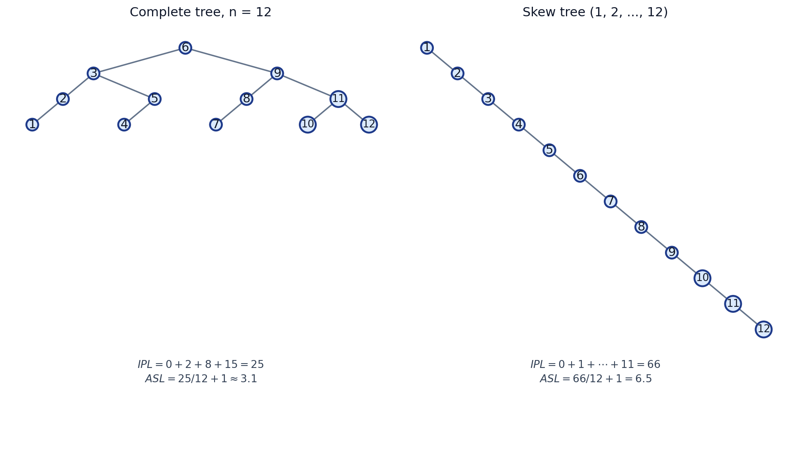

*图 1　同一组 12 个关键字、不同树形下的 $IPL$ 与 $ASL$（自制示意图，数值按式 (3)(4) 计算）*

把式 (3)(4) 代进两种极端形状：

- **完全平衡树**（perfectly balanced tree，$n=12$，深度分布 $0\times1$、$1\times2$、$2\times4$、$3\times5$）：
  $IPL = 0\cdot 1+1\cdot 2+2\cdot 4+3\cdot 5 = 25$，$ASL=\dfrac{25}{12}+1\approx 3.08\approx 3.1$；
- **斜树**（按 $1,2,\dots,12$ 顺序插入，深度 $0,1,\dots,11$）：
  $IPL = 0+1+\cdots+11=66$，$ASL=\dfrac{66}{12}+1=6.5$。

同样 12 个数据，斜树的平均查找代价约为平衡树的两倍。

---

# 平衡树（AVL Tree）

> **本节说明**：原笔记中“左旋 / 右旋：示例（待补全）”、LR / RL 型的旋转步骤等处是省略状态，本次已补全并配示意图；补充部分包括：为什么需要平衡树、高度为什么是 $O(\log n)$（最小节点数 $n_h$）、插入流程与讲义代码中的实现要点。补写内容以「（补充）」标出。

## 1. 为什么需要平衡树（补充）

- **目标**：加快搜索（并支持插入、删除）；**工具**：二叉搜索树（binary search tree, BST）。
- **问题**：BST 上每次操作的时间是 $T_p=O(h)$，而 $h$ 最坏可以达到 $O(N)$（斜树），此时 BST 与链表无异。
- **对策**：给树加上**平衡条件**（balance condition），把 $h$ 限制到 $O(\log N)$。AVL 树是最早提出的一种平衡二叉搜索树（Adelson-Velskii & Landis, 1962）。

（以上三点对应讲义 "Target / Tool / Problem" 三页。）

## 2. 平衡因子（balance factor）

设节点 $v$ 的左子树高为 $h_L$、右子树高为 $h_R$，则

$$
bf(v) = h_L - h_R \tag{6}
$$

- $bf>0$：左重（左子树更高）；
- $bf<0$：右重；
- $bf=0$：左右等高。

> **AVL 树**：树中**所有**节点的平衡因子都落在 $\{-1,0,+1\}$ 中。

**高度约定（补充）**：本笔记与讲义代码一致，取**空树高度为 $-1$**、叶节点高度为 $0$（`avltree.c` 中 `Height(NULL)` 返回 $-1$）。若改用“空树高 $0$、叶高 $1$”，式 (6) 的定义与 AVL 判据形式不变。

## 3. 失衡节点（trouble finder）

- **trouble finder（失衡节点）**：平衡因子不在 $\{-1,0,+1\}$ 中的节点，即 $|bf|\ge 2$ 的节点。
- **trouble maker**：导致失衡的节点（刚插入／删除的那个节点）。

> 我们根据 trouble maker 相对 trouble finder 的位置来判断具体是哪种 rotation。
> 我们不一定只进行一次就可以使得 tree 平衡，这种情况下我们需要使用离 trouble maker 最近的 trouble finder。

## 4. 为什么是“最近的”失衡节点

在 AVL 树中，插入或删除后可能多个祖先（ancestor）都失衡。但调整时有一个关键性质：

- **插入（insertion）**：只要调整**最低的那个失衡节点**（离插入点最近的失衡祖先），整棵树就恢复平衡，上面不会再失衡。
- **删除（deletion）**：可能需要在更高层继续调整，但第一步仍然是处理最低失衡节点。

所以通常策略是：

> 从 trouble maker 向上回溯，遇到的**第一个平衡因子绝对值 $>1$ 的节点**，就是 trouble finder。

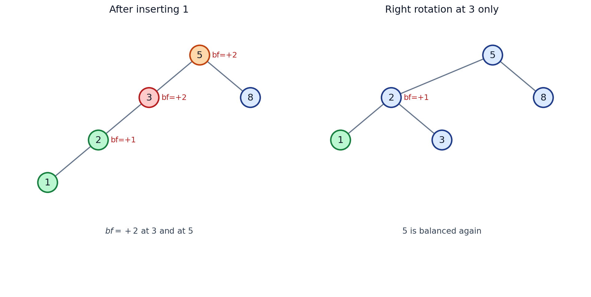

*图 2　原树中依次插入 $5,3,8,2$ 后再插入 $1$：节点 3 与 5 的 $bf$ 都是 $+2$（红色 = 最低的失衡节点，橙色 = 更高但无需处理的祖先）；只对 3 做一次右旋，5 也重新平衡，整棵树满足 AVL 条件*

## 5. 旋转

**目的**：恢复平衡性。

**定义**：

- **左旋（left rotation）**：以节点 $A$ 为轴，$A$ 的右孩子上升，$A$ 下降成为右孩子的左孩子；右孩子原来的左子树改挂到 $A$ 的右边。
- **右旋（right rotation）**：以节点 $A$ 为轴，$A$ 的左孩子上升，$A$ 下降成为左孩子的右孩子；左孩子原来的右子树改挂到 $A$ 的左边。

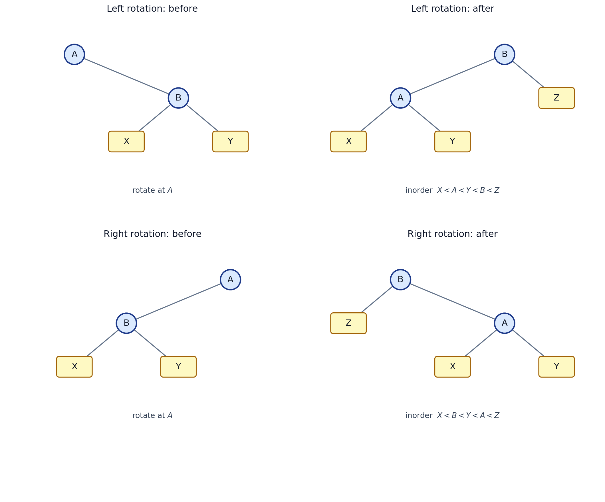

*图 3　左旋 / 右旋的前后对比（$X,Y,Z$ 表示子树）*

**性质**：

1. **旋转不会破坏中序遍历（inorder traversal）结果**，即不会破坏 BST 的序关系：图 3 中左旋前后中序都是 $X<A<Y<B<Z$，右旋前后都是 $X<B<Y<A<Z$。
2. 插入一个叶子结点（leaf）使某棵子树的高度由 $h$ 变为 $h+1$ 后，经旋转可以把该子树的高度**恢复为 $h$**（详见第 6 节）。子树高度复原，是“其上层的祖先不会再失衡”的原因。
3. 左右旋互为逆操作，都只改动常数条指针，代价 $O(1)$。
4. 旋转的轴 $A$ 不一定是整棵树的根（讲义提示：`A is not necessarily the root of the tree`），子树旋转后要挂回原父节点的对应位置。

## 6. 四种旋转的分析

判据：看 trouble maker 相对 trouble finder 的走向；等价地看 $bf$ 的符号。记 trouble finder 为 $A$，

| 类型 | trouble maker 的位置 | $bf$ 特征 | 操作 | 旋转次数 |
|---|---|---|---|---|
| **LL** | $A$ 的左子树的左子树 | $bf(A)=+2$，$bf(A_L)=+1$ | 对 $A$ 做一次**右旋** | 1 |
| **RR** | $A$ 的右子树的右子树 | $bf(A)=-2$，$bf(A_R)=-1$ | 对 $A$ 做一次**左旋** | 1 |
| **LR** | $A$ 的左子树的右子树 | $bf(A)=+2$，$bf(A_L)=-1$ | 先对 $A_L$ **左旋**，再对 $A$ **右旋** | 2（双旋 double rotation） |
| **RL** | $A$ 的右子树的左子树 | $bf(A)=-2$，$bf(A_R)=+1$ | 先对 $A_R$ **右旋**，再对 $A$ **左旋** | 2（双旋） |

（$A_L$、$A_R$ 分别是 $A$ 的左、右孩子。）

### 6.1 LL 型：一次右旋

- trouble maker 在 trouble finder **左子树的左子树**；
- 对 trouble finder 进行一次**右旋**。

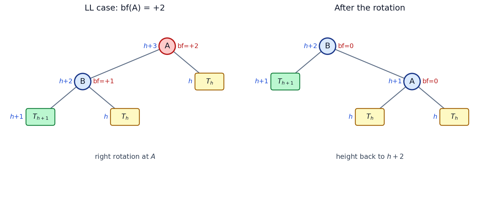

*图 4　LL 型。蓝色 = 子树高度，红色 = 平衡因子，绿色 = 因插入而长高的子树。旋转前 $bf(A)=+2$；旋转后由 $B$ 顶上，$bf(B)=bf(A)=0$，子树高度由 $h+3$ 回到 $h+2$*

**小例子**：依次插入 $3,2,1$。插入后 $A=3$ 的 $bf=+2$（LL 型），对 $3$ 右旋，得到以 $2$ 为根、$1$ 和 $3$ 为左右孩子的平衡树。

### 6.2 RR 型：一次左旋

- trouble maker 在 trouble finder **右子树的右子树**；
- 与 LL 型左右对称，对 trouble finder 进行一次**左旋**。

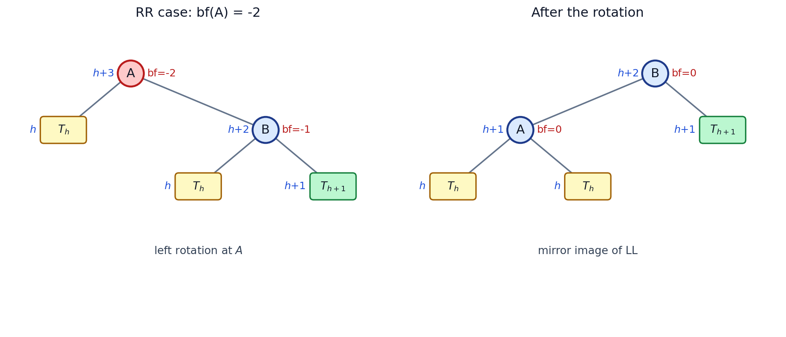

*图 5　RR 型，与图 4 镜像对称*

**小例子**：依次插入 $1,2,3$，对 $A=1$ 左旋，得到以 $2$ 为根的平衡树。

### 6.3 LR 型：两次旋转（双旋）

- trouble maker 在 trouble finder **左子树的右子树**，此时 $bf(A)=+2$ 而 $bf(A_L)=-1$（“左重但左孩子右倾”）；
- 做法：先对 $A$ 的**左孩子**（图中的 $B$）左旋，转成 LL 形；再对 $A$ 右旋。

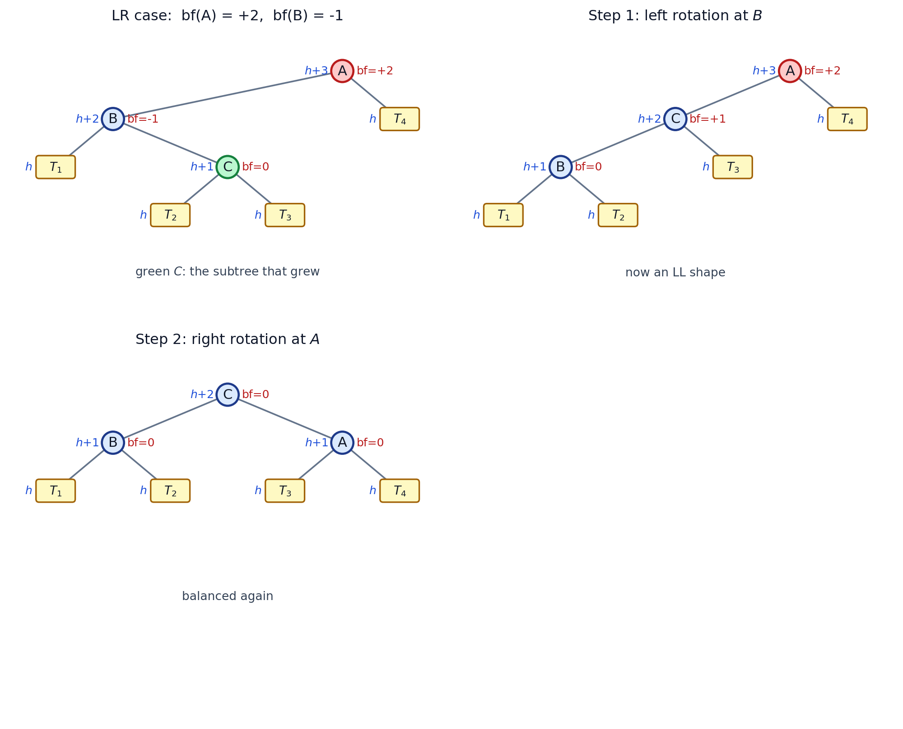

*图 6　LR 型的两步旋转。绿色 $C$ 是因插入而长高的子树。第 1 步对 $B$ 左旋后变成 LL 形（$bf(A)=+2$、$bf(C)=+1$），第 2 步对 $A$ 右旋后平衡，$C$ 成为子树根，高度回到 $h+2$*

**小例子**：依次插入 $3,1,2$；对 $1$（$A$ 的左孩子）左旋得到 LL 形，再对 $3$ 右旋，得到以 $2$ 为根的平衡树。

### 6.4 RL 型：两次旋转（双旋）

- trouble maker 在 trouble finder **右子树的左子树**，此时 $bf(A)=-2$ 而 $bf(A_R)=+1$；
- 做法：先对 $A$ 的**右孩子**（图中的 $B$）右旋，转成 RR 形；再对 $A$ 左旋。

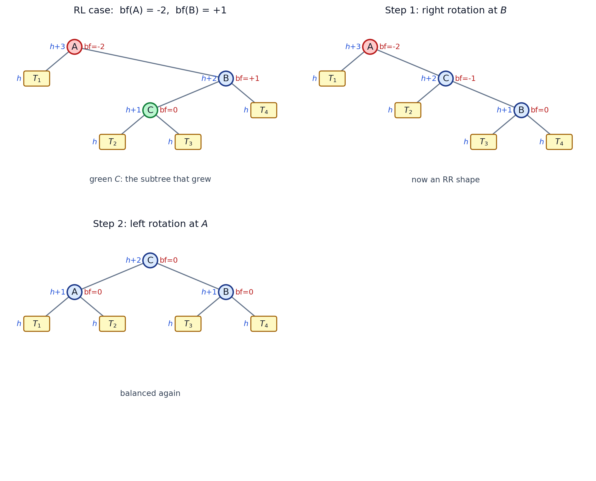

*图 7　RL 型，与图 6 镜像对称*

**小例子**：依次插入 $1,3,2$，先对 $3$ 右旋，再对 $1$ 左旋。

## 7. 插入流程与实现要点（补充）

**插入的完整流程**：

1. 按 BST 规则把新节点插到叶位置（沿途 $O(\log n)$ 个节点）；
2. 沿插入路径**自底向上**（bottom-up）更新各节点高度；
3. 遇到的第一个 $|bf|=2$ 的节点就是 trouble finder，按第 6 节的判据选择 LL / RR / LR / RL 并旋转修复；
4. 修复后子树高度复原，**更高的祖先不会再失衡**，因此插入最多只做一次修复（最多 2 次单旋 single rotation），总时间 $O(\log n)$。

**实现要点**（讲义代码 `Materials/Code/avltree.c`）：

- 每个节点额外保存一个 `Height` 字段（讲义原话：*Another option is to keep a height field for each node*），而不是每次都递归算高度；
- 空树高度记作 $-1$：`Height(P) = (P == NULL) ? -1 : P->Height`；
- 高度更新：`P->Height = Max(Height(P->Left), Height(P->Right)) + 1`；
- 讲义代码的函数名与本笔记的命名对应关系：

| 讲义代码（Weiss，`avltree.c`） | 触发条件 | 本笔记的叫法 |
|---|---|---|
| `SingleRotateWithLeft(K2)` | $bf(K2)=+2$ 且新节点在左子树的左子树 | **LL 型 → 右旋** |
| `SingleRotateWithRight(K1)` | $bf(K1)=-2$ 且新节点在右子树的右子树 | **RR 型 → 左旋** |
| `DoubleRotateWithLeft(K3)` | $bf(K3)=+2$ 且新节点在左子树的右子树 | **LR 型 → 先左旋后右旋** |
| `DoubleRotateWithRight(K1)` | $bf(K1)=-2$ 且新节点在右子树的左子树 | **RL 型 → 先右旋后左旋** |

**删除**：删除后子树高度可能**减小**，一次旋转未必能让上层恢复平衡，需要沿路径继续向上检查，最坏要做 $O(\log n)$ 次旋转；总时间仍是 $O(\log n)$。（讲义未展开删除细节；此外“被删节点的孩子 $bf=0$ 时用单旋即可”这一边界情况**待确认**。）

## 8. 补充：为什么 AVL 树高是对数级的

设 $n_h$ 为高度为 $h$ 的 AVL 树**最少**需要的节点数（minimum node count）。节点数要最少，根的两棵子树也必须是最小的 AVL 树（minimal AVL tree），且高度只能相差 $1$，于是左子树高 $h-1$、右子树高 $h-2$：

$$
n_h = n_{h-1} + n_{h-2} + 1,\qquad n_0 = 1,\ n_1 = 2 \tag{7}
$$

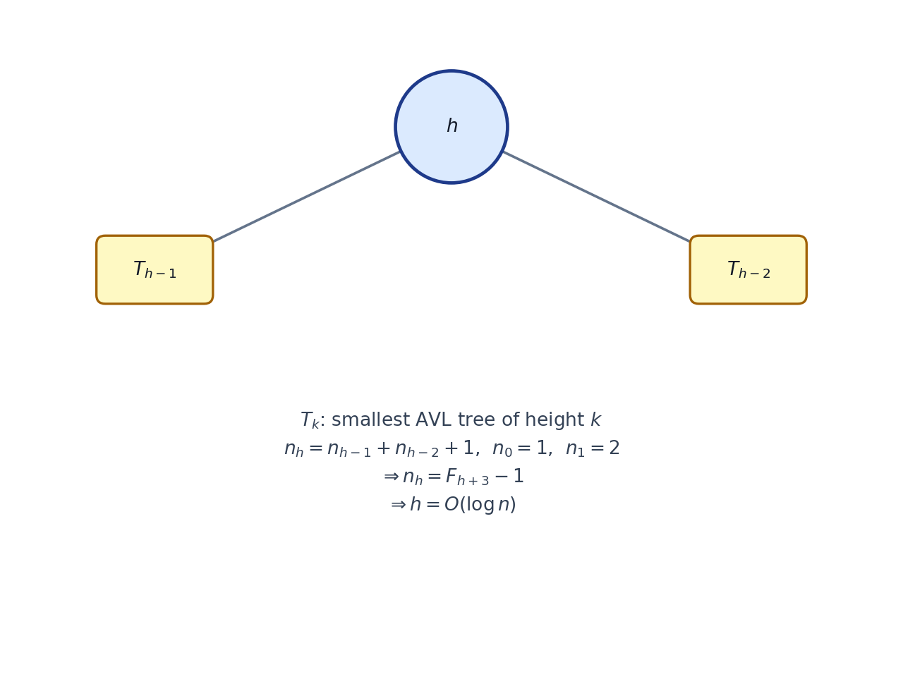

*图 8　高度为 $h$ 的最小 AVL 树的递归形状（$T_k$ 表示高度为 $k$ 的最小 AVL 子树）*

这正是一个斐波那契型递推（Fibonacci-like recurrence），其解为

$$
n_h = F_{h+3}-1 \quad (\text{取 } F_1=F_2=1) \tag{8}
$$

| $h$ | 0 | 1 | 2 | 3 | 4 | 5 | 6 | 7 | 8 | 9 | 10 |
|---|---|---|---|---|---|---|---|---|---|---|---|
| $n_h$ | 1 | 2 | 4 | 7 | 12 | 20 | 33 | 54 | 88 | 143 | 232 |

由 $n\ge n_h = F_{h+3}-1$ 反解，得到高度上界（量级上）

$$
h \lesssim 1.44\log_2 n
$$

即 $h=O(\log n)$（教材常写作 $h<1.44\log_2(n+2)$）。所以 AVL 树的查找、插入、删除都是 $O(\log n)$，这正是第 1 节“用平衡条件换对数级搜索时间”的落点。

## 9. 小结与待确认

- 平衡因子 $bf=h_L-h_R$，AVL 树要求所有节点的 $|bf|\le 1$；
- 插入后从最低失衡节点出发，按 LL / RR 单旋、LR / RL 双旋修复；
- 旋转保持中序序关系，并把被插入破坏的子树高度复原；
- 由此 $h=O(\log n)$，查找、插入、删除均为 $O(\log n)$。

**待确认**：

1. 删除时“孩子 $bf=0$ 用单旋”的细节，讲义未展开；

---

# splay tree(Self Ajusting tree)

> **本节来源**：ADS 讲义 `ADS01AVL_Stu.ppt` 中 splay / 摊还分析的部分（zig、zig-zag、zig-zig 及其摊还代价那一页）、讲义代码 `Materials/Code/splay.c`、`splay.h`、`Materials/Code/avltree.c`，以及 Weiss《Data Structures and Algorithm Analysis》§4.5（自调整树、splay 的三种旋转）、§11.5（摊还分析，定理 11.5）、§12.1（自顶向下 splay）。
> **说明**：原笔记文字保留原意；补写内容集中在「定义补充」「为什么“顺次单旋”不行」「小结与实现要点」等小节，示意图见 `assets/fig_splay_*.png`（图 9–12，由 `assets/make_splay_figs.py` 生成）；「摊还分析」一节的图 13、14 由 `assets/make_amort_figs.py` 生成。

## 定义

通常写作 **Splay Tree**，中文叫 **伸展树**。它是一种**自调整二叉搜索树**（self-adjusting binary search tree），由 Sleator 和 Tarjan 在 1985 年提出。核心思想是：**每次访问一个节点后，就通过一系列旋转把它“伸展”到根节点**。这样最近访问的元素会靠近根，利用访问局部性（locality of reference）。

相比于AVL tree，splay tree不根据平衡因子进行旋转。我们不能保证splay tree每次都会产生AVL tree ，但是它有这个趋向性，平均的时间cost是低于AVL tree的
>某些情况是要高于AVL的。

我们需要意识到只通过对skew 树进行顺次单旋，是无法实现这个目标的。

### 1. 定义补充  

1. **节点里存什么**：splay tree 不需要高度或平衡因子。讲义代码 `splay.h` / `splay.c` 的节点只有 `Element`、`Left`、`Right` 三个字段，而 `avltree.c` 的节点还要多存一个 `Height`。这就是“不根据平衡因子进行旋转”的具体含义：调整完全由**访问**驱动，而不是由高度差驱动。
2. **谁需要 splay**：查找（成功时 splay 到命中的节点；失败时 splay 到访问路径上最后一个节点）、插入、删除最后都用一次 `splay` 收尾，所以“一次 splay 的代价”基本上就是“一次操作的代价”。
3. **单次最坏 vs 摊还**：splay 只保证“趋向平衡”，不保证每一步操作后都是 AVL 树，所以**单次操作最坏可以是 $O(n)$**；但 $M$ 次连续操作的总代价是 $O(M\log n)$，即每次的**摊还**（amortized）代价为 $O(\log n)$。讲义的那一页写作 $T_{\text{amortized}}=O(\log N)$，教材定理 11.5 写作：splay 的摊还时间至多 $3\big(R(T)-R(X)\big)+1=O(\log N)$。这就是“平均 cost 低于 AVL，但某些情况下高于 AVL”的来源——splay 付的是**摊还账**，AVL 付的是**每次 $O(\log n)$ 的最坏账**。
   （每一步 zig / zig-zig / zig-zag 各自的摊还代价、以及 $3(R(T)-R(X))+1$ 这个界的来历，见本文最后的「摊还分析」一节；核对结果：讲义那页的结论与教材定理 11.5 一致；那个 $1$ 记在哪一步，见该节 5.4 的注。）
4. **一条关键性质**：splay 不只是把被访问节点搬到根，还会使**访问路径上大多数节点的深度大致减半**（被压下去的浅节点最多下降两层）（教材 §4.5.2）。这正是它比“顺次单旋”高明的地方，下面用斜树说明。

### 2. 为什么“顺次单旋”不行

“顺次单旋”（rotate-to-root / simple rotation）指：只要 $X$ 还不是根，就把 $X$ 与它当前的父节点旋转一次，重复到 $X$ 到根。教材专门用一小节讨论它，标题就叫 **A Simple Idea (That Does Not Work)**（§4.5.1）。它不行的原因有两条：

- **只搬走了 $X$，没有改善别的节点**：它把 $X$ 送上了根，却把原来的父节点（乃至祖父）压到几乎同样深的位置。教材原话是 *it has pushed another node ($k_3$) almost as deep as $k_1$ used to be*，即访问路径上其它节点的处境没有实质改善。
- **存在 $M$ 次操作要花 $\Omega(Mn)$ 的反例**（教材 §4.5.1）：先依次插入 $1,2,\dots,n$ 得到一棵退化成链的树（教材把它写成 “只有左孩子” 的链），再按 $1,2,\dots,n$ 的顺序访问。单旋策略下，每次访问都还要 $\Theta(n)$ 的时间（教材原文：*an access of the node with key 2 takes N units of time, key 3 takes N−1 units…*），一轮访问的总代价是 $\Theta(n^2)$；更要命的是**访问完一圈后树会回到原状**，这个序列可以反复做，于是总代价是 $\Omega(Mn)$（教材原文：*the tree reverts to its original state, and we can repeat the sequence*）。

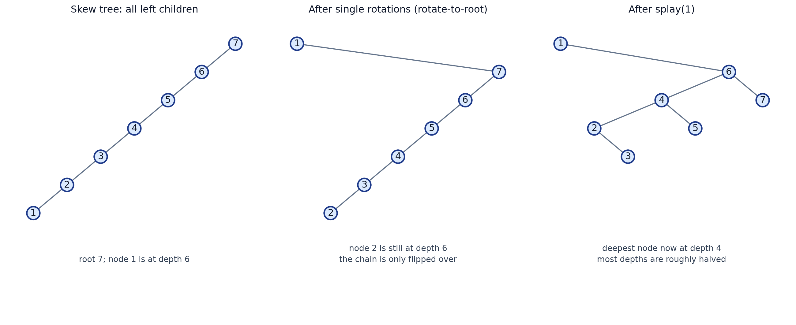

*图 9　同一棵斜树（$n=7$，全左链，节点 1 最深）访问节点 1：中图是“顺次单旋”的结果——整条链只是被翻了个方向，最深的节点 2 仍在深度 6，下一次访问仍旧很贵；右图是 splay 的结果——最深节点降到深度 4，大部分节点深度大致减半（自制示意图，形状由 `assets/make_splay_figs.py` 里真正跑一遍两种算法得到）*

因此 splay 在“$X$ 与 $P$ 在同一侧”时**不是**对 $X$ 连续单旋两次，而是先旋转 $P$ 与 $G$、再旋转 $X$ 与 $P$（见下面的 zig-zig），只有这样才能真正改变访问路径上大多数节点的深度。

> 链往左还是往右只差一个镜像，结论不变。

## 操作：splay

`splay(x)` 把节点 x 旋转到根，分三种情况：

1. **zig**：x 的父节点就是根，直接对 x 做一次单旋转。
2. **zig-zig**：x 和父节点在同一侧，做两次单旋转（图 11）。
3. **zig-zag**：x 和父节点在相反侧，等价于LR旋转，同样是两次单旋转（图 12）。

这些旋转都保持二叉搜索树的中序遍历不变。

**记号**（沿用讲义那一页）：$X$ 是当前要往上转的节点，$P$ 是它的父节点（parent），$G$ 是它的祖父节点（grandparent；$X$ 的父节点就是根时没有 $G$）；$A,B,C,D$ 表示不参与本次旋转的子树。splay 是**自底向上**（bottom-up）做的：每次连着处理 $X$、$P$、$G$ 两个层次，直到 $X$ 成为根。

### 1. zig：$P$ 就是根

- **触发条件**：$X$ 的父节点 $P$ 就是整棵树的根（$X$ 只差一步到根）。
- **做法**：对 $P$ 做一次单旋转（$X$ 是左孩子就右旋，是右孩子就左旋），$X$ 升为根。
- **特点**：只旋转一次，而且一定是**整个 splay 的最后一步**。

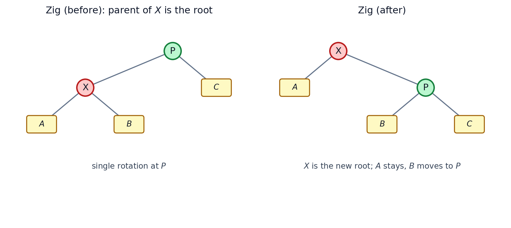

*图 10　zig：对根 $P$ 做一次单旋转。旋转后 $X$ 成为根，子树 $A$ 位置不变，$B$ 改挂到 $P$ 的另一侧*

### 2. zig-zig：$X$ 与 $P$ 在同一侧

- **触发条件**：$X$ 和 $P$ 都是左孩子，或者都是右孩子（$X$、$P$、$G$ 连成一条“直线”）。
- **做法**：两次单旋转，**顺序不能颠倒**：
  1. 先旋转 $P$ 与 $G$（$P$ 顶上来，$G$ 下去）；
  2. 再旋转 $X$ 与 $P$（$X$ 顶上来，$P$ 下去）。
- **结果**：$X$ 成为这棵子树的根，$P$ 是 $X$ 的右孩子（镜像情况为左孩子），$G$ 在 $P$ 的下面（图 11 第 3 幅）。
- **易错点**：这一种**不是**“对 $X$ 连续单旋两次”。如果对 $X$ 先与 $P$ 转、再与新的父节点（原来的 $G$）转，得到的树是另一种形状，而且那正是上一节被 $\Theta(n^2)$ 反例否定掉的“顺次单旋”。

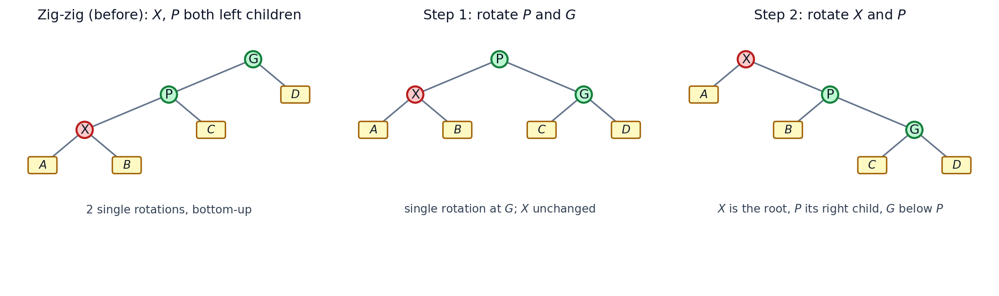

*图 11　zig-zig（$X$、$P$ 都是左孩子）：先对 $G$ 单旋，再对 $P$ 单旋。旋转后 $X$ 的右孩子是 $P$、$P$ 的右孩子是 $G$——讲义代码 `zig_zig_left()` 做的正是这几条指针修改*

### 3. zig-zag：$X$ 与 $P$ 在相反侧

- **触发条件**：$X$ 是右孩子而 $P$ 是左孩子，或者反过来（$X$、$P$、$G$ 拐了一个弯）。
- **做法**：两次单旋转，**两次都绕 $X$**：
  1. 先旋转 $X$ 与 $P$；
  2. 再旋转 $X$ 与 $G$。
- **结果**：$X$ 成为根，$P$、$G$ 分别成为 $X$ 的左右孩子。这与 AVL 的 LR / RL 双旋**完全一致**（教材原话：*we perform a double rotation, exactly like an AVL double rotation*）。

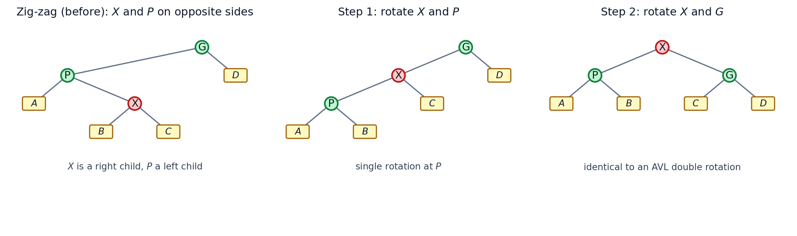

*图 12　zig-zag（$X$ 是右孩子、$P$ 是左孩子）：两次旋转都绕 $X$，结果与 AVL 的 LR 双旋相同*

### 4. 小结与实现要点

| 情况 | 触发条件 | 旋转 | 次数 |
|---|---|---|---|
| **zig** | $P$ 就是根 | 绕 $P$ 单旋一次 | 1 |
| **zig-zig** | $X$、$P$ 同侧 | 先 $P$–$G$，再 $X$–$P$ | 2 |
| **zig-zag** | $X$、$P$ 异侧 | 先 $X$–$P$，再 $X$–$G$（= AVL 双旋） | 2 |

- **自底向上的实现**：三种旋转都是从 $X$ 出发、成对地向根的方向做。因为一次要处理两层，**递归（recursion）写法不方便**（要先知道访问路径长度的奇偶），所以通常是非递归的“两趟”：先下去找到 $X$，再在回来的路上旋转；路径要么用栈（stack）存起来（最坏 $n$ 个指针），要么在节点里多存一个 `parent` 字段。
- **自顶向下（top-down，讲义代码）**：`Materials/Code/splay.c` 是 Weiss 的 top-down splay（教材 §12.1）。它只向下走一趟：用一个 header 节点把“小于 $X$ 的部分”和“大于 $X$ 的部分”分别挂到 $L$、$R$ 两棵树上，最后再拼回 $X$ 的左右，不需要 `parent` 指针也不需要栈，只用 $O(1)$ 额外空间，摊还界仍是 $O(\log N)$；代价是**中间过程与自底向上 splay 不同**（`splay.c` 里 zig-zag 还做了简化：直接让 $Y$ 而不是 $Z$ 当中间树的根）。做作业时要看清题目按哪一种口径。
- **顺带一提**：删除的做法是先把待删节点 splay 到根，删掉后得到左右子树 $T_L$、$T_R$，再把 $T_L$ 中最大的元素 splay 到 $T_L$ 的根，最后把 $T_R$ 接到它右边（讲义：*Step 3: FindMax($T_L$); Step 4: Make $T_R$ the right child of the root of $T_L$*）。删除等其它操作留待后面补写。

# 摊还分析(amortized analysis)

求多次开销的平均。

> **本节来源**：讲义课件 `ADS01AVL_Stu.ppt` 第 29 页 "Sketch of the proof for Splay tree"（势函数 $\Phi(T)=\sum_i \mathrm{Rank}(i)$、zig / zig-zag / zig-zig 各自的摊还代价、以及那条定理），课堂上补充的两页手写推导 `Splay Amortized Analysis.pdf`（含引理 11.4 的用法、zig-zag 与 zig-zig 逐项代入的细节、insert 的附加势能变化），以及教材 Weiss §11.5（引理 11.4、定理 11.5、习题 11.8，以及 insert / delete 的附加势能）与 §4.5（splay 的三种旋转）。补写、补证和核对的内容标为「（补充）」。
> **记号**：本节沿用讲义的下标写法——$R_1,S_1$ 是某一步旋转**之前**的量，$R_2,S_2$ 是**之后**的量（教材写作 $R_i,R_f$，$i$ = initial、$f$ = final，含义相同）。$R(\cdot)$ 是**秩**（rank），与「小结与实现要点」里自顶向下 splay 的子树 $L$、$R$ 无关。$\log$ 一律以 2 为底（教材约定）；$S(i)$ 是子树规模（含 $i$ 自身）。

## 1. 摊还分析在算什么

- 本文第 1 节的 $ASL$ 是**概率模型下的期望**：要先假设每个关键字被查找的概率 $p_i$（或干脆“等概率”），得到的是“平均情况”。
- 摊还分析不做任何概率假设，只对**一段操作序列**算总账：若任意 $M$ 次连续操作的总代价不超过 $M\cdot f(N)$，就说单次操作的**摊还代价**（amortized cost）是 $O(f(N))$。它比“单次最坏”更紧，又比“平均情况”更可靠——因为它对**每一条**操作序列都成立，不挑输入。
- 常用手段有三种：聚合分析（aggregate analysis）、记账法（accounting method）、**势能法**（potential method）。讲义与教材用的都是势能法。
- 摊还代价可以低于单次最坏代价（splay 单次最坏 $O(N)$，摊还 $O(\log N)$），但不是凭空便宜：省下来的时间以“势能”的形式**存**在数据结构里，等贵操作来的时候再花掉。

## 2. 势能法

给数据结构的每个状态 $D$ 配一个**势能**（potential）$\Phi(D)\ge 0$。设第 $i$ 次操作的**实际代价**（actual cost）为 $c_i$，定义

$$
\hat c_i=c_i+\Phi(D_i)-\Phi(D_{i-1}) \tag{9}
$$

称 $\hat c_i$ 为该操作的**摊还代价**（教材式 (11.2)：$T_{\text{actual}}+\Delta\Phi=T_{\text{amortized}}$）。把 $M$ 次操作加起来，中间那些 $\Phi(D_i)$ 两两抵消：

$$
\sum_{i=1}^{M}\hat c_i=\sum_{i=1}^{M}c_i+\Phi(D_M)-\Phi(D_0) \tag{10}
$$

从**空树**（empty tree）出发时 $\Phi(D_0)=0$，而 $\Phi\ge 0$，所以 $\sum_i\hat c_i\ge\sum_i c_i$：**摊还代价之和是真实总代价的上界**。于是“每次操作摊还 $O(\log N)$”这句话等价于证明两件事（讲义 PDF 第 2 页原话：*We have to prove two things*）：

1. $\sum_{i=1}^{M}\hat c_i=O(M\log N)$；
2. $\sum_i\hat c_i\ge\sum_i c_i$（由式 (10)，$\Phi(D_M)\ge\Phi(D_0)=0$）。

两条合起来就是 $\sum_i c_i=O(M\log N)$：**$M$ 次 insert/find/delete 的总实际代价是对数级的**。

> **（补充）两个容易忽略的点**：
> 1. 势能必须**非负**。若允许为负，式 (10) 里的 $\Phi(D_M)-\Phi(D_0)$ 可以是负数，摊还界就只是“借贷”而不是上界（教材总结里原话：*Negative potential means debt*）。
> 2. 势能函数允许差一个常数，所以只需取**相对势能**（relative potential）、令 $\Phi(D_0)=0$ 即可；讲义 PDF 用“$D_0$ 是空树”来定这个零点，教材的做法等价。
>
>  讲义 PDF 写的是 *the total actual cost is no more than $O(M\log M)$*，严格写应为 $O(M\log N)$（$N$ 是树规模、$M$ 是操作次数；两者同阶时形式一致）。

## 3. splay 的势函数（potential function）：为什么不用“深度和”

教材先试了一个“显而易见”的势函数：所有节点的**深度之和**。它不行——一次访问最多能让它涨 $\Theta(N)$（顺序插入就是例子），这样的势函数抵消不掉旋转的代价。

能用的势函数是：令 $S(i)$ 表示以 $i$ 为根的**子树规模**（subtree size，含 $i$ 自身），取

$$
\Phi(T)=\sum_{i\in T}\log S(i),\qquad R(i)=\log S(i) \tag{11}
$$

$R(i)$ 叫节点 $i$ 的**秩**（rank）。三个要点：

- 根节点的秩就是 $R(T)=\log N$，所以 $\Phi$ 的量级是 $O(N\log N)$，不会失控；
- **一次旋转只改变 $X$、$P$、$G$ 三个节点的子树规模**（子图里的 $A,B,C,D$ 整体搬家，规模不变），因此 $\Delta\Phi$ 只含这三项——这正是它比“深度和”好算的原因；
- $S(i)\ge 1\Rightarrow R(i)\ge 0$，空树 $\Phi=0$，式 (10) 需要的非负性满足。

（教材原话：*while a rotation can change the heights of many nodes in the tree, only $X$, $P$, and $G$ can have their ranks changed*。“秩”这个说法在并查集、二项队列、斐波那契堆里都出现过，含义都是“对数级别的规模”。）

## 4. 引理 11.4：两个字树的规模相加

**引理 11.4**　若 $a+b\le c$，且 $a,b$ 都是正整数，则

$$
\log a+\log b\le 2\log c-2 \tag{12}
$$

**证明**　由算术–几何平均不等式（AM–GM inequality）

$$
\sqrt{ab}\le\frac{a+b}{2}\le\frac{c}{2}
$$

即 $\sqrt{ab}\le c/2$；两边平方得 $ab\le c^{2}/4$；再取对数即得式 (12)。$\blacksquare$

把式 (12) 用在子树规模上（取 $a=S_f(P)$、$b=S_f(G)$、$c=S_f(X)$），就得到本节反复要用的形式：

$$
S_f(P)+S_f(G)\le S_f(X)\ \Longrightarrow\ R_f(P)+R_f(G)\le 2R_f(X)-2 \tag{13}
$$

讲义页上把这一句批注成 *Lemma 11.4 on [1] p.448*。

## 5. 三种旋转各自的摊还代价

代价口径（教材）：一次访问（access）的代价 $=1+$ 旋转次数，其中 zig 算 1 次旋转，zig-zig、zig-zag 各算 2 次。所以**一步旋转的实际代价** $t$ 是 1（zig）或 2（zig-zig / zig-zag）。一步之内只有 $X,P,G$ 的秩会变，于是通用式是

$$
\hat c=t+\big[R_2(X)-R_1(X)\big]+\big[R_2(P)-R_1(P)\big]+\big[R_2(G)-R_1(G)\big]
$$

（zig 这一步没有 $G$，最后一项不存在。）

下面三种情况逐一收紧。（子树命名沿用图 10–12 的约定：$X$ 是要往上转的节点，$P$ 是父节点，$G$ 是祖父节点。）

### 5.1 zig：$P$ 就是根

只涉及 $X$ 和 $P$：

$$
\hat c_{zig}=1+R_2(X)-R_1(X)+R_2(P)-R_1(P)
$$

旋转后 $P$ 的子树“少了一块”（$X$ 连同 $A$ 分出去了），故 $S_2(P)\le S_1(P)$，即 $R_2(P)\le R_1(P)$，右边可以扔一项：

$$
\hat c_{zig}\le 1+R_2(X)-R_1(X)
$$

又 $S_2(X)\ge S_1(X)\Rightarrow R_2(X)-R_1(X)\ge 0$，把 $1$ 放大成 $3(R_2(X)-R_1(X))$ 不改变不等号方向：

$$
\boxed{\ \hat c_{zig}\le 1+3\big(R_2(X)-R_1(X)\big)\ } \tag{14}
$$

### 5.2 zig-zag：$X$ 与 $P$ 异侧

$$
\hat c_{zig\text{-}zag}=2+R_2(X)-R_1(X)+R_2(P)-R_1(P)+R_2(G)-R_1(G)
$$

两个关键观察（对应手写稿上的批注 ① ②）：

- **①** $R_2(X)=R_1(G)$：旋转前后 $X$ 和 $G$ 都是**同一棵子树**（整块图）的根，规模相同；
- **②** $R_1(P)\ge R_1(X)$：在旋转前的树里 $P$ 是 $X$ 的父亲。

代入后 $R_2(X)$ 与 $-R_1(G)$ 抵消，再用 ② 把 $R_1(P)$ 换成 $R_1(X)$：

$$
\hat c_{zig\text{-}zag}\le 2+R_2(P)+R_2(G)-2R_1(X)
$$

最后用**引理 11.4**：旋转后的树里 $A,B$ 归 $P$、$C,D$ 归 $G$，两块加起来正好是 $X$ 的整棵子树，即 $S_2(P)+S_2(G)=S_2(X)-1\le S_2(X)$，由式 (13) 得 $R_2(P)+R_2(G)\le 2R_2(X)-2$：

$$
\hat c_{zig\text{-}zag}\le 2\big(R_2(X)-R_1(X)\big)\le 3\big(R_2(X)-R_1(X)\big) \tag{15}
$$

### 5.3 zig-zig：$X$ 与 $P$ 同侧

$$
\hat c_{zig\text{-}zig}=2+R_2(X)-R_1(X)+R_2(P)-R_1(P)+R_2(G)-R_1(G)
$$

前两个观察与 zig-zag 相同：$R_2(X)=R_1(G)$、$R_1(P)\ge R_1(X)$，于是

$$
\hat c_{zig\text{-}zig}\le 2+R_2(P)+R_2(G)-2R_1(X)
$$

**这里出现与 zig-zag 不同的地方**：旋转后 $P$ 反而是 $X$ 的孩子（图 11 第 3 幅），所以 $S_2(P)\le S_2(X)$，可把 $R_2(P)$ 放大成 $R_2(X)$：

$$
\hat c_{zig\text{-}zig}\le 2+R_2(X)+R_2(G)-2R_1(X)
$$

再用引理 11.4，但这次要凑的规模对是 $(S_1(X),S_2(G))$：$A,B$ 从上往下看属于 $X$ 原来的子树，$C,D$ 旋转后归 $G$，两块加起来正好是 $X$ 旋转后的整棵子树，即 $S_1(X)+S_2(G)=S_2(X)-1\le S_2(X)$（注意用的是**旋转前**的 $S_1(X)$），由式 (13)：

$$
R_1(X)+R_2(G)\le 2R_2(X)-2
$$

代回：

$$
\hat c_{zig\text{-}zig}\le 2+R_2(X)+\big(2R_2(X)-2-R_1(X)\big)-2R_1(X)=3\big(R_2(X)-R_1(X)\big) \tag{16}
$$

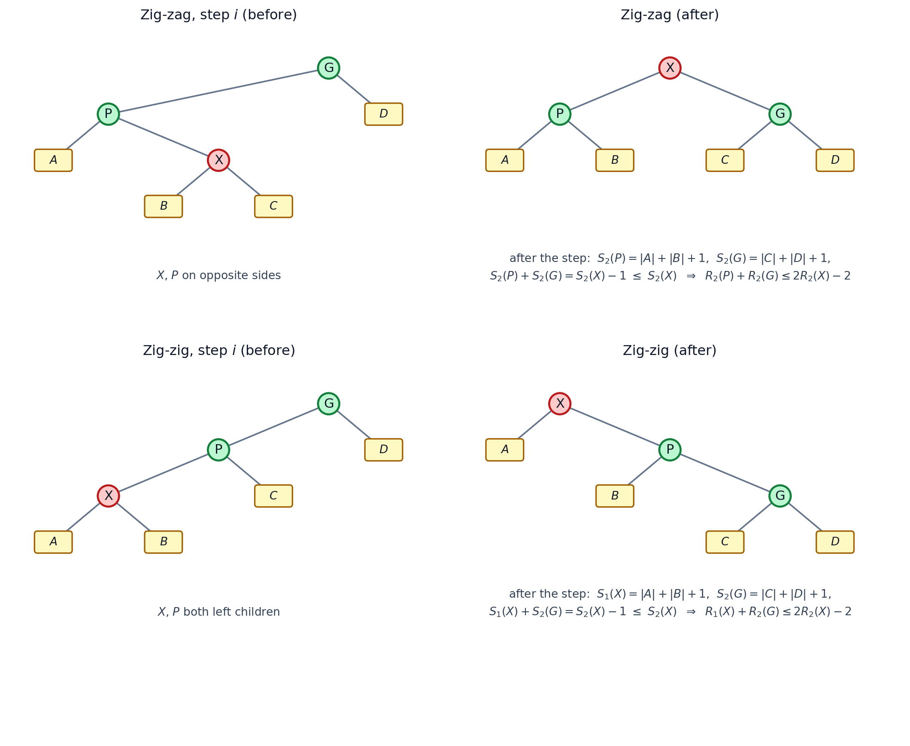

*图 13　两种双旋情形里进入引理 11.4 的规模对（自制示意图，子树画法与图 11、图 12 一致）：两种情况都凑出 $S_2(X)-1$，区别在于 zig-zag 用的是旋转后的 $S_2(P),S_2(G)$，而 zig-zig 要用旋转前的 $S_1(X)$ 和旋转后的 $S_2(G)$——这就是 zig-zig 的证明比 zig-zag 麻烦一点的原因*

### 5.4 汇总

| 旋转类型 | 实际代价（旋转次数） | $\Delta\Phi$ 涉及 | 该步摊还代价上界 |
|---|---|---|---|
| **zig** | 1 | $X,P$ | $1+3\big(R_2(X)-R_1(X)\big)$ |
| **zig-zag** | 2 | $X,P,G$ | $3\big(R_2(X)-R_1(X)\big)$ |
| **zig-zig** | 2 | $X,P,G$ | $3\big(R_2(X)-R_1(X)\big)$ |

> 只有 zig 那一项带 $+1$，而**一次 splay 中最多出现一次 zig，并且它一定是最后一步**（$P$ 已经是根）。
>
> **（待确认）** 讲义那页在 zig-zag / zig-zig 上方用红笔圈出一行 $\hat c\le 1+3\big(R_2(X)-R_1(X)\big)$，与教材对**单步**的写法略有出入（教材对 zig-zag、zig-zig 给的是不带 $1$ 的 $3(R_2(X)-R_1(X))$）。两种读法：
> - 若把它读作**整次 splay 的总结**，那它和教材定理 11.5 的 $1+3(R(T)-R(X))$ 完全一致（一整个 splay 里只有最后一步可能带 $1$）；
> - 若按“每一步都带 $1$”来用，求和后会多出与步数同阶的项，得到的是更松的界。
>
> 本文按教材的每步结论（第 5.4 节表格）使用。

## 6. 一次 splay 的总代价：望远镜求和（telescoping sum）

把一次 splay 的每一步相加。除了最后一步（可能是 zig，多一个 $1$），其余每步都不超过 $3\big(R_2(X)-R_1(X)\big)$，而相邻两步的“后”与“前”是同一个秩，中间项全部抵消：

$$
\hat c_{splay}\le 1+3\big(R_f(X)-R_i(X)\big) \tag{17}
$$

其中 $R_i(X)$ 是 splay 开始前 $X$ 的秩、$R_f(X)$ 是结束后 $X$ 的秩。splay 结束时 $X$ 已经**在根上**，所以 $R_f(X)=R(T)=\log N$；又 $R_i(X)\ge 0$：

$$
\boxed{\ \hat c_{splay}\le 3\log N+1=O(\log N)\ }
$$

这正是**教材定理 11.5**：*The amortized time to splay a tree with root $T$ at node $X$ is at most $3(R(T)-R(X))+1=O(\log N)$*，也与讲义第 29 页被红笔圈出的那行 $\hat c\le 1+3\big(R_2(X)-R_1(X)\big)$（按整次 splay 的口径，见 5.4 的注）以及该页底部的 $=O(\log N)$ 一致。

**（补充）一个可以手算的例子**：在 $N=31$ 的完全平衡树上（根为 16，1..31 全部就位）访问节点 2，路径是 $16\to8\to4\to2$，所以 splay 只有两步：zig-zig、然后 zig（$P=16$ 已经是根）。节点 2 的秩依次是 $\log_2 3\to\log_2 15\to\log_2 31$：

| 步 | 类型 | 该步的上界 | 说明 |
|---|---|---|---|
| 1 | zig-zig | $3(\log_2 15-\log_2 3)=6.97$ | 开始时 $X=2$ 的子树是 $\{1,2,3\}$（$S_1(X)=3$），旋转后变成 $\{1,\dots,15\}$（$S_2(X)=15$） |
| 2 | zig（最后一步） | $1+3(\log_2 31-\log_2 15)=4.14$ | $S_2(X)=31$，$X$ 到根 |
| 合计 | | $\le 3(\log_2 31-\log_2 3)+1=11.11$ | 中间项全部抵消，只剩 $3(R_f-R_i)+1$ |

（这几个数就是把每步的上界按 $S$ 直接代入得到的；本次访问的真实旋转次数是 $2+1=3$，摊还界 $11.11$ 只是上界。想自己核对，数一数子树规模即可。同一个树上访问最深的节点 1 是另一种情形：路径长度是偶数，两步 zig-zig 就把它送到根，没有最后的 zig。）

## 7. 从一次 splay 到 $M$ 次操作

- **find（查找）**：一次查找 = 一次 splay，摊还 $O(\log N)$。
- **insert（插入）**：讲义写作 *find + add node + splay to top*。其中 find 与 splay 已由式 (17) 管住，剩下“**add node 造成的附加势能变化**”要单独算。
  **（补充，教材 §11.5 与讲义 PDF 第 1 页的同一套推导）** 设插入前从根到新叶子父节点的路径为 $n_1,n_2,\dots,n_k$（$n_1$ 是叶子父节点，$n_k$ 是根），插入后它们的规模都 $+1$，新叶子自己 $R=\log 1=0$ 不计。于是
  $$
  \Phi(D_f)-\Phi(D_i)=\sum_{j=1}^{k}\big[R_2(n_j)-R_1(n_j)\big]
  $$
  而 $n_j$ 的子树（插入后）连同 $n_j$ 自身仍然在 $n_{j+1}$ 插入前的子树里，即 $S_1(n_j)+1\le S_1(n_{j+1})$（等价地 $S_2(n_j)\le S_1(n_{j+1})$），故 $R_2(n_j)=\log\big(S_1(n_j)+1\big)\le R_1(n_{j+1})$。把它逐项代进上式，中间项两两抵消（$\sum_{j=2}^{k}R_1(n_j)$ 与 $-\sum_{j=1}^{k}R_1(n_j)$ 相消），只剩
  $$
  \Phi(D_f)-\Phi(D_i)\le -R_1(n_1)+R_2(n_k)\le R_2(n_k)=\log N=O(\log N)
  $$
  也就是说，加一个叶子最多把势能抬高 $O(\log N)$，因此 **insert 的摊还代价仍是 $O(\log N)$**。（手写稿上的记号：$S_j+1\le S_{j+1}\Rightarrow R_2(n_j)\le R_1(n_{j+1})$，求和后 $\le R_2(\mathrm{root})=O(\log N)$，与这里一致。）
- **delete（删除）**：删除也包含一次 splay，附加的势能变化是“把两棵树接起来”那一步（把 $T_L$ 中最大的元素 splay 到 $T_L$ 的根，再把 $T_R$ 接上去，见「小结与实现要点」）。教材的说法是：这一步确实会抬高某一个节点的秩，但它被 $\log N$ 限制住，而且同时**删掉了一个当时在根上的节点**（势能里少一项）正好抵消，所以 splay 的界仍然管得住删除，**delete 的摊还代价也是 $O(\log N)$**。
- 结论：$M$ 次 insert / find / delete 的总实际代价 $O(M\log N)$，单次摊还 $O(\log N)$。

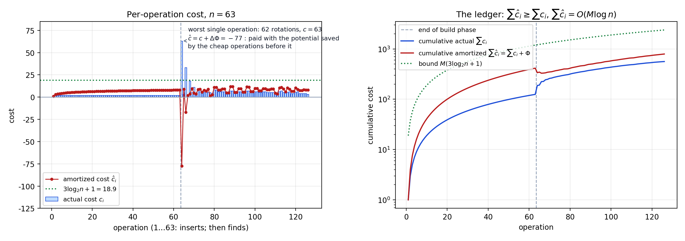

*图 14　摊还账本（$N=63$ 的真实模拟，脚本 `assets/make_amort_figs.py`）：先按 $1,2,\dots,63$ 依次插入（每次插入的 splay 恰好是一个 zig，实际代价 2），得到一棵“根为 63 的左链”；再按 $1,63,2,62,\dots$ 的顺序访问。左图：单次实际代价 $c_i$（蓝柱）与摊还代价 $\hat c_i=c_i+\Delta\Phi$（红点）——最贵的一次访问要 62 次旋转（$c=63$），已经超过 $3\log_2 N+1=18.9$，但它的摊还代价是 $-77$：这笔钱是之前那些便宜操作攒下的势能。右图：累积实际代价 $\sum c_i$、累积摊还代价 $\sum\hat c_i=\sum c_i+\Phi$、以及直线 $M(3\log_2 N+1)$，红曲线始终夹在蓝曲线与虚线之间，正对应式 (10) 的两条要求*

## 8. 小结与常见疑问

- **势能法一句话**：$\hat c=c+\Delta\Phi$；$\sum\hat c=\sum c+\Phi(D_M)-\Phi(D_0)$，取 $\Phi(D_0)=0,\ \Phi\ge0$ 即得 $\sum c\le\sum\hat c$。
- **splay 的势函数**就是所有节点秩之和 $\Phi(T)=\sum\log S(i)$，$R(T)=\log N$；一次旋转只动 $X,P,G$ 三个秩。
- **每步的界**：zig $\le 1+3\Delta R$，zig-zag / zig-zig $\le 3\Delta R$；求和望远镜后一次 splay $\le 3\log N+1=O(\log N)$。
- **“单次最坏 $O(N)$”与“摊还 $O(\log N)$”不矛盾**：图 14 左图里就有一次 62 次旋转的访问，它的账被前面便宜的操作付掉了。摊还界算的是**序列总账**，不是每一次的最坏情况。
- **为什么 splay 有时比 AVL 便宜、有时更贵**（见「定义」那一节）：AVL 每次保证最坏 $O(\log N)$；splay 不保证单次，但把 $M$ 次的总账压到 $O(M\log N)$，并且自带“访问局部性”的好处。比较单次、比最坏时 splay 可能输；比长序列的总代价时它不吃亏。
- 教材把 zig-zig 那一步留成了**习题 11.8**（*Show that the amortized time of a zig-zig splay is at most $3(R_f(x)-R_i(x))$*），上面的第 5.3 节就是这道题的完整解答。
- **（补充）数值自检**：`assets/make_amort_figs.py` 真正跑了一遍 splay（$N=63$，63 次插入 + 63 次访问），逐步骤核对了第 5 节里每步的上界，也核对了 $\sum_i\hat c_i\ge\sum_i c_i$ 与 $\max_i\hat c_i\le3\log_2 N+1$：本次运行的输出是 125 个旋转步全部满足、$\max_i\hat c_i=11.97\le18.93$、$\sum_i\hat c_i-\sum_i c_i=231.3=\Phi(D_M)\ge0$。改 $N$ 后重跑会得到不同的数值，但结论不变。

**待确认**：

1. 讲义 PDF 的结论写作 $O(M\log M)$，严格应为 $O(M\log N)$（见第 2 节注）；
2. delete 的附加势能分析讲义只写 *please refer to the textbook*，本文按教材 §11.5 转述；若老师课上另有推导，可据此补充；
3. 5.4 节注里那行被圈出的 $\hat c\le 1+3(R_2(X)-R_1(X))$ 究竟按“整次 splay”还是“每步”理解，建议上课时问一下。
