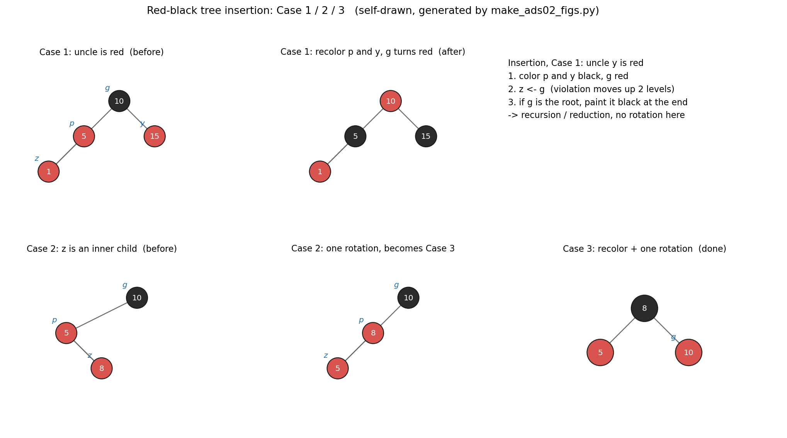
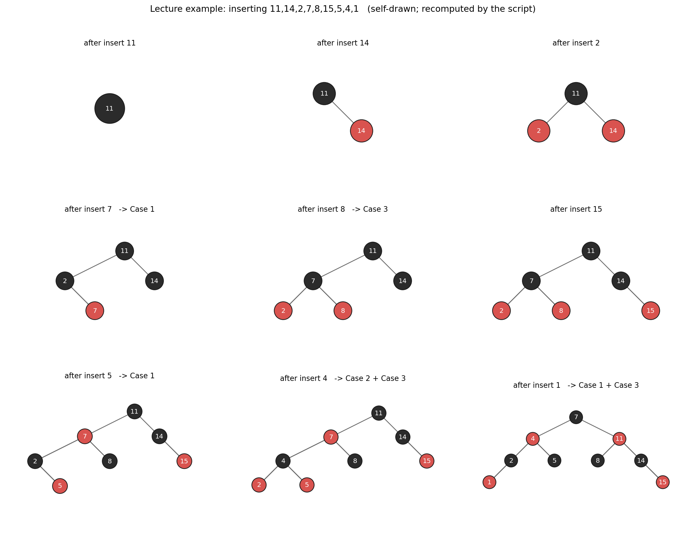
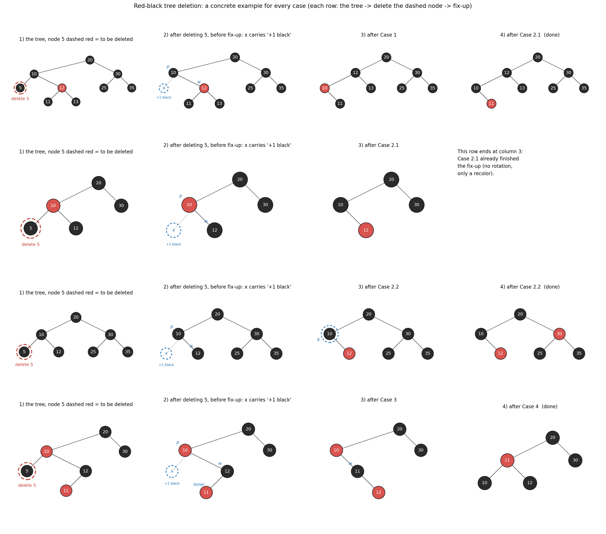
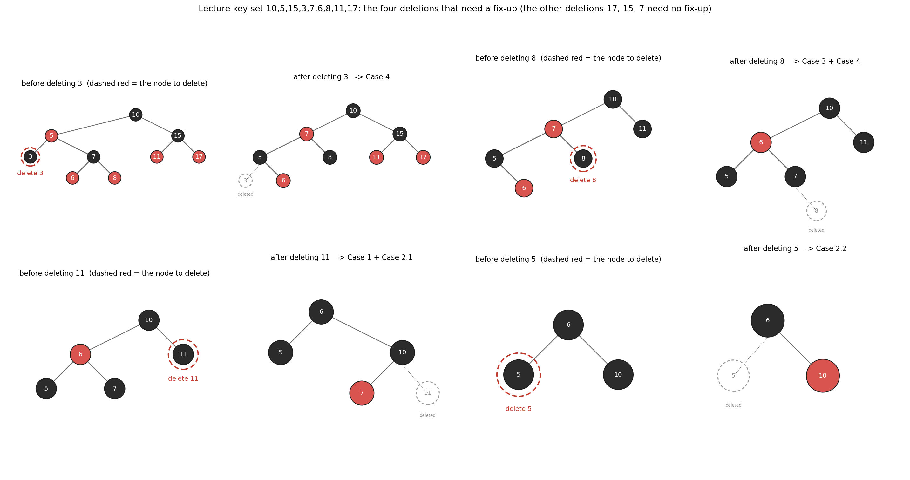
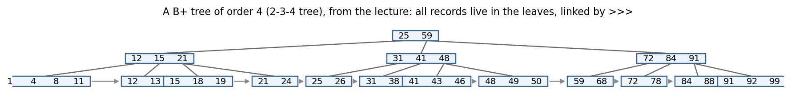
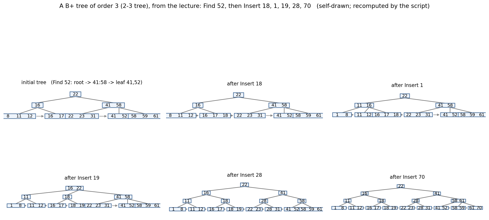

# ADS02 红黑树与 B+ 树 —— 课前笔记

> 来源：`../Materials/Student Slides/ADS02BTree_Stu.ppt`（*Red-Black Trees and B+ Trees*）
> 教材参考（讲义末页给出）：CLRS 3rd，Ch.13 p.308–338（红黑树）、Ch.18 p.484–504（B 树）
> 整理日期：2026-09-16（2026-09-20 补全插入 / 删除的完整 Case、示例复算与配图）
> 说明：本文由 AI 依据讲义幻灯片整理，用于课前预习；结构体、代码与彩色示意图请看原课件。
> 本讲的 6 张自绘配图（`assets/fig_rb_*.png`、`assets/fig_bplus_*.png`）由 `assets/make_ads02_figs.py` 生成，
> 其中的树结构与 Case 序列全部由该脚本内的红黑树 / B+ 树实现复算得到，可重跑复现。

## 1. 一页速览

| 问题 | 讲义给的答案 |
|---|---|
| 本讲目标 | 得到**平衡的二叉搜索树（binary search tree）**（*Target: Balanced binary search tree*） |
| 红黑树的代价 | 高度（height） $\le 2\log(N+1)$，插入、查找（search）都是 $T=O(\log N)$（课件该页写作 $2\ln(N+1)$，**底数写错了**：研习室勘误给出精确界 $2\log_2(N+1)$），可迭代（iteration）实现 |
| 插入（insertion）的三种情形 | *Sketch of the idea: Insert & color red*，然后修复 Case 1 / Case 2 / Case 3（对称情形同理） |
| 删除（deletion）的四类情形 | 只在被删节点为黑时调整；演示页按 Case 1 / 2.1 / 2.2 / 3 / 4 逐类给出 |
| 旋转（rotation）次数 | 插入最多 2 次；删除最多 3 次（讲义 AVL / 红黑树对比表） |
| 红黑树的存在意义 | 旋转次数少，是很多标准库 `map/set` 的实现基础 |
| B+ 树 | 为**磁盘（disk）/ 分层存储（hierarchical storage）**设计的多路平衡查找树（multiway balanced search tree）：阶 $M$ 的 B+ 树，数据全部在叶子（leaf）上 |
| B+ 树关键结论 | 查找 $O(\log N)$；插入要分裂（split）；讲义指出 **$M$ 取 3 或 4 最好** |

## 2. 红黑树（Red-Black Trees）

### 2.1 五条性质（property）【讲义定义】

1. 每个节点（node）是红色或黑色（讲义图上还标出 `key / parent / color / left / right` 五个域）；
2. 根（root）是黑色；
3. 每个叶子（**NIL**，外部节点）是黑色；NIL 就是 NULL，画图时一般省略；
4. 如果一个节点是红色，那么它的两个孩子（child）都是黑色；
5. 对每个节点，从它到其后代（descendant）叶子的**所有简单路径（simple path）含相同数目的黑节点**。

### 2.2 黑高（black height）与高度上界（upper bound）

- **黑高** $bh(x)$：从 $x$（不含 $x$）向下到叶子的任意简单路径上的黑节点数；$bh(\text{Tree})=bh(\text{root})$。
  > 研习室按课件口径补全了约定：黑高**不含 $x$ 自身、但包含路径终点那个黑色的 NIL**，且 $bh(\text{NIL})=0$（于是 $\text{size}(\text{NIL})=2^0-1=0$ 与归纳基例自洽）。
  > 若把"高度"只算到内部叶子（不数 NIL 那一层），得到的界只会更宽松；两种约定不能混用，否则 $h\le2\log_2(N+1)$ 的推导会出现半层偏差。
- **引理（lemma）**：有 $N$ 个内部节点（internal node）的红黑树高度不超过 $2\log(N+1)$。
  讲义给出的归纳证明（induction proof）骨架：对任意节点 $x$，$\text{size}(x)\ge 2^{bh(x)}-1$。
  - $h(x)=0$ 时 $x$ 是 NIL，$\text{size}=2^0-1=0$；
  - 归纳步（inductive step）：$h(x)=k+1$ 时，孩子的黑高要么 $=bh(x)$、要么 $=bh(x)-1$，于是
    $\text{size}(x)=1+\,\text{size}(\text{child1})+\,\text{size}(\text{child2})\ge 2^{bh(x)}-1$；
  - 再由 $bh(\text{Tree})\ge h(\text{Tree})/2$ 得结论。
  - 为什么 $bh(\text{Tree})\ge h(\text{Tree})/2$：把一条根到叶的简单路径上的节点拆成黑节点与红节点，
    即 $h=h_b+h_r$（若把 NIL 那一层也算进高度，则 $h_b$ 就是黑高 $bh$）；
    性质 4 保证**红节点不能相邻**，路径上每个红节点下面必然接一个黑节点，所以 $h_r\le h_b$，
    于是 $h\le 2h_b=2\,bh$。
    > 注意：这里的高度是算上 NIL 节点的；单个节点 $x$ 的 $h(x)$ 不超过整棵树的高度。
  - 【讲义】把这一步留成 *Discussion 2: Please finish the proof*。
- **推导用到的一条性质**：$N=\text{size}(\text{root})\ge 2^{bh(\text{root})}-1\ge 2^{h/2}-1$，即 $N+1\ge 2^{h/2}$，解出 $h\le 2\log(N+1)$。

### 2.3 插入（insertion）与三种情形（Case 1 / 2 / 3）

【讲义】思路：**按普通 BST 插入并染成红色**（*Sketch of the idea: Insert & color red*）——染红只可能违反性质 4，
修复目标单一；然后自底向上修复，分 Case 1 / 2 / 3（左右镜像（mirror）的情形同理，【讲义】图上只写一句 *Symmetric*）。

> 讲义把三种情形的图直接画在幻灯片上（文字里只有 *Case 1 / Case 2 / Case 3* 三个标题），
> 下面的条件与处理按教材 CLRS 13.3 / 13.4 补全，用作读课件图的对照。

**记号**：$z$ 是新插入的红节点，$p=z.p$（父节点），$g=z.p.p$（祖父节点），$y$ 是 $p$ 的兄弟即叔节点（uncle）。
所谓「内侧孩子」（inner child），指 $z$ 与 $p$ 处于相反的方向（例如 $p$ 是左孩子而 $z$ 是右孩子）；「外侧孩子」（outer child）指同方向。

| 情形 | 条件 | 处理 | 结果 |
|---|---|---|---|
| Case 1 | 叔节点 $y$ 是红色 | $p$、$y$ 改黑，$g$ 改红；令 $z\leftarrow g$ | 不旋转；红-红冲突**向上化归两层**，循环继续 |
| Case 2 | 叔节点 $y$ 是黑色，且 $z$ 是**内侧**孩子 | 绕 $p$ 旋转一次（左-右或右-左），旋转后令 $z\leftarrow$ 原 $p$ | 不改变颜色；问题**化归为 Case 3** |
| Case 3 | 叔节点 $y$ 是黑色，且 $z$ 是**外侧**孩子 | $p$ 改黑、$g$ 改红，绕 $g$ 旋转一次 | **终结**：红黑性质全部恢复 |
> 研习室补充的两条实现口径：① 循环**结束后必须把根染黑**——Case 1 上移到根时根可能暂时是红的（见下面图 1 的说明）；
> ② 课件 Case 1 的前提是"**父红且叔红**"，只有叔黑的两支才按 $z$ 是内侧 / 外侧分成 Case 2 / Case 3。

- 循环结束后（$z$ 变成根，或 $p$ 已是黑）把根重新染黑。
- 代价 $T=O(h)=O(\log N)$，**可以写成迭代**（*— can be done iteratively*）：Case 1 只需把 $z$ 上移，不必递归回溯。



> 图 1　红黑树插入 Case 1 / 2 / 3 的「处理前 → 处理后」（自绘，蓝色小字 $z,p,g,y$ 是上面的记号）。
> 第一行右边那格是 Case 1 处理后的状态：此时根 10 暂时还是红的，循环结束时才被改回黑。

#### 讲义示例复算：依次插入 $11,14,2,7,8,15,5,4,1$

| 插入 | 触发的 Case | 说明 |
|---|---|---|
| 11 | — | 根，最后染黑 |
| 14 | — | 作为 11 的红孩子 |
| 2 | — | 11 的两个孩子都是红，仍合法 |
| 7 | Case 1 | 此时树是 $11(2,14)$，叔节点 14 红 → 改色，$z$ 上移到 11（根） |
| 8 | Case 3 | 外侧孩子 → 改色 + 旋转一次 |
| 15 | — | 直接挂在 14 下 |
| 5 | Case 1 | 叔节点 8 红 → 改色上移 |
| 4 | Case 2 + Case 3 | 先旋转化归，再改色 + 旋转结束 |
| 1 | Case 1 + Case 3 | 先改色上移，再改色 + 旋转结束 |



> 图 2　讲义插入示例的逐步复算（自绘）：每一步画出插入并修复后的树，标题里标出触发的 Case。
> 9 次插入里 Case 1 / 2 / 3 都出现过，与讲义插入页上标出的 *Case 1 / Case 2 / Case 3* 一致。

### 2.4 删除（deletion）与四类情形（Case 1 / 2.1 / 2.2 / 3 / 4）

#### 2.4.1 先按「节点度数（degree）」分三种结构情形【讲义】

1. **删叶子（leaf）**：*Reset its parent link to NIL*；
2. **删度为 1 的节点**：*Replace the node by its single child*；
3. **删度为 2 的节点**：*Replace the node by the largest one in its left subtree or the smallest one in its right subtree*，
   再从子树（subtree）中删掉那个替代者（即前驱 / 后继（predecessor / successor），把问题化为情形 1 或 2）。

**只有被删节点是黑色时才需要调整**（*Adjust only if the node is black*.）；替代节点（replacement node）**保持颜色**（*Keep the color*），
这等价于给替代节点所在的路径**补 1 个黑**（*Must add 1 black to the path of the replacing node.*）。
笔记里沿用这个「记账」说法：把替代节点（可能是 NIL）记作 **$x$，它带着一个多余的「+1 black」**（也叫双黑，double black）。
修复的目标就是把这个多出来的黑消掉。

**记号**：$x$ 是「+1 black」的位置，$p=x.p$，$w$ 是 $x$ 的兄弟（sibling）；
$w$ 的两个孩子（侄子，nephew）中，**靠近 $x$ 一侧的叫内侄**，**远离 $x$ 一侧的叫外侄**。

> 同样地，讲义删除页只有 $x$、$w$ 与 *Case 1 / 2 / 3 / 4* 的示意图，条件与处理按 CLRS 13.4 补全；
> 讲义演示页上另标出 *Case 2.1* 与 *Case 2.2*，即下表 Case 2 的两个子情形。

#### 2.4.2 四类情形（Case 1 / 2.1 / 2.2 / 3 / 4）

| 情形 | 条件 | 处理 | 结果 |
|---|---|---|---|
| Case 1 | 兄弟 $w$ 是红色 | $w$ 改黑、$p$ 改红，绕 $p$ 旋转一次 | $w$ 变黑 ⇒ **化归为 Case 2 / 3 / 4**（旋转 1 次） |
| Case 2 | $w$ 是黑，且两个侄子都是黑 | $w$ 改红 | 见下面的 2.1 / 2.2 |
| Case 2.1 | 上一条且 $p$ 是**红** | $w$ 改红、$p$ 改黑 | **终结**：黑高补齐，不旋转 |
| Case 2.2 | 上一条且 $p$ 是**黑** | $w$ 改红，令 $x\leftarrow p$ | 「+1 black」**向上化归**一层，循环继续（*Continue to add 1 black to the path of x*），不旋转 |
| Case 3 | $w$ 是黑，**外侄黑、内侄红** | 内侄改黑、$w$ 改红，绕 $w$ 旋转一次 | 新 $w$ 的外侄变红 ⇒ **化归为 Case 4**（旋转 1 次） |
| Case 4 | $w$ 是黑，**外侄红** | $w$ 取 $p$ 的颜色、$p$ 改黑、外侄改黑，绕 $p$ 旋转一次 | **终结**（旋转 1 次） |

- 与 CLRS 13.4 的对应：CLRS 的 Case 2 就是「$w$ 黑、两侄皆黑」，【讲义】在演示页上把它拆成 **2.1（$p$ 红）/ 2.2（$p$ 黑）** 两个子情形
  （2.2 正是「双黑继续上移」的那一步，讲义在该页写 *Still not solved*、*Continue to add 1 black to the path of x*）。
  > 待确认：讲义删除演示页上的 Case 图是图片，本笔记按 CLRS 的口径给出 2.1 / 2.2 的划分依据（$p$ 的颜色），上课时请核对。
  > **（2026-09-20 研习室已确认）** 课件里的 Case 2.1 / 2.2 就是**删除 Case 2（兄弟黑、两侄皆黑）按"执行前父节点的颜色"做的细分**，与 CLRS 13.4 口径一致；
  > 而且标签要按**执行前**的状态固定，**不要用变色之后的颜色重新判别**（否则同一状态会被归到另一个子情形）。该站另为 Case 2.1 单独准备了演示案例。
- 旋转次数：Case 1 一次、Case 3 一次、Case 4 一次，合计 **至多 3 次**；Case 2.2 可能循环 $O(\log N)$ 次但一次都不旋转。



> 图 3　红黑树删除四类情形的**完整过程**（自绘）。每行四格：
> ① **原树**——红色虚线圆圈标出**要删掉的节点**（四行的例子删的都是 $5$，但周围结构不同）；
> ② **删除后、修复前**——被删节点已经消失，替代它的位置（这里是 NIL）带着「+1 black」，用蓝色虚线圆圈 $x$ 标出；
> ③ ④ **修复过程**——每一格是处理完某一类 Case 之后的形状，标题写明是哪一类 Case（这一格是"化归给下一格"还是"结束"）。
> 四个例子都先由脚本构造出合法的红黑树（`check()` 校验红黑性质），再跑真实的删除与修复；图中的 $p$ 是父节点、$w$ 是兄弟、*inner* 是内侄。

#### 2.4.3 讲义示例复算：键集 $10,5,15,3,7,6,8,11,17$

讲义用这组键在删除页上依次演示 Case 1 / 2.1 / 2.2 / 3 / 4。本笔记按同样的键集复算（建树顺序即讲义列出的顺序；
其中删 $17$、$15$、$7$ 这三次不需要修复，[图 4](#243-讲义示例复算键集-1051537681117) 里只画了需要修复的四次）：

| 删除 | 触发的 Case | 说明 |
|---|---|---|
| 3 | Case 4 | 外侄红 → 改色 + 绕 $p$ 旋转一次，结束 |
| 17 | — | 删的是红节点，不需要调整 |
| 15 | — | 被删的 15 有两个孩子，用后继 17 替代；替代节点是红色 ⇒ 不用调整 |
| 8 | Case 3 + Case 4 | 先绕 $w$ 旋转化归，再一次旋转结束 |
| 11 | Case 1 + Case 2.1 | 先旋转化成 Case 2.1，再改色结束 |
| 7 | — | 删的是红节点 |
| 5 | Case 2.2 | $w$ 与两侄皆黑、$p$ 黑 → 改色后「+1 black」上移到根，结束 |



> 图 4　讲义删除示例键集的复算（自绘），**每一对都是「删除前 → 删除后」**：
> 左格是删除前的树，红虚线圆圈标出**这一次要删的节点**；
> 右格是删除并修复之后，灰虚线圆圈标出**被删掉的位置**（里面写着被删掉的键），标题里标出这一步触发的 Case。
> 四对分别是删 $3$（Case 4）、删 $8$（Case 3 + 4）、删 $11$（Case 1 + 2.1）、删 $5$（Case 2.2）；
> 另外三次删除（$17$、$15$、$7$）不需要修复，所以不在图里。

#### 2.4.4 一个完整的删除例子：把讲义那棵树里的 3 删掉

用 [图 4](#243-讲义示例复算键集-1051537681117) 的第一对（"before deleting 3" → "after deleting 3 -> Case 4"）把每一步写清楚。
按 $10,5,15,3,7,6,8,11,17$ 依次插入后，树是（记号 $kB$ = 黑节点，$kR$ = 红节点）：

$$10B\bigl(\,5R(3B,\ 7B(6R,8R)),\ 15B(11R,17R)\,\bigr)$$

| 步骤 | 做什么 | 结果 |
|---|---|---|
| ① 结构情形 | $3$ 是**叶子**（度 0），按 [§2.4.1](#241-先按节点度数degree分三种结构情形讲义) 第 1 条直接摘掉（*Reset its parent link to NIL*） | $5$ 的左孩子变成 NIL |
| ② 要不要调整 | 被删的 $3$ 是**黑**节点 ⇒ 这条路径少了 1 个黑，替代它的 NIL 记作 $x$ 并带上「+1 black」（[图 4](#243-讲义示例复算键集-1051537681117) 第一对右格里的蓝虚线 $x$） | 树暂时"少一个黑" |
| ③ 判 Case | $x$ 的父 $p=5$（红），兄弟 $w=7$（黑），两侄 $6$、$8$ 都是红 ⇒ **不是** Case 2；其中远离 $x$ 的**外侄** $8$ 是红 ⇒ 命中 **Case 4** | Case 4 |
| ④ 处理 Case 4 | $w$ 取 $p$ 的颜色（$7$ 变红）、$p$ 改黑（$5$ 变黑）、外侄改黑（$8$ 变黑），再绕 $p=5$ **左旋**一次 | 见 [图 4](#243-讲义示例复算键集-1051537681117) 第一对右格 |
| ⑤ 结束 | Case 4 是终结情形，旋转后「+1 black」被消掉，红黑性质恢复 | 最终树：$10B\bigl(\,7R(5B(-,6R),8B),\ 15B(11R,17R)\,\bigr)$ |

一句话：**删黑叶子 → 记一个「+1 black」→ 看兄弟和两个侄子的颜色 → Case 4 改色 + 一次左旋 → 完事**
（这一步只用 1 次旋转，符合 [§2.5](#25-化归reductioncase-之间的转化关系) 里"删除最多 3 次旋转"的上界）。
再看 [图 4](#243-讲义示例复算键集-1051537681117) 另外三对就完整了：删 $8$ 要 Case 3 + Case 4（两次旋转）、删 $11$ 要 Case 1 + Case 2.1（一次旋转）、
删 $5$ 落在 Case 2.2（不旋转，只是把「+1 black」继续上推）。

### 2.5 化归（reduction）：Case 之间的转化关系

插入和删除的修复都是「**遇到某个 Case 就把它化成另一个更简单的 Case**」，只有少数 Case 是终结情形：

| 过程 | 化归链 | 终结情形 | 旋转次数上界 |
|---|---|---|---|
| 插入 | Case 2 →（旋转）Case 3；Case 1 →（$z$ 上移两层）重新分类，即向上化归 | Case 3 | 1（Case 2）+ 1（Case 3）= **2** |
| 删除 | Case 1 →（旋转）Case 2 / 3 / 4；Case 3 →（旋转）Case 4；Case 2.2 →（$x$ 上移一层）向上化归 | Case 2.1、Case 4 | 1（Case 1）+ 1（Case 3）+ 1（Case 4）= **3** |

- **插入**：Case 1 只改色、不旋转，且一次把 $z$ 上移两层；Case 2 只旋转、不改色，旋转后必定变成 Case 3；
  因此「插入最多 2 次旋转」，而且 Case 1 的向上化归可以写成一个迭代的 `while`。
- **删除**：Case 1 的旋转一定产生一个黑兄弟，于是问题落到 Case 2 / 3 / 4；Case 3 的旋转一定产生一个红的外侄，于是落到 Case 4；
  只有 Case 2.2 会继续向上循环（最多 $O(\log N)$ 层，但每层不旋转），因此「删除最多 3 次旋转」。
- 一句话记忆：**插入是「改色向上 + 两次旋转封顶」，删除是「改色向上 + 三次旋转封顶」**。

#### 2.5.1 补充：Bottom-up 与 Top-down（Weiss 风格）插入的对比

上面这套 Case 1 / 2 / 3 是**经典自底向上**（bottom-up）修复（CLRS 13.3 口径，本笔记与研习室的红黑树图解都采用它）。
教材（Weiss）另有一种**自顶向下**（top-down）的对称版本：在向下寻找插入位置的一路上就把遇到的"4-节点"（父黑、两孩子红）**提前分裂**（变色 + 必要时旋转），因此挂入新键后可能**完全不需要再修复**。

> 研习室（`#btrees/rb-compare` 专题）给出的对照结论：
> - 同一棵初始树插入同一个键，两种做法的**中间事件与最终树形可以不同**（示例：17 节点树插入 110，bottom-up 无需修复，top-down 在挂入前做了一次双旋）；
> - 用只含 3-节点与 4-节点的极端族（7 / 19 / 43 / 91 个节点）可以刻意放大差异：bottom-up 修复 0 次，top-down 需要 $\Theta(\log n)$ 次**预先分裂**；
> - 两边的**统计口径**要写清（事件次数 $\neq$ CPU 时间，且都不含教学可视化的快照 / 绘图开销）；
> - 做作业或读代码前先确认用的是哪一套（讲义代码 `../Materials/Code/redblack.c` 与本笔记的 Case 编号走 bottom-up）。
>
> 教材参考：Weiss《Data Structures and Algorithm Analysis in C》红黑树一节；本笔记只补这个"两套实现口径"的提醒，不改变第 2 章的 Case 体系。

### 2.6 与 AVL 的对比（旋转次数）

【讲义】用一张表对比 AVL 与红黑树的**旋转次数**：

| 树 | 插入的旋转次数 | 删除的旋转次数 |
|---|---|---|
| AVL | $\le 2$（单旋 1 次 / 双旋 2 次） | $O(\log N)$ |
| 红黑树（red-black tree） | $\le 2$ | $\le 3$ |

红黑树用**放宽高度平衡**（$h\le 2\log(N+1)$；AVL 的高度界是 $h<1.44\log_2(n+2)$，见 `02_ADS001_伸展树与摊还分析.md`）
换取了**更少的旋转**，
因此在插入删除频繁的场景更省；查找代价仍然是 $O(\log N)$。

> 待确认：讲义该页表格是图片，本笔记按「插入 2 / 删除 O(log N) / 插入 2 / 删除 3」的对应关系填表（与 2.5 节推出的 2 次、3 次吻合），以课件原图为准。

## 3. B+ 树（B+ Trees）

### 3.1 定义【讲义定义】

阶为 $M$ 的 B+ 树满足：

1. 根要么是叶子，要么有 2 到 $M$ 个孩子；
2. 所有非叶节点（除根）有 $\lceil M/2\rceil$ 到 $M$ 个孩子，内部节点最多M-1个分割键。
3. 所有叶子深度（depth）相同；
4. （约定）非根叶子也含 $\lceil M/2\rceil$ 到 $M$ 个孩子（原文：*Assume each nonroot leaf also has between $\lceil M/2\rceil$ and $M$ children*）。叶子最多存M个数据键。
> 研习室勘误（p.12 一带）：B+ 树里**键数与孩子数差 1**——内部节点是"$M$ 个孩子 + $M-1$ 个分隔键"，叶子是"最多 $M$ 个数据键"，
> 不能把所有节点统一当作"存同样多的键"。按该站约定：非根内部节点至少有 $\lceil M/2\rceil$ 个孩子，非根叶子至少有 $\lceil M/2\rceil$ 个数据键。

### 3.2 结构要点【讲义】

- **实际数据（record）全部存放在叶子上**（*All the actual data are stored at the leaves.*）；
- 叶子之间用图上的 `>>>` 指针（pointer）串联成链表（linked list），便于范围查询（range query）与顺序访问（sequential access）；
- 每个内部节点（interior node）含 $M$ 个指向孩子的指针（*Each interior node contains M pointers to the children.*），
  以及**除第 1 个之外的每个子树中的最小键**（共 $M-1$ 个键值）
  （原文：*And M 1 smallest key values in the subtrees except the 1st one.*，讲义里丢了个减号，应为 $M-1$）；
  即内部节点的第 $i$ 个键 $= $ 第 $i+1$ 棵子树里的最小键——注意不是「第 $i$ 棵子树的最大键」。
- 与 B 树的区别：B+ 树数据只在叶子、内部节点只做索引（index）、叶子链支持顺序扫描。

### 3.3 查找（search）与插入（insertion）

- **查找**：从根出发，在每个内部节点里比较，沿指针下降到叶子，命中与否都在叶子判定。
  > 研习室（按课件约定）：内部节点是"**$M$ 个孩子 + $M-1$ 个分隔键**"，分隔键取**右侧孩子子树的最小键**，比较时**等于分隔键就向右走**；非根内部节点至少有 $\lceil M/2\rceil$ 个孩子，非根叶子至少有 $\lceil M/2\rceil$ 个数据键。
  以阶 3 的示例树查 52（讲义 *Find: 52*）：根 $\to$ 节点 $41{:}58$ $\to$ 叶子 $(41,52)$，命中。
- **插入**（讲义伪代码 *Btree Insert*）：

  ```text
  Search from root to leaf for X and find the proper leaf node;
  Insert X;
  while ( this node has M+1 keys ) {
      split it into 2 nodes with ⌈(M+1)/2⌉ and ⌊(M+1)/2⌋ keys, respectively;
      if (this node is the root)
          create a new root with two children;
      check its parent;
  }
  ```

  即：先插到叶子里；若一个节点攒到 $M+1$ 个键就**分裂**成两半（$\lceil(M+1)/2\rceil$ 与 $\lfloor(M+1)/2\rfloor$ 个键），
  右半的最小键**上推**（push up，也叫 promote）给父节点；若分裂的是根就**新建根**（树高 +1），然后继续检查父节点，分裂可能**逐层向上传播**。

#### 讲义示例 1：阶 4 的 B+ 树（2-3-4 树）

讲义给的是一棵**已经长好**的阶 4 树：12 个叶子、中间层 3 个节点、根 1 个节点。



> 图 5　讲义阶 4（2-3-4 树）示例（自绘）：结构按讲义图，键值取自讲义文字；
> 每层节点里的键就是「除第 1 个子树外各子树的最小键」——根的两个键 $25,59$ 是第 2、3 组叶子的最小键。

| 层 | 内容 |
|---|---|
| 根 | $25 \mid 59$（3 个孩子） |
| 中间层 | 3 个节点：$12,15,21$ / $31,41,48$ / $72,84,91$（各带 4 个叶子，$M=4$ 满配） |
| 叶子（链表，`>>>` 相连） | 12 个叶子：1,4,8,11 / 12,13 / 15,18,19 / 21,24 / 25,26 / 31,38 / 41,43,46 / 48,49,50 / 59,68 / 72,78 / 84,88 / 91,92,99 |

#### 讲义示例 2：阶 3 的 B+ 树（2-3 树）的插入全过程

初始树（讲义图）：叶子 $(8,11,12),(16,17),(22,23,31),(41,52),(58,59,61)$，
第 2 层为节点 $16$（带前两个叶子）与 $41{:}58$（带后三个叶子），根为 $22$。



> 图 6　讲义阶 3（2-3 树）示例的插入复算（自绘）：每个面板是一步插入后的形状，叶子之间用 `>>>` 相连。
> 每一步的叶子内容、第 2 层节点键与根键都与讲义文字一致（例如插入 1 后出现 $11{:}16$，插入 19 后根变成 $16{:}22$）。

| 操作 | 分裂/传播 | 插入后的叶子（按 `>>>` 顺序） |
|---|---|---|
| Insert 18 | 叶子 $(16,17)$ 变 $(16,17,18)$，未分裂 | $(8,11,12)\ (16,17,18)\ (22,23,31)\ (41,52)\ (58,59,61)$ |
| Insert 1 | 叶子 $(8,11,12)$ 溢出 $\to$ 分裂为 $(1,8)$、$(11,12)$，$11$ 上推 | $(1,8)\ (11,12)\ (16,17,18)\ (22,23,31)\ (41,52)\ (58,59,61)$ |
| Insert 19 | 叶子 $(16,17,18)$ 溢出 $\to$ 分裂为 $(16,17)$、$(18,19)$，$18$ 上推；父节点攒到 4 个孩子再分裂，$16$ 上推给根 | $(1,8)\ (11,12)\ (16,17)\ (18,19)\ (22,23,31)\ (41,52)\ (58,59,61)$ |
| Insert 28 | 叶子 $(22,23,31)$ 溢出 $\to$ 分裂为 $(22,23)$、$(28,31)$，$28$ 上推；父节点 $41{:}58$ 分裂，$41$ 上推；根再分裂，$22$ 成为新根 → 树高 +1 | $(1,8)\ (11,12)\ (16,17)\ (18,19)\ (22,23)\ (28,31)\ (41,52)\ (58,59,61)$ |
| Insert 70 | 叶子 $(58,59,61)$ 溢出 $\to$ 分裂为 $(58,59)$、$(61,70)$，$61$ 上推 | $(1,8)\ (11,12)\ (16,17)\ (18,19)\ (22,23)\ (28,31)\ (41,52)\ (58,59)\ (61,70)$ |

可以看到：**插入的分裂会一路上推，最坏情况下从叶子一直传到根，正好让树高 +1**；这一路都只改一条路径上的节点，所以插入还是 $O(\log N)$。

### 3.4 删除（deletion）【讲义】

- 【讲义】原话：*First find a sibling with 2 keys and adjust.  Keep more nodes full.*
  ——删除时优先找一个**有富余（有 2 个键）的兄弟**做调整（向兄弟「借」（borrow）键，或把相邻的稀疏节点合并（merge）），
  总的倾向是**让节点更满**（避免频繁分裂、保持树矮）。
- 根的收缩：【讲义】*Deletion is similar to insertion except that the root is removed when it loses two children.*
  ——删除与插入类似，但**当根只剩一个孩子（失去两个孩子）时，根被删掉**，树高 −1。
- 删除可能使得树高减小，所以当合并操作可以实现这一点是需要合并，并且合并优先合并兄弟节点。


### 3.5 复杂度与参数选择【讲义结论】

$$
\text{Depth}(M,N)=O\big(\log_{\lceil M/2\rceil}N\big),\qquad
T_{\text{Find}}(M,N)=O(\log N) \tag{1}
$$

- 单个节点内部的搜索（或分裂，因为节点里要线性比较）代价 $T=O(M)$，从而
  $$T(M,N)=O\!\left(\frac{M}{\log M}\log N\right) \tag{2}$$
- 【讲义】结论：**$M$ 的最佳选择是 3 或 4**（*Note: The best choice of M is 3 or 4.*）。
  直观解释：树高是 $O(\log_M N)$（越小越好），而每个节点内部要花 $O(M)$（越大越差），
  (2) 式的 $\dfrac{M}{\log M}$ 在 $M=3,4$ 附近最小，所以 B+ 树的阶不宜太大；
  阶 3 就是 2-3 树，阶 4 就是 2-3-4 树（讲义示例正是这两种）。
> 研习室把代价拆成"**I/O 次数**"与"**节点内 CPU**"两笔账，引用式 (1)(2) 时必须带上计算模型：
> 记非根最小扇出 $m=\lceil M/2\rceil$（$M\ge3$ 时 $m\ge2$），高度为 $h$ 时叶子数至少 $2m^{h-1}$、每叶至少 $m$ 个数据键，故 $N\ge2m^{h}$，即 $h=O(\log_m N)$；
> 每次查找只走一条根到叶的路径，故**页访问** $O(1+\log_m N)$（根页常驻内存可再省常数次）；
> **节点内**若用二分查找分隔键，比较代价 $O(\log M)$，于是 CPU 检索 $O(\log M\cdot\log_m N)$；而**更新**每层可能要移动 $O(M)$ 个键，代价 $O(M\log_m N)$。
> 上面式 (2) 的 $\dfrac{M}{\log M}\log N$ 属"节点内按线性扫描计"的一种折中口径，与"节点内二分"不是同一套假设——引用时务必写清哪一套。
> 研习室勘误（p.12）："$M$ 最好为 3 或 4"依赖上面的**计算模型**（每节点一次比较、每页一次 I/O、忽略缓存与填充率等），
> **不能当作磁盘索引的一般结论**；实际 $M$ 由页大小、键长、指针/记录尺寸、填充率与缓存行为共同决定，外存模型里增大扇出通常更划算。

## 4. 听课重点与易混点

1. **性质 3 里的「叶子」是 NIL 外部节点（external node）**，不是「没有孩子的内部节点」——黑高按这个定义算。
2. **红黑树插入染红色**：因为染红只可能违反性质 4（红节点的孩子必须黑），修复目标单一。
3. **插入的 Case 2 不改变颜色、只旋转一次**，它必然化成 Case 3；**Case 1 只改色、不旋转**，且一次上移两层。
   Case 3 与删除 Case 4 的处理**顺序都是「先改色、再旋转」**（红黑树不是先旋转再修补颜色）。
4. **删除只在被删节点为黑色时调整**，替代节点保持原色；「补 1 个黑」的记账方式是理解 Case 1–4 的主线。
5. **删除 Case 2 拆成 2.1 / 2.2**：父节点是红（2.1）改色即结束；父节点是黑（2.2）必须把「+1 black」继续上推。
6. **旋转次数与化归链对应**：插入 ≤ 2 次（Case 2 + Case 3）、删除 ≤ 3 次（Case 1 + Case 3 + Case 4）——与讲义 AVL / 红黑树对比表一致。
7. **B+ 树与 B 树的区别**：B+ 树的数据全在叶子、内部节点只做索引、叶子链支持顺序访问（sequential access）。
8. **内部节点的键是「除第 1 个之外各子树的最小键」**，不是「各子树的最大键」；查找时用 $\le$、$>$ 决定走哪一支。
9. **阶数（order） $M$ 不是越大越好**：节点内搜索 $O(M)$ 与树高 $O(\log_M N)$ 之间有折中，最佳在 $M=3,4$。

## 5. 课后回顾

> 每道题后面给出**本讲对应小节**的链接（点击直接跳回），以及可以顺带回查的**关联知识点**（同一门课的其他笔记 / 教材）。

| # | 问题 | 本讲对应小节 | 关联知识点 |
|---|---|---|---|
| 1 | 写出红黑树五条性质；为什么它们能推出高度 $O(\log N)$？ | [§2.1 五条性质](#21-五条性质property讲义定义)、[§2.2 黑高与高度上界](#22-黑高black-height与高度上界upper-bound) | AVL 的平衡条件是怎么写的：[`02_ADS001` §2 平衡因子](02_ADS001_伸展树与摊还分析.md#2-平衡因子balance-factor) |
| 2 | 用 $\text{size}(x)\ge2^{bh(x)}-1$ 完成归纳证明（讲义 *Discussion 2*），并说明 $bh(\text{Tree})\ge h(\text{Tree})/2$ 为什么成立。 | [§2.2 黑高与高度上界](#22-黑高black-height与高度上界upper-bound) | AVL 的高度界 $h<1.44\log_2(n+2)$：[`02_ADS001` §8 补充：为什么 AVL 树高是对数级的](02_ADS001_伸展树与摊还分析.md#8-补充为什么-avl-树高是对数级的) |
| 3 | 插入 Case 1 / 2 / 3 各自在什么条件下发生？哪一个是终结情形？为什么插入最多 2 次旋转？ | [§2.3 插入与三种情形](#23-插入insertion与三种情形case-1--2--3)、[§2.5 化归](#25-化归reductioncase-之间的转化关系) | AVL 插入的四种失衡型 LL / RR / LR / RL：[`02_ADS001` §5 旋转](02_ADS001_伸展树与摊还分析.md#5-旋转)、[§6 四种旋转的分析](02_ADS001_伸展树与摊还分析.md#6-四种旋转的分析) |
| 4 | 删除时为什么要「补 1 个黑」？Case 2.1 与 2.2 的区别是什么？哪一个可能反复循环？ | [§2.4.1 三种结构情形](#241-先按节点度数degree分三种结构情形讲义)、[§2.4.2 四类情形](#242-四类情形case-1--21--22--3--4)、[§2.4.3 讲义示例复算](#243-讲义示例复算键集-1051537681117) | BST 删除与前驱 / 后继：`02_ADS001` [§1 平均搜索时间](02_ADS001_伸展树与摊还分析.md#1-成功查找的平均搜索时间average-search-length-asl)；AVL 删除为什么要 $O(\log N)$ 次旋转：同文 [§6 四种旋转的分析](02_ADS001_伸展树与摊还分析.md#6-四种旋转的分析) |
| 5 | 阶为 $M$ 的 B+ 树，非根节点至少要有几个孩子、几个键？根节点呢？ | [§3.1 定义](#31-定义讲义定义)、[§3.2 结构要点](#32-结构要点讲义) | 「为什么要块状结构」的动机：[`16_ADS15` §2 基本模型与流程](16_ADS15_外部排序.md#2-基本模型与流程) |
| 6 | 画一棵阶 3 的 B+ 树，依次插入 $18,1,19,28,70$，写出每次分裂后各层节点的键。 | [§3.3 查找与插入](#33-查找search与插入insertion)（图 6 这一节） | B+ 树在文件 / 检索系统里的位置：[`04_ADS03` §3 构造流程与工程要点](04_ADS03_倒排文件索引.md#3-构造流程与工程要点) |
| 7 | 为什么讲义说 $M$ 取 3 或 4 最好？由哪个代价式决定？ | [§3.5 复杂度与参数选择](#35-复杂度与参数选择讲义结论) | 外部排序里「$k$ 路归并」的 $k$ 与缓冲区折中：[`16_ADS15` §3.1 $k$ 路归并](16_ADS15_外部排序.md#31-k-路归并)、[§4 缓冲区与并行](16_ADS15_外部排序.md#4-缓冲区与并行buffer-handling) |

### 5.1 关联知识点（跨讲 / 跨资料）

- **同一门课里「平衡 BST」的三条路线**（连着本讲 §2.6 的对比表一起看）：
  - **AVL 树**：`02_ADS001_伸展树与摊还分析.md` 的 [§2 平衡因子](02_ADS001_伸展树与摊还分析.md#2-平衡因子balance-factor)、[§3 失衡节点](02_ADS001_伸展树与摊还分析.md#3-失衡节点trouble-finder)、[§5 旋转](02_ADS001_伸展树与摊还分析.md#5-旋转)、[§6 四种旋转的分析](02_ADS001_伸展树与摊还分析.md#6-四种旋转的分析)、[§8 为什么 AVL 树高是对数级的](02_ADS001_伸展树与摊还分析.md#8-补充为什么-avl-树高是对数级的)；
  - **伸展树（splay tree）**：同文的 [操作：splay](02_ADS001_伸展树与摊还分析.md#操作splay)（zig / zig-zig / zig-zag），以及 [为什么“顺次单旋”不行](02_ADS001_伸展树与摊还分析.md#2-为什么顺次单旋不行)；
  - **红黑树（本讲）**：用**放宽高度平衡**（$h\le2\log(N+1)$）换取更少的旋转。
- **「最坏情况」与「摊还」两种记账方式**：伸展树与摊还分析（[势能法](02_ADS001_伸展树与摊还分析.md#2-势能法)、[三种旋转各自的摊还代价](02_ADS001_伸展树与摊还分析.md#5-三种旋转各自的摊还代价)）——
  本讲的红黑树给的是**最坏情况**保证（每次插入 ≤ 2 次旋转、每次删除 ≤ 3 次旋转），两者目标相同、话术不同。
- **同样用摊还说话的数据结构**：`05_ADS04_左式堆与斜堆.md` 的 [斜堆归并的摊还分析](05_ADS04_左式堆与斜堆.md#31-斜堆归并的摊还分析讲义amortized-analysis-for-skew-heaps)、`06_ADS05_二项队列.md` 的 [§5 为什么 $N$ 次插入是 $O(N)$](06_ADS05_二项队列.md#5-为什么-n-次插入是-on两种证明讲义)。
- **磁盘 / 块状 I/O 这条线**：`16_ADS15_外部排序.md` 的 [§2.1 生成 run + 多趟归并](16_ADS15_外部排序.md#21-两阶段生成-run--多趟归并)、[§3.1 $k$ 路归并](16_ADS15_外部排序.md#31-k-路归并)、[§4 缓冲区与并行](16_ADS15_外部排序.md#4-缓冲区与并行buffer-handling)——
  B+ 树「一个节点 ≈ 一个磁盘块」与外部排序「一次 I/O 一个块」是同一套假设，本讲 §3.5 的 $M/\log M$ 折中就是这一类「块大小怎么取」的问题。
- **索引结构**：`04_ADS03_倒排文件索引.md` 的 [§3 构造流程与工程要点](04_ADS03_倒排文件索引.md#3-构造流程与工程要点)（词典、倒排表、压缩）。
- **递归式量级**：`08_ADS07_分治法与递归式.md` 的 [§4.3 主方法](08_ADS07_分治法与递归式.md#43-主方法master-method)，可用来快速判断 $\text{Depth}(M,N)=O(\log_{\lceil M/2\rceil}N)$ 这类式子的量级。
- **教材与代码**：CLRS 3rd Ch.13（红黑树）、Ch.18（B 树）；讲义代码 `../Materials/Code/redblack.c`、`redblack.h`、`testrb.c`；拓展阅读 `../Materials/Further Reading/2008-09LLRB.pdf`（左倾红黑树 LLRB）。
- **工程与并发（研习室）**：真实索引还要处理锁 / 闩（latch）、页分裂的并发控制、恢复与日志；B-link 树给节点加"右邻指针 + 边界键"，让查找能跨越**正在分裂**的页——网站明确把这些放在单线程结构演示之外，本笔记同样只作提示。
- **本课程其他讲**：回 [笔记索引 `00_索引.md`](00_索引.md) 按「数据结构的分析 / 算法设计技术」两条线找相邻讲义。

## 6. 来源与延伸阅读

- 讲义：`ADS02BTree_Stu.ppt`（*Red-Black Trees and B+ Trees*）；配套代码：`../Materials/Code/redblack.c`、`redblack.h`、`testrb.c`（另有 `aatree.c` 为 AA 树，非本讲内容）。
- 拓展阅读：`../Materials/Further Reading/2008-09LLRB.pdf`（左倾红黑树）。
- 教材：CLRS 3rd Ch.13 p.308–338（红黑树插入、删除的 Case 定义）、Ch.18 p.484–504（B 树）。
- 本讲配图（全部自绘，脚本 `assets/make_ads02_figs.py`，重跑即可复现，`dpi=160`）：

  | 图 | 用途 |
  |---|---|
  | `assets/fig_rb_insert_cases.png` | 图 1　插入 Case 1 / 2 / 3 的前后对比 |
  | `assets/fig_rb_insert_demo.png` | 图 2　讲义插入示例 $11,14,2,7,8,15,5,4,1$ 的复算 |
  | `assets/fig_rb_delete_cases.png` | 图 3　删除 Case 1 / 2.1 / 2.2 / 3 → 4 的前后对比 |
  | `assets/fig_rb_delete_demo.png` | 图 4　讲义删除示例键集的复算 |
  | `assets/fig_bplus_order4.png` | 图 5　讲义阶 4（2-3-4 树）示例结构 |
  | `assets/fig_bplus_23_demo.png` | 图 6　讲义阶 3（2-3 树）插入 18,1,19,28,70 的复算 |

- 待确认：
  - 讲义删除演示页上的 Case 2.1 / 2.2 划分依据（本笔记按父节点颜色对应，见图 3 说明）；
  - 讲义 AVL / 红黑树对比表的单元格对应关系（本笔记按「插入 2 / 删除 $O(\log N)$ / 插入 2 / 删除 3」填写）；
  - B+ 树删除的完整 Case（讲义该页只有示意图与两句结论）；
    （研习室同样只到讲义口径：它的 B+ 实验只覆盖插入与查找，删除机制仍以讲义 / 课堂为准。）
  - 本讲**不涉及线段树（segment tree）**：讲义全文没有出现该内容，若课上讲到请另行补注。
