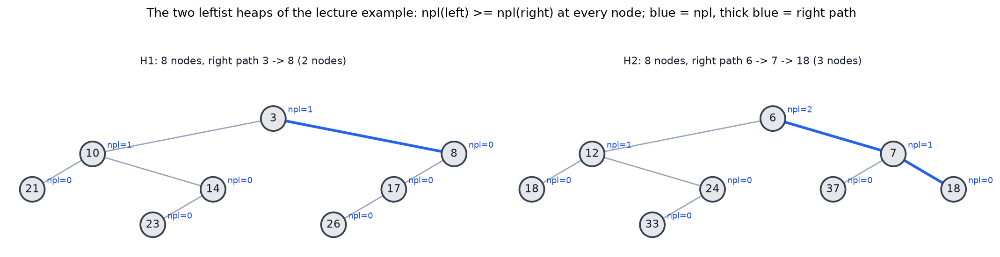
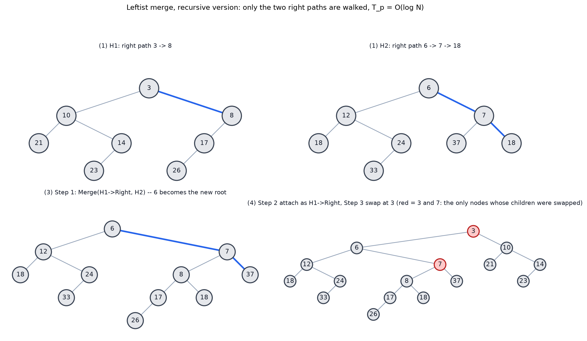
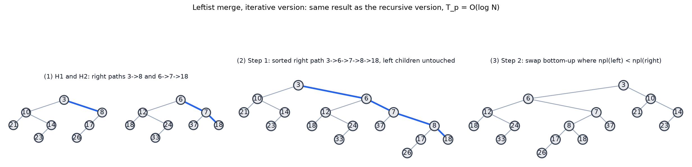
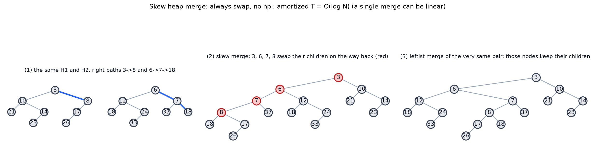
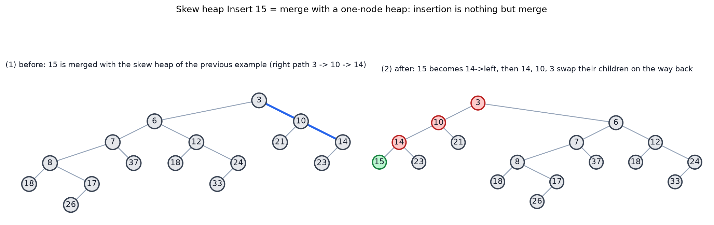
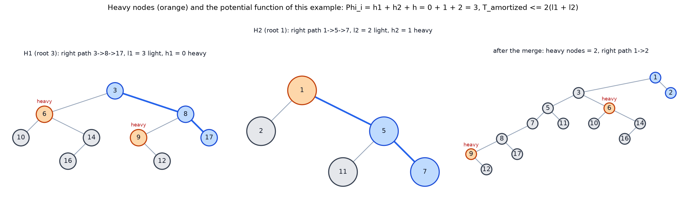

# ADS04 左式堆与斜堆 —— 复习笔记

> 来源：`../Materials/Student Slides/ADS04LeftistSkewH_Stu.ppt`（*Leftist Heaps and Skew Heaps*）
> 教材参考（讲义末页给出）：Weiss《Data Structures and Algorithm Analysis in C》(2nd Ed.) Ch.5 p.161–169；Ch.11 p.435–437
> 整理日期：2026-09-16（2026-09-22 补全 *Discussion 5* 的解答、§2.2 定理证明与 §3.1 的摊还推导，并按研习室第 04 章补齐边界说明；2026-09-29 把 §4 的四个讲义示例补成自绘图片，生成脚本 `assets/make_leftist_skew_figs.py`）
> 说明：本文由 AI 依据讲义幻灯片整理，用于课前预习。归并过程的动画（节点搬运）请看课件。

## 1. 一页速览

| 问题 | 讲义给的答案 |
|---|---|
| 起点 | 普通二叉堆（binary heap：堆序性 + 完全二叉树（complete binary tree））：**用原始结构归并两个堆只能到 $O(N)$**（讲义 *Discussion 5*，解答见 [§1.1](#11-讨论题-5discussion-5用原始堆结构归并两个堆有多快)） |
| 目标 | 把归并加速（*Speed up merging in O(N)*） |
| 左式堆 | 牺牲"完全性（completeness）"：仍是**堆序（heap order）**的二叉树（binary tree），但**不平衡**，用 **Npl** 维持左偏性质（leftist property） |
| 基本操作 | **归并（merge）**是核心；**插入（insertion）就是只含一个节点（node）的堆与堆归并的特例**；**DeleteMin = 删根 + 归并两棵子树（subtree）** |
| 复杂度 | 归并 $T_p=O(\log N)$（因为**右侧路径长 $O(\log N)$**） |
| 斜堆 | 左式堆的"简化版"：**不存 Npl、不做判断，总是交换左右孩子（child）**，靠摊还分析（amortized analysis）保证 $O(\log N)$ |
| 斜堆的代价 | 归并的**摊还（amortized）**代价 $O(\log N)$（势函数 = "重节点"个数） |

### 1.1 讨论题 5（Discussion 5）：用原始堆结构归并两个堆有多快？

> 【讲义】*Discussion 5: How fast can we merge two heaps if we simply use the original heap structure?*
> 讲义把它放在"堆 = 结构性质 + 序性质"之后，答案就是下一页写的 *Target: Speed up merging in O(N)*——**现有做法只能到 $O(N)$，本讲要把它加速**。

设两个堆一共有 $N$ 个元素。"用原始堆结构"指数组表示的完全二叉树（complete binary tree）二叉堆，此时归并可以这样做：

1. 把两个堆的数组**首尾拼接**成一个长度 $N$ 的数组（$O(N)$，元素要搬一遍）；
2. 对拼接结果调用 **buildHeap（自底向下的下滤（percolate down），Floyd 法）**，把违反堆序的位置逐层修好（$O(N)$）。

所以**原始堆结构上的归并是 $O(N)$**。注意两步都不能省：**只拼接**（把两个数组接起来，$O(1)$）得到的数组形状是合法完全二叉树，但拼接处两边的键没有大小关系，一般**不是堆**，必须付 buildHeap 的代价——这正是原稿"把两个堆直接存进同一个数组、重建一个大小为 $N$ 的堆"那句话的完整含义。

**为什么 buildHeap 是 $O(N)$ 而不是 $O(N\log N)$**：完全二叉树中高度为 $h$ 的结点数不超过 $\left\lceil N/2^{h+1}\right\rceil$，每个这样的结点最多下滤 $h$ 层，于是总下滤步数

$$T(N)=\sum_{h\ge 1} h\left\lceil \frac{N}{2^{h+1}}\right\rceil \le N\sum_{h\ge 1}\frac{h}{2^{h+1}}+O(\log^2 N)=N+O(\log^2 N)=O(N),$$

其中 $\sum_{h\ge 1}\dfrac{h}{2^{h+1}}=1$（由 $\sum_{h\ge 1}hx^h=\dfrac{x}{(1-x)^2}$ 取 $x=\tfrac12$ 得）。原稿"第 $k$ 层最坏要调整 $k$ 步，这一层有若干结点"要补的正是**这一层的结点数 $\le N/2^{k+1}$**：层越深、结点越少，$k$ 与 $N/2^{k+1}$ 相乘求和收敛到常数。

**为什么不可能更快**：归并的结果必须包含全部 $N$ 个元素，用这套数组表示做什么都至少要把这 $N$ 个元素读写一遍，$\Omega(N)$ 的下界是平凡的。两边合起来——**原始堆结构上的归并是 $\Theta(N)$**，$O(N)$ 的做法已经最优到常数因子。

易错点：

- **逐个插入（insertion + 上滤（percolate up））是 $O(N\log N)$**，不是 $O(N)$；线性建堆靠"从底层往上批量修复"，不是"边插边修"。
- 讲义接着就要放弃完全性（completeness）：左式堆 / 斜堆都是**不平衡**的二叉树，用 $Npl$ / 交换来换 $O(\log N)$ 的归并。
- 对照 [`06_ADS05` §5 为什么 $N$ 次插入是 $O(N)$：两种证明](06_ADS05_二项队列.md#5-为什么-n-次插入是-on两种证明讲义)：那里说的"连续 $N$ 次插入 $O(N)$"是**摊还**总代价，与这里"一次 buildHeap 是 $O(N)$"是两笔不同的账；`06` 抄录的研习室勘误（§3.3）专门提醒这两个结论都要写清前提，别混着用。

## 2. 左式堆（Leftist Heaps）

### 2.1 定义【讲义定义】

- **零路径长（null path length）**：$Npl(X)$ = 从 $X$ 到**一个没有两个孩子的节点**的**最短路径（shortest path）长度**（边数）；约定 $Npl(\text{NULL})=-1$。等价地
  $$Npl(X)=\min\{\,Npl(C)+1\ :\ C\ \text{是}\ X\ \text{的孩子}\,\}$$
- **左式堆性质（leftist property）**：对每个节点 $X$，**左孩子的 Npl ≥ 右孩子的 Npl**。（讲义图示：左侧为 0/0，右侧为 1/0 等。）
- 直观效果：*The tree is biased to get deep toward the left*——树被"压"向左边，于是**右侧路径（right path）很短**。

### 2.2 关键定理（theorem）

> **【定理】** 右侧路径上有 $r$ 个节点的左式树，至少含 $2^{r}-1$ 个节点（讲义注明证明见教材 p.162，用归纳）。

**证明**（讲义只写 *By induction on p. 162*，即"见教材 p.162，用归纳"；下面按研习室「左式堆右路径只有对数长」的同一思路，写成对 $Npl$ 的结构归纳）。记 $s(X)$ 为以 $X$ 为根的子树规模，先证一条引理：

$$s(X)\ \ge\ 2^{\,Npl(X)+1}-1 \qquad (\text{对每个节点 } X). \tag{1}$$

- **基例 $Npl(X)=0$**：任意子树至少 1 个节点，$s(X)\ge 1=2^{0+1}-1$，(1) 成立。
- **归纳步 $Npl(X)=k\ge1$**：由 $Npl(X)=\min\{Npl(C)+1\}$ 知两个孩子都存在；左式性质给出 $Npl(\text{左})\ge Npl(\text{右})$，所以上式中的 min 取在右孩子上，
  $$Npl(X)=Npl(\text{右})+1 \quad\Longrightarrow\quad Npl(\text{右})=k-1,\qquad Npl(\text{左})\ge k-1 .$$
  对两个孩子分别用归纳假设（$Npl(\text{左}),Npl(\text{右})<k$，归纳是良基的）：
  $$s(\text{右})\ge 2^{k}-1,\qquad s(\text{左})\ge 2^{k}-1 .$$
  于是
  $$s(X)=1+s(\text{左})+s(\text{右})\ \ge\ 1+2\left(2^{k}-1\right)=2^{k+1}-1=2^{\,Npl(X)+1}-1,$$
  即 (1) 对 $X$ 也成立。

回到定理：设右侧路径上有 $r$ 个节点。左式性质使 $Npl(X)=Npl(\text{右孩子})+1$ 沿右侧路径处处成立，而右侧路径的末端结点没有右孩子、$Npl=0$，所以 $Npl(\text{根})=r-1$。代入 (1)：

$$N\ \ge\ s(\text{根})\ \ge\ 2^{(r-1)+1}-1=2^{r}-1. \qquad\blacksquare$$

> 研习室「左式堆右路径只有对数长」是同一证明的另一种叙述，它强调 $Npl$ 的最短空路径含义：$Npl$ 大意味着"离最近的单孩子结点还很远"，两棵这样的子树才撑得起 $2^{r}-1$ 个结点。


**推论（讲义 *Discussion 6*：*How long is the right path of a leftist tree of $N$ nodes? What does this conclusion mean to us?*）**：由 $N\ge 2^{r}-1$ 得

$$r\ \le\ \log_2(N+1)=O(\log N),$$

即 $N$ 个节点的左式堆**右侧路径上至多 $O(\log N)$ 个节点**。意义：归并、插入、DeleteMin 都只沿右侧路径（right path）工作，代价随之为 $O(\log N)$——**这条定理就是左式堆能把归并降到对数级的全部依据**。

### 2.3 归并：递归版（recursive version）三步（【讲义】）

```text
Step 1: Merge( H1->Right, H2 )      /* 递归归并 H1 的右子树与 H2 */
Step 2: Attach( H2, H1->Right )     /* 把结果接回 H1 的右孩子 */
Step 3: Swap( H1->Right, H1->Left ) if necessary   /* 维持左式性质 */
```

配套声明与代码（【讲义】原文）：

```c
struct TreeNode { ElementType Element; PriorityQueue Left; PriorityQueue Right; int Npl; };
```

- 归并入口：先按根的大小选"小根"作主树，再调用 `Merge1`；
- `Merge1` 中若主树没有左孩子（单节点），直接 `H1->Left = H2`（此时 `H1->Right` 已是 NULL、`H1->Npl` 已是 0）；
- 否则递归（recursion）归并右子树（right subtree），**若 `H1->Left->Npl < H1->Right->Npl` 才交换孩子**，最后更新 `H1->Npl = H1->Right->Npl + 1`。
- 【讲义】提问：*What if Npl is NOT updated?*（预习时想一想：Npl 一旦失效，左式性质就无从判断，复杂度保证随之失效。）
- 结论：$T_p=O(\log N)$。

### 2.4 迭代版（iterative version）与 DeleteMin，Insert

- **迭代（iteration）归并**：Step 1 把两条右侧路径**按大小合并**（不改各自的左孩子），Step 2 再自底向上检查并交换孩子，$T_p=O(\log N)$。
- **DeleteMin**：Step 1 删根；Step 2 归并两棵子树。
- **Insert**:Insert可以直接视为并堆。

## 3. 斜堆（Skew Heaps）

- **定位**：左式堆的简单版；目标同样是 *Any M consecutive operations take at most $O(M\log N)$ time*。
- **归并规则【讲义】**：**总是交换左右孩子**，唯一的例外是——**两条右侧路径上最大的那个节点不交换它的孩子**（*No Npl*）。
  - 讲义强调：*Not really a special case, but a natural stop in the recursions*（它不是特例，而是递归自然停下来的地方）。
  - 讲义明确留了一个坑：*This is NOT always the case*（"总是交换"这句话需要理解成"沿右侧路径的每一步都交换，直到递归底"）。
- **插入**：与只含一个节点的堆归并；【讲义】用 `Insert 15` 的序列演示。
- **优点【讲义】**：不需要额外空间维护路径（path）长度，也不需要判断"何时该交换"。
- **开放问题【讲义】**：左式堆与斜堆的**期望（expected value）右侧路径长度**至今没有精确结论。

### 3.1 斜堆归并的摊还分析（【讲义】*Amortized Analysis for Skew Heaps*）

- 插入与删除（deletion）都只是归并，所以只需分析归并。
- **重节点（heavy node）定义【讲义】**：节点 $p$ 是 **heavy**，若它**右子树的子孙数 ≥ $p$ 的子孙数的一半**（子孙数（descendants）含 $p$ 自己）；否则是 **light**。
- **每次归并只有原本位于右侧路径上的节点可能改变 heavy/light 状态**【讲义】：归并只改写右侧路径上的孩子指针，路径以外的结点的子树原封不动。
- 势函数（potential function）取**重节点的个数**（heavy 个数非负，满足势函数的非负要求）；记第 $i$ 次归并前后的势为 $\Phi_i,\Phi_{i+1}$。

**推导**（对应【讲义】该页的符号 $\Phi_i=h_1+h_2+h$；与研习室「斜堆的昂贵合并由势能支付」一致）。设参与归并的两条右侧路径上 light 结点数为 $l_1,l_2$、heavy 结点数为 $h_1,h_2$，两条路径以外（子树不变）的 heavy 结点数为 $h$。

- **实际代价**：递归只访问两条右侧路径上的结点，每个结点常数工作，故
  $$T_{\text{worst}}=l_1+h_1+l_2+h_2 \qquad(\text{【讲义】原式}).$$
- **势能变化** $\Delta\Phi=\Phi_{i+1}-\Phi_i\le (l_1+l_2)-(h_1+h_2)$，两个方向各有一条理由：
  - *heavy 只会变少*：参与归并的 heavy 结点 $p$ 交换孩子后，右孩子变成原来的左子树，其规模 $<\tfrac12 s(p)\le\tfrac12 s'(p)$（$s'$ 是归并后 $p$ 的子树规模，只增不减），所以 $p$ 归并后变成 light——参与的那 $h_1+h_2$ 个 heavy **一个不留**；
  - *light 最多各补一个*：参与归并的 light 结点交换孩子后最多变成 1 个 heavy，其余结点（含路径以外那 $h$ 个 heavy）状态不变，所以势能至多增加 $l_1+l_2$。
  - 与【讲义】的写法对照：讲义记"归并前 $\Phi_i=h_1+h_2+h$"，归并后"沿右侧路径上至多 $l_1+l_2$ 个 heavy 结点、其余 $h$ 个不变"，即 $\Phi_{i+1}\le (l_1+l_2)+h$，相减同样得到上式。
- **摊还代价**：
  $$T_{\text{amortized}}=T_{\text{worst}}+\Phi_{i+1}-\Phi_i\ \le\ (l_1+h_1+l_2+h_2)+\big[(l_1+l_2)-(h_1+h_2)\big]=2(l_1+l_2).$$

**为什么 $l_1+l_2=O(\log N)$**：设 $p$ 是 light，则 $|\text{right}(p)|<\tfrac12|p|$，即从 $p$ 往右孩子走一步，子树规模至少减半；一条右侧路径上最多有 $\log_2 N$ 个 light 结点，故 $l_1\le\log_2(n+1)$、$l_2\le\log_2(m+1)$（$n,m$ 为两棵树的规模）。于是

$$T_{\text{amortized}}\le 2(l_1+l_2)=O(\log n+\log m)=O(\log(n+m)),$$

而单次归并的最坏代价可以远大于 $O(\log N)$（研习室该章 `cost`：*斜堆 merge 摊还 $O(\log(n+m))$，单次可线性*）——左边那套"每次归并都 $O(\log N)$"的最坏保证在斜堆上不再成立，这正是要搬出势能法的原因。

**结论**：**任意 $M$ 次连续操作的摊还代价是每次 $O(\log N)$，总代价 $O(M\log N)$**，正是讲义开篇写的目标 *Any M consecutive operations take at most $O(M\log N)$ time*。


### 3.2 Discussion
#### 8-1 斜堆归并伪代码（pseudocode）与摊还分析

> 【讲义】*Skew heap merge pseudo code and its amortized analysis*
> *Notice that you don’t have to always swap children all the way to the last. Does this affect the amortized bound? Why?*

按讲义的递归定义，先让较小根作为主堆；把主堆的右子树与另一堆归并，再交换主堆的左右孩子：

```text
Merge(H1, H2):
    if H1 = NULL: return H2
    if H2 = NULL: return H1
    if H1.key > H2.key: swap(H1, H2)
    H1.right = Merge(H1.right, H2)
    swap(H1.left, H1.right)
    return H1
```

交换孩子不是维持堆序的条件，而是斜堆的自调整步骤；根比较和递归归并保证堆序。交换还会改变被访问节点的重 / 轻状态，这是 §3.1 势能分析中抵消实际代价的关键。

**回答**：若“不到最后”指只省略归并路径上最后一个节点的一次交换，摊还界**不变**。该节点至多多留下一个未被交换的重节点，因而势能变化的上界至多多一个常数项；实际代价也至多少一次常数时间操作。原推导相应变为

$$T_{\text{amortized}}\le 2(l_1+l_2)+O(1)=O(\log N).$$

但不能据此任意跳过路径中许多节点的交换。均摊分析的抵消依赖于：被访问的重节点经交换后转为轻节点，释放出的势能支付访问代价。若跳过某个重节点的交换，它可能仍为重节点，该次访问就没有这笔势能下降可抵；若跳过的重节点数不受 $O(\log N)$ 控制，原证明便不能推出 $O(\log N)$ 摊还界。**所以只省略末尾的常数次交换无碍；任意省略内部交换则不能直接沿用该摊还保证。**

## 4. 讲义中的例子（课上会看到）

> 本节把课件 ADS04 上的**图示示例**（四组，共 6 张图）按讲义重绘：节点标签、父子关系与归并结果都取自课件图形，图是**自绘**的（不是讲义截图）。
> 重绘脚本 [`assets/make_leftist_skew_figs.py`](assets/make_leftist_skew_figs.py) 用本讲自己的算法（[§2.3](#23-归并递归版recursive-version三步讲义) 的 `Merge1`、[§3.2](#32-discussion) 的伪代码）把每次归并**复算**了一遍：§4.2–§4.5 的复算结果与课件图示逐个节点一致（脚本里做了断言），§4.6 第 3 格是本讲算法复算出的归并结果，重节点数按定义数出。脚本可重跑复现。

### 4.1 两棵左式堆 H1 与 H2



- $H_1=3(10(21,14(23)),8(17(26)))$：根 3 的左孩子 10（$Npl=1$）、右孩子 8（$Npl=0$），共 8 个节点；
- $H_2=6(12(18,24(33)),7(37,18))$：根 6 的左右孩子 $Npl$ 都是 1，也是 8 个节点；
- 图里蓝色数字是每个节点的 $Npl$，加粗蓝线是**右侧路径**：H1 只有 $3\to 8$（2 个节点），H2 是 $6\to 7\to 18$（3 个节点）——归并、插入、DeleteMin 都只沿这条路径走，这就是 $O(\log N)$ 的全部来源（[§2.2](#22-关键定理theorem)）。

### 4.2 左式堆归并的递归三步



- **Step 1**（第 3 格）：$H_1$ 的右子树 $8(17(26))$ 与 $H_2$ 归并，根比较后 6 成为新根；回溯途中逐层判断——8 处左右 $Npl$ 都为 0（不交换），7 处 $Npl(37)=0<Npl(8\text{ 子树})=1$（交换），6 处 $Npl(12\text{ 子树})=Npl(7\text{ 子树})=1$（不交换）；
- **Step 2**（第 4 格）：把这棵结果接回 $H_1$ 的右孩子，此时 3 的左右子树 $Npl$ 为 1 与 2；
- **Step 3**（同一格）：$1<2$，交换 3 的左右孩子——$6$ 子树转到左边、$10$ 子树转到右边。
- 图中红色节点（3、7）是**真的交换过孩子**的节点；整趟归并只碰右侧路径上的节点，所以 $T_p=O(\log N)$。

### 4.3 左式堆归并的迭代两步



- **Step 1**（第 2 格）：把两条右侧路径 $3\to 8$ 与 $6\to 7\to 18$ 按大小**归并成一条** $3\to 6\to 7\to 8\to 18$，各自原来的左子树原封不动；
- **Step 2**（第 3 格）：自底向上，凡是 $Npl(\text{左})<Npl(\text{右})$ 就交换孩子——8 处不交换、7 处交换、6 处不交换、3 处交换；
- 结果与递归版**完全一致**（脚本里两个算法都实现并做过断言）。

### 4.4 斜堆归并：与左式堆对比



- 斜堆没有 $Npl$：回溯时**凡参与过比较的节点都交换孩子**（第 2 格），于是 3、6、7、8 的孩子顺序与左式堆结果（第 3 格）不同；差别集中在 6 的子树——斜堆得到 $6(7\text{ 子树},12\text{ 子树})$，左式堆得到 $6(12\text{ 子树},7\text{ 子树})$，正是讲义强调的**结果"不一定"相同**；
- 但两条路的走法相同（都只沿右侧路径递归），所以 [§3.1](#31-斜堆归并的摊还分析讲义amortized-analysis-for-skew-heaps) 的势能分析照旧成立。

### 4.5 斜堆 Insert 15



- 15 与上一例得到的斜堆归并：递归沿右侧路径 $3\to 10\to 14$ 比较（第 1 格），15 先接到 14 的右孩子；
- 回溯时 14、10、3 依次交换孩子（第 2 格红色），15 最终成为 $14$ 的**左**孩子，结果为 $3(10(14(15,23),21),\dots)$——**插入就是与单节点堆归并**。

### 4.6 heavy/light 分析与势函数



- 这一组用的是讲义摊还分析那两页的**另一组示例树**（节点编号与 §4.1 的 H1、H2 不同，别混用）；左边两棵就是要归并的 H1（根 3，9 个节点）与 H2（根 1，5 个节点）；橙色是**重节点**（其右子树的子孙数 ≥ 整棵子树子孙数的一半，子孙含自身），蓝色是右侧路径上的**轻节点**，其余轻节点为灰色；
- 计数：$l_1=3,h_1=0$（$3,8,17$ 全轻）、$l_2=2,h_2=1$（路径 $1\to 5\to 7$ 上只有 1 是重的），路径以外还有 2 个重节点（6、9），即 $h=2$，于是 $\Phi_i=h_1+h_2+h=3$；
- 归并后只剩 2 个重节点（$\Phi_{i+1}=2$，势能下降 1，第 3 格是按 §3.2 伪代码复算的结果），而 $T_{\text{worst}}=l_1+h_1+l_2+h_2=6$、$T_{\text{amortized}}=6-1=5\le 2(l_1+l_2)=10$，正是 [§3.1](#31-斜堆归并的摊还分析讲义amortized-analysis-for-skew-heaps) 的那条不等式。

## 5. 听课重点与易混点

1. **Npl 的定义是"到最近的缺孩子的节点的最短距离"**，不是"到叶子（leaf）的距离"，也不是高度（height）。
2. **左式性质只约束 Npl 大小关系**，不是"左子树（left subtree）更高"；AVL 才管高度。
3. **归并只沿右侧路径走**——这是 $O(\log N)$ 的全部来源；"为什么右路径短"要能说出 $2^r-1$ 那条定理。
4. **插入是归并的特例**（不是单独设计的过程），DeleteMin 才是"删根 + 归并"。
5. **左式堆 vs 斜堆**：前者每次归并都保证 $O(\log N)$（最坏），后者只在**摊还**意义下 $O(\log N)$（单次可以很贵，见 §3.1）。
6. **重节点定义里的"一半"**指子孙数（含自身），别漏掉这个细节；heavy/light 只用来**记账**（定义势函数），不参与归并的走向——斜堆归并完全不需要判断谁重谁轻。
7. **整树高度可以很大，右路径仍然很短**：全是左孩子的"链"仍然满足左式性质，树高 $\Theta(N)$，但右路径只有 1 个结点。所以"归并 $O(\log N)$"的分析对象是**右路径**，拿整树高度当依据是错的（研习室该章 `extensions`）。
8. **可合并堆不是万能的**：只有单队列的插入 + 取最小、不需要归并时，数组二叉堆的空间局部性（spatial locality）与常数通常更好；"归并界更优"不等于"处处更快"（研习室该章 `extensions`）。

## 6. 复习要点

> 每道题后面给出**本讲对应小节**的链接（点击跳回），以及可以顺带回查的**关联知识点**。

| # | 问题 | 本讲对应小节 | 关联知识点 |
|---|---|---|---|
| 1 | 写出 $Npl$ 的递归定义，并给 $Npl(\text{NULL})=-1$ 的作用。 | [§2.1 定义](#21-定义讲义定义) | 二叉堆（binary heap）的实现见 `../Materials/Code/binheap.c`，它不支持高效归并——这正是左式堆要解决的问题 |
| 2 | 证明"右路径 $r$ 个节点 ⇒ 至少 $2^r-1$ 个节点"（建议归纳）。 | [§2.2 关键定理](#22-关键定理theorem) | 与 AVL 的 $n_h=F_{h+3}-1$ 是同一类「由结构性质推规模下界」的证明：[`02_ADS001` §8 为什么 AVL 树高是对数级的](02_ADS001_伸展树与摊还分析.md#8-补充为什么-avl-树高是对数级的) |
| 3 | 写出左式堆递归归并的三步，并说明第 3 步的交换条件。 | [§2.3 归并：递归版三步](#23-归并递归版recursive-version三步讲义)（例见图 [§4.2](#42-左式堆归并的递归三步)、迭代版见 [§4.3](#43-左式堆归并的迭代两步)） | 归并（merge）是优先队列的通用操作：对照 [`06_ADS05` §3.2 Merge](06_ADS05_二项队列.md#32-merge) |
| 4 | `Merge1` 中 `H1->Npl = H1->Right->Npl + 1` 为什么成立？若不更新 Npl 会怎样？ | [§2.3 归并：递归版三步](#23-归并递归版recursive-version三步讲义)、[§2.4 迭代版与 DeleteMin](#24-迭代版iterative-version与-deletemininsert) | 讲义代码 `../Materials/Code/leftheap.c`（`Merge1` 与 Npl 更新都在里面） |
| 5 | 斜堆归并时"总是交换"具体交换到什么程度？哪一步不交换？ | [§3 斜堆](#3-斜堆skew-heaps)（例见图 [§4.4](#44-斜堆归并与左式堆对比)、[§4.5](#45-斜堆-insert-15)） | 与左式堆的差别只有「交换条件」一行：[§2.3](#23-归并递归版recursive-version三步讲义) 第 3 步 |
| 6 | 斜堆摊还分析中 heavy / light 的定义是什么？势函数取什么？最终界为什么是 $O(\log N)$？ | [§3.1 斜堆归并的摊还分析](#31-斜堆归并的摊还分析讲义amortized-analysis-for-skew-heaps)（例见图 [§4.6](#46-heavylight-分析与势函数)） | 势能法（potential method）的完整复习：[`02_ADS001` §2 势能法](02_ADS001_伸展树与摊还分析.md#2-势能法)、[§5 三种旋转各自的摊还代价](02_ADS001_伸展树与摊还分析.md#5-三种旋转各自的摊还代价) |
| 7 | *Discussion 5*：用原始（数组）堆结构归并两个堆最快能到多少？为什么不能再快？ | [§1.1 讨论题 5](#11-讨论题-5discussion-5用原始堆结构归并两个堆有多快) | 线性建堆的两笔不同账：[`06_ADS05` §5 两种证明](06_ADS05_二项队列.md#5-为什么-n-次插入是-on两种证明讲义)（连续插入的**摊还** $O(N)$）与 [`06_ADS05` §3.3 的研习室勘误](06_ADS05_二项队列.md#33-insert)（别把摊还说成最坏）；教材 Weiss §6.3 的 buildHeap |
| 8 | *Discussion 8-1*：省略最后一次孩子交换是否改变斜堆归并的摊还界？为什么不能任意跳过内部交换？ | [§3.2 Discussion 8-1](#32-discussion) | 对照 [§3.1 的重 / 轻节点记账](#31-斜堆归并的摊还分析讲义amortized-analysis-for-skew-heaps)：势能下降能否抵偿访问代价，取决于被访问的重节点是否交换 |

### 6.1 关联知识点（跨讲 / 跨资料）

- **三种可归并堆的对照**（同一门课的三条路）：
  - 本讲（[§2 左式堆](#2-左式堆leftist-heaps)、[§3 斜堆](#3-斜堆skew-heaps)）：靠 $Npl$ / 交换保持右路径短，归并 $O(\log N)$（斜堆为摊还）；
  - [`06_ADS05_二项队列.md`](06_ADS05_二项队列.md)：[§2 二项树 $B_k$](06_ADS05_二项队列.md#2-二项树-b_k)、[§3 五种操作](06_ADS05_二项队列.md#3-五种操作)——用「二进制加法」组织森林，$N$ 次插入摊还 $O(N)$；
  - 普通二叉堆：`../Materials/Code/binheap.c`，不能高效归并。
- **摊还分析的两种用法**：[`02_ADS001_伸展树与摊还分析.md`](02_ADS001_伸展树与摊还分析.md) 的 [§2 势能法](02_ADS001_伸展树与摊还分析.md#2-势能法)、[§5 三种旋转各自的摊还代价](02_ADS001_伸展树与摊还分析.md#5-三种旋转各自的摊还代价)（splay）与本讲 [§3.1 斜堆归并的摊还分析](#31-斜堆归并的摊还分析讲义amortized-analysis-for-skew-heaps)——同一套 $\hat c=c+\Delta\Phi$。
- **红黑树 / AVL 的高度界**：[`03_ADS02` §2.2 黑高与高度上界](03_ADS02_红黑树与B+树.md#22-黑高black-height与高度上界upper-bound)、[§2.6 与 AVL 的对比](03_ADS02_红黑树与B+树.md#26-与-avl-的对比旋转次数)——「结构约束 ⇒ 对数高度」的另两个例子。
- **教材**：Weiss Ch.5（p.161–169）与 Ch.11（p.435–437）；拓展阅读 `../Materials/Further Reading/lowskew.pdf`。

## 7. 来源与延伸阅读

- 讲义：`ADS04LeftistSkewH_Stu.ppt`；配套代码：`../Materials/Code/leftheap.c`、`leftheap.h`、`testleft.c`（本讲未提供斜堆代码文件，斜堆按讲义算法实现即可）。
- 拓展阅读：`../Materials/Further Reading/lowskew.pdf`（与"低偏斜"结构相关的讨论，讲义未点名要求）。
- 教材：Weiss Ch.5（p.161–169，左式堆与斜堆）与 Ch.11（p.435–437，摊还分析）。
- 研习室（第 04 章「左式堆与斜堆」）：`leftist` / `skew` 两个交互演示；`proofs` 两条（「左式堆右路径只有对数长」「斜堆的昂贵合并由势能支付」）已并入 §2.2 与 §3.1；`extensions` 三条（整树高度 ≠ 右路径、实现必须维护的状态、可合并堆的适用场景）已并入 §5；`quiz` 三问（左式堆不一定左子树结点更多、斜堆不在基例交换剩余子树、DeleteMin 后必须归并两棵子树）见 §2.2、§3、§2.4。
- 延伸阅读（研习室该章 `refs`）：Jeff Erickson《Algorithms》<https://jeffe.cs.illinois.edu/teaching/algorithms/>。
- 已补全（2026-09-22）：斜堆摊还分析的逐步推导原本只是 `.ppt` 里的图形符号，现按【讲义】该页符号（$\Phi_i=h_1+h_2+h$）与研习室的证明补全于 §3.1，不再挂"待确认"。
