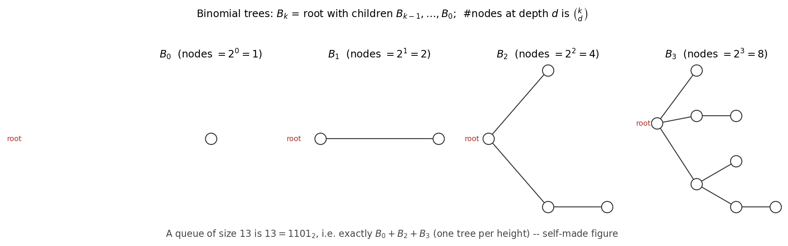

# ADS05 二项队列（binomial queue） —— 课前笔记

> 来源：`../Materials/Student Slides/ADS05BinomialQ_Stu.ppt`（*Binomial Queue*）
> 教材参考（讲义末页给出）：Weiss《Data Structures and Algorithm Analysis in C》(2nd Ed.) Ch.5 p.170–180；Ch.11 p.430–435；CLRS 3rd Ch.19 p.505–530（斐波那契堆）
> 整理日期：2026-09-16
> 示意图：`assets/fig_binomial_queue.png`（按讲义"13 的表示"一页自绘）

## 1. 一页速览

| 问题 | 讲义给的答案 |
|---|---|
| 本讲动机 | 左式堆/斜堆的**平均（average case）**插入（insertion）是 $O(\log N)$，这"不够好"——二叉堆（binary heap）连续插入 $N$ 个键的总时间是 $O(N)$（教材定理 5.1，p.156） |
| 结构 | 二项队列**不是一棵堆序树（heap-ordered tree）**，而是**一组**堆序树（森林），每棵是**二项树（binomial tree）** $B_k$ |
| 表示 | 规模 $N$ 的优先队列（priority queue）由 $N$ 的**二进制位（binary digit）**唯一决定：第 $k$ 位为 1 就有一棵 $B_k$ |
| 操作 | FindMin $O(\log N)$（记住最小值则 $O(1)$）、Merge $O(\log N)$、DeleteMin $O(\log N)$、Insert 摊还（amortized）常数 |
| 关键结论 | **$N$ 次插入建成队列（queue）的最坏（worst case）总时间是 $O(N)$**（聚合分析 + 势能法两种证明） |

## 2. 二项树 $B_k$

- $B_0$ 是单节点（single-node）树；
- $B_k$ 由**两棵 $B_{k-1}$** 组成：把一棵 $B_{k-1}$ 接到另一棵 $B_{k-1}$ 的根上（要保持堆序）；
- 【讲义】观察（Observation）——$B_k$ 的性质：
  1. 根有 $k$ 个孩子（child），分别是 $B_0,B_1,\dots,B_{k-1}$；
  2. 恰好有 $2^k$ 个节点（node）；
  3. **深度（depth） $d$ 处的节点数是二项式系数（binomial coefficient） $\binom{k}{d}$**（这也是"二项树"得名的原因）。

$$B_k:\quad \#\text{nodes}=2^k,\qquad \#\text{nodes at depth }d=\binom{k}{d} \tag{1}$$



*图 1　讲义 "Represent a priority queue of size 13" 一页的复述：$13=1101_2$，故由 $B_0,B_2,B_3$ 组成；每个 $B_k$ 内部满足堆序（heap order），根处标出最小值。*

**二项队列的表示性质**【讲义】：$B_k$ 结构 + 堆序 + **每个高度（height）至多一棵树** ⇒ 任意规模的优先队列都有唯一表示。

## 3. 五种操作

### 3.1 FindMin

最小值必在**某个根**上，而根至多 $\lceil\log N\rceil$ 个，故 $T_p=O(\log N)$。

> 【讲义】备注：如果**记住最小值**并在它被改变时更新，则 FindMin 可以做到 $O(1)$。

### 3.2 Merge

- 与**二进制（binary）加法**完全同构：两棵同高度的树"进位（carry）"合并（carry）。
- 【讲义】例子：$6=110_2$ 与 $7=111_2$ 相加得 $13=1101_2$。
- **必须把队列中的树按高度排序（sorting）**才能这样做；$T_p=O(\log N)$。

### 3.3 Insert

- 归并（merge）的特例；【讲义】例子：依次插入 $1,2,\dots,7$。
- 【讲义】结论：若插入时"最小的不存在的二项树"是 $B_i$，则 $T_p=\text{Const}\cdot(i+1)$；
  对空队列做 $N$ 次插入是 **$O(N)$ 最坏**，因此**平均是常数**。

### 3.4 DeleteMin

四步【讲义】（括号内是该步代价）：

```text
Step 1: FindMin in Bk            /* O(log N) */
Step 2: Remove Bk from H  => H'  /* O(1)     */
Step 3: Remove root from Bk => H''  /* O(log N) */
Step 4: Merge( H', H'' )         /* O(log N) */
```

拆掉根之后，$B_k$ 的孩子恰好是 $B_{k-1},B_{k-2},\dots,B_0$，**倒序放回**就构成一个合法的二项队列 $H''$。

### 3.5 实现【讲义】

- **等价于数组（array）**：`struct Collection { int CurrentSize; BinTree TheTrees[MaxTrees]; }`——数组下标（index）就是 $k$；
- 每棵树的节点用 **left-child / next-sibling** 表示：`struct BinNode { ElementType Element; Position LeftChild; Position NextSibling; };`
  （讲义特别标注：`BinTree` 这一行 **missing from p.176**，即教材该页漏印。）
- 孩子的**排列顺序**：讲义把 *In which order must we link the subtrees?* 留成 *Discussion 8* —— 因为 DeleteMin 要把孩子依次倒填回数组，顺序必须与"$B_{k-1},\dots,B_0$"一致。

## 4. 关键算法片段

**合并两棵等高的树**（代价 $O(1)$）：

```c
BinTree CombineTrees( BinTree T1, BinTree T2 ) {   /* merge equal-sized T1 and T2 */
    if ( T1->Element > T2->Element ) return CombineTrees( T2, T1 );  /* 大者挂到小者下面 */
    T2->NextSibling = T1->LeftChild;   /* 把 T2 插到 T1 孩子链的最前面 */
    T1->LeftChild = T2;
    return T1;
}
```

**整个队列的 Merge**：用 `switch( 4*!!Carry + 2*!!T2 + !!T1 )` 的 8 个分支模拟**带进位的二进制加法**（`Carry`、`T2`、`T1` 就是"和位、加数、被加数"）。

**DeleteMin**：先扫 `TheTrees[]` 找最小根（`MinItem`、`MinTree`），取出该树、置空、摘下根并 `free` ，再把它的孩子倒序装进 `DeletedQueue`（`DeletedQueue->CurrentSize = (1<<MinTree) - 1`），最后 `H = Merge( H, DeletedQueue )`。

## 5. 为什么 $N$ 次插入是 $O(N)$：两种证明【讲义】

**证法 1（聚合分析）**：一次插入的代价 = "步数 + 链接（link）数"。把 $N$ 次插入的步数与链接数分别累加（讲义用 $B_0\to B_1\to\dots$ 的表格逐行列出），得到

$$Total\ steps=N,\qquad \text{累计链接数}=O(N)$$

直觉：【讲义】原话——"贵的插入会消掉一些树，便宜的插入会造出树"，两者互相抵消。

**证法 2（势能法）**：设 $C_i$ 为第 $i$ 次插入的代价、$\Phi_i$ 为插入后森林（forest）中树的棵数（$\Phi_0=0$），则

$$C_i+\big(\Phi_i-\Phi_{i-1}\big)=2 \qquad\text{对所有 } i \tag{2}$$

把 $N$ 个等式相加即得总代价 $O(N)$；同时 $T_{\text{worst}}=O(\log N)$ 而 $T_{\text{amortized}}=2$——**这就是"单次最坏对数级、摊还常数级"的典型对照**。

## 6. 讲义中的例子（课上会看到）

- $B_0,B_1,B_2,B_3$ 的逐层构造；
- $13=2^0+2^2+2^3=1101_2$ 的队列表示；
- Merge：$6=110_2$ 与 $7=111_2$；
- 依次 Insert $1,\dots,7$ 的过程；
- DeleteMin 的四步拆解（把 $B_3$ 拆成 $B_0,B_1,B_2$ 再归并）。

## 7. 听课重点与易混点

1. **二项队列是一组树，不是一个堆**；"堆序"只在每棵树内部成立。
2. **唯一表示**来自"每个高度至多一棵树"，一旦违反（比如 DeleteMin 后出现两棵同高度的树）就必须**归并进位**。
3. **Insert 与 Merge 的平均/摊还代价（amortized cost）是常数**，但**最坏**仍是 $O(\log N)$——两个结论不要互相顶替。
4. **DeleteMin 中 $H''$ 的孩子顺序**：树中孩子是从大到小（$B_{k-1},\dots,B_0$）排列，填数组时要**倒序**。
5. **`Carry` 的三个分支含义**：`111` 时"和位留 carry、把 T1 与 T2 合并成新的 carry"，这是二进制加法的关键一步，建议自己在纸上把 8 个分支过一遍。

## 8. 课前自测

1. 画出 $B_0\dots B_3$，说明 $B_k$ 的节点数、根的孩子、深度 $d$ 的节点数。
2. 用二进制写出规模 $13$、$20$ 的二项队列分别含哪些 $B_k$。
3. 写出 Merge 的"二进制加法"表格（`Carry,T2,T1` 的三位组合）。
4. DeleteMin 的四步各是什么代价？为什么第 3 步是 $O(\log N)$？
5. 用势能法（potential method）证明 $N$ 次插入 $O(N)$：$\Phi$ 取什么？为什么 $C_i+\Delta\Phi=2$？
6. 为什么二项队列比二叉堆更适合"多次插入 + 归并"的场景？它相对左式堆的优势在哪？

## 9. 来源与延伸阅读

- 讲义：`ADS05BinomialQ_Stu.ppt`；配套代码：`../Materials/Code/binomial.c`、`binomial.h`、`testbin.c`。
- 教材：Weiss Ch.5（p.170–180）、Ch.11（p.430–435）；CLRS Ch.19（斐波那契堆，p.505–530）。
- 本讲配套的研究项目：*Research Project 1 — Shortest Path Algorithm with Heaps*（基于优先队列实现 Dijkstra，讲义要求见 pintia.cn）。
- 待确认：讲义中 `Merge` 的 `switch` 注释 `/* assign each digit to a tree */` 与 `DeleteMin` 中 `/* This can be replaced by the actual number of roots */` 的上下文，建议对照课件原文。
