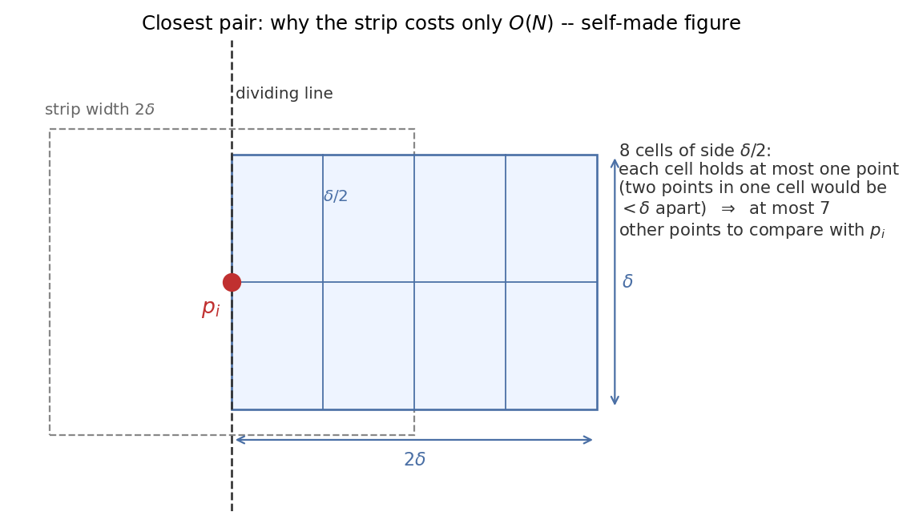

# ADS07 分治法（divide and conquer）与递归式（recurrence） —— 课前笔记

> 来源：`../Materials/Student Slides/ADS07Divide Conquer_Stu.ppt`（*Divide and Conquer*）
> 教材参考（讲义末页给出）：CLRS 3rd Ch.4 p.65–113；Weiss《Data Structures and Algorithm Analysis in C》(2nd Ed.) Ch.10 p.370–375；Jeff Erickson *Notes on Solving Recurrence Relations* p.10–13
> 整理日期：2026-09-16
> 示意图：`assets/fig_closest_strip.png`（按讲义"strip"一页自绘）

## 1. 一页速览

| 问题 | 讲义给的答案 |
|---|---|
| 分治三步 | **Divide**（分成子问题）→ **Conquer**（递归求解）→ **Combine**（合并子解） |
| 通用递归式 | $T(N)=a\,T(N/b)+f(N)$ |
| 已见过的主角 | 最大子列和（maximum subarray sum） $O(N\log N)$、树的遍历（traversal） $O(N)$、归并排序（merge sort）与快速排序（quicksort） $O(N\log N)$ |
| 本讲新例 | **最近点对（closest pair）问题**：穷举（brute force） $O(N^2)$ → 分治 $O(N\log N)$ |
| 核心技术 | 分治中的"**跨越分界线的 strip**"如何在**线性时间**内处理完 |
| 后半讲 | 解递归式的三种方法：**代入法 / 递归树（recursion tree）法 / 主方法** |

## 2. 最近点对问题（Closest Points Problem）

- 问题：平面上 $N$ 个点，找距离最近的一对（重合点则距离为 0）。
- **穷举**：检查 $N(N-1)/2$ 对，$T=O(N^2)$。
- **分治**（与"最大子列和"同构）：按 $x$ 坐标（coordinate）排序（sorting）后**一分为二**，分别求左半、右半的最近距离，再处理**跨过分界线**的情形：

$$T(N)=2\,T(N/2)+f(N) \tag{1}$$

其中 $f(N)$ 是"合并（处理跨越情形）"的代价。

### 2.1 关键：strip 内为什么是线性时间

设左右两半各自的最小距离为 $\delta$，则跨界的最近点对要么**两点的 $x$ 差小于 $\delta$**，要么不可能更近。于是只需考察**宽度为 $2\delta$ 的竖直条带（strip）**：

- 朴素做法：条带内两两比较，最坏 $O(N^2)$（【讲义】"The worst case: NumPointInStrip = N"）；
- 【讲义】的正确做法：**把条带内的点按 $y$ 排序**，对每个点 $p_i$ 只向后看，一旦 $y$ 方向距离超过 $\delta$ 就 `break`（因为后面的点更远）：

```c
/* points are all in the strip and sorted by y coordinates */
for ( i = 0; i < NumPointsInStrip; i++ )
    for ( j = i + 1; j < NumPointsInStrip; j++ )
        if ( Dist_y( Pi, Pj ) > δ )  break;
        else if ( Dist( Pi, Pj ) < δ )  δ = Dist( Pi, Pj );
```

- 【讲义】结论：**对任意 $p_i$，至多考察 7 个点**，因此

$$f(N)=O(N) \tag{2}$$

代入式 (1)：$T(N)=2T(N/2)+O(N)=O(N\log N)$。



*图 1　把 $2\delta\times\delta$ 的条带切成 8 个边长 $\delta/2$ 的小方格：每个小方格内至多一个点（否则这两点距离 $<\delta$，与 $\delta$ 是最小距离矛盾）。把 $p$ 放在左边界，右半侧只有 4 个方格、再加上左侧相邻的 4 格，可考察的点总计不超过 7 个 ⇒ $f(N)=O(N)$。*

> 讲义提醒（对"显然"的反思）：*It is so simple … It is $O(N\log N)$ all right. But is it really clearly so?* —— 分治写起来简单，**难点全在"合并能否线性完成"**。

## 3. 顺带复习：递归（recursion）展开的两种"手感"

【讲义】用展开法演示了两种典型：

$$
T(N)=2T(N/2)+cN \Rightarrow 2^kT(N/2^k)+kcN=\Theta(N\log N) \tag{3}
$$

$$
T(N)=2T(N/2)+cN^2 \Rightarrow 2^kT(N/2^k)+cN^2\left(1+\tfrac12+\cdots+\tfrac1{2^{k-1}}\right)=O(N^2) \tag{4}
$$

直觉：**每一层的工作量是等比（或等差）序列**，求和后看"哪一层占主导"。

## 4. 解递归式的三种方法（【讲义】主线）

先约定两个被忽略的细节【讲义】：

- 不纠结 $N/b$ 是否为整数；
- 小规模时**一律假设 $T(n)=\Theta(1)$**。

### 4.1 代入法（Substitution）——先猜，再归纳证明（induction proof）

例子【讲义】：$T(N)=2T(\lfloor N/2\rfloor)+N$，猜 $T(N)=O(N\log N)$。
假设对所有 $m<N$ 成立（尤其 $m=\lfloor N/2\rfloor$），则存在常数 $c>0$ 使 $T(\lfloor N/2\rfloor)\le c\lfloor N/2\rfloor\log\lfloor N/2\rfloor$，代入：

$$T(N)\le 2c\lfloor N/2\rfloor\log\lfloor N/2\rfloor+N\le cN(\log N-\log 2)+N\le cN\log N\quad(\text{当 }c\ge1)$$

【讲义】的两个提醒：

1. 别纠结 $N=1$ 的边界——**只要对足够大的 $c$ 在 $T(2),T(3)$ 上成立即可**；
2. 猜错会"证出"错误结论：猜 $T(N)=O(N)$ 时会得到 $\le cN+N=O(N)$，但这是**错的**，原因是归纳假设（induction hypothesis）的形式必须**精确**（不能把 $O(N)$ 直接当作常数倍的界）。

### 4.2 递归树法（Recursion-tree）

- $T(N)=3T(N/4)+\Theta(N^2)$：逐层画树，每层代价是等比（geometric）数列，**根处（第一层）占主导**，结论 $O(N^2)$；
- $T(N)=T(N/3)+T(2N/3)+cN$：树**不平衡**，讲义该页显示推导"Not complete!"，需要改用代入法验证上界（讲稿备注：可以用 substitution 验证这个上界）。

### 4.3 主方法（Master Method）

【讲义】按 CLRS 的形式给出：$T(N)=aT(N/b)+f(N)$（$a\ge1$，$b>1$），比较 $f(N)$ 与 $N^{\log_b a}$：

| 情形 | 条件 | 结论 |
|---|---|---|
| 1 | $f(N)=O\big(N^{\log_b a-\epsilon}\big)$ 对某常数 $\epsilon>0$ | $T(N)=\Theta\big(N^{\log_b a}\big)$ |
| 2 | $f(N)=\Theta\big(N^{\log_b a}\big)$ | $T(N)=\Theta\big(N^{\log_b a}\log N\big)$ |
| 3 | $f(N)=\Omega\big(N^{\log_b a+\epsilon}\big)$，且满足**正则性条件（regularity condition）** $af(N/b)\le cf(N)$（某 $c<1$、充分大的 $N$） | $T(N)=\Theta\big(f(N)\big)$ |

> 表格的完整形式来自 CLRS 第 4 章（讲义该页的公式为图片）；【讲义】注释：*f(N) 与 $N^{\log_b a}$ 中较大的那个决定 $T(N)$，而且必须"严格大"，即大出某个多项式阶*。讲义留了 *Discussion 9: Please prove case 2*，并指向 CLRS 第 4 章。

**主方法的另一种形式**【讲义】（教材 Weiss 的写法）：

- 若 $af(N/b)=\kappa f(N)$（$\kappa<1$）$\Rightarrow$ $T(N)=\Theta(f(N))$；
- 若 $af(N/b)=K f(N)$（$K>1$）$\Rightarrow$ $T(N)=\Theta\big(N^{\log_b a}\big)$；
- 若 $af(N/b)=f(N)$ $\Rightarrow$ $T(N)=\Theta\big(f(N)\log_b N\big)$。

（等式的三种结论依教材 Weiss Ch.10 的标准形式写出。）

**含 $N^k\log^p N$ 的定理（theorem）**【讲义】：$T(N)=aT(N/b)+\Theta(N^k\log^p N)$（$a\ge1,b>1,p\ge0$）时

- $a>b^k$：$T(N)=O\big(N^{\log_b a}\big)$；
- $a=b^k$：$T(N)=O\big(N^k\log^{p+1}N\big)$；
- $a<b^k$：$T(N)=O\big(N^k\log^p N\big)$。

【讲义】用到的几个数值例子：

- 归并排序：$a=b=2,k=1,p=0$（或 $f(N)=N$，Case 2）$\Rightarrow T=O(N\log N)$；
- 每次分成 3 份、合并（merge） $O(N)$：$a=3,b=2,k=1,p=0\Rightarrow T=O(N^{1.59})$；
- 合并变成 $O(N^2)$：$T=O(N^2)$；
- $a=b=2$、$f(N)=N\log N\Rightarrow T=O(N\log^2N)$。

## 5. 听课重点与易混点

1. **分治的难点在合并**：最近点对的 $f(N)=O(N)$ 靠"按 $y$ 排序 + 至多 7 个点"两个观察，缺一不可。
2. **7 这个数字**来自 "$\delta/2$ 网格 + 每个格子至多一个点"，要能自己画出图 1 并解释。
3. **代入法必须先猜**：猜中形如 $cN\log N$；若猜 $O(N)$ 会"自证"出错误界——**归纳假设要写成精确形式**。
4. **主方法不能乱用**：三种情形之间要求"多项式级别的差距"，$f(N)=N\log N$ 与 $N^{\log_b a}=N$ 落在 Case 2 与 Case 3 之间，需要专门的结论（讲义给了 $O(N\log^2 N)$ 的例子）。
5. **奇数规模的处理**：讲义允许忽略 $N/b$ 是否整除，这是"工程化"的简化，写论文级证明时要补细节。

## 6. 课前自测

1. 写出分治三步与通用递归式；举例说明哪一步最容易出问题。
2. 最近点对中，为什么只需考虑宽 $2\delta$ 的 strip？为什么 strip 内至多看 7 个点？
3. 用代入法证明 $T(N)=2T(\lfloor N/2\rfloor)+N=O(N\log N)$，并说明 $N=1$ 的边界怎么处理。
4. 举一个"猜错导致证明无效"的例子，并解释原因。
5. 写出主定理（master theorem）三种情形（含正则性条件），并判断 $T(N)=2T(N/2)+N\log N$、$T(N)=3T(N/2)+N$ 各属于哪一类。
6. $T(N)=T(N/3)+T(2N/3)+cN$ 为什么用递归树不容易直接看出？该用什么方法验证？

## 7. 来源与延伸阅读

- 讲义：`ADS07Divide Conquer_Stu.ppt`（含讲稿备注：*f(N) 和 $N^{\log_b a}$ 中较大者决定 $T(N)$，且必须严格大*；$T(N)=T(N/3)+T(2N/3)+cN$ 可用代入法验证）。
- 拓展阅读：`../Materials/Further Reading/Some Notes on the Master Methods.pdf`。
- 教材：CLRS Ch.4（p.65–113）、Weiss Ch.10（p.370–375）、Erickson 的递推式（recurrence）笔记（讲义末页列出）。
- 待确认：讲义中 $T(N)=T(N/3)+T(2N/3)+cN$ 与 $T(N)=3T(N/4)+\Theta(N^2)$ 的递归树图在 `.ppt` 中是图片，本文只复述结论。
