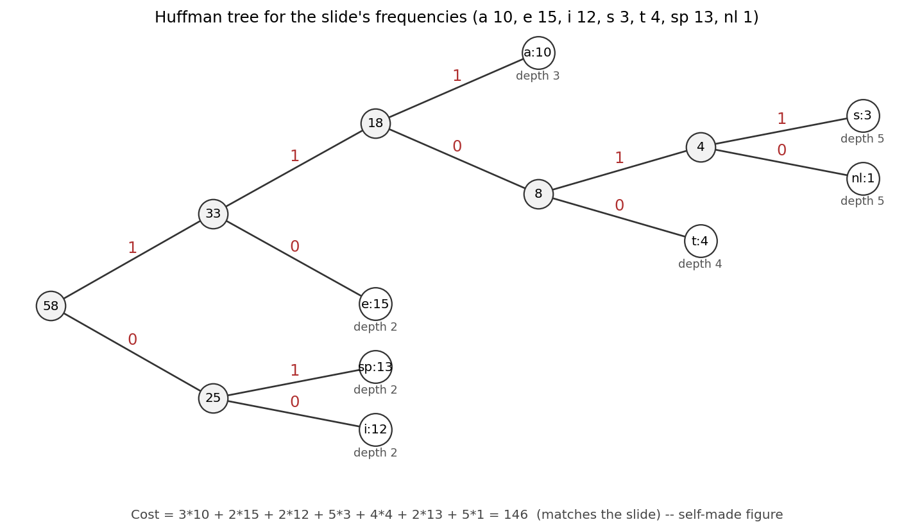

# ADS09 贪心算法（greedy algorithm） —— 课前笔记

> 来源：`../Materials/Student Slides/ADS09Greedy_Stu.ppt`（*Greedy Algorithms*）
> 教材参考（讲义末页给出）：CLRS 3rd Ch.16 p.415–437
> 整理日期：2026-09-16
> 示意图：`assets/fig_huffman_tree.png`（按讲义频数表重绘的 Huffman 树）

## 1. 一页速览

| 问题 | 讲义给的答案 |
|---|---|
| 最优化问题的三件套 | **约束（constraint）**、**目标函数（objective function）**、**可行解（feasible solution）**；使目标函数最优的可行解叫**最优解（optimal solution）** |
| 贪心法 | 每一阶段按某个**贪心准则（greedy criterion）**做"当前最好"的决定，且决定**之后不再更改**，但要保证可行性 |
| 何时有效 | **局部最优（local optimum） = 全局最优（global optimum）**时才有效；否则只能当启发式（得到的解接近最优，但不保证最优） |
| 活动选择 | 四条候选准则中只有"**最早结束**"是对的（其余三条各有反例） |
| Huffman 编码 | 贪心地反复合并频率（frequency）最小的两棵树；代价 $T=O(C\log C)$；正确性靠**贪心选择性质（greedy-choice property）**+**最优子结构（optimal substructure）** |
| 方法论 | 贪心 = "做一次选择 + 只剩一个子问题（subproblem）"；*Beneath every greedy algorithm, there is almost always a more cumbersome DP solution* |

## 2. 活动选择问题（Activity Selection）

- 输入：活动集合 $S=\{a_1,\dots,a_n\}$，$a_i$ 占用时间区间（interval） $[s_i,f_i)$；
- **相容（compatible）**：$s_i\ge f_j$ 或 $s_j\ge f_i$（区间不重叠）；
- 目标：选出**最大规模**的互相兼容的活动子集；
- 假设：$f_1\le f_2\le\dots\le f_n$（按结束时间排好序）。

【讲义】给出的例子（$n=11$）：

| $i$ | 1 | 2 | 3 | 4 | 5 | 6 | 7 | 8 | 9 | 10 | 11 |
|---|---|---|---|---|---|---|---|---|---|---|---|
| $s_i$ | 1 | 3 | 0 | 5 | 3 | 5 | 6 | 8 | 8 | 2 | 12 |
| $f_i$ | 4 | 5 | 6 | 7 | 9 | 9 | 10 | 11 | 12 | 14 | 16 |

### 2.1 四条候选贪心准则（【讲义】*Discussion 12: How can we be greedy?*）

| 准则 | 结果 |
|---|---|
| 1. 选**开始最早**的（不与已选重合） | ✗ 反例（counterexample）存在 |
| 2. 选**持续时间最短**的 | ✗ 反例存在 |
| 3. 选**与其他活动冲突最少**的 | ✗ 反例存在 |
| 4. 选**结束最早**的 | ✓ —— *Resource becomes free as soon as possible* |

（准则 1 的朴素实现是 $O(N^2)$。）

### 2.2 正确性证明（交换论证）【讲义】

> **【定理】** 对任意非空子问题 $S_k$，设 $a_m$ 是 $S_k$ 中**结束最早**的活动，则 $a_m$ 一定属于 $S_k$ 的某个最大相容活动子集。
>
> **证明思路**：设 $A_k$ 是 $S_k$ 的最优解、$a_{ef}$ 是其中结束最早的活动。若 $a_m=a_{ef}$ 则证毕；否则**把 $a_{ef}$ 换成 $a_m$** 得到 $A_k'$——由于 $f_m\le f_{ef}$，替换后仍然相容，故 $A_k'$ 也是最优解。

实现：先选第一个活动，再对剩下的递归（recursion）求解；**去掉尾递归改成迭代（iteration）**后总代价 $O(N\log N)$（排序的开销）。

### 2.3 与 DP 的对照（【讲义】"Another Look at DP Solution"）

DP 写法：$c_{1,j}$ 表示 $a_1..a_j$ 的最优解，$a_{k(j)}$ 是"结束在 $a_j$ 之前且与 $a_j$ 相容的最近活动"。课堂的两个问题：

- **Q1：这个 DP 还是对的吗？**（讲稿备注：**是**。）
- **Q2：贪心还是对的吗？**（讲稿备注：**否**。）——当每个活动带有**权重（weight）**时，得放弃贪心、回到 DP。

## 3. 贪心策略（greedy strategy）的三个要素（【讲义】*Elements of the Greedy Strategy*）

1. 把问题刻画成"**做一次选择，然后只剩一个子问题**"的形式；
2. 证明**总存在**一个最优解包含这个贪心选择（贪心选择是**安全的**）；
3. 证明**最优子结构**：做了贪心选择之后，剩下的子问题的最优解与原选择组合起来就是原问题的最优解。

【讲义】的原话提醒：*Beneath every greedy algorithm, there is almost always a more cumbersome dynamic-programming solution.*

## 4. Huffman 编码（Huffman Codes，1952）

### 4.1 从"定长"到"变长"

- 【讲义】例子：长度为 1000、只含 $a,u,x,z$ 四个字符的文本，按一字节存要 8000 bit；用 2 bit 定长编码（$a=00,u=01,x=10,z=11$）只要 2000 bit + 码表；
- 记 $f(a)=4,f(u)=1,f(x)=2,f(z)=1$，改用**变长**编码 $a=0,\ u=110,\ x=10,\ z=111$，则 `aaaxuaxz` 编码为 `00010110010111`。
- **代价公式**：若字符 $C_i$ 在编码树（**trie**）中的深度（depth）是 $d_i$、出现次数是 $f_i$，

$$\text{Cost}=\sum_i d_i f_i \tag{1}$$

  定长编码（fixed-length code） Cost $=2\cdot4+2\cdot1+2\cdot2+2\cdot1=16$；变长编码（variable-length code） Cost $=1\cdot4+3\cdot1+2\cdot2+3\cdot1=14$。
- **能唯一解码的原因**：**没有任何一个编码是另一个编码的前缀**（*No code is a prefix of another*），这正是"数据只放在叶子（leaf）上"的 trie 所保证的性质。
- 注意【讲义】：若所有字符频率相同，变长编码基本不会有收益。

### 4.2 算法【讲义】

```c
void Huffman ( PriorityQueue heap[ ], int C )
{   /* 把 C 个字符看作 C 棵单节点树，放进最小堆 */
    for ( i = 1; i < C; i++ ) {
        create a new node;
        /* be greedy here */
        delete root from min heap and attach it to left_child of node;
        delete root from min heap and attach it to right_child of node;
        weight of node = sum of weights of its children;
        insert node into min heap;
    }
}
```

代价 $T=O(C\log C)$（每轮两次 `deleteMin` + 一次 `insert`，共 $C-1$ 轮）。

### 4.3 例：7 个符号的编码

【讲义】给出的频数（frequency）表（`a 10, e 15, i 12, s 3, t 4, sp 13, nl 1`，其中 `sp` 是空格、`nl` 是换行），合并过程最终得到总代价

$$\text{Cost}=3\cdot10+2\cdot15+2\cdot12+5\cdot3+4\cdot4+2\cdot13+5\cdot1=146 \tag{2}$$



*图 1　按讲义频数合并出的编码树（encoding tree）：`e`、`i`、`sp` 深度 2，`a` 深度 3，`t` 深度 4，`s`、`nl` 深度 5；代入式 (1) 得 146，与讲义一致。左右孩子（child）可以交换（swap），因此 Huffman 编码**不唯一**——这正是 Research Project 4 要处理的问题。*

（讲义该页的"符号↔编码"标签为图片，未能从 `.ppt` 文本提取；图 1 是按频数表重绘的等价结果，深度分布与总代价 146 与讲义一致。）

### 4.4 正确性【讲义】的两条引理（lemma）

1. **贪心选择性质**：设 $x,y$ 是频率最低的两个字符，则存在一棵最优前缀码（prefix code）树，其中 $x,y$ 的码长相同、只有最后一位不同（证明方式是把 $x,y$ 与树上最深处的两个叶子**交换**，代价不增）。
2. **最优子结构**：把 $x,y$ 合并成一个频率为 $f_x+f_y$ 的新字符 $z$ 得到字符集 $C'$；若 $T'$ 是 $C'$ 的最优前缀码树，则把 $z$ 的叶子替换成以 $x,y$ 为孩子的内部节点（internal node）后得到的 $T$，是 $C$ 的最优前缀码树（用反证法）。

## 5. 听课重点与易混点

1. **"局部最优 = 全局最优"是贪心成立的前提**，活动选择的三条失效准则最好能各自举出反例。
2. **区间调度类问题要按"结束时间"排序（sorting）**，不是开始时间、更不是长度。
3. **有权重时贪心失效**（讲义 Q2 的答案），要回退到 DP —— 这是本讲最重要的对照。
4. **Huffman 的"合并最小的两个"**是贪心选择，正确性靠两条引理，不是"显然"。
5. **前缀码性质**是唯一可解码（uniquely decodable）的关键；`trie` 上数据只在叶子。
6. 代价公式 $Cost=\sum d_if_i$ 在比较编码方案时**必须代数值**，不能只看树形。

## 6. 课前自测

1. 用讲义的活动表验证：按"开始最早""最短""冲突最少"分别选，能否找到反例？
2. 复述活动选择定理（theorem）的交换论证（exchange argument），指出哪一步用了 $f_m\le f_{ef}$。
3. 为什么带权活动选择不能贪心？写出它的 DP 递推（recurrence）思路。
4. 用 $a=0,u=110,x=10,z=111$ 解码 `00010110010111`，并说明前缀码的作用。
5. 手工执行 Huffman 算法得到图 1 的树，核对 Cost $=146$。
6. 写出 Huffman 正确性的两条引理，并说明各自用在哪一步。

## 7. 来源与延伸阅读

- 讲义：`ADS09Greedy_Stu.ppt`（含讲稿备注：*A1: Yes; A2: No.*；*Cumbersome = 笨重的*）。
- 教材：CLRS Ch.16（p.415–437）。
- 配套代码：`../Materials/Code/binheap.c`（Huffman 用的最小堆，另见 `leftheap.c`、`binomial.c` 亦可用于优先队列）。
- 本讲配套的研究项目：*Research Project 4 — Huffman Codes*（判断学生提交的编码是否为合法/最优 Huffman 编码，正因编码不唯一）。
- 待确认：讲义中"符号↔编码"的对应标签为图片，图 1 的编码是等价重绘，具体标签以上课课件为准。
