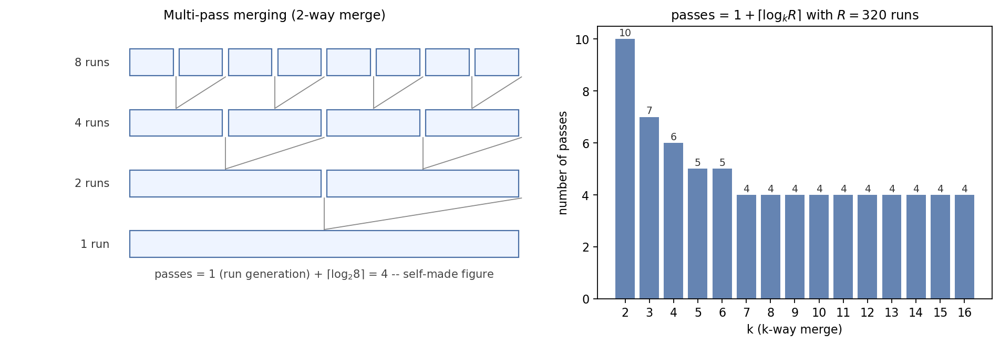

# ADS15 外部排序（external sorting） —— 课前笔记

> 来源：`../Materials/Student Slides/ADS15ExternalSorting_TS.ppt`（*External Sorting*）
> 教材参考（讲义末页给出）：Weiss《Data Structures and Algorithm Analysis in C》(2nd Ed.) Ch.6 p.222–227；W. C. Lynch, *The Fibonacci Numbers and Polyphase Sorting*
> 整理日期：2026-09-16
> 示意图：`assets/fig_external_sort.png`（自绘：多趟归并与趟数—$k$ 的关系）

## 1. 一页速览

| 问题 | 讲义给的答案 |
|---|---|
| 为什么不能直接对磁盘（disk）做快排 | 内存访问是 $O(1)$；磁盘要"找磁道（track） → 找扇区（sector） → 传输"，是**设备相关**的昂贵操作 |
| 简化模型 | 数据存在**磁带（tape）**上（只能顺序访问），至少用 **3 台磁带机（tape drive）**；工具是**归并排序（merge sort）** |
| 核心指标 | **归并趟数（number of merge passes）**（seek time 与趟数成正比） |
| 减少趟数的手段 | **$k$ 路归并**（趟数 $=1+\lceil\log_k(N/M)\rceil$，但要 $2k$ 台磁带机）；**多相归并（polyphase merge）**只需 $k+1$ 台 |
| 让 I/O 与 CPU 并行 | 缓冲区（buffer）管理：$k$ 路归并需要 $2k$ 个输入缓冲（input buffer） + $2$ 个输出缓冲（output buffer） |
| 让 run 更长 | **置换选择（replacement selection）**，对"接近有序（nearly sorted）"的输入特别有效 |
| 让归并总代价最小 | 用 **Huffman 树（Huffman tree）**决定归并顺序 |

## 2. 基本模型与流程

- **代价来源**【讲义】：
  1. seek time —— 与**趟数**成正比（$O(\text{number of passes})$）；
  2. 读写一个 block 的时间；
  3. 内存内部排序（sorting） $M$ 条记录（record）的时间；
  4. 把 $N$ 条记录从输入缓冲归并到输出缓冲的时间。
- 【讲义】指出计算机可以**并行**做 I/O 与 CPU 处理，因此有"缓冲区并行"这一节。
- **四个优化目标**【讲义】：*Reduction of the number of passes、Run merging、Buffer handling for parallel operation、Run generation*。

### 2.1 两阶段：生成 run + 多趟归并

【讲义】以 $M=3$ 条记录的内存为例：先把输入切成若干**长度 $M$ 的有序段（run）**——这一趟算 $1$ 趟；然后用 $k$ 路归并反复合并，直到只剩一个 run：

$$\text{趟数}=1+\big\lceil\log_k R\big\rceil,\qquad R=\left\lceil \frac NM\right\rceil \tag{1}$$

*图 1　左：两路归并的多趟结构（8 run → 4 → 2 → 1）。右：固定 $R=320$ 个 run 时，$k$ 路归并所需趟数 $1+\lceil\log_kR\rceil$——这是讲义"如何减少趟数"一页的量化版。*

## 3. 减少趟数

### 3.1 $k$ 路归并

- 与两路归并相比趟数从 $1+\lceil\log_2R\rceil$ 降到 $1+\lceil\log_kR\rceil$；
- **代价**：【讲义】强调 *Require $2k$ tapes!*（每个输入流一台 + 输出一台）。

### 3.2 只有 3 台磁带机时的多相归并（Polyphase Merge）

- 【讲义】的例子：$T_1$ 上有 34 个 run，如何在 3 台磁带机上做两路归并？
- **思路：不均匀地分配**（例如 $17+17$ 之后再重新分配），这样能省掉"整体复制"的额外趟数——讲义对比了两种做法：一种要 $1+6$ 趟 $+5$ 次拷贝，另一种要 $1+7$ 趟。
- > **【Claim】** 若 run 的个数是 Fibonacci 数 $F_N$，最佳分配是 $F_{N-1}$ 与 $F_{N-2}$；对 $k$ 路归并，只需要 $k+1$ 台磁带机。
- 【讲义】留了 *Discussion 20*：若把 22 个 run 放到 $T_2$、12 个放到 $T_3$ 会怎样？（初始 run 数**不是** Fibonacci 数时怎么办——讲义用"虚 run / dummy run"的思路处理。）

## 4. 缓冲区与并行（Buffer handling）

【讲义】的例子：文件 3250 条记录，内存最多排 750 条，输入块长 250 条。

- 两路归并：需要 **2 个输入缓冲 + 1 个输出缓冲**；
- 一般 $k$ 路归并：需要 **$2k$ 个输入缓冲 + 2 个输出缓冲**才能让 I/O 与计算重叠（一半在填、一半在读）；
- 【讲义】警告：**$k$ 不是越大越好**——缓冲区变大、每次读入的块变小，会拉长 seek 时间；超过某个 $k$ 之后 I/O 时间反而上升。**最优 $k$ 取决于磁盘参数与可用内存**。

## 5. 生成更长的 run：置换选择（Replacement Selection）

- 【讲义】演示：从输入序列里不断取"不小于当前输出元素"的最小者输出，直到内存里所有元素都小于它，于是**换新的一轮**——一"趟"就能生成**平均长度约 $2M$**（讲义给出的具体过程见课件）的 run。
- 【讲义】的评价：*Powerful when input is often nearly sorted*（输入接近有序时特别有效）；并留了一个小问题：*What if we swap 35 with 99?* —— 讲稿备注的答案是"99 会落到第一个 run 里"。

## 6. 归并顺序也要贪心：Huffman 树

- 【讲义】问题：4 个长度分别为 $2,4,5,15$ 的 run，如何安排归并顺序使**总归并代价最小**？
- 答案：**用 Huffman 树**——每次合并最小的两个，于是

$$\text{Total merge time}=O(\text{the weighted external path length}) \tag{2}$$

（这正好呼应前一讲 Huffman 编码：同样的"合并最小两者"的贪心。）

## 7. 讲稿备注里的两个算例

1. $10{,}000{,}000$ 条记录、每条 128 字节、内存 4 MB：可排 $4\text{MB}/128\text{B}=32768$ 条/run，共有约 320 个 run，两路归并需
   $$1+\lceil\log_2 320\rceil=1+9=10\ \text{趟}$$
2. 同样 320 个 run，若用 10 台磁带机（即 9 路归并）：
   $$1+\lceil\log_9 320\rceil=1+3=4\ \text{趟}$$

## 8. 听课重点与易混点

1. **外部排序的复杂度用"趟数"衡量**，不是比较次数（number of comparisons）——因为瓶颈是 I/O。
2. **$k$ 路归并要 $2k$ 台设备**，多相归并只要 $k+1$ 台（代价是分配规则更精细）。
3. **缓冲区数量的公式**：$2k$ 输入 + 2 输出；$k$ 越大未必越快。
4. **run 的长度不只取决于内存 $M$**：置换选择可以让平均 run 长度超过 $M$。
5. **归并顺序用 Huffman 树**，与"哪两个先合、哪两个后合"直接决定总 I/O 量。
6. **Fibonacci 分配**只对"run 数是 Fibonacci 数"的情况最优；否则要先造虚 run（dummy run）。

## 9. 课前自测

1. 为什么磁盘上的排序不能用快排？"找磁道 → 找扇区 → 传输"分别对应代价模型的哪一项？
2. 写出趟数公式 $1+\lceil\log_kR\rceil$，并解释为什么 $k$ 路归并需要 $2k$ 台磁带机。
3. 用图 1 右侧的柱状图解释：为什么 $k$ 从 2 增到 4 收益很大，而从 10 增到 16 几乎没有收益？
4. 多相归并中"若 run 数是 $F_N$，最佳分成 $F_{N-1}$ 与 $F_{N-2}$"这条结论的直觉是什么？
5. $k$ 路归并需要多少输入缓冲与输出缓冲？为什么 $k$ 太大反而变慢？
6. 置换选择如何生成比内存容量更长的 run？
7. 4 个长度 $2,4,5,15$ 的 run，用 Huffman 树安排顺序，写出每一步合并与总代价。

## 10. 来源与延伸阅读

- 讲义：`ADS15ExternalSorting_TS.ppt`（含讲稿备注：$10^7\times128$B 与 320 run 的两个算例、"交换 35 与 99"的提问）。
- 教材：Weiss Ch.6（p.222–227）；W. C. Lynch 的多相排序论文（讲义末页列出）。
- 拓展阅读：`../Materials/Further Reading/External sort lecture notes.pdf`、`../Materials/Further Reading/K way polyphase merge .pdf`。
- 待确认：讲义中的 run 分布示意（$T_1,T_2,T_3$ 上的数字序列）为图形，本文只复述其分配思路，未逐一转抄数值。
