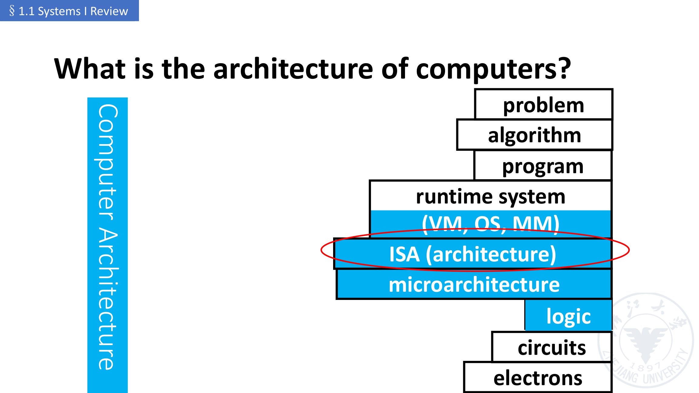
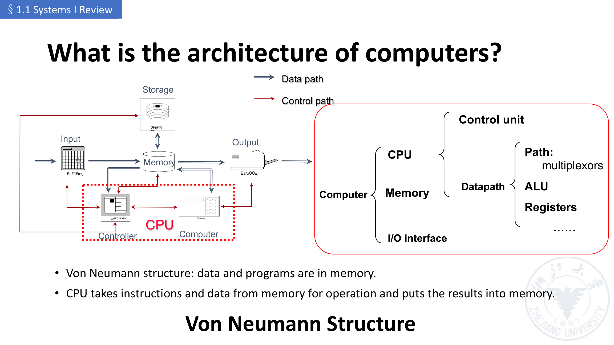
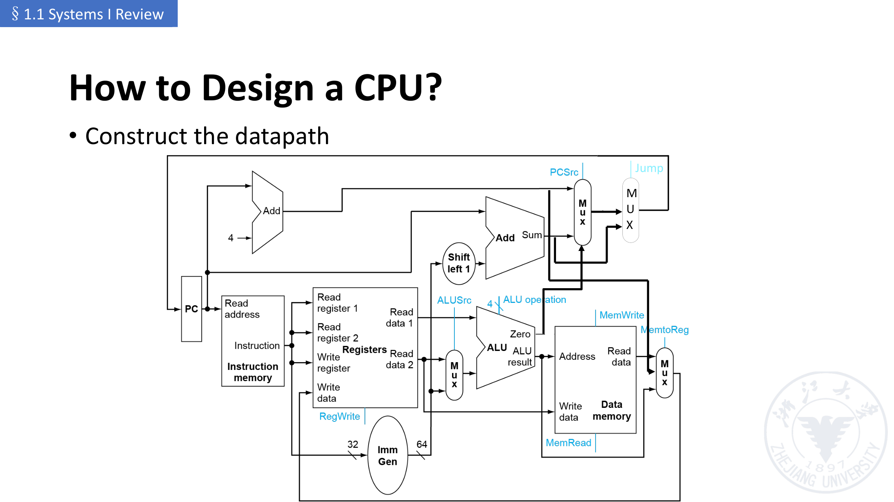
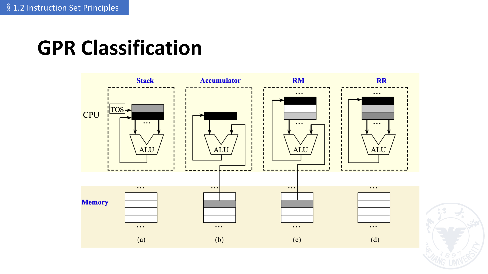
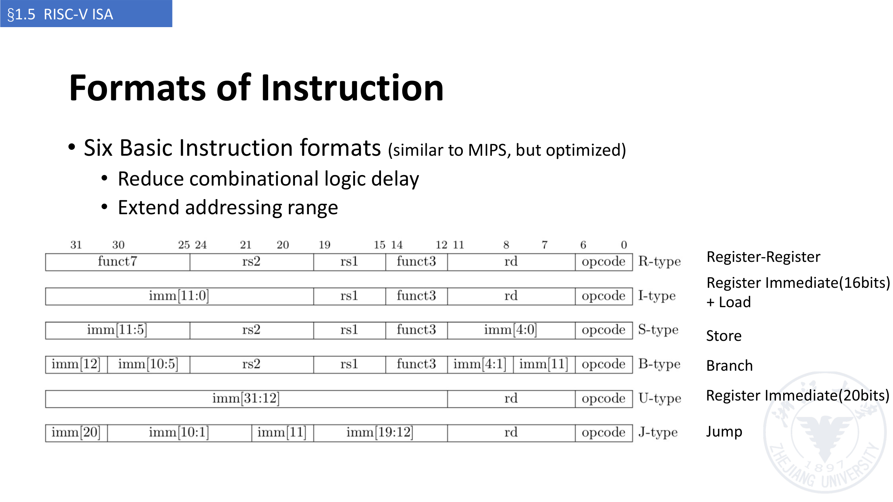
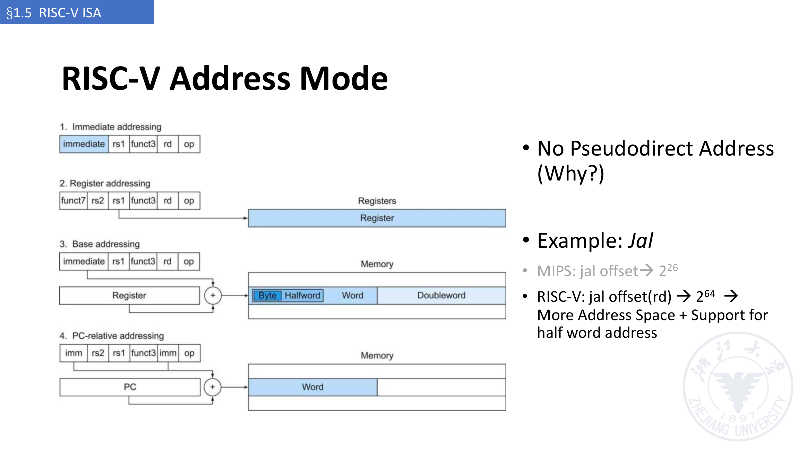
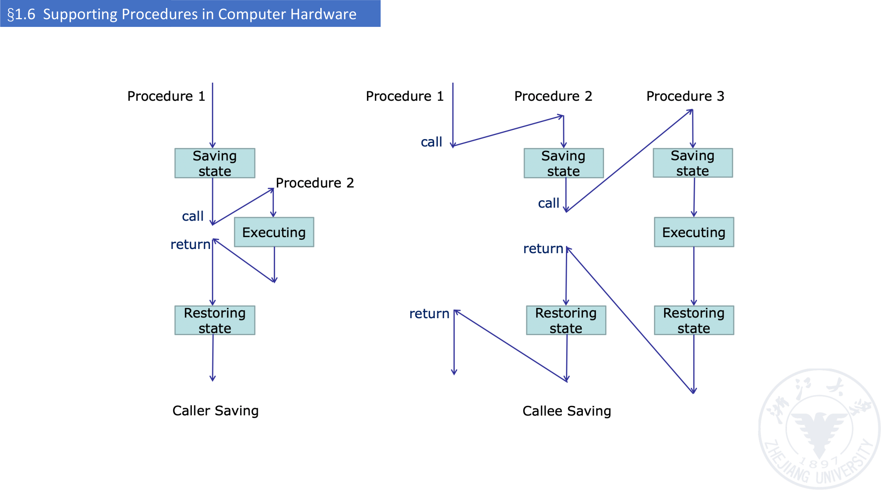

# 计算机系统 II · 第 1 讲：课程介绍与 ISA 设计原理

> 来源：`../lec01-2026-chang.pdf`（Computer Systems II 讲义，浙江大学；主讲：卢立 Li Lu；PDF 共 121 页，本讲覆盖 §1.0–§1.8）
> 整理日期：2026-09-19
> 说明：本文由 AI 依据讲义幻灯片整理，供课前预习与课后复习；只做提炼、串讲与页码对照，不添加讲义之外的结论。
> 文中 `(p.x)` 指 **PDF 页码**；带「【讲义】」的是幻灯片原文或直接提炼；带「待确认」的是讲义未写明或存在疑点之处。
> 图片：`assets/` 下 7 张图均由讲义对应页直接导出（图注注明页码），**不是**自绘插图。

## 0. 本讲速览

| 小节 | 页码 | 主题 | 一句话摘要 |
|---|---|---|---|
| §1.0 | p.2–8 | About the Class | 课程定位、教材、主题与周数、上课时间与 Lab、评分（作业 10% + Projects 40% + 期末 50%）、诚信与迟交政策。 |
| §1.1 | p.9–33 | Systems I Review | 从二进制、冯·诺依曼结构、CPU 内部组成，到指令执行五步、数据通路与控制器，再说明为什么单周期、多周期都不够，从而引出流水线。 |
| §1.2 | p.34–66 | Instruction Set Principles | ISA 设计目标、按内部存储分类（栈 / 累加器 / GPR）、四类 ISA 的 `C = A + B` 代码对比、GPR 的两大类与优缺点。 |
| §1.3 | p.67–81 | More about ISA | 寻址模式、字节编址与大小端、对齐、操作数类型与大小、操作类型、控制流指令。 |
| §1.4 / §1.5 | p.82–108 | RISC and RISC-V | CISC vs RISC、RISC-V 简史与模块化扩展、六种指令格式、寄存器约定、内存与立即数操作数、地址模式、分支/跳转寻址、逻辑与条件操作、`if` / `while` 编译示例。 |
| §1.6 | p.109–117 | Supporting Procedures | 过程调用六步、`jal` / `jalr`、叶子过程示例、caller saving 与 callee saving、栈上的过程帧（activation record）。 |
| §1.7 / §1.8 | p.118–121 | 四条 ISA 设计原则 + Discussion | 四条设计原则；常见谬误与陷阱（顺序字地址每次 +4、返回后自动变量指针失效等）。 |

**本讲主线**：① §1.1 的落点是「单周期 → 多周期 → 流水线」；② §1.2–§1.5 的落点是「ISA 怎么分类、操作数放在哪里、指令怎么编码」。这两条线在后面的流水线 CPU 设计中合流。

---

## 1. §1.0 课程概况（p.2–8）

### 1.1 课程定位（p.3）【讲义】

- 上一门课（Systems I）已学：数字逻辑（Digital Logic）、基本指令集设计、CPU 设计（**主要是单周期 CPU**）。
- 本课程要做的事：
  - 向前一步，学更复杂的 CPU 设计（流水线、冒险处理）；
  - 开始进入**操作系统原理**（OS 的引入、中断、进程与线程、调度与同步）；
  - **不仅知道 what，还要知道 why**。

### 1.2 教材与教学组成（p.4）【讲义】

- 教材（textbook）：
  - *Computer Organization and Design: The Hardware/Software Interface*（**RISC-V Edition**）；
  - *Operating System Concepts*。
- 另有 References；教学组成（Teaching Components）：**Lectures** + **Labs**。

### 1.3 课程主题与课时（p.5）【讲义】

| 主题 | 约用时间 |
|---|---|
| Instruction Classification and Design Principle | ~1 week |
| Concept, Category, Architecture and Design of Pipeline CPU | ~1.5 weeks |
| Hazard of Pipeline CPU | ~2 weeks |
| Software/Hardware Interfaces | ~1 week |
| Introduction of OS | ~2 weeks |
| Interrupt | ~2 weeks |
| Process and Thread | ~2 weeks |
| Scheduling, Synchronization and Deadlock | ~2.5 weeks |
| Final Review | ~1 week |

> 观察：前半段（指令集 → 流水线 → 冒险 → 软硬件接口）约占 5.5 周，后半段全是 OS，说明本课是「**CPU + OS 桥接**」的定位。

### 1.4 上课与实验安排（p.6）【讲义】

| 环节 | 时间 | 地点 |
|---|---|---|
| Lecture | 周二 13:25 – 15:00 | 紫金港西区 1-215（Zijingang West 1-215） |
| Lecture | 周五 8:00 – 9:35 | 同上 |
| Lab | 周五 10:00 – 12:25 | 同上 |

- Lab 要求：**不分小组，独立完成**；但 2 人共用 1 块开发板。
- 待确认：讲义把 Lab 时间写成 “10:00 AM – 12:25 **AM**”，从常理看应为 12:25 PM，疑为笔误。

### 1.5 评分构成（p.7）【讲义】

| 部分 | 占比 | 明细 |
|---|---|---|
| Homework Assignment | 10% | 讲义标注 TBD |
| Projects | 40% | Lab 0 CPU Design Review 2% / Lab 1 Pipeline CPU Design 4% / Lab 2 Hazard Processing I 4% / Lab 3 Hazard Processing II 4% / Lab 4 Kernel Boot 2% / Lab 5 Interrupt 3% / Lab 6 Simple Scheduling 4% / Project – Running Naive OS on CPU 7% / TBA – Programming exam 10% / Bonus 5% |
| Final Exam | 50% | **低于 50 分即不及格**（FAIL if below 50 points!） |

- 按讲义分项相加：Lab 0–6 + Project = 2+4+4+4+2+3+4+7 = **30%**，再加 Programming exam **10%** 正好凑成 Projects 的 **40%**；Bonus 5% 应为额外分（讲义未明说，待确认）。

### 1.6 课程政策（p.8）【讲义】

- **学术诚信**：严格执行学校、学院、系的规定；任何形式的抄袭都不容忍。
- 重点提示：**2024 年起启用查重；一次抄袭取消该次 Lab 成绩，两次直接整门课不及格**。
- 除非另有说明，提交的作业应体现你**独立完成**的能力；若不确定，注明/引用来源与帮助来源。
- **迟交每天扣 20%**；有记录的紧急情况或事先约定可不扣。

---

## 2. §1.1 系统 I 回顾（p.9–33）

### 2.1 开场问题与结论（p.10–11）

讲义以 6 个问题开场：为什么计算机用二进制？计算机的体系结构是什么？CPU 内部是什么？为什么用 CPU 解题？CPU/ISA 设计的基本原则是什么？怎么设计 CPU、怎么改进它？

- 为什么用二进制（p.11）【讲义】：计算机由电子元件构成，**二进制最容易实现**。

### 2.2 计算机体系结构的分层（p.12）【讲义】

从「问题」到「电子」是一条逐层下降的链：

```
problem → algorithm → program → runtime system (VM, OS, MM)
        → ISA (architecture) → microarchitecture
        → logic → circuits → electrons
```



**这一讲（以及本课）的核心位置就是图中被圈出的 `ISA (architecture)` 层**：它上承运行时系统（VM/OS/内存管理），下接微体系结构。

### 2.3 冯·诺依曼结构（p.13）【讲义】

- 冯·诺依曼结构（Von Neumann structure）：**程序与数据都放在存储器里**；
- CPU 从存储器取出指令与数据进行运算，再把结果写回存储器。



### 2.4 CPU 内部有什么（p.14–15）【讲义】

| 部件 | 作用 |
|---|---|
| Datapath（数据通路） | 对数据执行运算 |
| Control（控制） | 为数据通路、存储器等**排序**（sequencing） |
| Cache memory（高速缓存） | 小而快的 SRAM，用于立即访问数据 |

- p.15 用一张经典单周期数据通路图说明「输出信号（Output signals）」与「Jump」。

### 2.5 为什么用 CPU 解题（p.16–18）

- 一般设计方法（design methodology）：**Program state machine (PSM)**——用控制器（control unit）+ 数据通路（datapath）接收状态信号、产生控制信号（p.16）。
- 更好的方式：**图灵机（Turing Machine）**（p.17）【讲义】：
  1. 无限长的纸带 TAPE；2. 读/写头 HEAD；3. 一组控制规则 TABLE；4. 一个状态寄存器。
  - Ideal vs. Universal：理想图灵机无法实现（不存在无限长的纸带）；**通用（universal）**做法是把纸带首尾相接、做得足够长来替代无限纸带。
  - 幻灯片标注来源：Turing Model：Marvin Minsky (1967)。
- 结论（p.18）【讲义】：**CPU = 通用数字系统 = 一台图灵机**，用寄存器传输控制技术实现，由 Datapath（执行算术运算）与 Control（按程序指令指挥数据通路、存储器和 I/O）两部分组成。

### 2.6 CPU / ISA 设计的基本原则（p.19–21）【讲义】

- **指令集（Instruction Set）**：一台计算机的指令总库（repertoire）。
  - 不同计算机的指令集不同，但有很多共性；
  - 早期计算机指令集极简单，实现也简单；
  - **许多现代计算机也采用简单指令集**。
- **指令集体系结构（Instruction Set Architecture, ISA）**：编程者可见的指令集（programmer-visible instruction set）。
- 看一条指令 `ADD R3, R1, R2` 要回答三件事：
  1. **What to do?** —— 操作类型（operation type）；
  2. **To whom?** —— 操作数（operands）；
  3. **What else? / Where are they?** —— 存储器寻址（memory addressing）。

### 2.7 如何设计一个 CPU（p.22–28）【讲义】

**(1) 理解 ISA（以 RISC-V 为例，p.22）**

- RISC-V ISA 被定义为一个**基础整数 ISA（base integer ISA）**；
- 与早期 RISC 处理器（如 MIPS）非常相似；
- **没有分支延迟槽（no branch delay slots）**；
- 支持可选的**变长指令编码**；
- 目标：为工业实现提供一个**标准、自由、开放**的体系结构。

**(2) 理解指令执行（p.24）——五步**

| 步骤 | 内容 |
|---|---|
| Fetch | 从指令存储器取指令；修改 PC 指向下一条指令 |
| Instruction decoding & Read Operand | 翻译成机器控制命令；读取寄存器操作数（是否使用取决于指令） |
| Executive Control | 控制相应 ALU 运算的执行 |
| Memory access | 从存储器读/写数据；**只有 `ld` / `sd`** |
| Write results to register | R 型：ALU 结果写 `rd`；I 型：存储器数据写 `rd` |

- 另外：分支指令要**修改 PC**。

**(3) 认识基本元件（p.25）**：寄存器（Registers）、存储器（Memories）、多路选择器（Multiplexer）、算术与逻辑单元（Arithmetic and Logic）。

**(4) 搭数据通路（p.26）**



**(5) 搭控制器（p.27–28）**

控制器（controller）的输入是**指令的 32 位**：

- 选择要执行的操作（ALU、读/写等）；
- 控制数据流动（多路选择器的输入）；
- ALU 的操作由**指令类型 + 功能码（funct）**决定。

控制信号表（讲义 p.27 原表）：

| 指令 | opcode | ALUSrcB | MemtoReg | RegWrite | MemRead | MemWrite | Branch | Jump | ALUOp1 | ALUOp0 |
|---|---|---|---|---|---|---|---|---|---|---|
| R-format | 0110011 | 0 | 00 | 1 | 0 | 0 | 0 | 0 | 1 | 0 |
| Ld (I-Type) | 0000011 | 1 | 01 | 1 | 1 | 0 | 0 | 0 | 0 | 0 |
| sd (S-Type) | 0100011 | 1 | x | 0 | 0 | 1 | 0 | 0 | 0 | 0 |
| beq (B-Type) | 1100111 | 0 | x | 0 | 0 | 0 | 1 | 0 | 0 | 1 |
| jal (J-Type) | 1101111 | x | 10 | 1 | 0 | 0 | 0 | 1 | x | x |

> 待确认：讲义表中 `beq` 的 opcode 写作 `1100111`，而 RISC-V 规范中 `BEQ` 是 `1100011`（`1100111` 是 `JALR`），疑为讲义笔误。

两级译码结构（p.28）：

```
opcode(7) ──► Main Decoder (First) ──► Control Signals (7) [Defined]
                    │
                    └──► ALU op(2) [Defined] ──► ALU Decoder (Second) ──► ALU operation(4)
funct(7) / funct(3) ────────────────────────────┘
```

即：**第一级主译码器**由 opcode 产生 7 个控制信号与 2 位 ALU op；**第二级 ALU 译码器**再由 ALU op 与 funct 字段产生 4 位 ALU 操作码。

### 2.8 为什么不用单周期（p.29）【讲义】

- 时钟周期由**最长延迟**决定；关键路径是 `load` 指令：指令存储器 → 寄存器堆 → ALU → 数据存储器 → 寄存器堆。
- 面积也有浪费：若某条指令要多次使用同一功能单元（如 `mult` 反复用 ALU），CPU 会变得很大。

讲义给出的各指令耗时（ps）：

| 指令 | Instr fetch | Register read | ALU op | Memory access | Register write | 合计 |
|---|---|---|---|---|---|---|
| ld | 200 | 100 | 200 | 200 | 100 | **800** |
| sd | 200 | 100 | 200 | 200 | — | **700** |
| R-type | 200 | 100 | 200 | — | 100 | **600** |
| beq | 200 | 100 | 200 | — | — | **500** |

> 读表要点：单周期下所有指令都要按 800 ps 走，短的指令（beq 500 ps）被拖慢——这就是「**最长的指令决定时钟周期**」。

### 2.9 改进 CPU 的思路（p.30）【讲义】

- 减少程序中的指令条数：让指令做更多事（**CISC**）、用更好的编译器；
- 每条指令用更少周期：更简单的指令（**RISC**）；
- 并行使用多个部件/ALU/核心；
- 提高时钟频率：更新制造工艺、重设计时间关键部件；
- 采用**多周期（multi-cycle）**。

### 2.10 多周期 CPU 设计（p.31–32）

单周期 vs 多周期（p.31）【讲义】：

| | 优点 | 缺点 |
|---|---|---|
| 单周期微体系结构 | 简单 | 时钟周期被最长指令（`lw`）限制；需要两个加法器/ALU 和两个存储器 |
| 多周期微体系结构 | 时钟周期更短；简单指令跑得更快；昂贵硬件可在多个周期复用 | 时序开销（sequencing overhead）要付很多次 |

多周期设计的基本原理（p.32）【讲义】：

- 把指令执行拆成**若干等长（周期）的阶段**——很难做到完全等长，所以目标是「**大致相等**」；
- 每个阶段占一个时钟周期；
- 每个时钟周期**至多**完成一次存储器访问、一次寄存器访问或一次 ALU 运算；
- 上一周期的执行结果要存进指定的**时序逻辑部件**；
- 时钟周期取决于**最复杂的那个操作**。

### 2.11 为什么又不用多周期（p.33）【讲义】

- 指令执行时间反而更长：讲义给出 **92.5 s（单周期）< 133.9 s（多周期）** 的对比；
- 与单周期相比达不到预期性能；
- 但它提供了新的视角：**在一个时钟周期内做更细粒度的执行**；
- 下一步用**流水线（pipelining）**改进性能。

> 待确认：92.5 s / 133.9 s 的统计基准（测试程序、时钟设定）讲义未给出。

---

## 3. §1.2 指令集设计原理（p.34–66）

> 注：本节幻灯片页脚混用了 `§2.2 ISA Classes` 与 `§1.2 Instruction Set Principles` 两种编号，应为沿用教材章节号的遗留。

### 3.1 ISA 设计目标（p.35）【讲义】

**兼容性（compatibility）、通用性（versatility）、高效性（high efficiency）、安全性（security）**。

### 3.2 ISA 的分类依据（p.37–38）【讲义】

按**内部存储的类型**分：栈（stack）、累加器（accumulator）、寄存器（register）——即在处理器内部存放「从存储器或缓存取来的数据」的地方。由此得到三类 ISA：

### 3.3 三类 ISA 的写法（p.39–60）【讲义】

**(1) 栈结构（Stack architecture）**

- 操作数隐含在**栈顶（Top Of the Stack, TOS）**；
- 第一个操作数被弹出，第二个操作数的位置被结果替换；
- `C = A + B` 需要：`Push A` / `Push B` / `Add` / `Pop C`。

**(2) 累加器结构（Accumulator architecture）**

- **一个隐含操作数：累加器**；一个显式操作数：存储器位置；
- 累加器既是隐含的输入操作数，也是结果存放处；
- `C = A + B`：`Load A` / `Add B` / `Store C`。

**(3) 通用寄存器结构（General-Purpose Register, GPR）**

- **只有显式操作数**：寄存器、存储器位置；
- 操作数访问方式：直接访问存储器，或先装入临时存储（寄存器）；
- 两个子类：
  - **寄存器-存储器（register-memory）**：任何指令都能访问存储器；
  - **取数-存数（load-store）**：只有 load / store 指令能访问存储器。

### 3.4 同一段代码的四类写法（p.65）【讲义】

`C = A + B`（A、B、C 都是存储器位置）：

| 架构 | 代码序列 |
|---|---|
| Stack | `Push A` / `Push B` / `Add` / `Pop C` |
| Accumulator | `Load A` / `Add B` / `Store C` |
| Register (register-memory) | `Load R1, A` / `Add R1, B` / `Store C, R1` |
| Register (load-store) | `Load R1, A` / `Load R2, B` / `Add R3, R1, R2` / `Store C, R3` |

栈结构课堂练习（p.44–45）：`98 * (12 + 45)`；`98 - 12 * 45`（讲义只给题目，未给答案）。



### 3.5 GPR 的进一步分类（p.61–63）【讲义】

- ALU 指令有 2 个还是 3 个操作数？
  - 2 个 = 1 个结果兼源操作数 + 1 个源操作数；
  - 3 个 = 1 个结果操作数 + 2 个源操作数。
- ALU 指令中有 0、1、2、3 个操作数**是存储器地址**。

按「存储器地址个数」划分的三大类（讲义 p.62 原表）：

| 存储器地址个数 | 允许的最大操作数个数 | 体系结构类型 | 例子 |
|---|---|---|---|
| 0 | 3 | Load-store | Alpha, ARM, MIPS, PowerPC, SPARC, SuperH, TM32 |
| 1 | 2 | Register-memory | IBM 360/370, Intel 80x86, Motorola 68000, TI TMS320C54x |
| 2 | 2 | Memory-memory | VAX（也有三操作数格式） |
| 3 | 3 | Memory-memory | VAX（也有两操作数格式） |

三类 GPR 的优缺点（讲义 p.63 原表）：

| 类型 | 优点 | 缺点 |
|---|---|---|
| Register-register (0, 3) | 指令编码简单、定长；代码生成模型简单；每条指令执行时钟数相近 | 指令条数比含存储器引用的架构多；指令密度低，程序更大 |
| Register-memory (1, 2) | 无需单独的 load 指令即可访问数据；指令格式容易编码、密度好 | 操作数不等价（二元运算会破坏一个源操作数）；每条指令中同时编码寄存器号与存储器地址会限制可用寄存器数；每条指令的时钟数随操作数位置变化 |
| Memory-memory (2, 2) 或 (3, 3) | 最紧凑，不浪费寄存器存放临时值 | 指令长度变化大（尤其三操作数）；每条指令的工作量变化大；存储器访问造成的瓶颈（**今天已不用**） |

### 3.6 为什么几乎所有新架构都用 GPR（p.66）【讲义】

- 寄存器比存储器（甚至缓存）**快得多**；有**时间局部性（temporal locality）**；
- 寄存器值**立即可用**；
- 寄存器适合存放变量，编译器会把一些变量**只**分配在寄存器里；
- 用小的字段就能指定寄存器（相比存储器地址），**代码更紧凑**。

---

## 4. §1.3 ISA 的更多话题（p.67–81）

### 4.1 操作数在哪里：寻址模式（p.69–70）【讲义】

指令要指定「要访问对象的地址」，地址来源有三类：**常数——立即数（immediate）**、**寄存器**、**存储器位置——有效地址（effective address）**。

讲义给出的寻址模式表（p.70 原表；**Register / Immediate / Displacement 三种被框出为 frequently used**）：

| 寻址模式 | 示例指令 | 含义 | 使用场合 |
|---|---|---|---|
| Register | `Add R4,R3` | `Regs[R4] ← Regs[R4] + Regs[R3]` | 值在寄存器中 |
| Immediate | `Add R4,#3` | `Regs[R4] ← Regs[R4] + 3` | 常量 |
| Displacement | `Add R4,100(R1)` | `Regs[R4] ← Regs[R4] + Mem[100+Regs[R1]]` | 访问局部变量（也可模拟寄存器间接、直接寻址） |
| Register indirect | `Add R4,(R1)` | `Regs[R4] ← Regs[R4] + Mem[Regs[R1]]` | 用指针或算出的地址访问 |
| Indexed | `Add R3,(R1+R2)` | `Regs[R3] ← Regs[R3] + Mem[Regs[R1]+Regs[R2]]` | 数组寻址：R1 为数组基址，R2 为下标 |
| Direct or absolute | `Add R1,(1001)` | `Regs[R1] ← Regs[R1] + Mem[1001]` | 访问静态数据；地址常量可能较大 |
| Memory indirect | `Add R1,@(R3)` | `Regs[R1] ← Regs[R1] + Mem[Mem[Regs[R3]]]` | 若 R3 是指针 p 的地址，则得到 `*p` |
| Autoincrement | `Add R1,(R2)+` | `Regs[R1] ← Regs[R1] + Mem[Regs[R2]]`；`Regs[R2] ← Regs[R2] + d` | 在循环中遍历数组：R2 指向数组起点，每次引用后加元素大小 d |
| Autodecrement | `Add R1,–(R2)` | `Regs[R2] ← Regs[R2] – d`；`Regs[R1] ← Regs[R1] + Mem[Regs[R2]]` | 同 autoincrement；也可当作 push/pop 实现栈 |
| Scaled | `Add R1,100(R2)[R3]` | `Regs[R1] ← Regs[R1] + Mem[100+Regs[R2]+Regs[R3]*d]` | 数组索引；某些机器中可用于任何带索引的寻址 |

### 4.2 存储器地址的解释（p.71–77）

- **按字节编址（byte addressing）**（p.71）：byte = 8 bit，half word = 16 bit，word = 32 bit，double word = 64 bit。
- **操作数类型与大小**（p.72 原表）：

| 类型 | 位数 |
|---|---|
| ASCII character | 8 |
| Unicode character, Half word | 16 |
| Integer, word | 32 |
| Double word, Long integer | 64 |
| IEEE 754 floating point – single precision | 32 |
| IEEE 754 floating point – double precision | 64 |
| Floating point – extended double precision | 80 |

- **字节序（byte ordering）**（p.73–74）：以 `0x12345678` 为例
  - Little Endian：最低有效字节放在最小地址 → `78 | 56 | 34 | 12`
  - Big Endian：最高有效字节放在最小地址 → `12 | 34 | 56 | 78`
  - p.74 的显式例子：十进制 168496141 = `0x0A0B0C0D`，大端排列 `0A 0B 0C 0D`，小端排列 `0D 0C 0B 0A`。
- **地址对齐（address alignment）**（p.75–77）：
  - 对象宽度为 s 字节、地址为 A，若 **A mod s = 0** 则对齐；
  - 为什么要对齐：**每个未对齐的对象需要两次存储器访问**。

### 4.3 操作类型（p.79）【讲义】

| 操作类型（operator type） | 例子 |
|---|---|
| Arithmetic and logical | 整数算术与逻辑运算：add、subtract、and、or、multiply、divide |
| Data transfer | Loads-stores（在有存储器寻址的机器上叫 move 指令） |
| Control | Branch、jump、过程调用与返回、traps |
| System | 操作系统调用、虚存管理指令 |
| Floating point | 浮点运算：add、multiply、divide、compare |
| Decimal | 十进制加、十进制乘、十进制到字符的转换 |
| String | 字符串 move、compare、search |
| Graphics | 像素与顶点操作、压缩/解压操作 |

### 4.4 控制流指令（p.80–81）【讲义】

- 四类控制流改变方式：**条件分支（最频繁）**、跳转（jumps）、过程调用（procedure calls）、过程返回（procedure returns）。
- 目标地址怎么给：
  - 显式指定的目标地址（例外：过程的返回，编译时不知道目标）；
  - **PC 相对（PC-relative）**：目标地址 = PC + displacement；
  - **动态地址（dynamic address）**：用于返回和编译时未知目标的间接跳转，例如「指定一个存放目标地址的寄存器」。

---

## 5. §1.4 / §1.5 RISC 与 RISC-V（p.82–108）

### 5.1 CISC 与 RISC（p.83–84）

- p.83 只给了标题层次：「CISC / 缺点」「RISC / 优点 / 特征」
- p.84 给出的对比【讲义】：
  - **CISC（Complex Instruction Set Computer）**：如 Intel x86——变长指令、大量寻址模式、大量指令；**近年的 x86 会把指令译码成类 RISC 的微操作（micro-operations）**。
  - **RISC（Reduced Instruction Set Computer）**：如 MIPS、Sun SPARC、IBM、PowerPC、ARM、RISC-V。
  - **RISC 哲学（RISC Philosophy）**：指令**定长**、指令格式统一；**load-store 型指令集**；**有限的寻址模式**；**有限的操作种类**。

### 5.2 RISC-V 简史（p.85）【讲义】

- 起源：UC Berkeley 面向**并行计算**的研究（2010 年 5 月起）。
- 为什么不用 X86、ARM 或 MIPS？——**许可费昂贵、闭源或难以扩展**……
- 发展：设计许多 RISC-V 处理器所用的 **Chisel 硬件构建语言**同样出自 Par Lab；**RISC-V 基金会**（www.riscv.org）2015 年成立；2018 年 11 月与 Linux 基金会合作。
- 更多：`https://riscv.org/about/history/`

### 5.3 RISC-V ISA 的定位（p.86）【讲义】

- 定义为一个**基础整数 ISA（base integer ISA）**；
- 与早期 RISC 处理器（如 MIPS）非常相似；
- **没有分支延迟槽**；
- 支持可选的**变长指令编码**；
- 目标：标准的、自由开放的工业实现架构。

### 5.4 RISC-V 的模块化（p.87）【讲义】

| 模块 | 含义 |
|---|---|
| **I** | 整数计算 + Load/Store + 控制流（基础） |
| **M** | 乘除法扩展 |
| **A** | 原子的读-改-写存储器操作，用于处理器间同步 |
| **F** | 浮点寄存器、单精度计算 + load/store |
| **D** | 浮点寄存器、双精度计算 + load/store |
| ... | 讲义此处为省略号，未列全 |

### 5.5 六种基本指令格式（p.88）【讲义】

讲义强调：与 MIPS 类似但做了优化，目的是**减少组合逻辑延迟**、**扩展寻址范围**。



| 类型 | 字段（bit 31 → 0） | 讲义标注的用途 |
|---|---|---|
| R-type | funct7 (7 位) \| rs2 (5 位) \| rs1 (5 位) \| funct3 (3 位) \| rd (5 位) \| opcode (7 位) | Register-Register |
| I-type | imm[11:0] (12 位) \| rs1 (5 位) \| funct3 (3 位) \| rd (5 位) \| opcode (7 位) | Register Immediate (16 bits) + Load |
| S-type | imm[11:5] (7 位) \| rs2 (5 位) \| rs1 (5 位) \| funct3 (3 位) \| imm[4:0] (5 位) \| opcode (7 位) | Store |
| B-type | imm[12] \| imm[10:5] (6 位) \| rs2 (5 位) \| rs1 (5 位) \| funct3 (3 位) \| imm[4:1] (4 位) \| imm[11] \| opcode (7 位) | Branch |
| U-type | imm[31:12] (20 位) \| rd (5 位) \| opcode (7 位) | Register Immediate (20 bits) |
| J-type | imm[20] \| imm[10:1] (10 位) \| imm[11] \| imm[19:12] (8 位) \| rd (5 位) \| opcode (7 位) | Jump |

### 5.6 寄存器约定（p.89）【讲义】

- 算术指令使用寄存器操作数；RISC-V 有 **32 × 32-bit 寄存器堆（register file）**，编号 0–31；32 位数据称为一个 **word**。

| 寄存器 | 讲义给出的用途 |
|---|---|
| x0 | 常数 0 |
| x1 | 链接寄存器（link register） |
| x2 | 栈指针（stack pointer） |
| x3 | 全局指针（global pointer） |
| x4 | 线程指针（thread pointer） |
| x5–x7, x28–x31 | 临时（temporary） |
| x8–x9, x18–x27 | 保存（save） |
| x10–x17 | 参数/结果（parameter/result） |

### 5.7 存储器操作数（p.90）【讲义】

- 主存用于复合数据：数组、结构体、动态数据；
- 要参与算术运算，必须 **load 到寄存器 / store 回存储器**；
- 存储器**按字节编址**，每个地址对应一个 8 位字节；
- **字对齐**：地址必须是 4 的倍数；
- **RISC-V 是小端（Little Endian）**：最低有效字节在最小地址（对比：大端把最高有效字节放在字的最小地址）。

### 5.8 两个内存操作数例子（p.91–92）【讲义】

例 1：`g = h + A[8];`（g 在 x8，h 在 x9，A 的基址在 x18）

```asm
lw  x5, 32(x18)    # load word：下标 8 → 偏移 32（每字 4 字节）
add x8, x9, x5
```

例 2：`A[12] = h + A[8];`（h 在 x8，A 的基址在 x9）

```asm
lw  x5, 32(x9)     # load word
add x5, x8, x5
sw  x5, 48(x9)     # store word：下标 12 → 偏移 48
```

### 5.9 寄存器 vs 存储器（p.93）【讲义】

- 寄存器访问比存储器快；
- 对存储器中的数据做运算需要 load + store，**指令条数更多**；
- 编译器应尽量把变量放进寄存器，**只对不常用的变量 spill 到存储器**；
- **寄存器优化很重要**。

### 5.10 立即数（p.94）【讲义】

```asm
addi x8, x8, 4     # 立即数与寄存器相加
addi x8, x9, -1    # 没有减法立即数指令，用负常数代替
```

- **设计原则 3：Make the common case fast**——小常数很常见；立即数操作数**省掉一条 load 指令**。

### 5.11 RISC-V 的地址模式（p.95）【讲义】



- 幻灯片列出四种：**1. 立即数寻址（immediate addressing）；2. 寄存器寻址（register addressing）；3. 基址寻址（base addressing）；4. PC 相对寻址（PC-relative addressing）**。
- **没有伪直接寻址（No Pseudodirect Address）（Why?）**；
- 例子：`Jal`
  - MIPS：`jal offset` → 2^26；
  - RISC-V：`jal offset(rd)` → 2^64 → 说明「**更大的地址空间 + 支持半字地址**」。
- 待确认：这里是讲义原话，`2^64` 的具体含义（可寻址空间 vs 偏移范围）课上可能另有解释。

### 5.12 32 位常量（p.96）【讲义】

- 大多数常量很小，16 位立即数够用；偶尔需要 32 位常量时用 `lui`：
  - `lui rt, constant`：把 16 位常量放到 rt 的**高 16 位**，并把低 16 位清零。

```
lui x5, 61      → 0000 0000 0111 1101 0000 0000 0000 0000
ori x5, x5, 2304→ 0000 0000 0111 1101 0000 1001 0000 0000
```

### 5.13 分支与跳转的寻址（p.97–98）【讲义】

- 分支指令指定：**opcode + 两个寄存器 + 到目标的偏移（offset）**；
- 大多数分支目标离分支指令很近（向前或向后）；
- **PC 相对寻址**：目标地址 = PC + offset × 4；此时 **PC 已经加了 4**（讲义：「PC already incremented by 4 by this time」）；
- 讲义在 p.97 画了分支指令的字段分布示意图（op / imm / funct3 / rs1 / rs2 / imm），**该示意与 RISC-V 规范的 B 型编码排列不完全一致，以规范为准（待确认）**。
- 跳转（`jal`）目标可能落在 text 段的任意位置，因此指令中**编码完整地址**：op(7 位) + immediate(20 位) + rd(5 位)。

### 5.14 逻辑操作（p.99–100）【讲义】

| 操作 | C / Java | RISC-V |
|---|---|---|
| Shift left（左移） | `<<` | `sll` |
| Shift right（右移） | `>>` / Java `>>>` | `srl` |
| Bitwise AND（按位与） | `&` | `and` / `andi` |
| Bitwise OR（按位或） | 竖线运算符（见下注） | `or` / `ori` |
| Bitwise NOT（按位取反） | `~` | `nor` |

- 注：C / Java 的按位或运算符是**单个竖线字符**，因 Markdown 表格以竖线分列，此处不便直接写出。
- 位移指令格式：op (7 位) + rd (5 位) + func3 (3 位) + rs1 (5 位) + imm[11:0] (12 位)。

### 5.15 AND / OR 的作用（p.101–102）【讲义】

- **AND：掩码（mask）** —— 选取某些位，其余清 0。例：`and x5, x6, x7`
  - `x6`：`0000 0000 0000 0000 0000 1101 1100 0000`
  - `x7`：`0000 0000 0000 0000 0011 1100 0000 0000`
  - `x5`：`0000 0000 0000 0000 0000 1100 0000 0000`
- **OR：置位** —— 把某些位置 1，其余不变。例：`or x5, x6, x8`
  - `x6`：`0000 0000 0000 0000 0000 1101 1100 0000`
  - `x8`：`0000 0000 0000 0000 0011 1100 0000 0000`
  - `x5`：`0000 0000 0000 0000 0011 1101 1100 0000`

### 5.16 条件操作与编译示例（p.103–106）【讲义】

条件分支：

```asm
beq x5, x6, L1   # if (rs == rt) 跳转到 PC+L1
bne x5, x6, L1   # if (rs != rt) 跳转到 PC+L1
jal x1, L1       # 无条件跳转到 PC+L1，并把返回地址 PC+4 存入 x1
```

编译 `if` 语句（p.104）——C：`if (i == j) f = g + h; else f = g - h;`（f/g/h/i/j 在 x5/x6/x7/x8/x9）：

```asm
bne x8, x9, 12   # 若 i != j，跳过 then 分支
add x5, x6, x7   # f = g + h
jal x1, 8        # 跳过 else 分支
sub x5, x6, x7   # f = g - h
Exit: ...
```

> 讲义注明：这些跳转偏移由**汇编器计算**。

编译 `while` 语句（p.105）——C：`while (save[i] == k) i += 1;`（i 在 x3，k 在 x5，save 的地址在 x6）：

```asm
Loop: sll  x8, x3, 2    # i * 4
      add  x8, x8, x6   # &save[i]
      lw   x7, 0(x8)    # save[i]
      bne  x7, x5, 12   # 不等则退出循环
      addi x3, x3, 1    # i += 1
      jal  x1, -20      # 回到 Loop
Exit: ...
```

> 待确认：讲义回跳用 `jal x1, -20`（会写坏链接寄存器 x1），实际代码通常用不写寄存器的跳转；此处按讲义原文记录。

**集合比较指令**（p.106）：`slt x5, x6, x7`（x6 < x7 则 x5 = 1，否则 0）、`slti x5, x6, immediate`；常与 `beq` / `bne` 组合：

```asm
slt x5, x6, x7    # if (x6 < x7)
bne x5, x0, L1    # 跳转到 PC+L1
```

### 5.17 为什么分支不直接提供 blt / bge（p.107）【讲义】

- `<`、`≥` 的硬件比 `=`、`≠` **慢**；
- 与分支结合会让每条指令做更多工作，**要求更慢的时钟**，从而**惩罚所有指令**；
- `beq` 和 `bne` 才是常见情形，这是**合理的设计折中**；
- 补充：RISC-V **支持** `blt`、`bge` 等（讲义如此）。

### 5.18 有符号与无符号比较（p.108）【讲义】

- 有符号比较：`slt`、`slti`；无符号比较：`sltu`、`sltui`。
- 例：`x5 = 1111...1111`（32 位全 1），`x6 = 0000...0001`

```asm
slt  x2, x5, x6   # 有符号：-1 < +1 → x2 = 1
sltu x2, x5, x6   # 无符号：+4,294,967,295 > +1 → x2 = 0
```

---

## 6. §1.6 过程调用的硬件支持（p.109–117）

### 6.1 过程调用的六个步骤（p.109）【讲义】

1. 把参数放入寄存器；
2. 把控制权转移给被调用过程；
3. 为过程获取存储空间；
4. 执行过程的操作；
5. 把结果放入供调用者使用的寄存器；
6. 返回调用点。

### 6.2 调用与返回指令（p.110）【讲义】

```asm
jal  x1, ProcedureOffset   # 调用：把下一条指令地址存入 x1，并跳到 PC+Offset
jalr x3, x1, offset        # 返回：把 x1 中的地址加 offset 送入 PC；下一条指令地址存入 x3
```

### 6.3 叶子过程示例（p.111–112）【讲义】

C 代码：

```c
int leaf_example (int g, h, i, j) {
    int f;
    f = (g + h) - (i + j);
    return f;
}
```

约定：g…j 在 x10…x13；f 放在 x7（因此**需要把 x7 存到栈上**）；结果放在 x17。

```asm
leaf_example:
    addi x2, x2, -4      # 开栈
    sw   x7, x2, 0       # Save x7 on stack（讲义写法）
    add  x5, x10, x11    # g + h
    add  x6, x12, x13    # i + j
    sub  x7, x5, x6      # f = (g+h) - (i+j)
    add  x17, x7, x0     # Result
    lw   x7, x2, 0       # Restore x7
    addi x2, x2, 4       # 收栈
    jalr x0, x1, 0       # Return
```

> 讲义把注释单独列在右侧一栏（Save x7 on stack / Procedure body / Restore x7 / Result / Return），上表按行对应整理。

### 6.4 嵌套调用与寄存器保存（p.113–115）

- 过程还会调用别的过程时（嵌套调用），调用者需要在栈上保存：**自己的返回地址**、以及调用之后还要用的**参数与临时值**；调用返回后再从栈上恢复（p.113）。
- 过程调用要考虑两件事：**控制转移 + 状态保存**；返回地址必须保存在**专用链接寄存器或某个通用寄存器**中（p.114）。
- 两种保存策略（p.115）【讲义】：
  - **Caller saving（调用者保存）**：调用过程自己保存它希望在调用之后仍能访问的寄存器；
  - **Callee saving（被调用者保存）**：被调用过程保存它自己想要使用的寄存器。



### 6.5 栈上的局部数据（p.117）【讲义】

- 局部数据由被调用者分配，例如 C 的自动变量；
- **过程帧（procedure frame / activation record）**：某些编译器用它来管理栈上的存储。

---

## 7. §1.7 四条 ISA 设计原则 + §1.8 谬误与陷阱（p.118–121）

### 7.1 四条 ISA 设计原则（p.118）【讲义】

1. **Simplicity favors regularity（简单源于规整）**
   - 指令长度、指令格式、数据格式保持一致；
   - 简化硬件、便于实现，从而带来更高性能。
2. **Smaller is faster（越小越快）**
   - 需要访问和修改的位数更少；
   - 用寄存器堆而不是更慢的存储器。
3. **Make the common case fast（加速常见情形）**
   - 例如小常量很常见，所以应立即数字段。
4. **Good design demands good compromises（好的设计需要好的折中）**
   - 为重要的例外情况折中出特殊格式；
   - 例如「长跳转（超出小常量范围）」。

### 7.2 谬误（Fallacies，p.119–120）【讲义】

- 「指令越强性能越高」：指令条数少了，但复杂指令难实现，可能拖慢**所有**指令（包括简单指令）；编译器擅长用简单指令生成快代码。
- 「用汇编写代码性能更高」：现代编译器更懂现代处理器；代码行数越多，错误越多、效率越低。
- 「向后兼容 ⇒ 指令集不变」：实际上指令集会不断**累积**（x86 指令集就是例子）。

### 7.3 陷阱（Pitfalls，p.121）【讲义】

- **顺序的字并不在相邻的地址上**：地址要每次 **+4，而不是 +1**。
- **过程返回后仍持有指向自动变量的指针**：例如通过参数把指针传回去；栈弹出后指针就失效了。

---

## 8. 听课重点与易混点

1. **「为什么不能用单周期 / 多周期」是本讲的核心逻辑**：单周期受最长指令限制；多周期能缩短时钟周期、但时序开销反复付出，讲义数据显示总时间反而更长 → 于是引出流水线。
2. **ISA 三分类的判据是「内部存储放在哪里」**：栈（隐含栈顶）、累加器（隐含累加器 + 1 个显式）、GPR（全显式操作数）。
3. **register-memory 与 load-store 的区别只有一句**：是不是「任何指令都能访问存储器」；RISC-V 属 load-store。
4. **RV32I 的常用寻址其实只有三种**：讲义把 Register / Immediate / Displacement 框为 frequently used。
5. **小端 + 4 字节对齐**是 RISC-V 两条容易记反的硬性约定（地址必须是 4 的倍数；最低有效字节在最小地址）。
6. **`beq`/`bne` 而不是 `blt`/`bge` 的理由是时钟**：硬件更慢会要求更慢的时钟，从而拖累所有指令。
7. **caller saving 与 callee saving 是两种约定，不要混说**：一个是「调用者保存自己要用的」，一个是「被调用者保存自己要用的」。
8. **顺序字地址每次 +4**：写循环取数组元素时最容易错的一处。

## 9. 课前自测 / 复习清单

1. 本课的评分由哪几部分组成？期末低于多少分直接不及格？迟交如何扣分？抄袭的后果是什么？
2. 画出「problem → electrons」的层次链，指出 ISA 位于哪两层之间。
3. 冯·诺依曼结构的关键特点是什么？CPU 的哪两个部件分别负责「做运算」和「排序」？
4. 指令执行可以拆成哪五步？哪一步只允许 `ld` / `sd` 访问存储器？
5. 单周期 CPU 的两个主要缺点是什么？多周期设计的五条基本原理是什么？为什么最终还要用流水线？
6. 三类 ISA 分别是哪三类？判据是什么？
7. 用 `C = A + B` 写出四种架构下的代码序列。
8. 「存储器地址个数」为 0、1、2、3 时分别对应什么类型的架构？各举例。
9. 讲义把哪三种寻址模式标为最常用？`Add R4,100(R1)` 的含义是什么？
10. 大端与小端在 `0x12345678` 上分别如何排列？为什么要求地址对齐？
11. RISC-V 的 `I`、`M`、`A`、`F`、`D` 模块各是什么？
12. 六种基本指令格式分别叫什么？`lw x5, 32(x18)` 中的 32 是怎么来的？
13. `addi`、`lui`、`ori` 分别在什么场合使用？为什么没有「减立即数」指令？
14. `jal` 与 `jalr` 的区别？x1 的作用是什么？
15. 四条 ISA 设计原则分别是什么？各自的例子是什么？
16. 为什么分支指令不直接提供 `blt` / `bge`？RISC-V 是否提供？
17. 有符号与无符号比较分别用哪条指令？给出 `-1` 与 `+1` 的比较结果。
18. 什么是 caller saving、callee saving？过程帧（activation record）用来做什么？

## 10. 来源、页码对照与待确认

**来源**：`../lec01-2026-chang.pdf`（Computer Systems II，浙江大学，主讲 卢立 Li Lu），第 1 讲全部 121 页。

**页码对照**：

| 内容 | 页码 |
|---|---|
| 课程概况 | p.2–8 |
| 系统 I 回顾 | p.9–33 |
| 指令集设计原理 | p.34–66 |
| ISA 的更多话题 | p.67–81 |
| RISC / RISC-V | p.82–108 |
| 过程调用硬件支持 | p.109–117 |
| 四条设计原则与讨论 | p.118–121 |

**讲义图片导出清单**（`assets/`，均为讲义原页，非自绘）：

| 文件 | 页码 | 内容 |
|---|---|---|
| `fig_p12_architecture_layers.png` | p.12 | 体系结构分层：problem → electrons，ISA 层被框出 |
| `fig_p13_von_neumann_cpu.png` | p.13 | 冯·诺依曼结构 + CPU 内部（control unit / datapath） |
| `fig_p26_single_cycle_datapath.png` | p.26 | 单周期数据通路全图 |
| `fig_p64_isa_classes.png` | p.64 | Stack / Accumulator / RM / RR 四类 ISA 的结构示意 |
| `fig_p88_instruction_formats.png` | p.88 | RISC-V 六种基本指令格式与位宽 |
| `fig_p95_riscv_addressing.png` | p.95 | RISC-V 四种地址模式 |
| `fig_p116_caller_callee_saving.png` | p.116 | Caller Saving 与 Callee Saving 对比 |

**待确认清单**：

1. p.27 控制器表中 `beq` 的 opcode 写作 `1100111`（RISC-V 规范中 BEQ 为 `1100011`，`1100111` 是 JALR），疑为讲义笔误。
2. p.6 Lab 时间写作 `10:00 AM – 12:25 AM`，疑为 PM 之误。
3. p.95 `RISC-V: jal offset(rd) → 2^64` 的确切含义（与 MIPS 的 2^26 对照）。
4. p.83「CISC 缺点 / RISC 优点与特征」只有标题，正文未出现在幻灯片上。
5. p.97 分支指令字段示意图与 RISC-V 规范的 B 型编码排列不完全一致。
6. p.105 循环示例用 `jal x1, -20` 回跳（会写坏 x1），按讲义原文记录。
7. p.33 的 92.5 s / 133.9 s 性能对比，讲义未给测试基准。
8. p.7 作业 10% 标注为 TBD；Projects 40% 的构成是按分项相加推得（30% + 10%），Bonus 5% 为额外分。
9. 讲义小节编号混用（`§1.2` 页面中夹有 `§2.2 ISA Classes`、`§1.3` 与 `§1.6` 页面中夹有 `§2.3 More about ISA`），应为教材章节号遗留。
10. 本文件为第 1 讲（`lec01-2026-chang.pdf`）笔记；同目录的 `lec02(2).pdf` 尚未整理。
