# 计算机系统 II · 第 2 讲：流水线（Pipelining）——概念、分类与性能评价

> 来源：`../lec02(2).pdf`（Computer Systems II 讲义，浙江大学；主讲：卢立 Li Lu；PDF 共 92 页，本讲覆盖 §2.1–§2.5）
> 整理日期：2026-09-19
> 说明：本文由 AI 依据讲义幻灯片整理，供课前预习与课后复习；只做提炼、串讲与页码对照，不添加讲义之外的结论。
> 文中 `(p.x)` 指 **PDF 页码**；带「【讲义】」的是幻灯片原文或直接提炼；带「待确认」的是讲义未写明或存在疑点之处。
> 图片：`assets/` 下 11 张图均由讲义对应页直接导出（图注注明页码），**不是**自绘插图。

## 0. 本讲速览

| 小节 | 页码 | 主题 | 一句话摘要 |
|---|---|---|---|
| §2.1 | p.2–24 | Introduction | 用食堂排队与「洗衣房」例子说明流水：单任务不变慢、平均时间大幅下降，最慢的阶段决定节拍。 |
| §2.2 | p.25–52 | What is pipelining | 指令执行的三段（IF/ID/EX）、顺序 / 一次重叠 / 二次重叠三种执行方式及其时间公式，流水线的定义、术语（段、深度、流水寄存器）与特点（通过时间、排空时间）。 |
| §2.3 | p.53–61 | Classes of pipelining | 单功能 / 多功能、静态 / 动态、部件级 / 处理器级 / 处理器间、线性 / 非线性、有序 / 无序、标量 / 向量流水线。 |
| §2.4 | p.62–66 | An Implementation of Pipelining | RISC-V 五级流水（IF / ID / EX / MEM / WB）、ISA 为什么适合流水、实现的关键是**增加流水寄存器**，并给出五级流水的 RTL 描述。 |
| §2.5 | p.67–92 | Performance evaluation | 时钟周期 800ps → 200ps；吞吐率 $TP$、加速比 $S_p$、效率 $\eta$ 的公式与点积例题；瓶颈段的两种解法；为什么不能一味加深流水线。 |

**两讲之间的衔接**：第 1 讲从「单周期 → 多周期」讲到「多周期也不够快」，落点在流水线；本讲把流水线讲透（概念 → 分类 → 实现 → 性能），**结尾的路线图（p.66）指向下一讲：流水线的冒险（data hazard / structure hazard / control hazard）**。

---

## 1. §2.1 引入：食堂与洗衣房（p.2–24）

### 1.1 本讲要回答的三个问题（p.4）【讲义】

1. 什么是流水线（what is pipelining）？
2. 流水线怎么实现（how is the pipelining implemented）？
3. 什么让流水线难以实现（what makes pipelining hard to implement）？

### 1.2 食堂（cafeteria）类比（p.5–12）

- 问：你会等到所有人都打完饭才开始吗（p.5）？
- 三个环节：**order（点单）→ pay（付钱）→ enjoy（享用）**（p.6–8）。
- 观察（p.9–12）【讲义】：
  - 依赖的功能区**协同使用**可以加速所有人的就餐过程；
  - 从个体看：如果只有一个人服务，排队会非常非常长；
  - 从平均看：**更快**；从个体看：服务时间可能**更慢**，但**排队时间少得多**；
  - 个体总时间（排队 + 服务）整体上更快。

### 1.3 洗衣房例子（laundry example，p.13–23）【讲义】

- Ann、Brian、Cathy、Dave 各有一筒衣服，流程是 **wash → dry → fold**；
- 各阶段时间：**washer 30 min，dryer 40 min，folder 20 min**。

| 方式 | 时间 | 说明 |
|---|---|---|
| 顺序执行（sequential laundry） | **6 hours** | 每人 30+40+20 = 90 min，4 人依次 6 h |
| 流水（pipelining laundry） | **3.5 hours** | 各阶段重叠，总时间约 30 + 4×40 + 20（图上标注 30 40 40 40 40 20） |

观察（p.17–23）【讲义】：

1. 一个任务有**一系列阶段**；
2. 阶段之间有**依赖**（如先 wash 才能 dry）；
3. 多个任务的阶段可以**重叠**；
4. **同时使用不同资源**来加速；
5. **最慢的阶段决定完成时间**（这里 40 min 的 dryer）；
6. **单个任务没有变快**（A 仍要 30+40+20 = 90）；
7. **平均任务执行时间变快**：3.5×60/4 = **52.5 < 90**。

### 1.4 其他类比（p.24）

汽车装配线（assembly line）、可乐瓶流水线：都是同一思想。

---

## 2. §2.2 什么是流水线（p.25–52）

### 2.1 加速指令执行的手段（p.26）【讲义】

- 缩短每条指令的执行时间：更高速的器件、更好的计算方法；
- 提高指令内部各微操作的**并行性**、减少解释过程的节拍数；
- 减少整个程序（机器语言）的执行时间：通过控制机制，让两条、多条甚至整个程序**同时解释**。

### 2.2 流水线的定义（p.27–28）【讲义】

- 「流水线是一种实现技术：让**多条指令在执行中重叠**（overlapped in execution）；它利用执行一条指令所需的各动作之间存在的并行性。」
- 「**今天，流水线是使 CPU 变快的关键实现技术。**」
- p.28 另引词典定义：「一种设计在计算机中、通过在上一条指令完成之前就开始执行下一条指令来提高速度的技术。」

### 2.3 指令执行的三段与三种执行方式（p.29–30）

- 讲义把一条指令的执行分为三段：**取指（Instruction fetch, IF）→ 译码（Instruction decode, ID）→ 执行（Execution, EX）**。

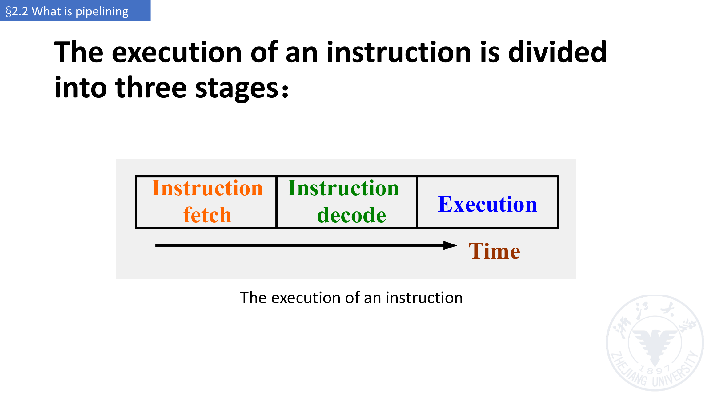

- 三种执行方式（p.29）【讲义】：**顺序执行（sequential execution）**、**一次重叠（single overlapping）**、**二次重叠（twice overlapping）**。

### 2.4 顺序执行（p.31）【讲义】

指令依次执行，指令内部的微操作也依次执行：

$$T = \sum_{i=1}^{n}\left(t_{IFi} + t_{IDi} + t_{EXi}\right)$$

### 2.5 重叠执行（p.32–37）【讲义】

设三段等长：**Δt1 = Δt2 = Δt3 = Δt**（讲义 p.34 的图上 Δt1↔IF、Δt2↔ID、Δt3↔EX）。

- 顺序执行 n 条指令：$T = \sum_{i=0}^{n}(t_{IFi}+t_{IDi}+t_{EXi}) = 3n\Delta t$；
- 重叠执行 n 条指令：

$$T = t_{IF} + \max(t_{IF},t_{ID}) + (n-2)\max(t_{IF},t_{ID},t_{EX}) + \max(t_{ID},t_{EX}) + t_{EX} = (n+2)\Delta t$$

- 若各段时间**不等长**（p.36–37），会出现功能部件的空闲（资源浪费）或需要「多重叠加」：
  - Δt2 > Δt3：EX 部件出现空闲（Waste of resources (EX)）；
  - Δt2 < Δt3：需要 Multiple overlapping (EX)。

### 2.6 顺序 vs 重叠（p.38）【讲义】

| 方式 | 优点 |
|---|---|
| 顺序执行 | 控制简单，节省设备 |
| 重叠执行 | 功能部件的**利用率更高** |

### 2.7 一次重叠与二次重叠（p.39–43）【讲义】

**一次重叠（single overlapping）**：

- 在第 k 条指令执行的同时取第 k+1 条指令；

$$T = (2n+1)\Delta t$$

- 优点：执行时间**减少近 1/3**；功能部件利用率明显提高；
- 缺点：需要**额外硬件**，控制过程变复杂。

**二次重叠（twice overlapping）**：

- 在第 k 条指令执行的同时译码第 k+1 条；在第 k 条指令译码的同时取第 k+1 条；

$$T = (n+2)\Delta t$$

- 优点：执行时间**减少近 2/3**；利用率明显提高；
- 缺点：需要**多得多的硬件**，必须要有**独立的取指、译码、执行部件**。

补充（p.43）：若取指阶段非常短，取指可以**并入译码**，此时二次重叠退化为一次重叠。

### 2.8 重叠执行的时空图（p.44–46）

- p.44–45：Δt_ID = Δt_EX 时，两条指令的 ID 与 EX 段正好错开一个 Δt，流水顺畅；
- p.46：Δt_ID ≠ Δt_EX 时会出现 ID、EX 两处的资源浪费（图中标出 Waste of resources (ID) / (EX)）。

### 2.9 访存冲突与哈佛结构（p.47）【讲义】

- 冲突来源：**取指令与取数据都要访问存储器**；
- 解决方式：
  - **指令存储器与数据存储器分开**（Harvard structure，哈佛结构）；
  - 指令缓存与数据缓存分开（同一块存储器做成两个 cache）；
  - 在**存储器与指令译码部件之间加指令缓冲（instruction buffer）**。

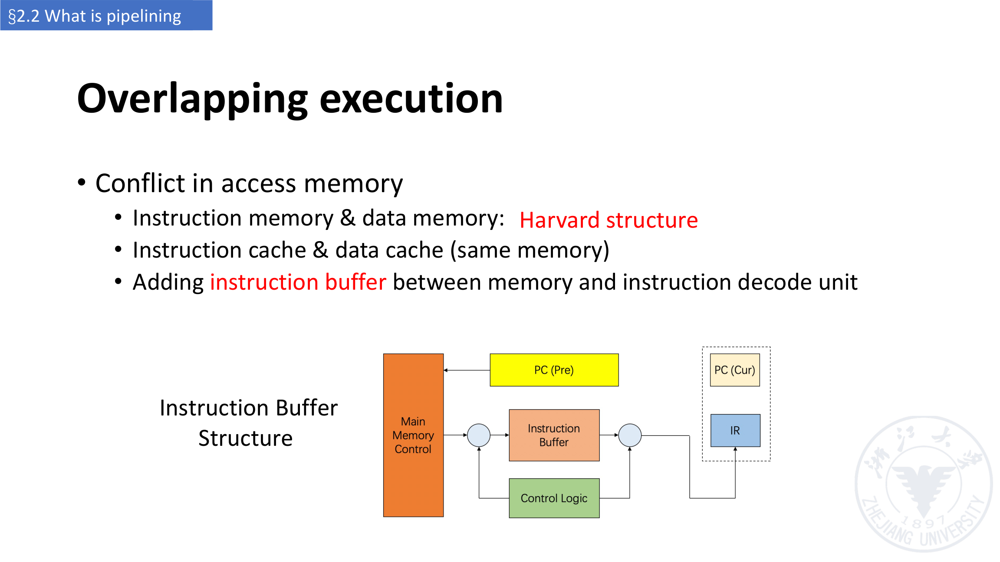

### 2.10 流水线的定义与术语（p.48–50）【讲义】

- 流水线：把一条指令的处理过程分成 **m（m > 2）个时间相等的子过程**，让 **m 条相邻指令**的处理过程在**同一时间**内错开、重叠；
- 流水线可以看作重叠执行的**推广/扩展**；
- 每个子过程及其功能部件称为流水线的**段（stage / segment）**，各段连接起来构成一条流水线；
- 流水线的段数称为流水线的**深度（depth）**。

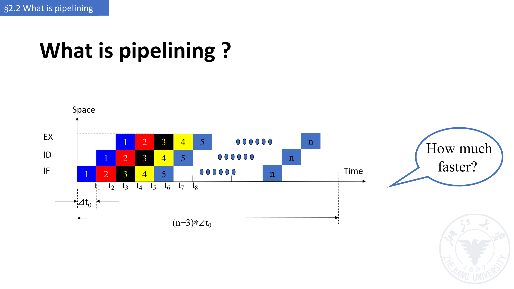

> 待确认：p.50 标注总时间为 `(n+3)*Δt0`，而讲义 p.41/p.45 给出的 3 段重叠执行时间公式是 `(n+2)Δt`，两者相差一个 Δt，疑为讲义笔误。

### 2.11 流水线的特点（p.51–52）【讲义】

1. 流水线把一个过程分成若干子过程，每个子过程由**专用功能部件**实现；
2. 各段的时间应**尽量相等**，否则流水线会被阻塞、断流，**最长的段会成为瓶颈（bottleneck）**；
3. 每个功能部件之间必须有**缓冲寄存器（latch）**，称为**流水寄存器（pipeline register）**：
   - 作用：在相邻两段之间传送数据，保证后面要用的数据仍然可用，并把各段的处理工作**相互隔离**；
   - 讲义标注「Learning from multi-cycle design」——多周期设计中「用寄存器保存上一周期结果」的思想在这里被复用。
4. 流水线技术适合**大量重复的连续过程**：只有输入连续不断地提供任务，流水线的效率才能充分发挥；
5. 流水线需要**通过时间（pass time）**与**排空时间（empty time）**：
   - 通过时间：第一个任务从进入流水线到结束的时间；
   - 排空时间：最后一个任务从进入流水线到出结果的时间。

---

## 3. §2.3 流水线的分类（p.53–61）

### 3.1 单功能 / 多功能（p.53–54）【讲义】

- **单功能流水线（single function pipelining）**：只有一种固定功能的流水线；
- **多功能流水线（multi function pipelining）**：流水线的各段可以按不同方式连接，完成多种不同功能。

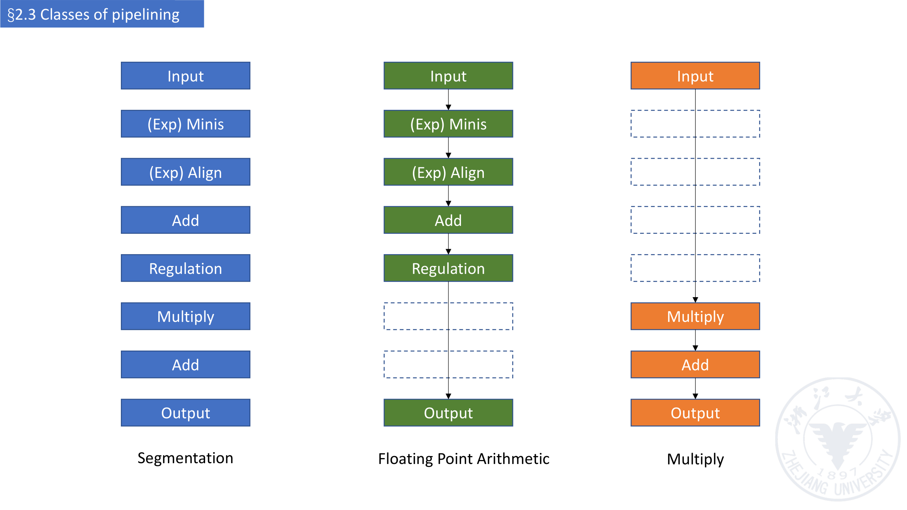

### 3.2 静态 / 动态（p.55–56）【讲义】

- **静态流水线（static pipelining）**：同一时间内，多功能流水线的各段只能按**同一种功能**的连接方式工作；
  - 只有当输入是一**系列相同的运算任务**时，效率才能充分发挥。
- **动态流水线（dynamic pipelining）**：同一时间内，各段可以按**不同方式连接**、**同时执行多种功能**；
  - 灵活但**控制复杂**；可以提高功能部件的可用性（availability）。

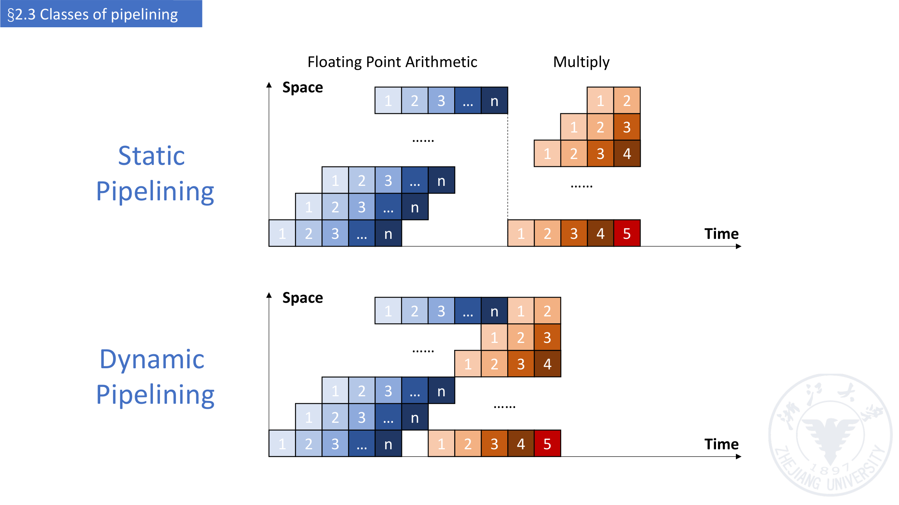

### 3.3 三个层次（p.57）【讲义】

| 分类 | 含义 |
|---|---|
| 部件级流水线（component level / component-operation pipelining） | 把处理器的算术逻辑运算部件分段，使多种类型的运算可以流水进行 |
| 处理器级流水线（processor level / inter-component, instruction pipelining） | 指令的解释与执行通过流水线实现：把一条指令的执行过程分成若干子过程，每个子过程在独立的功能部件中执行 |
| 处理器间流水线（inter-processor / macro pipelining） | 两个或多个处理器串接起来处理**同一数据流**，每个处理器完成整个任务的一部分 |

### 3.4 线性 / 非线性（p.58–59）【讲义】

- **线性流水线（linear pipelining）**：各段串行连接，**没有反馈回路**；数据流过时每段最多流过一次；
- **非线性流水线（nonlinear pipelining）**：除串行连接外，还有**反馈回路**；
  - 由此带来**调度问题**：要决定何时向流水线引入新任务，才能与先前进入流水线的任务**不发生冲突**。

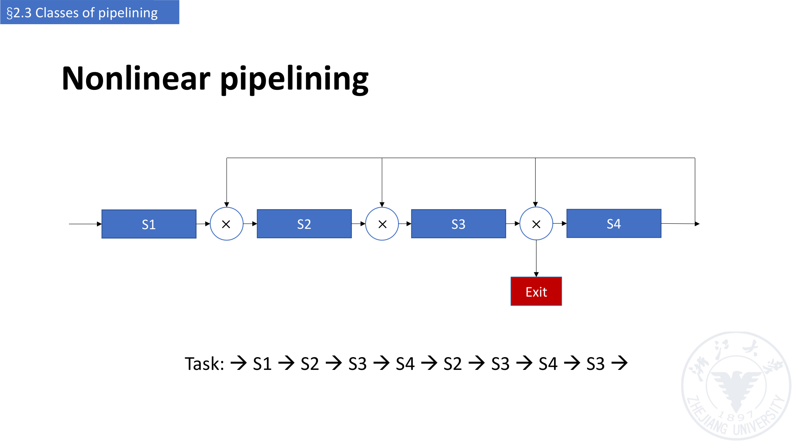

> 图示说明：p.59 给出的任务序列是 `S1 → S2 → S3 → S4 → S2 → S3 → S4 → S3 →`。

### 3.5 有序 / 无序（p.60）【讲义】

- **有序流水线（ordered pipelining）**：任务**流出顺序**与流入顺序完全相同，每个任务依次流过各段；
- **无序流水线（disordered pipelining）**：流出顺序与流入顺序不同，**允许后面的任务先完成**。

### 3.6 标量 / 向量流水线（p.61）【讲义】

- **标量处理器（scalar processor）**：没有向量数据表示和向量指令，只能通过流水线处理标量数据；
- **向量流水线处理器（vector pipelining processor）**：有向量数据表示和向量指令，是**向量数据表示与流水线技术的结合**。

---

## 4. §2.4 流水线的一种实现：RISC-V 五级流水（p.62–66）

### 4.1 五个阶段（p.62）【讲义】

**五级，一级一步**：

1. **IF**：Instruction fetch from memory（从存储器取指令）
2. **ID**：Instruction decode & register read（译码并读寄存器）
3. **EX**：Execute operation or calculate address（执行运算或计算地址）
4. **MEM**：Access memory operand（访问存储器操作数）
5. **WB**：Write result back to register（把结果写回寄存器）

### 4.2 为什么 RISC-V ISA 适合流水线（p.63）【讲义】

| ISA 特征 | 对流水线的意义 |
|---|---|
| 所有指令都是 32 位 | **更容易在一个周期内完成取指与译码**（对比 x86：1–17 字节的指令） |
| 指令格式少而规整 | 可以在**一步**内完成译码与寄存器读取 |
| load/store 型寻址 | 可以在**第 3 段**算地址、**第 4 段**访问存储器 |
| 存储器操作数**对齐** | 存储器访问**只需一个周期** |

### 4.3 实现要点：加流水寄存器（p.64）【讲义】

> Main Difference: **Adding new registers to separate stages physically!**（与单周期最大的区别：新增寄存器把各段在物理上分隔开）

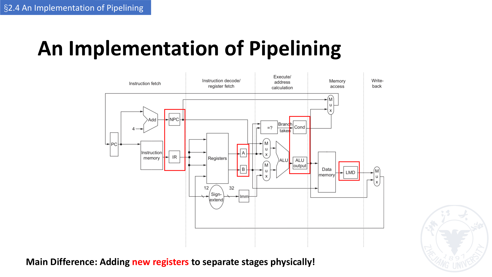

### 4.4 五级流水的 RTL 描述（p.65）【讲义，原表】

| 阶段 | 任何指令（Any instruction） |
|---|---|
| **IF** | `IF/ID.IR ← Mem[PC]`；`IF/ID.NPC,PC ← (if ((EX/MEM.opcode == branch) & EX/MEM.cond) {EX/MEM.ALUOutput} else {PC+4})` |
| **ID** | `ID/EX.A ← Regs[IF/ID.IR[rs1]]; ID/EX.B ← Regs[IF/ID.IR[rs2]];` `ID/EX.NPC ← IF/ID.NPC; ID/EX.IR ← IF/ID.IR;` `ID/EX.Imm ← sign-extend(IF/ID.IR[immediate field]);` |

EX / MEM / WB 三段按指令类型展开：

| 阶段 | ALU instruction | Load instruction | Branch instruction |
|---|---|---|---|
| **EX** | `EX/MEM.IR ← ID/EX.IR;` `EX/MEM.ALUOutput ← ID/EX.A func ID/EX.B;`（R 型）**或** `EX/MEM.ALUOutput ← ID/EX.A op ID/EX.Imm;`（I 型） | `EX/MEM.IR ← ID/EX.IR;` `EX/MEM.ALUOutput ← ID/EX.A + ID/EX.Imm;` | `EX/MEM.ALUOutput ← ID/EX.NPC + (ID/EX.Imm << 2);` |
| **MEM** | `MEM/WB.IR ← EX/MEM.IR;` `MEM/WB.ALUOutput ← EX/MEM.ALUOutput;` | `MEM/WB.LMD ← Mem[EX/MEM.ALUOutput];` | `or` `Mem[EX/MEM.ALUOutput] ← EX/MEM.B;`（store 的写存储器操作） |
| **WB** | `Regs[MEM/WB.IR[rd]] ← MEM/WB.ALUOutput;` | For load only: `Regs[MEM/WB.IR[rd]] ← MEM/WB.LMD;` | — |

> 读表要点：**IF 段就用 `EX/MEM.ALUOutput` 更新 PC**（即分支在 EX 段判定后才改 PC），这也是后面要讲的 **control hazard** 的来源；MEM 段第三栏的 `Mem[...] ← EX/MEM.B` 对应 store 的写存储器操作。
> 待确认：① 讲义表中 Load instruction 一栏首行写作 `EX/MEM.IR to ID/EX.IR`（其余列为赋值写法），疑为笔误；② 第 3 栏标题为 “Branch instruction”，但这一栏还列了 store 的写存储器操作（讲义如此）。

### 4.5 本讲的路线图（p.66）【讲义】

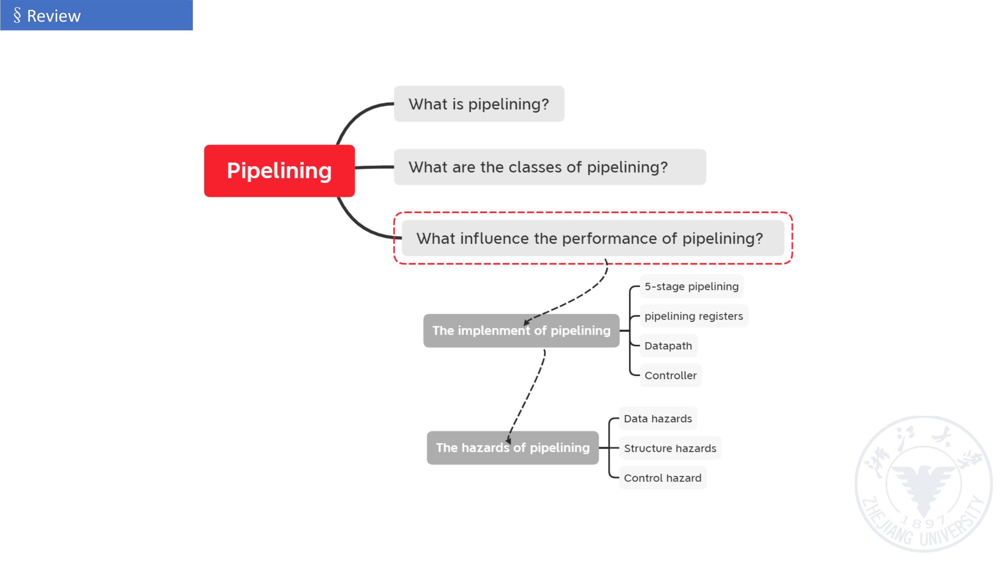

- **What is pipelining?**
- **What are the classes of pipelining?**
- **What influence the performance of pipelining?**（本讲重点，虚线框标出）
  - **The implement of pipelining**：5-stage pipelining、pipelining registers、Datapath、Controller
  - **The hazards of pipelining**：Data hazards、Structure hazards、Control hazard ← **后续课程内容**

---

## 5. §2.5 流水线性能评价（p.67–92）

### 5.1 例子：七类指令与各级耗时（p.67–70）【讲义】

考虑包含 7 条指令的系统：`lw`、`sw`、`add`、`sub`、`and`、`or`、`beq`。

| 指令类 | Fetch | Register Read | ALU Operation | Data Access | Register Write | 合计 |
|---|---|---|---|---|---|---|
| `lw` | 200ps | 100ps | 200ps | 200ps | 100ps | **800ps** |
| `sw` | 200ps | 100ps | 200ps | 200ps | — | **700ps** |
| `add, sub, and, or` | 200ps | 100ps | 200ps | — | 100ps | **600ps** |
| `beq` | 200ps | 100ps | 200ps | — | — | **500ps** |

- **单周期的时钟周期 = MAX(各指令总时间) = 800ps**（p.69）；
- **流水线的时钟周期 = MAX(各操作时间) = 200ps**（p.70）。

### 5.2 三条指令的执行对比（p.71–73）

- 非流水（single-cycle, nonpipelined）：3 × 800ps = **2400ps**；
- 流水（pipelined）：200ps × 7 = **1400ps**。

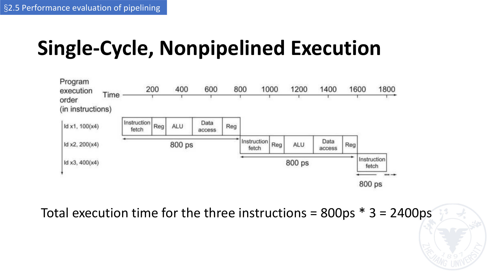

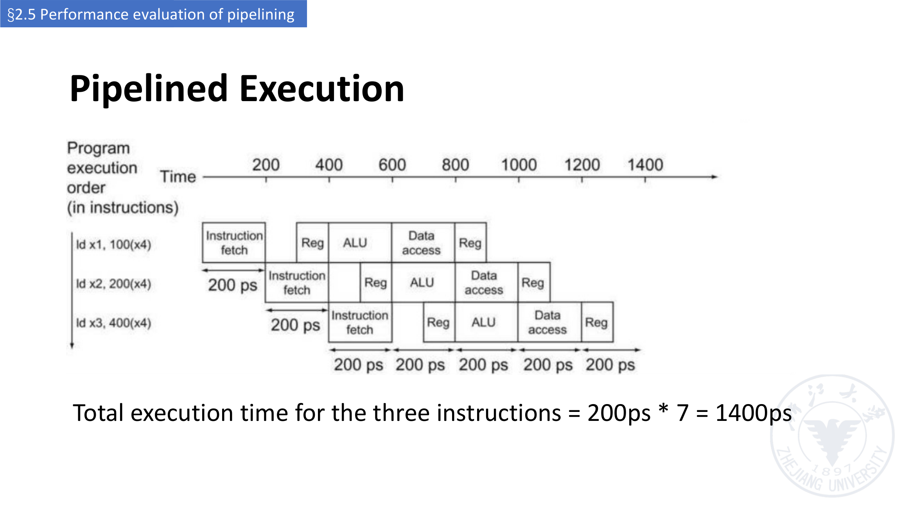

### 5.3 吞吐率 TP（p.74–77）【讲义】

- 定义：$TP = \dfrac{n}{T}$，且 $TP < TP_{max}$；
- 对 m 段流水线、n 个任务：

$$T = (m+n-1)\Delta t_0, \qquad TP = \frac{n}{(m+n-1)\Delta t_0}, \qquad TP_{max} = \frac{1}{\Delta t_0}$$

- 当 **n ≫ m** 时，$TP \approx TP_{max}$；
- 另一写法（p.76）：$TP = \dfrac{n}{n+m-1}\,TP_{max}$；
- **实际吞吐率小于最大吞吐率**，不仅与各段的时间有关，还与 **m 和 n** 有关。

### 5.4 瓶颈段（p.77–79）【讲义】

- 实际情形：各段时间不等。例：m = 4，S1、S3、S4 各为 Δt，**S2 为 3Δt（瓶颈）**；
- 流水线中**最长的段称为瓶颈段（bottleneck segment）**。

**解决瓶颈的常用方法（p.78）**：

| 方法 | 做法 |
|---|---|
| **细分（subdivision）** | 把 S2 分成 3 个子段：S2a、S2b、S2c（配合数据分配器 Data distributor 与数据收集器 Data collector），使 $TP_{max} = 1/\Delta t$ |
| **重复（repetition）** | 把瓶颈段 S2 重复设置 3 套，让多个任务并行通过该段 |

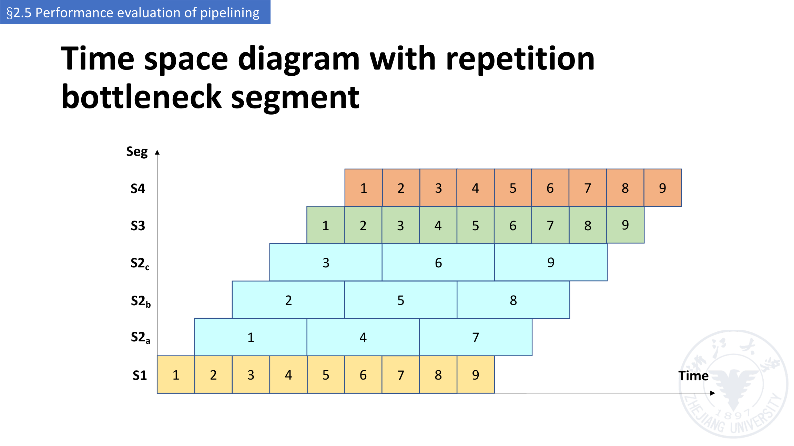

### 5.5 加速比 Sp（p.80–82）【讲义】

- 3 条指令的例子：2400ps vs 1400ps → **1.7:1**；
- 扩展到 1,000,003 条指令：`1,000,000×800ps + 2,400ps = 800,002,400ps` vs `1,000,000×200ps + 1,400ps = 200,001,400ps` → **4:1**；
- 一般式（m 段、n 个任务、各段等长 Δt0）：

$$S_p = \frac{n \times m \times \Delta t_0}{(m+n-1)\Delta t_0} = \frac{n \times m}{m+n-1}$$

- 当 **n ≫ m** 时，$S_p \approx m$；
- p.81 的另一种表述：$S_p = \dfrac{\text{非流水执行时间}}{\text{流水执行时间}} \le \text{流水线级数}$，**五级流水几乎快 5 倍**。

### 5.6 效率 η（p.83）【讲义】

$$\eta = \frac{n \times m \times \Delta t_0}{(m+n-1)\Delta t_0 \times m} = \frac{n}{m+n-1}$$

- 当 **n ≫ m** 时，$\eta \approx 1$。

### 5.7 综合例题：向量点积（p.84–86）【讲义】

题设：向量 $A(a_1,a_2,a_3,a_4)$、$B(b_1,b_2,b_3,b_4)$，在**静态双功能流水线**上计算点积 $A \cdot B$：

- 加法流水线：`1 → 2 → 3 → 5`
- 乘法流水线：`1 → 4 → 5`
- 每段的时间都是 Δt；问 $TP$、$S_p$、$\eta$。

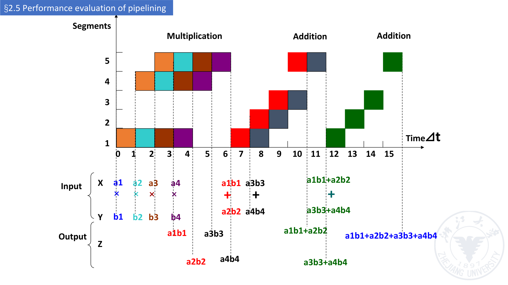

讲义给出的结果（p.86）：

$$S_p = \frac{4\times 3\Delta t + 3\times 4\Delta t}{15\Delta t} = 1.6$$

$$\eta = \frac{3\times 4\Delta t + 4\times 3\Delta t}{5\times 15\Delta t} = 32\%$$

$$TP = \frac{7}{15\Delta t} = 0.47/\Delta t$$

> 读题要点：4 次乘法（各占 3 段）+ 3 次加法（各占 4 段）= 7 个任务；非流水方式需 $4\times3\Delta t + 3\times4\Delta t = 24\Delta t$，流水方式只用 15Δt。

### 5.8 讨论（p.87–92）【讲义】

**（1）为什么用流水线（p.87–88）**

- 结构上非流水时每 100ns 才能启动一次计算 → 每秒完成 $10^7$ 次计算；
- 流水结构下每 20ns 就能启动一次计算 → 每秒完成 $5\times10^7$ 次计算；
- 流水线是让 CPU 变快的关键实现技术：**减少 CPU 时间**；它提升的是**吞吐率**（而不是单条指令的执行时间），并提升**功能部件的利用率**。

**（2）理想性能（p.89）**

- 若各段**完全平衡**，流水处理器上每条指令的时间 = （非流水机器上每条指令的时间）／（流水线级数）；
- 因此**理想加速比 = 流水线的级数**。

**（3）为什么不做 50 级流水线（p.90–91）**

- 级数太多 → 复杂问题多：要处理**在途指令之间可能的依赖**，控制逻辑庞大；
- 流水寄存器**不是免费的**：占面积，而且**穿过锁存器本身就有真实延迟**；
- **机器周期 > 锁存器延迟 + 时钟偏移（clock skew）**；在现代深流水（10–20 级）中这是真实效应；
- 典型的一级流水中的逻辑「深度」约为 10–20 个门；在这样的速度与逻辑级数下，**锁存器延迟很重要**。
- 结论：**5 级可以（OK），50 级不行（NO. Sorry!）**。

**（4）影响多功能流水线效率的因素（p.92，共 6 条）【讲义】**

1. 多功能流水线实现某一功能时，总有些段处于为其他功能准备的**空闲**状态；
2. 流水线建立（填充）过程中，有些要用的段也是空闲的；
3. 各段不等长时，时钟周期取决于**瓶颈段**的时间；
4. 功能切换时，流水线需要**排空**（emptied）；
5. 上一次运算的输出是下一次运算的输入（**依赖 Dependency**）；
6. 额外开销：**流水寄存器延迟**与**时钟偏移开销**。

---

## 6. 听课重点与易混点

1. **流水线不缩短单条指令的时间**，缩短的是**平均**时间／提升的是**吞吐率**——洗衣房例子（90 min 不变、平均 52.5 min）是标准答案。
2. **最慢的段决定时钟周期**：洗衣房是 40 min 的 dryer，CPU 里是「取指/译码/ALU/访存/写回」中最长的那一段（例子里都是 200ps）。
3. **顺序 → 一次重叠 → 二次重叠**的三条公式要能互推：$3n\Delta t$、$(2n+1)\Delta t$、$(n+2)\Delta t$。
4. **流水线的段间必须有流水寄存器（latch）**，作用一是传送数据、二是隔离各段的处理工作。
5. **静态流水线要求「同一时间只做同一种功能」**，动态流水线允许各段按不同方式连接；这一点最容易和「多功能流水线」混起来——多功能讲的是**能力**，静态/动态讲的是**同一时刻的使用方式**。
6. **线性 / 非线性**的判据是有无**反馈回路**；非线性带来调度问题。
7. **三个必背公式**（m 段、n 个任务、各段等长 Δt0）：
   - $T = (m+n-1)\Delta t_0$
   - $TP = \dfrac{n}{(m+n-1)\Delta t_0}$，$TP_{max} = \dfrac{1}{\Delta t_0}$
   - $S_p = \dfrac{n\,m}{m+n-1}$，$\eta = \dfrac{n}{m+n-1}$；当 $n \gg m$ 时 $S_p \approx m$、$\eta \approx 1$。
8. **瓶颈段**用细分成重复法解决；细分法要配合 distributor / collector 使用。
9. **理想加速比 = 级数**，但级数不能无限加深（锁存器延迟、clock skew、依赖与控制复杂度）。
10. 本讲末尾的路线图直接指向**下一讲的三种冒险**：data hazard、structure hazard、control hazard。

## 7. 课前自测 / 复习清单

1. 洗衣房例子中，4 人顺序洗要多久？流水要多久？单个任务和平均任务的时间分别是多少？
2. 流水线为什么不会缩短单条指令的执行时间？它提升的是什么指标？
3. 一条指令被分成哪三个阶段？写出顺序执行、一次重叠、二次重叠的时间公式。
4. 二次重叠的硬件代价是什么？什么情况下二次重叠会退化成一次重叠？
5. 取指与取数据的访存冲突有哪三种处理方式？指令缓冲（instruction buffer）的作用是什么？
6. 什么是流水线的「段」与「深度」？流水寄存器的两个作用是什么？
7. 什么是通过时间、排空时间？
8. 单功能 / 多功能、静态 / 动态、线性 / 非线性、有序 / 无序，各自的判据是什么？
9. 部件级、处理器级、处理器间流水线分别在流水什么？
10. RISC-V 五级流水的五个阶段分别做什么？为什么 RISC-V 的 ISA 特别适合流水线（至少三条理由）？
11. 与单周期实现相比，流水线实现的关键改动是什么？
12. 单周期时钟周期与流水线时钟周期分别是多少（用 p.68 的表回答）？为什么？
13. 写出 $T$、$TP$、$TP_{max}$、$S_p$、$\eta$ 的公式。为什么 $TP < TP_{max}$？
14. 什么是瓶颈段？细分法和重复法分别怎么做？
15. 点积例题里为什么 $S_p = 1.6$ 而 $\eta$ 只有 32%？$TP$ 又是多少？
16. 为什么不能直接做 50 级流水线？至少说出三条理由。
17. 影响多功能流水线效率的六个因素是什么？

## 8. 来源、页码对照与待确认

**来源**：`../lec02(2).pdf`（Computer Systems II，浙江大学，主讲 卢立 Li Lu），第 2 讲全部 92 页。

**页码对照**：

| 内容 | 页码 |
|---|---|
| 引入：食堂 / 洗衣房 / 装配线 | p.2–24 |
| 什么是流水线（三段、三种执行方式、特点） | p.25–52 |
| 流水线的分类 | p.53–61 |
| RISC-V 五级流水实现与 RTL | p.62–66 |
| 性能评价（TP、Sp、η、例题、讨论） | p.67–92 |

**讲义图片导出清单**（`assets/`，均为讲义原页，非自绘）：

| 文件 | 页码 | 内容 |
|---|---|---|
| `fig_p30_three_stages.png` | p.30 | 指令执行三段：IF / ID / EX |
| `fig_p47_instruction_buffer.png` | p.47 | 指令缓冲结构与 PC(Pre)/PC(Cur)、IR |
| `fig_p50_timespace_3stage.png` | p.50 | 3 段流水线时空图与 `(n+3)*Δt0` |
| `fig_p54_pipeline_segmentation.png` | p.54 | 分段、浮点加法、乘法流水线结构 |
| `fig_p56_static_vs_dynamic.png` | p.56 | 静态 vs 动态流水线时空图 |
| `fig_p59_nonlinear_pipeline.png` | p.59 | 非线性流水线（带反馈回路与 Exit） |
| `fig_p64_pipelined_datapath.png` | p.64 | 流水线数据通路与流水寄存器 |
| `fig_p66_roadmap.png` | p.66 | 本讲路线图（实现 + 冒险） |
| `fig_p71_nonpipelined_exec.png` | p.71 | 非流水执行时空图（2400ps） |
| `fig_p73_pipelined_exec.png` | p.73 | 流水执行时空图（1400ps） |
| `fig_p79_repetition_bottleneck.png` | p.79 | 重复法消除瓶颈段的时空图 |
| `fig_p85_dotproduct_timespace.png` | p.85 | 点积例题时空图 |

**待确认清单**：

1. p.50 时空图标总时间为 `(n+3)*Δt0`，与 p.41/p.45 的 3 段重叠公式 `(n+2)Δt` 不一致（相差一个 Δt），疑为笔误。
2. p.65 RTL 表中 Load instruction 一栏首行写作 `EX/MEM.IR to ID/EX.IR`（其余为赋值写法），疑为笔误。
3. p.26「加速指令执行」的六条bullet 为逐条淡入的讲义要点，其中若干措辞（如「同时解释整个程序」）在原文中即较笼统，按其字面记录。
4. p.34 的 Δt1/Δt2/Δt3 与 IF/ID/EX 的对应关系由图上位置确定（Δt1↔IF、Δt2↔ID、Δt3↔EX）。
5. p.36–37 的「Δt2 > Δt3 / Δt2 < Δt3」两组图在讲义中为动画叠加，正文按最后停留的状态记录。
6. p.87 的 100ns / 20ns、$10^7$ / $5\times10^7$ 为讲义给出的示意数字，未说明具体结构参数。
7. §2.3 的六组分类（p.53–61）讲义标题统一写作 “Classes of pipelining”，本笔记按内容加了中文小标题以便检索。
