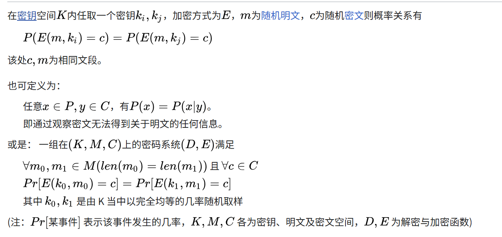
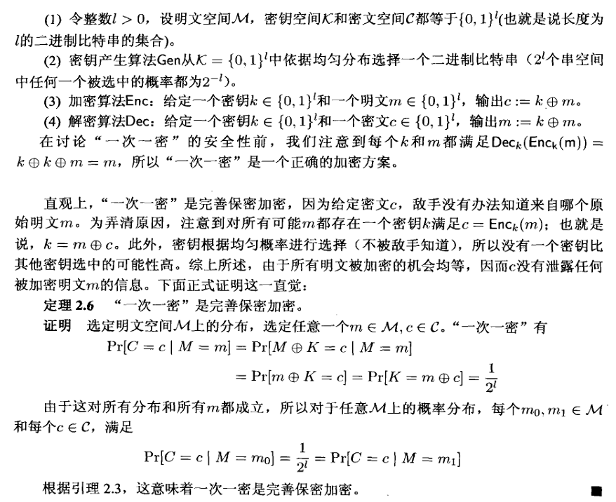

# 密码学基础 · 02：完美保密与一次性密码本（Perfect Secrecy & One-Time Pad）

> 来源：用户提供的课程资料（一份速查表提纲 ＋ 一份按课次记录的课程笔记 Lec1–Lec13；详见 [`00_索引.md`](00_索引.md) §1）
> 整理日期：2026-09-21
> 说明：本文由 AI 依据上述资料整理；资料把证明留给读者（用 🙈 标出），本笔记**保留 🙈 标记**，只把“要证什么、线索是什么”写清楚，不代替原文给出证明。
> 教材对照：Katz & Lindell（Revised 3rd ed.）**§2 Perfectly Secret Encryption**（§2.1 Definitions / §2.2 The One-Time Pad / §2.3 Limitations of Perfect Secrecy / §2.4 \*Shannon's Theorem）。

## 0. 本节速览

| 小节 | 主题 | 一句话摘要 |
|---|---|---|
| §1 | 本节定位 | 介绍香农安全/完美安全的互化，并陈述其局限性；本质是**基于纯随机的等价概率分布**。 |
| §2 | 两个定义 | Shannon 形式（先验 = 后验）与 Perfect 形式（不同明文得到同一密文的概率相等）。 |
| §3 | 等价性定理 🙈 | 两个定义等价，提示用**全概率展开**。 |
| §4 | Shannon 定理 | 若 $\lvert\mathcal{M}\rvert=\lvert\mathcal{K}\rvert=\lvert\mathcal{C}\rvert$：完美安全 ⇔ 密钥均匀分布且 $(m,c)$ 唯一确定密钥。 |
| §5 | 一次性密码本（OTP） | $\mathrm{Enc}(sk,m)=sk\oplus m$；由 $sk$ 均匀随机立即得到完美保密。 |
| §2.5 | 定义的“四次尝试”（新增） | 不知道密钥 → 不知道信息 → 香农安全 → 完美安全；并说明“三次/四次”的差别是**要不要依赖明文分布**。 |
| §6 | 局限 | 香农安全必有 $\lvert\mathcal{K}\rvert\ge\lvert\mathcal{M}\rvert$ 🙈（长密钥保护短内容 / 密文空间非常大）。 |

---

## 1. 本节定位

- 资料的一行总结：**介绍香农/完美安全互化，并陈述其局限性。本质是基于纯随机的等价概率分布的生成。**

## 2. 两个形式的安全定义

资料以“两个形式”并列给出：

**（1）Shannon 形式**

$$\forall t,c,\quad \mathbb{P}_{m\leftarrow D}\,[m=t]\ =\ \mathbb{P}_{m\leftarrow D,\;sk\leftarrow\mathrm{Gen}}\,[\,m=t \mid \mathrm{Enc}(sk,m)=c\,]$$

即：**看到密文 $c$ 之后，对明文的后验分布与先验分布相同**。

**（2）Perfect 形式**

$$\forall m_1,m_2,\ c,\quad \mathbb{P}_{sk\leftarrow\mathrm{Gen}}\,[\mathrm{Enc}(sk,m_1)=c]\ =\ \mathbb{P}_{sk\leftarrow\mathrm{Gen}}\,[\mathrm{Enc}(sk,m_2)=c]$$

即：**任意两条明文被加密成同一密文的概率一样**（密钥随机性来“抹平”明文差异）。

| 记号 | 含义 |
|---|---|
| $D$ | 明文上的先验分布（资料写作 $m\leftarrow D$，即明文按某个分布取） |
| $c$ | 固定的一条密文 |
| $sk\leftarrow\mathrm{Gen}$ | 按密钥生成算法随机取密钥 |

> 待确认：资料在 Perfect 形式里把 $c$ 写成了**自由变量**（“$\forall m_1,m_2$”后面直接出现 $c$，未说明对 $c$ 的量词）。按常见口径应为“**对任意 $c$**（以及任意 $m_1,m_2$）都相等”，此处照录资料写法，量词细节待上课确认。
> 资料此处公式的渲染有轻微错乱（Perfect 式子末尾多了一个 `\rbrack`），已按上下文整理。

### 2.1 定义的“四次尝试”与两个定义的关键差别

课程笔记按“逐步加严”的顺序把安全定义走了四遍（前三次都被否掉）：

| 尝试 | 说法 | 课程笔记的评价 |
|---|---|---|
| 第一次 | 攻击者**不知道密钥** | **不安全**——“其实还是明文传输” |
| 第二次 | 攻击者**不知道信息** | 安全，但**并不现实** |
| 第三次 | 攻击者拿到**一部分密文**，但没办法得到更多关于明文的信息 ⇒ **香农安全** | 由 **Shannon 于 1949 年**提出，是 [§2](#2-两个形式的安全定义) 的 Shannon 形式 |
| 第四次 | **任意两个明文**被加密成**同一个密文的概率相等** ⇒ **完美安全** | [§2](#2-两个形式的安全定义) 的 Perfect 形式 |

课程笔记对第三次（Shannon 形式）的解读：

- 式子左侧 $\mathbb{P}_{M\leftarrow D}[m=t]$ 叫**先验（a priori）概率**，右侧 $\mathbb{P}_{M\leftarrow D,sk\leftarrow \mathrm{Gen}}[m=t\mid \mathrm{Enc}(sk,m)=c]$ 叫**后验（posteriori）概率**；
- 直观解释：**在了解到加密过程和密文之后，仍然不会影响敌手判断出原文的概率**，即密文没有泄露任何明文信息。

课程笔记对第三次与第四次差别（这条是资料没有讲清的**关键辨析**）：

> 最大区别在于**第四次定义不考虑明文空间的分布**，也就是**敌手不需要知道明文空间的分布**；而**香农的定义需要考虑明文空间 $\mathcal{M}$ 的分布**。
> 一言以蔽之：**在完美安全的定义下，密文的分布不依赖于明文**。敌手需要知道的信息更少，实现难度在直觉上更简单。

课程笔记对二者等价的表述：

> **定义 3 基于概率，定义 4 基于不可区分性，二者是完全等价的**（对应资料 [§3](#3-两个定义等价) 里那个 🙈 的定理）。

参考链接（课程笔记原文给出）：[完善保密性（维基百科）](https://zh.wikipedia.org/wiki/%E5%AE%8C%E5%96%84%E4%BF%9D%E5%AF%86%E6%80%A7)。

课程笔记在这里还附了一张**Perfect 定义的等价写法**截图，它把「不同明文得到同一密文的概率相等」写成了三种并列形式（**照录，记号与本文 [§2](#2-两个形式的安全定义) 不同**：它用 $E$ 表示加密、$(D,E)$ 表示密码系统、$C$ 表示密文空间）：

1. 以**密钥**并列：在密钥空间 $K$ 内任取两个密钥 $k_i,k_j$，则 $P(E(m,k_i)=c)=P(E(m,k_j)=c)$（$m$ 为随机明文、$c$ 为随机密文，且此处 $c,m$ 为相同文段）；
2. 以**明文/密文**并列：任意 $x\in P,\ y\in C$，有 $P(x)=P(x\mid y)$——「**通过观察密文无法得到关于明文的任何信息**」；
3. 以**概率系统**的一般形式：一组在 $(K,M,C)$ 上的密码系统 $(D,E)$ 满足：$\forall m_0,m_1\in M$（且 $\mathrm{len}(m_0)=\mathrm{len}(m_1)$）与 $\forall c\in C$，有 $\Pr[E(k_0,m_0)=c]=\Pr[E(k_1,m_1)=c]$，其中 $k_0,k_1$ 在 $K$ 中**以完全均等的几率随机取样**。

## 3. 两个定义等价（🙈）

> **Theorem**：上述两个定义等价。🙈
> **Hint**：全概率展开。

- 🙈 表示**资料要求读者自己证明**，本笔记不代替给出完整证明。
- 整理者提示（仅为记号整理，不是证明）：Shannon 形式里的 $\mathbb{P}[m=t\mid \mathrm{Enc}(sk,m)=c]$ 用**全概率公式**展开时，会同时用到“明文先验 $D$”与“密钥分布”，这正是两条定义能对接的地方——具体推导请按教材 §2.1 完成。
- 资料随后注明：“**有一个推论**”，即 §4 的 Shannon 定理。

## 4. Shannon 定理（Shannon's theorem）

> **假设** $\lvert\mathcal{M}\rvert=\lvert\mathcal{K}\rvert=\lvert\mathcal{C}\rvert$，则：
> **完美安全 ⇔ ① 密钥 $k$ 服从均匀分布；② 对给定的 $m,c$，$\mathrm{Enc}(k,m)=c$ 中的 $k$ 是唯一的。**

理解要点：

- 条件 ② 说的是**加密映射是一一对应**（每个 $(m,c)$ 至多对应一条密钥）。
- 条件 ①+② 合起来：$\lvert\mathcal{K}\rvert=\lvert\mathcal{M}\rvert$ 时若还要完美保密，密钥必须“用满且均匀”。
- 这条定理的推论就是 §6 的密钥长度下界 $\lvert\mathcal{K}\rvert\ge\lvert\mathcal{M}\rvert$。

### 4.1 两条下界与“optimal”的说法

课程笔记在 Shannon 定理之后补了两句便于记忆的话：

- $\lvert\mathcal{K}\rvert\ge\lvert\mathcal{M}\rvert$ 时**才有可能**满足 Perfect Privacy（密钥不能比明文短）；
- $\lvert\mathcal{C}\rvert\ge\lvert\mathcal{M}\rvert$ 时**才能保证密文被正确解密**；
- 而香农定理里陈述的条件 $\lvert\mathcal{K}\rvert=\lvert\mathcal{M}\rvert=\lvert\mathcal{C}\rvert$ 相当于“**optimal**”（三个空间一样大时，两条下界同时取等号）。

## 5. 一次性密码本（One-Time Pad, OTP）

资料给出的方案（原文这里公式被挤成一行、渲染错乱，下面按上下文整理）：

$$\mathcal{M}=\mathcal{K}=\{0,1\}^n,\qquad
\mathrm{Gen}(\cdot)\to sk,\ sk\overset{\$}{\leftarrow}\mathcal{K},\qquad
\mathrm{Enc}(sk,m)=sk\oplus m,\qquad
\mathrm{Dec}(sk,c)=sk\oplus c$$

- 因为 $sk$ 在 $\{0,1\}^n$ 上均匀，显然有

$$\mathbb{P}_{sk}\,[\,sk\oplus m=c\,]=\mathbb{P}_{sk}\,[\,sk=m\oplus c\,]$$

- 资料指出这里会冒出一个问题：**长密钥保护短内容**（密钥与明文等长，甚至比明文长）。
- 结论：**OTP 是 Shannon-secure 的**（即满足完美保密）。

> 记号提示：$x\overset{\$}{\leftarrow}\mathcal{K}$ 表示**从 $\mathcal{K}$ 中均匀随机**取 $x$（资料用 $\overset{\$\not{}}{\leftarrow}$ 这类写法，按上下文应读作“均匀随机选取”）。
> 待确认：资料把 OTP 的 $\mathrm{Gen}$ 写成 $\mathrm{Gen}(\cdot)$（未写安全参数），与 [01 篇 §3](01_导论与密码学原则.md#3-加密方案的组成三种算法--两种空间) 中 $\mathrm{Gen}(\mathrm{srand})=sk$ 的记号一致性问题，同样待上课统一。

### 5.1 OTP 的补充说明

- **加解密都是异或**；**密钥与明文等长**。
- 安全性的一句话：**只要密钥是真正随机、只使用一次、与明文等长，即使攻击者有无限计算能力，也无法从密文中获得任何关于明文的信息**。
- OTP 的缺陷，课程笔记的表述是：**密文空间非常大**。

> 两处资料对“缺陷”的强调点不同，**并列记录、不下判定**：
> - 资料：[§6](#6-完美保密的局限密钥不能比明文短) 强调“**长密钥保护短内容**”（密钥长度代价）；
> - 课程笔记强调“**密文空间非常大**”（密钥/密文的存储与分发代价）。

课程笔记另外附了**教材式的 OTP 形式定义与证明**（截图见下），骨架是：

1. 令整数 $l>0$，说明文空间 $\mathcal{M}$、密钥空间 $\mathcal{K}$、密文空间 $\mathcal{C}$ 都等于 $\{0,1\}^{l}$；
2. 密钥生成算法 $\mathrm{Gen}$ 从 $\mathcal{K}=\{0,1\}^{l}$ 中依据**均匀分布**选出一个二进制比特串（每个密钥被选中的概率都是 $2^{-l}$）；
3. 加密算法 $\mathrm{Enc}$：给定 $k\in\{0,1\}^{l}$ 与 $m\in\{0,1\}^{l}$，输出 $c:=k\oplus m$；
4. 解密算法 $\mathrm{Dec}$：给定 $k\in\{0,1\}^{l}$ 与 $c\in\{0,1\}^{l}$，输出 $m:=k\oplus c$。

截图里先验证了**正确性**（每个 $k,m$ 都满足 $\mathrm{Dec}_k(\mathrm{Enc}_k(m))=k\oplus k\oplus m=m$），再算

$$\Pr[C=c\mid M=m]=\Pr[M\oplus K=c\mid M=m]=\Pr[K=m\oplus c]=\frac{1}{2^{l}}$$

（最后一式用的是密钥**均匀**选取），由此得到「$\Pr[C=c\mid M=m_0]=\Pr[C=c\mid M=m_1]$」，再引用**引理 2.3** 得结论：**定理 2.6——“一次一密”是完善保密加密**。

![同处的**引理 2.3**：明文空间为 $\mathcal{M}$ 的加密方案 $(\mathrm{Gen},\mathrm{Enc},\mathrm{Dec})$ 是完善保密加密，当且仅当对任意 $\mathcal{M}$ 上的概率分布、每个 $m_0,m_1\in\mathcal{M}$ 与每个 $c\in\mathcal{C}$，有 $\Pr[C=c\mid M=m_0]=\Pr[C=c\mid M=m_1]$](assets/fig_l2_otp_2.png)

> 整理者按语：这套「**先验正确性 → 算 $\Pr[C=c\mid M=m]$ 与 $m$ 无关 → 引用等价形式**」的写法，就是完美保密证明的**标准模板**，与本文 [§3](#3-两个定义等价)（资料标 🙈 的等价定理）正好互为表里——把 $\mathbb{P}[C=c\mid M=m]$ 算成 $1/2^{l}$，[§3](#3-两个定义等价) 的等价性自然成立。

## 6. 完美保密的局限：密钥不能比明文短

> **Theorem**：香农安全（完美保密）必定有 $\lvert\mathcal{K}\rvert\ge\lvert\mathcal{M}\rvert$。🙈
> **Hint**：从**映射不完全性**出发。

- 🙈 表示资料要求自己证明。
- 这条定理与 §4 的 Shannon 定理一起说明了完美保密的**代价**：密钥空间至少要和明文空间一样大 ⇒ 实际系统里需要“**密钥比明文短**”，于是必须放弃完美保密，转向[计算安全（下一节）](03_单向函数与伪随机生成器.md)。
- 与 [§5](#5-一次性密码本one-time-pad-otp) 的“长密钥保护短内容”是同一件事的两种说法。

## 7. 关键公式汇总

| 名称 | 公式 | 备注 |
|---|---|---|
| Shannon 定义 | $\mathbb{P}_{m\leftarrow D}[m=t]=\mathbb{P}_{m\leftarrow D,sk\leftarrow\mathrm{Gen}}[m=t\mid\mathrm{Enc}(sk,m)=c]$ | 先验 = 后验 |
| Perfect 定义 | $\mathbb{P}_{sk}[\mathrm{Enc}(sk,m_1)=c]=\mathbb{P}_{sk}[\mathrm{Enc}(sk,m_2)=c]$ | 逐密文比较 |
| 等价性 | 两定义等价 🙈（Hint：全概率展开） | [§3](#3-两个定义等价) |
| Shannon 定理 | $\lvert\mathcal{M}\rvert=\lvert\mathcal{K}\rvert=\lvert\mathcal{C}\rvert$ 时，完美安全 ⇔ $k$ 均匀且 $k$ 由 $(m,c)$ 唯一确定 | [§4](#4-shannon-定理shannons-theorem) |
| OTP | $\mathrm{Enc}(sk,m)=sk\oplus m$，$\mathrm{Dec}(sk,c)=sk\oplus c$ | $sk$ 均匀 ⇒ 完美保密 |
| 密钥下界 | $\lvert\mathcal{K}\rvert\ge\lvert\mathcal{M}\rvert$ 🙈 | Hint：映射不完全性 |

## 8. 听课重点与易混点

1. **两个定义的差别在“出发点”**：Shannon 从“明文分布的先验/后验”出发；Perfect 从“两条明文撞上同一密文”出发。二者等价，但改写方向不同。
2. **完美保密是信息论层面的安全**（不限制计算能力），所以才有 $\lvert\mathcal{K}\rvert\ge\lvert\mathcal{M}\rvert$ 这种“硬代价”；这条代价在现代密码学里靠 **PPT 攻击者 + 可忽略概率** 才得以绕开。
3. **OTP 的“一次”不能少**：本节只讨论单条消息的完美保密；密钥复用会泄露信息（多消息安全见 [04 篇](04_多消息安全与IND-CPA.md#1-动机为什么一次一密不够)）。
4. 资料两处 🙈（[§3](#3-两个定义等价) 的等价性、[§6](#6-完美保密的局限密钥不能比明文短) 的密钥下界）都提示用**具体工具**（全概率展开 / 映射不完全性），不是凭空论证。

## 9. 复习清单

- [ ] 默写完美保密的两个形式，并说明各自量词覆盖什么。（[§2](#2-两个形式的安全定义)）
- [ ] 等价性定理的证明线索是什么？为什么“全概率展开”能把两个定义接起来？（[§3](#3-两个定义等价)）
- [ ] 叙述 Shannon 定理的两个条件，并解释“$k$ 唯一”意味着加密映射具有什么性质。（[§4](#4-shannon-定理shannons-theorem)）
- [ ] 写出 OTP 的 Gen/Enc/Dec，并说明为什么它满足完美保密。（[§5](#5-一次性密码本one-time-pad-otp)）
- [ ] 为什么完美保密必然要求 $\lvert\mathcal{K}\rvert\ge\lvert\mathcal{M}\rvert$？（[§6](#6-完美保密的局限密钥不能比明文短)）

- [ ] 完美安全定义的“四次尝试”分别是什么？前三次为什么被否掉？（[§2.5](#21-定义的四次尝试与两个定义的关键差别)）
- [ ] 第三次（香农）与第四次（完美）的差别到底在“要不要知道明文分布”，这句话怎么理解？（[§2.5](#21-定义的四次尝试与两个定义的关键差别)）
- [ ] 先验概率与后验概率分别对应式子的哪一边？（[§2.5](#21-定义的四次尝试与两个定义的关键差别)）

## 10. 关联知识点

- 安全定义“从直觉到精确”的第一课（定义、假设、证明三要素）——见 [`01_导论与密码学原则.md`](01_导论与密码学原则.md#5-可证明安全provable-security三要素)。
- 用**计算安全**绕开 OTP 的长密钥代价：PRG 与流密码——见 [`03_单向函数与伪随机生成器.md`](03_单向函数与伪随机生成器.md#61-动机魔改-otp-得到流密码)。
- OTP 的缺陷变体（密钥空间被限制后立刻失去完美保密）——见作业一 Q1：[`12_习题一_OTP缺陷与OWF-PRG关系.md`](12_习题一_OTP缺陷与OWF-PRG关系.md#1-q1a-flawed-one-time-pad)。
- 教材：§2.1（定义）、§2.2（OTP）、§2.3（局限）、§2.4（\*Shannon 定理）。

## 11. 来源与延伸阅读

- 来源：用户提供的课程资料（速查表提纲 ＋ 课程笔记 Lec1–Lec13）；清单见 `密码学基础/readme.md`。原始资料（`数据安全与密码学基础.zip` 及其中的附件）均为**只读引用**，未改动。
- 参考书：Katz & Lindell, *Introduction to Modern Cryptography*（Revised 3rd ed.）**§2** Perfectly Secret Encryption（§2.1–§2.4）。
