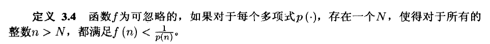
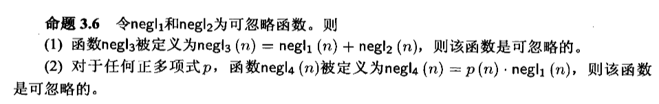
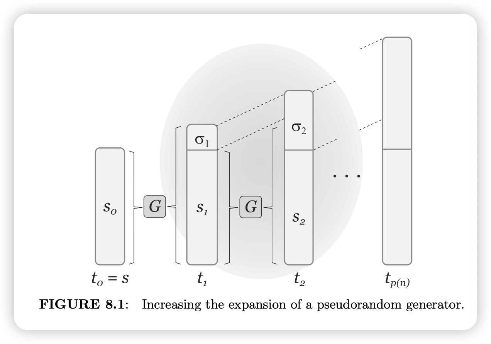
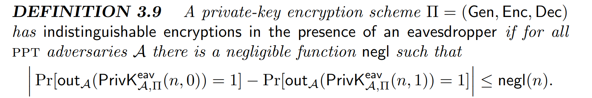
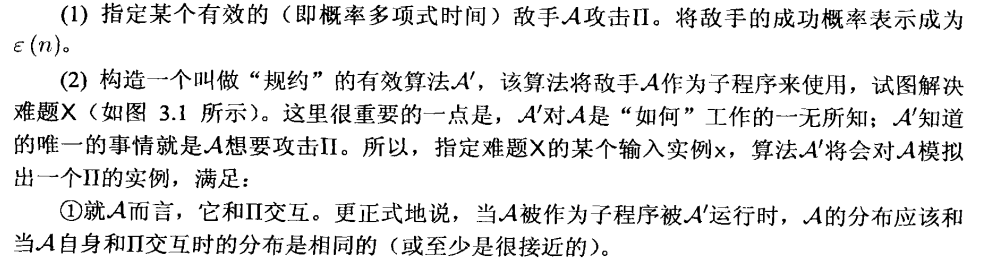
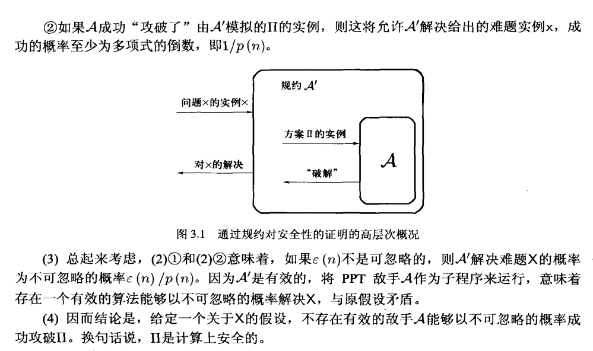
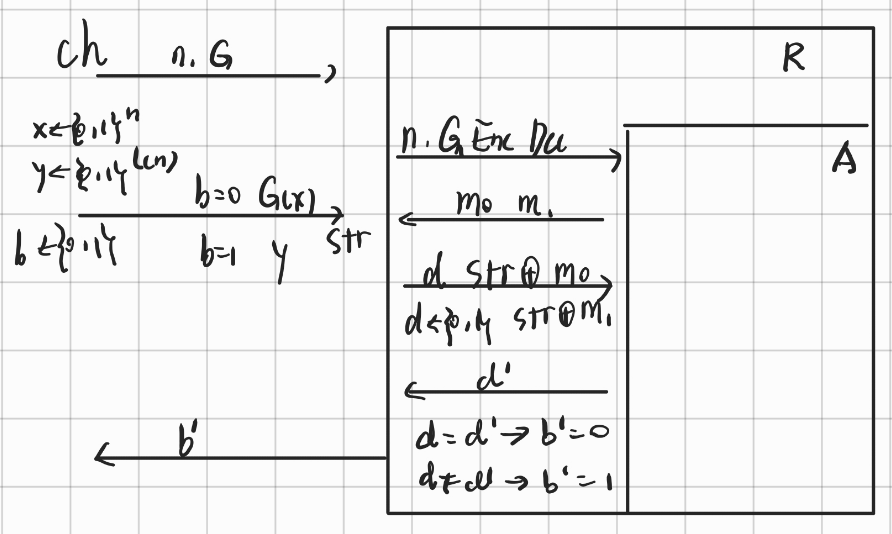

# 密码学基础 · 03：单向函数与伪随机生成器（OWF, Hard-Core Predicate & PRG）

> 来源：用户提供的课程资料（一份速查表提纲 ＋ 一份按课次记录的课程笔记 Lec1–Lec13；详见 [`00_索引.md`](00_索引.md) §1）
> 整理日期：2026-09-21
> 说明：本文由 AI 依据上述资料整理；资料多处公式在网页上是图片/公式渲染，本笔记按上下文重排为 LaTeX，**凡资料记号不完整之处都标了「待确认」**，不作臆断。
> 教材对照：Katz & Lindell（Revised 3rd ed.）**§3.1** Computational Security、**§3.2.1** The Basic Definition of Security (EAV-Security)、**§3.3** Constructing an EAV-Secure Encryption Scheme（§3.3.1 PRG / §3.3.2 Proofs by Reduction / §3.3.3 EAV-Security from a PRG）、**§8.1** One-Way Functions、**§8.4.2** Increasing the Expansion Factor。

## 0. 本节速览

| 小节 | 主题 | 一句话摘要 |
|---|---|---|
| §1 | 计算模型 | 图灵机 $T(\mathcal{M})$ 的停止时间、攻击者 $\mathcal{A}$ 是 PPT；$n$ 是**数据规模（位数）**而不是数据个数。 |
| §1.1–1.2 | 计算安全（新增） | 信息论安全 vs 计算安全（$P\ne NP$）、两个放宽条件、实现上的**具体方法**与**渐进方法**。 |
| §2 | 单向函数（OWF）三档 | worst-case / **strong（默认）** / weak 单向函数，区别在“求逆成功概率”的上界。 |
| §3 | 例子：大数分解 | 在“$n$ 位素数集合 $\mathcal{P}_n$”上定义 $f(p,q)=pq$；资料指出课堂上一处论证有误，并给出 $g(x,y)=xy$ 不是 strong OWF 的算法。 |
| §4 | 硬核谓词（hard-core predicate） | 可计算但**不可预测**的那一位：$\mathbb{P}[\mathcal{A}(1^n,f(x))=\mathrm{hc}(x)]\le\frac12+\mathrm{negl}(n)$。 |
| §5 | 语义安全 / EAV-secure | 从密文里拿不到明文的任何“字段”信息；给出定义、游戏与另一种等价形式。 |
| §6 | PRG 与 hybrid argument | PRG 的标准定义、归约图，以及 $G:\{0,1\}^n\to\{0,1\}^{n+1}$ 能扩展成任意 $\mathrm{poly}(n)$ 输出的定理。 |

---

## 1. 计算模型：图灵机、PPT、$n$ 的含义

> 小标题为「Turing machine 假设」。

- $\mathcal{M}$ 是一个**图灵机（Turing machine）**；$T(\mathcal{M})$ 表示：对 $\forall \mathbf{x}\in\{0,1\}^*$，$\mathcal{M}$ 会在 $T(|x|)$ 内停下（即在输入长度的多项式/给定界内停机）。
- $\mathcal{A}$ 是 **adversary（对手/攻击者）**，满足 **PPT（probabilistic polynomial time，概率多项式时间）**，即攻击力有限。
- 资料的强调：**$n$ 是数据量规模，不是数据个数**——对“大数”而言，贡献来自**位数**。

> 这三条是本课程全部定义的地基：**一切“安全”都是相对 PPT 攻击者、以 $n$ 为参数、允许 $\mathrm{negl}(n)$ 的失败概率**来刻画的（对照 [01 篇 §2.2](01_导论与密码学原则.md#22-攻击者模型的转变从无限强到-ppt)）。

### 1.1 信息论安全 vs 计算安全

课程笔记把“我们为什么要改安全定义”讲得很直白：

- 假设敌手**拥有无限计算能力**的安全方案叫 **“信息理论安全”**，也就是上一讲的 **“完美安全”（Perfect Privacy）**。
- 对应的，**计算安全（Computational Security）**指的是：**只要攻破该加密方案所需的计算量很大，这个级别的安全就足够了**；它明显比信息理论安全**弱**。
- 但代价是：**计算安全强依赖于不能被证明的假设**，而信息理论安全**完全不需要**假设。

> 课程笔记原句：**任何对密码学构造方法的计算安全的无条件证明，都需要证明 $P\neq NP$。**
> （这句话解释了为什么后面所有方案的安全性都要挂在一个“假设”上——正对应 [01 篇 §5](01_导论与密码学原则.md#5-可证明安全provable-security三要素) 的第二条原则。）

**两个放宽条件**（课程笔记原文的三条要点整理）：

1. 安全性**只针对 “Efficient（高效）” 的敌手**存在——“Efficient” 指在**可行的时间内**运行；
2. 敌手**潜在的成功概率非常小**。

### 1.2 两种实现方法：具体方法 vs 渐进方法

| 方法 | 课程笔记原文要点 | 定位 |
|---|---|---|
| **具体方法（concrete）** | 一个方案为 **$(t,\epsilon)$ 安全**：**每个运行时间最多为 $t$ 的敌手，以最多为 $\epsilon$ 的概率成功攻破该方案** | 课程笔记注明“**不是讨论的重点，不是书中用到的方法**” |
| **渐进方法（asymptotic）** | **引入安全参数 $n$**，把敌手的运行时间与成功概率都视为 $f(n)$：“可行的/有效的” ⟺ **以 $n$ 为参数的多项式时间内运行的概率算法**；“小的成功概率” ⟺ **小于任何以 $n$ 为参数的多项式的倒数** | 本课程与教材采用的口径 |

> 课程笔记的原文（**照录**）：「渐进方法下的通用定义是：如果每个概率多项式时间（PPT）的敌手 $A$ 执行某个特定类型的攻击，对于每个多项式 $p(\cdot)$，存在一个整数 $N$，对 $n>N$，$A$ 在这次攻击中成功的概率小于 $\frac{1}{p(n)}$，则这个方案是安全的。」
> 与资料的对应：资料在 [§1](#1-计算模型图灵机pptn-的含义) 里给的“$\mathcal{A}$ 是 PPT、$n$ 是数据规模”正是**渐进方法**的两块基石。

## 2. 单向函数（One-Way Function, OWF）

资料列了三档，并注明「**默认均指 strong 那一档**」。

### 2.1 最坏情况单向函数（Worst one-way function）

- **易计算（easy to compute）**：

$$\exists\,\mathcal{M}(P),\ \forall x\in\{0,1\}^*,\ \mathcal{M}(x)=f(x)$$

- **难求逆（hard to invert）**：不存在 $\mathcal{A}$ 使得

$$\mathbb{P}\,[\,\mathcal{A}(f(x))=t \mid f(x)=f(t)\,]=1$$

注意这是“全称 + 概率 1”的最强要求，因而最弱的一种 OWF。

> 课程笔记对这个定义的评价（原文整理）：**这个定义是非常宽松的**，因为它**只要求敌手不能攻破所有的 $x$**——即使**有一部分 $x$ 被攻破**，也会被认为是安全的。

### 2.2 强单向函数（strong one-way function，默认口径）

$$\forall\,\mathcal{A}^{r},\quad \mathbb{P}_{x,r}\,[\,\mathcal{A}(f(x))=t \mid f(x)=f(t)\,]\ \le\ \mathtt{negl}(n)$$

即**任何 PPT 算法求逆成功的概率都是可忽略的**。资料注明：「默认均指这个」。

### 2.3 弱单向函数（weak one-way function）

$$\forall\,\mathcal{A}^{r},\quad \mathbb{P}_{x,r}\,[\,\mathcal{A}(f(x))=t \mid f(x)=f(t)\,]\ \le\ 1-\frac{1}{\mathrm{poly}(n)}$$

即只要求**不能以显著概率（不可忽略）求逆**。资料注明：「其实不管，比较复杂，**OWF 是一个 family**」。

| 档位 | 求逆成功概率的界 | 资料态度 |
|---|---|---|
| worst-case | $=1$ 都不行（不存在这样的 $\mathcal{A}$） | 理论起点 |
| **strong** | $\le \mathtt{negl}(n)$ | **默认口径** |
| weak | $\le 1-1/\mathrm{poly}(n)$ | 资料：“其实不管” |

> 待确认：资料把这三条都写成 $\mathbb{P}[\mathcal{A}(f(x))=t\mid f(x)=f(t)]$ 这一形式（把“求逆”写成“找到一个 $t$ 使 $f(t)=f(x)$”），符号 $\mathcal{A}^{r}$（带随机带的对手 $r$）与条件 $f(x)=f(t)$ 的写法资料未加解释。这里**照录资料记号**，量词与概率空间的严格写法请以教材 §8.1.1 为准。

### 2.4 补充：可忽略函数的定义与封闭性

课程笔记在 OWF 定义之后用两段截图“补了一些定义”（原文照录）：

- **定义 3.4（可忽略函数）**：函数 $f$ 为可忽略的，如果**对于每个多项式 $p(\cdot)$，存在一个 $N$，使得对于所有的整数 $n>N$，都满足** $f(n)<\dfrac{1}{p(n)}$。
- **命题 3.6（可忽略函数的封闭性）**：令 $\mathrm{negl}_1$ 和 $\mathrm{negl}_2$ 为可忽略函数，则
  1. $\mathrm{negl}_3(n)=\mathrm{negl}_1(n)+\mathrm{negl}_2(n)$ 是可忽略的；
  2. 对于任何正多项式 $p$，$\mathrm{negl}_4(n)=p(n)\cdot\mathrm{negl}_1(n)$ 是可忽略的。
- 课程笔记另外记了一句结论：**函数 $2^{-n}$、$2^{-\sqrt{n}}$ 以及 $n^{-\log n}$ 都是可忽略的**。

> 整理者按语：这三条正是**期中试卷选择题第 3 题**要判的东西（见 [`14_期中试卷_25秋冬.md`](14_期中试卷_25秋冬.md#2-一选择题各-5-分)）；注意 $n^{-5}=1/n^{5}$ **不**是可忽略的——取 $p(n)=n^{5}$ 就破坏了定义 3.4 里的严格不等式。
> 待确认：这两张截图带的是**教材编号**（定义 3.4 / 命题 3.6），课程笔记没有注明它引自哪本书（本笔记不猜测出处）。

## 3. 例子：大数分解为什么“像”一个 OWF

### 3.1 记号与素数定理

- 设 $\mathcal{P}_n$ 表示 $\mathcal{P}\cap[2^{n-1},\,2^{n}-1]$，即**二进制恰为 $n$ 位的素数集合**。
- 由**素数定理** $\pi(n)\approx\dfrac{n}{\ln n}$，于是

$$|\mathcal{P}_n|=\pi(2^{n})\approx\frac{2^{n}}{n}$$

### 3.2 一个“分解型 OWF”

$$f:\ \mathcal{P}_n\times\mathcal{P}_n\to\{0,1\}^{2n}$$

即把两个 $n$ 位素数映为它们的乘积，资料称其为一个 OWF，理由是

$$\forall\mathcal{A}^{r},\ \mathbb{P}_{x,r}\,[\mathcal{A}(f(x))=t\mid f(x)=f(t)]
=\mathbb{P}_{(p,q)\overset{\$}{\leftarrow}\mathcal{P}_n\times\mathcal{P}_n}\,[\mathcal{A}(z)=(p',q')\mid p'q'=pq=z]
=\mathtt{negl}(n)$$

也就是「**大数分解的概率**」。

### 3.3 关于“素数密度定理直接推出 OWF”的一处更正

> 资料原文：「这里张聪上课说错了，**不能直接用素数密度定理直接说明这个 OWF 性质**」。

- 也就是说：由 $|\mathcal{P}_n|\approx 2^n/n$ 只能说明**输入空间的大小**，**不能**直接推出“分解是难的”——困难性属于**假设**（computational hardness assumption），不是在课堂上用一个计数公式就能证出来的。
- 这正是 [01 篇 §5](01_导论与密码学原则.md#5-可证明安全provable-security三要素) 中“**数学假设**”那一条的位置：安全性证明要挂在某个假设上。

### 3.4 换一个函数：$g(x,y)=xy$ 显然不是 strong OWF

资料接着给出

$$g:\{0,1\}^{n}\times\{0,1\}^{n}\to\{0,1\}^{2n},\qquad g(x,y)=xy$$

- 取 $\mathcal{P}_n\times\mathcal{P}_n\subseteq\{0,1\}^n\times\{0,1\}^n$，随机取到这一部分的概率为

$$\mathbb{P}\,[\,(x,y)\in\mathcal{P}_n\times\mathcal{P}_n\,]=\frac{|\mathcal{P}_n|^{2}}{2^{2n}}\approx\frac{1}{4n^{2}}$$

- 于是求逆的成功概率可以拿到 $1-\frac{1}{4n^{2}}$ 那么大的下界：

$$\mathbb{P}_{(p,q)\overset{\$}{\leftarrow}\{0,1\}^{n}\times\{0,1\}^{n}}\,[\,\mathcal{A}(z)=(p',q')\mid p'q'=pq=z\,]\ \le\ 1-\frac{1}{4n^{2}}$$

- 说明 $g$ **不是** strong OWF（成功概率不是可忽略的，而是“接近 1 的失败者”：只有约 $1/(4n^2)$ 的输入是“两个素数相乘”，其余输入容易处理）。

> 资料在此处自注「这里我跳步了」——所以上面这段只有结论与关键概率，**中间的推导请自行补齐**（建议先想清楚：$g$ 的求逆难度只在“两个因子都是素数”这一小部分输入上）。

## 4. 硬核谓词（hard-core predicate）

给定函数 $f$，若存在

$$\mathrm{hc}:\{0,1\}^{*}\to\{0,1\}$$

满足以下两条，则称 $\mathrm{hc}$ 是 $f$ 的 **hard-core predicate（硬核谓词）**：

- **可计算性**：$\mathrm{hc}$ 可以在多项式时间内计算。
- **难以预测性**：对任意概率多项式时间算法 $\mathcal{A}$，存在可忽略函数 $\mathrm{negl}(n)$，使得

$$\mathbb{P}_{x\leftarrow\{0,1\}^{n}}\Bigl[\,\mathcal{A}(1^{n},\,f(x))=\mathrm{hc}(x)\,\Bigr]\ \le\ \frac{1}{2}+\mathrm{negl}(n)$$

读法：**给定 $f(x)$，$\mathrm{hc}(x)$ 的那一位是不好猜的**——能算出来但猜不中（比盲猜 1/2 只好一点点）。资料把这条放在 OWF 与 PRG 之间作为“补充概念”，正是构造 PRG 时要用到的中间件（教材 §8.1.3 / §8.3）。

> 资料此处排版把 $\mathrm{hc}$、$\mathcal{A}$、$\mathrm{negl}(n)$ 三个符号单独拆成了三行公式（网页渲染问题），上面已按语义合并。

## 5. 语义安全 / EAV-secure

资料在 PRG 一节开头插入的“补充概念”，标题写作 **EAV-secure/Semantic Security**：

### 5.1 定义

$$\forall\mathcal{A}^{r},\ i,\qquad \mathbb{P}\bigl[\,\mathcal{A}\bigl(1^{n},\mathrm{Enc}(sk,m)\bigr)=m_{i}\,\bigr]\ \le\ \frac12+\mathtt{negl}(n)$$

资料的解释：**实质上就是我们无法通过分析加密结果，获取关于数据任意字段的信息**（$m_i$ 表示明文的第 $i$ 位/某个字段）。

### 5.2 游戏（game）过程描述

资料用一排箭头描述了这个游戏：

$$\mathrm{ch}\xrightarrow{n,\ \mathrm{Gen},\mathrm{Enc},\mathrm{Dec}}\mathcal{A};\qquad
\mathcal{A}\xrightarrow{m_0,m_1,\ |m_0|=|m_1|}\mathrm{ch};\qquad
\mathrm{ch}\xrightarrow{\mathrm{Enc}(sk,m_b)}_{b\leftarrow\{0,1\},\ sk\leftarrow\mathrm{Gen}(1^{n})}\mathcal{A};\qquad
\mathcal{A}\xrightarrow{b'}\mathrm{ch}$$

一句话版本：**$\mathcal{A}$ 无法依赖 ch 给出的加密范式，区分自己提供的两条消息（任意消息）加密后的结果。**

### 5.3 另一种等价形式

设 $\pi=(\mathrm{Enc},\mathrm{Dec})$，则 $\pi$ 是 EVA-secure 当且仅当

$$\forall\mathcal{A}^{r},\ f:\{0,1\}^{n}\to\{0,1\},\ \mathcal{D},\ \exists\,\mathcal{A}'：
\Bigl|\ \mathbb{P}\bigl[\mathcal{A}(1^n,\mathrm{Enc}(sk,m))=f(m)\bigr]-\mathbb{P}\bigl[\mathcal{A}'(1^n)=f(m)\bigr]\ \Bigr|\ \le\ \mathtt{negl}(n)$$

直观含义：**“看了密文再猜 $f(m)$”与“压根不看密文就猜 $f(m)$”一样准**——这正是语义安全（semantic security）的经典写法。

> 待确认：资料把这条定义写成 “$\pi=(\mathrm{Enc},\mathrm{Dec})$ os EVA iff …”，其中 「os」应为「is」的笔误；式子里 $\mathcal{D}$ 的角色（资料自己注明“懒得区分这里的 $\mathcal{D}$ 和 $\mathcal{A}$”）未展开，量词顺序也请以教材为准。EAV-security 的精确游戏定义见教材 §3.2.1。

## 6. 伪随机生成器（Pseudorandom Generator, PRG）

### 6.1 动机：魔改 OTP 得到流密码

小标题是 “stream password（stream cipher）—— 魔改 OTP”：

$$\mathrm{Gen}(1^{n})\to seed\in\{0,1\}^{n};\qquad
\mathrm{Enc}(seed,m)\to sk\oplus m;\qquad
\mathrm{Dec}(seed,c)\to sk\oplus c$$

资料紧接着指出：**这里需要一个把 seed 与 sk“混淆”的东西**——即要让“由短种子生成的长密钥串”在 PPT 看来**与真随机不可区分**，这个东西就是 PRG。

> 待确认：资料这三行的写法里，$\mathrm{Gen}$ 的产物叫 $seed$，而加密/解密里出现的却是 $sk$（且 $\mathrm{Enc}$ 的输出写成 $sk\oplus m$）。按上下文，这里想表达的是 $\mathrm{Enc}(seed,m)=G(seed)\oplus m$（$sk$ 指由种子生成的密钥流）；资料自己也没有展开 $G$。此处照录资料，不作为定论。

### 6.2 标准定义

设 $G:\{0,1\}^{n}\to\{0,1\}^{l(n)}$，则 $G$ 是 PRG 当且仅当对任意 PPT 的 $\mathcal{A}^{r}:\{0,1\}^{l(n)}\to\{0,1\}$，

$$\Bigl|\ \Pr_{s\leftarrow\{0,1\}^{n},\ r\leftarrow G(s)}[\mathcal{A}(r)=1]\ -\ \Pr_{r\overset{\$}{\leftarrow}\{0,1\}^{l(n)}}[\mathcal{A}(r)=1]\ \Bigr|\ \le\ \mathtt{negl}(n)$$

即：**“$G$ 的输出”和“真随机串”是多项式时间不可区分的**（资料的“一句话”：伪随机）。资料在此注明了一处记号简化的态度：“这里我为了一致性，懒得区分这里的 $\mathcal{D}$ 和 $\mathcal{A}$ 了”。

### 6.3 由 PRG 得到 EAV 安全的加密方案（归约的思路）

- 资料说：这里有一个**外包任务（外包给归约）**——可以依赖 EAV-secure 的游戏形式**构造 reduction**。
- 具体做法（资料描述）：在 PRG 的游戏中，**有一半的时候丢均匀分布，一半的时候丢 $G(x)$ 生成的分布**；于是 $\mathcal{A}'$ 的优势可忽略。

- 这张图就是“**归约 = 把外部难题当黑盒，用攻击者的能力去解它**”的示意图；本课程后面所有“$\Rightarrow$ / $\Leftarrow$”式结论（[05 篇](05_伪随机函数与伪随机置换.md) 的 PRF⇔IND-CPA、[07 篇](12_习题一_OTP缺陷与OWF-PRG关系.md) 的 PRG⇒OWF）都按这个套路走。

### 6.4 PRG 链与 hybrid argument

> **PRG 可扩展定理**：假设 $G:\{0,1\}^{n}\to\{0,1\}^{n+1}$，则对任意 $\mathrm{poly}(n)$，我们可以构造出
> $$\hat{G}:\{0,1\}^{n}\to\{0,1\}^{\mathrm{poly}(n)}$$

资料随附的两条重要提醒：

- 资料表示**不理解为什么老师取 $\mathrm{poly}(n)=2n$**，也不知道这有什么特殊性（待确认）。
- **千万不要认为这个迭代过程可以无限**：该迭代次数**关于 $n$ 是常数**。
- 上述证明称为 **hybrid argument（混合论证）**，资料注明「这里不做解释 (P282)」——即资料把证明留给了教材（对照教材 §8.4.2 “Increasing the Expansion Factor”，资料标注的 P282 应指该处）。

### 5.4 计算不可区分性（computational indistinguishability）

课程笔记 Lec4 的开场把“怎么定义安全”拆成了两个要素，并解释了为什么最终用**不可区分性**：

- 定义一种安全要考虑两个要素：**敌手的能力**（EAV 下：只能**窃听单条消息**，且计算能力限于多项式时间）与**安全目标**（形式化“敌手不能从密文中获得任何有关明文的信息”）。
- 后者用**语义安全（semantic security）**可以形式化，但**很复杂**；幸运的是有一个**完全等价**的定义（课程笔记注明“教材中有证明，此处略”），即 **不可区分性（indistinguishability）**：

> 任何多项式时间的敌手都**无法以不可忽略的优势区分两个不同消息的加密结果**，即 $\mathrm{Enc}(m_0)$ 与 $\mathrm{Enc}(m_1)$ 在计算上不可区分。

课程笔记给的游戏（与 [§5.2](#52-游戏game过程描述) 资料的箭头图是同一个游戏）：

$$ch\xrightarrow{n,\ \mathrm{Gen},\mathrm{Enc},\mathrm{Dec}}\mathcal{A};\quad
\mathcal{A}\xrightarrow{m_0,m_1,\ |m_0|=|m_1|}ch;\quad
ch\xrightarrow[b\leftarrow\{0,1\}]{\mathrm{Enc}(m_b)}\mathcal{A};\quad
\mathcal{A}\xrightarrow[b';\ \text{if } b=b',\ \mathcal{A}\ \text{wins}]{b'}ch$$

课程笔记同时给出一句重要的包含关系：

> **IND-CPA 安全 隐含了 EAV-Secure，但反过来不成立。**（原因见 [§5 的说明](#5-语义安全--eav-secure)：CPA 的敌手多了加密预言机。）

![EAV-Secure 的定义（教材「定义 3.8」：$\Pr[\mathrm{PrivK}^{\mathrm{eav}}_{\mathcal{A},\Pi}(n)=1]\le\frac12+\mathrm{negl}(n)$，并说明概率来自 $\mathcal{A}$ 的随机性、密钥与比特 $b$ 的选择以及加密过程本身的随机性；**截图引自课程笔记**）](assets/fig_l4_eav_def.png)

### 6.5 PRG 的形式化条件与「PRG ⇒ EAV」的归约

**（1）PRG 的两个条件**（课程笔记 Lec4 的写法比资料更完整，含**扩展性**）：

1. **扩展性（expansion）**：存在函数 $l:\mathbb{N}\to\mathbb{N}$ 使得对所有 $n$ 有 $l(n)>n$，且 $G$ 把种子 $s\in\{0,1\}^n$ 映为长度 $l(n)$ 的串；
2. **伪随机性（pseudorandomness）**：对所有 PPT 区分器 $D$，

$$\bigl|\Pr[D(G(U_n))=1]-\Pr[D(U_{l(n)})=1]\bigr|\le \mathrm{negl}(n)$$

其中 $U_k$ 表示 $\{0,1\}^k$ 上的**均匀分布**（真随机）。课程笔记的直观解释：**PRG 的输出与真随机串在计算上不可区分**。

**（2）用 PRG 构造 EAV 安全方案**（就是“把 OTP 的等长真随机密钥换成伪随机长密钥”）：

$$\mathrm{Gen}(1^n)\to sk\leftarrow\{0,1\}^n;\qquad
\mathrm{Enc}(sk,m)\to G(sk)\oplus m;\qquad
\mathrm{Dec}(sk,c)\to G(sk)\oplus c$$

**（3）归约（逆否命题的写法）**：如果存在高效敌手 $\mathcal{A}$ 能攻破 EAV 安全，就能构造归约器 $R^{\mathcal{A}}$ 攻破 PRG。课程笔记给出的推导（$b$ 表示 PRG 游戏里“给的是 $G$ 的输出还是真随机串”）：

$$\Pr[\mathcal{A}\ \text{wins EAV}]=\frac12+\Delta$$
$$\Pr[R^{\mathcal{A}}\ \text{wins PRG}]
=\frac12\Pr[R^{\mathcal{A}}\mid b=0]+\frac12\cdot\frac12
=\frac12\Bigl(\frac12+\Delta\Bigr)+\frac14=\frac12+\frac{\Delta}{2}$$

> 课程笔记的总结：**非常巧妙的归约方法**——借助于 $R$，假设 $\mathcal{A}$ 能攻破 EAV，推出 $R^{\mathcal{A}}$ 能攻破 PRG（“攻破”即优势 NonSmall）。$\Delta$ 不可忽略时，$\Delta/2$ 也不可忽略。
> 待确认：课程笔记的两张归约过程截图（见下）与其文字之间的记号对应（$b$ 的角色）未完全写清；此处的推导按上下文整理，请以教材 §3.3.3 为准。

### 6.6 流密码（stream cipher）与它的弱点

- 上面那套构造 $\mathrm{Enc}(sk,m)=G(sk)\oplus m$ 就叫**流密码（stream cipher）**：它**完全脱胎于 OTP**——先产生**伪随机比特流**，再与明文**异或**。
- **弱点（课程笔记写作 Weakness）**：流密码继承了 OTP 的“只能一次一密”。若同一 $sk$ 加密两条消息：

$$sk\oplus m_1=c_1,\qquad sk\oplus m_2=c_2\ \Longrightarrow\ c_1\oplus c_2=m_1\oplus m_2$$

也就是**会泄露有关明文的额外信息**（这正是 [04 篇](04_多消息安全与IND-CPA.md#1-动机为什么一次一密不够) 要解决的问题）。

 的 hybrid argument 是同一件事）](assets/fig_l4_prg_expansion.png)

> 课程笔记对 hybrid argument 的**文字版证明**也给了（与 [§6.4](#64-prg-链与-hybrid-argument) 资料的“迭代”说法一致）：
> ① 假设 $\hat G$ 不安全（存在显著优势的区分器 $D$）；② 构造混合实验 $H_0,\dots,H_{l(n)}$（$H_0$ 全随机 → $H_{l(n)}$ 全伪随机）；
> ③ 由**鸽巢原理**，$D$ 必能区分某对相邻实验 $H_i$ 与 $H_{i+1}$；④ 但 $H_i$ 与 $H_{i+1}$ 只差“第 $i+1$ 位是真随机还是来自 $G(s_i)$”，
> 于是能构造 $D'$ 攻击**基础 PRG $G$** ⇒ 与假设矛盾。

## 7. 关键公式汇总

| 名称 | 公式 | 出处 |
|---|---|---|
| strong OWF | $\mathbb{P}_{x,r}[\mathcal{A}(f(x))=t\mid f(x)=f(t)]\le\mathtt{negl}(n)$ | [§2.2](#22-强单向函数strong-one-way-function默认口径) |
| weak OWF | $\le 1-1/\mathrm{poly}(n)$ | [§2.3](#23-弱单向函数weak-one-way-function) |
| 硬核谓词 | $\mathbb{P}[\mathcal{A}(1^n,f(x))=\mathrm{hc}(x)]\le\frac12+\mathtt{negl}(n)$ | [§4](#4-硬核谓词hard-core-predicate) |
| 语义安全 | $\mathbb{P}[\mathcal{A}(1^n,\mathrm{Enc}(sk,m))=m_i]\le\frac12+\mathtt{negl}(n)$ | [§5.1](#51-定义) |
| PRG 定义 | $\bigl|\Pr[\mathcal{A}(G(s))=1]-\Pr[\mathcal{A}(r)=1]\bigr|\le\mathtt{negl}(n)$ | [§6.2](#62-标准定义) |
| PRG 可扩展 | $G:\{0,1\}^n\to\{0,1\}^{n+1}\ \Rightarrow\ \hat{G}:\{0,1\}^n\to\{0,1\}^{\mathrm{poly}(n)}$ | [§6.4](#64-prg-链与-hybrid-argument) |

## 8. 听课重点与易混点

1. **“难”= 对 PPT 而言概率可忽略**；worst-case OWF 里的“不存在任何算法”才是信息论式的强要求，别和 strong OWF 混。
2. **$n$ 是位数**：$|\mathcal{P}_n|\approx 2^n/n$ 这类结论用的是位数参数 $n$。
3. **假设 vs 定理**：分解困难是**假设**（资料特别点出课堂上“不能直接用素数密度定理说明 OWF 性质”）；能被证明的只有“**若假设成立，则方案安全**”这种条件命题。
4. **硬核谓词**是“可计算但不可预测”的位——它是 OWF → PRG 的桥梁，最容易被误读成“难计算的位”。
5. **语义安全 / EAV** 的两种写法（“猜不出 $m_i$” 与 “看密文猜 $f(m)$ 不比不看强”）在使用上等价，但量词不同，写证明时别混。
6. **hybrid argument 的迭代次数是常数**（关于 $n$），不是“迭代到无穷”；资料特意提醒过。

## 9. 复习清单

- [ ] $T(\mathcal{M})$、PPT、$n$ 在这门课里各指什么？（[§1](#1-计算模型图灵机pptn-的含义)）
- [ ] 写出 strong OWF 与 weak OWF 的定义，并说明二者差别。（[§2](#2-单向函数one-way-function-owf)）
- [ ] 为什么说“用素数密度定理直接说明分解型 OWF 的性质”是错的？（[§3.3](#33-关于素数密度定理直接推出-owf的一处更正)）
- [ ] 说明 $g(x,y)=xy$ 为什么不是 strong OWF，并复算那个 $1/(4n^2)$。（[§3.4](#34-换一个函数gxyxy-显然不是-strong-owf)）
- [ ] 硬核谓词的两条要求是什么？为什么界是 $1/2+\mathrm{negl}(n)$？（[§4](#4-硬核谓词hard-core-predicate)）
- [ ] 默写 PRG 的定义，并解释“一半真随机、一半 $G(s)$”在归约里起什么作用。（[§6.2](#62-标准定义)、[§6.3](#63-由-prg-得到-eav-安全的加密方案归约的思路)）
- [ ] PRG 可扩展定理的条件与结论是什么？为什么不能无限迭代？（[§6.4](#64-prg-链与-hybrid-argument)）

- [ ] 信息论安全与计算安全的差别有哪两条？为什么计算安全必须依赖假设？（[§1.1](#11-信息论安全-vs-计算安全)）
- [ ] “两个放宽条件”分别放宽了什么？（[§1.1](#11-信息论安全-vs-计算安全)）
- [ ] 具体方法的 $(t,\epsilon)$ 安全与渐进方法的安全参数 $n$ 各是什么意思？（[§1.2](#12-两种实现方法具体方法-vs-渐进方法)）

## 10. 关联知识点

- 计算安全与 PPT 攻击者的由来（“攻击者从无限强 → PPT”）——见 [`01_导论与密码学原则.md`](01_导论与密码学原则.md#22-攻击者模型的转变从无限强到-ppt)。
- 完美保密为什么要被放弃（密钥必须 $\ge$ 明文长）——见 [`02_完美保密与一次性密码本.md`](02_完美保密与一次性密码本.md#6-完美保密的局限密钥不能比明文短)。
- 从“一次一密”走向“多消息安全”，以及 IND-CPA 的游戏定义——见 [`04_多消息安全与IND-CPA.md`](04_多消息安全与IND-CPA.md)。
- PRG ⇒ PRF 的 GGM 树与 PRF/PRP 的游戏定义——见 [`05_伪随机函数与伪随机置换.md`](05_伪随机函数与伪随机置换.md#5-prg--prfsggm-树与-hybrid-argument)。
- PRG ⇒ OWF 的完整归约（作业题）——见 [`12_习题一_OTP缺陷与OWF-PRG关系.md`](12_习题一_OTP缺陷与OWF-PRG关系.md#2-q21prg-一定是强单向函数)。
- 教材：§3.1–§3.3（计算安全、EAV、PRG 与归约）、§8.1（OWF 与硬核谓词）、§8.4.2（扩展 PRG 的 expansion）。

## 11. 来源与延伸阅读

- 来源：用户提供的课程资料（速查表提纲 ＋ 课程笔记 Lec1–Lec13）；清单见 `密码学基础/readme.md`。原始资料（`数据安全与密码学基础.zip` 及其中的附件）均为**只读引用**，未改动。
- 参考书：Katz & Lindell, *Introduction to Modern Cryptography*（Revised 3rd ed.）**§3.1–§3.3**、**§8.1**、**§8.4.2**。
- 图片：`assets/fig_reduction_overview.png`（原图出自 Katz–Lindell Figure 3.1）、`assets/fig_prg_expansion.png`（原图出自该书 Figure 8.1）——版权属原书作者。
- 仍待补：**弱单向函数**不要求掌握（资料只写「比较复杂，只做了解」）；**PRG 可扩展定理的归约细节**资料里也是草稿。
