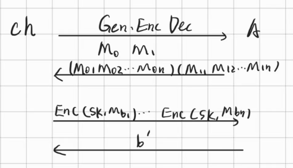
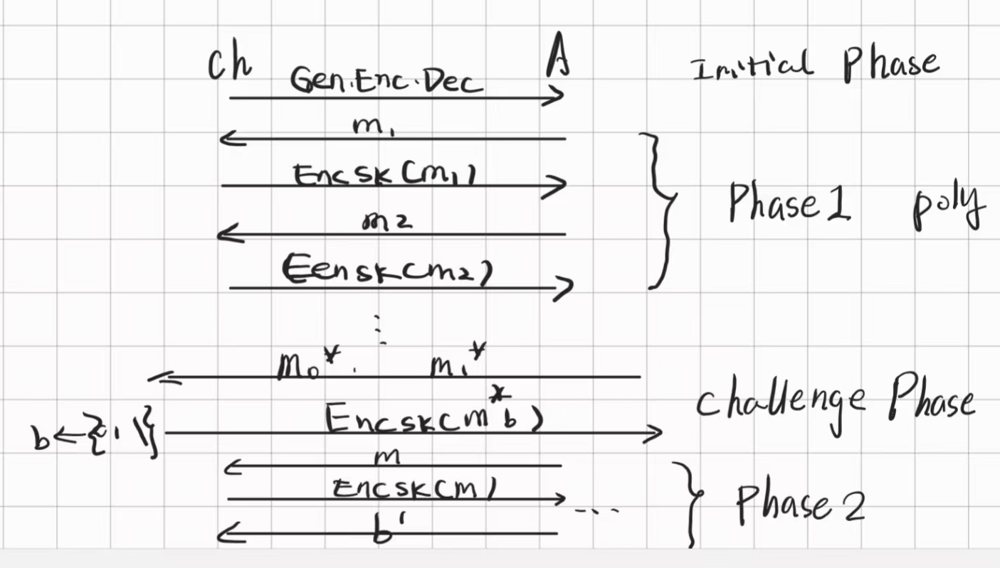
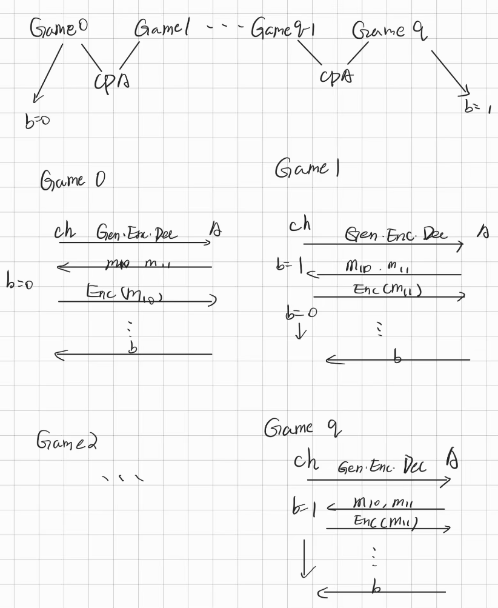

# 密码学基础 · 04：多消息安全与 IND-CPA（Multiple-Message Security & Chosen-Plaintext Attacks）

> 来源：用户提供的课程资料（一份速查表提纲 ＋ 一份按课次记录的课程笔记 Lec1–Lec13；详见 [`00_索引.md`](00_索引.md) §1）
> 整理日期：2026-09-21
> 说明：本文由 AI 依据上述资料整理；资料用箭头图（网页上为公式图）描述游戏流程，本笔记改写成步骤化叙述，**资料写得含糊的地方保留原文并标「待确认」**。
> 教材对照：Katz & Lindell（Revised 3rd ed.）**§3.4** Stronger Security Notions（§3.4.1 Security for Multiple Encryptions / §3.4.2 Chosen-Plaintext Attacks and CPA-Security / §3.4.3 CPA-Security for Multiple Encryptions）。

## 0. 本节速览

| 小节 | 主题 | 一句话摘要 |
|---|---|---|
| §1 | 动机 | 缩短密钥的流密码仍然只能“一次一密”：异或可逆性让对手能构造冲撞、拿额外信息。 |
| §2 | 多消息安全 | 进入“消息阵列”的游戏；资料给出一条随机化方案 $\mathrm{Enc}(sk,m,r)=(G(sk\Vert r)\oplus m,\ r)$。 |
| §3 | IND-CPA 的四个阶段 | 初始化 → Phase1（可反复问）→ Challenge（只此一次二择一）→ Phase2，最后猜 $b'$。 |
| §4 | IND-CPA 与多消息安全的关系 | CPA2 ⇒ 多消息安全；CPA2 ⇒ CPA 显然；CPA ⇒ CPA2 用 hybrid argument（“搭长桥”）。 |

---

## 1. 动机：为什么“一次一密”不够

- 资料指出：之前构造的**流密码**虽然把 $sk$ 缩短了，但**还是只能一次一密**——因为异或可逆，密钥流复用后对手可以**构造冲撞、获取额外信息**。
- 于是考虑下面这个游戏：挑战者把 **$\mathrm{Enc}(M_{b,*})$ 的一组密文**交给 $\mathcal{A}$，即**一次给一整列消息的加密结果**，最后由 $\mathcal{A}$ 猜 $b'$。

> 待确认：资料此处的游戏箭头图渲染错乱（原文只剩 `chA chA ch ... A` 这样的残片），上面的叙述是按上下文（“当我们提供来选择的消息为阵列时，情况有所不同”一句）整理出来的；严格的游戏定义（$\mathrm{PrivK}^{\mathrm{mult}}_{\mathcal{A},\Pi}(n)$）资料只提了名字，见教材 §3.4.1。

## 2. 一种多消息安全的方案

资料给出：

$$\mathrm{Enc}(sk,m,r)\ \to\ \bigl(G(sk\Vert r)\oplus M,\ r\bigr)\ \to\ (c_1,c_2);\qquad
\mathrm{Dec}(sk,c_1,c_2)\ \to\ G(sk\Vert c_2)\oplus c_1$$

要点：

- **随机化**（每次加密带一个新鲜随机量 $r$）：同一条消息两次加密得到不同结果，这正是多消息安全的关键。
- 资料的评价：“在这个意义上，我们**泄露了一部分 $sk'$**，达成了安全性”——即随机量 $r$ 被公开写在密文里，换来的是一消息一随机（“泄漏一点、换到安全”的取舍）。

> 待确认：资料把明文写成 $M$、密文写成 $(c_1,c_2)$，并把 $sk\Vert r$ 作为 PRG 的输入；但 $G$ 在 [03 篇](03_单向函数与伪随机生成器.md#61-动机魔改-otp-得到流密码) 中的口径（PRG 的输入是种子、输出是密钥流）需要用“**更新密钥流**”的思路来理解（教材 §3.6.1–§3.6.2 的 stream-cipher modes）。资料没有说明 $G$ 的扩展率，此处不补。

## 3. IND-CPA：选择明文攻击下的不可区分性

资料标题：**IND-CPA：*indistinguishabable* *chosen-plaintext-attacks***。游戏分四步：

| 阶段 | 谁做什么 | 资料写法 |
|---|---|---|
| **Initial Phase** | 挑战者 ch 把 $(\mathrm{Gen},\mathrm{Enc},\mathrm{Dec})$ 交给 $\mathcal{A}$ | $\mathrm{ch}\xrightarrow{\mathrm{Gen},\mathrm{Enc},\mathrm{Dec}}\mathcal{A}$ |
| **Phase 1** | 多轮：$\mathcal{A}$ 发 $m_i$，ch 回 $\mathrm{Enc}_{sk}(m_i)$ | $\mathrm{ch}\underset{\mathrm{Enc}_{sk}(m_i)}{\overset{m_i}{\leftrightarrow}}\mathcal{A}$ |
| **Challenge Phase** | **只有一次**、二择一：$\mathcal{A}$ 给 $m_1^{*},m_2^{*}$，ch 回 $\mathrm{Enc}_{sk}(m_b^{*})$ | $\mathrm{ch}\underset{\mathrm{Enc}_{sk}(m_b^{*})}{\overset{m_1^{*},m_2^{*}}{\leftrightarrow}}\mathcal{A}$ |
| **Phase 2** | 继续像 Phase 1 那样问 | $\mathrm{ch}\underset{\mathrm{Enc}_{sk}(m_i)}{\overset{m_i}{\leftrightarrow}}\mathcal{A}$ |
| 结束 | $\mathcal{A}$ 输出猜测 $b'$ | — |

> 资料在 Challenge 阶段特意加注：“**注意这种二择一的只有一次**”。

## 4. IND-CPA 与 Multi-Message Security 的关系

### 4.1 用到的是更强形式：CPA2

资料的推理链是：**本题里的 IND-CPA 范式实际上可以用更强形式表示，记作 CPA2**：

- **CPA2 ⇒ Multi-Msg Secure（显然）**：每次都可以问一对 $m_{i,0/1}$，然后得到 $\mathrm{Enc}(m_{i,b})$ 作为回答。
- 也就是说，这个 CPA 里所有问题都形如

$$\mathrm{ch}\underset{\mathrm{Enc}_{sk}(m_{i,b}^{*})}{\overset{m_{i,1}^{*},m_{i,2}^{*}}{\leftrightarrow}}\mathcal{A}$$

即**每一轮都是二择一**（而非“只有 Challenge 阶段才二择一”）。

### 4.2 三条归约

| 方向 | 资料结论 | 资料理由 |
|---|---|---|
| CPA2 → Multi-Msg Secure | 成立 | “显然”：每轮二择一即可模拟多消息加密 |
| CPA2 → CPA | 成立 | “直接将二择一的问变成确定问，这个 reduce 是显然的” |
| CPA → CPA2 | 成立 | 需要**构造一个 hybrid argument**：“1 个 power 怎么扩展” |

### 4.3 CPA → CPA2 的 hybrid 构造（“搭长桥”）

资料用“Game set”的感性描述：

- **Game 0**：分别问 $(m_{10},m_{11}),\ldots,(m_{i0},m_{i1})$，**全部**回答 $b_i=0$；
- **Game 1**：除了**第一个**，全部回答 $b_i=0$；
- **Game 2**：除了**前两个**，全部回答 $b_i=0$；
- ……

资料的总结：

> “一句话，你最后是**希望区分全 0 和全 1**”；上面 $\mathrm{Game}_i$ 与 $\mathrm{Game}_{i+1}$ 本质上就是**前缀的 1 多了一位**，能利用 CPA 来分界搭桥（**新引入的那一位就是 challenge phase**），最后就能搭一个长桥。

也就是说：相邻两个 hybrid 游戏只在**第 $i+1$ 轮**的“回答 0 还是回答 1”上不同，于是这一位的差别正好能塞进一次 CPA 的 challenge，从而用 CPA 的安全性把 $\mathrm{Game}_i$ 与 $\mathrm{Game}_{i+1}$ 的区分优势压到可忽略，再把 $i=0\ldots t-1$ 的若干段“桥”串起来。

> 待确认：资料把 hybrid 游戏的描述写成“Game1：除第一个全答 0；Game2：除前两个全答 0”，按字面读是**从“第 1 个开始逐步把答案翻成 1”**的过程，但资料同时说“最后是希望区分全 0 和全 1”。两种读法的编号方式（“除前 $i$ 个”还是“前 $i$ 个”）资料未写死，此处照录资料文字，编号以教材 §3.4.3 的 hybrid 为准。

### 4.4 多信息下的窃听不可区分实验

- 课程笔记点明动机：**流密码继承了 OTP 的所有缺点**（一次一密），而现实中一次通信会有很多条消息，所以要定义**多消息安全（multi-message security）**；这一模型下的攻击者**仍然是窃听者模型**。
- 实验描述（课程笔记原文）：

  1. 敌手 $\mathcal{A}$ **选择两组消息列表** $M_0$ 与 $M_1$；
  2. 实验随机选择一组（$M_0$ 或 $M_1$）加密，生成对应的**密文列表**；
  3. 敌手根据看到的密文列表猜测加密的是哪一组；
  4. 猜对（$b'=b$）则实验输出 1（敌手成功），否则输出 0。

### 4.5 CPA 实验的五步描述与 CPA2 的直觉

**（1）CPA 不可区分性实验 $\mathrm{PrivK}^{\mathrm{cpa}}_{\mathcal{A},\Pi}(n)$ 的五步**：

1. 运行 $\mathrm{Gen}(1^n)$ 生成密钥 $k$；
2. 敌手 $\mathcal{A}$ 得到 $1^n$ **以及加密预言机 $\mathrm{Enc}_k(\cdot)$ 的访问权**，输出一对**等长**消息 $m_0,m_1$；
3. 均匀随机取 $b\in\{0,1\}$，计算 $c\leftarrow\mathrm{Enc}_k(m_b)$ 并交给 $\mathcal{A}$；
4. $\mathcal{A}$ **继续**访问 $\mathrm{Enc}_k(\cdot)$，输出猜测 $b'$（课程笔记注明：**仅一次挑战机会**）；
5. $b'=b$ 则输出 1（称 $\mathcal{A}$ 成功），否则输出 0。

**（2）安全定义**：方案 $\Pi=(\mathrm{Gen},\mathrm{Enc},\mathrm{Dec})$ 是 CPA 安全的，如果对所有 PPT 敌手

$$\Pr\bigl[\mathrm{PrivK}^{\mathrm{cpa}}_{\mathcal{A},\Pi}(n)=1\bigr]\le\frac12+\mathrm{negl}(n)$$

课程笔记的解读：敌手的实际成功概率**不能显著高于 $1/2$**，超出部分必须不超过可忽略函数；随安全参数 $n$ 增大，优势**迅速衰减**。
并且课程笔记再次强调包含关系：**满足 CPA 安全一定满足 EAV 安全**（EAV 的敌手没有用到预言机）。

**（3）CPA2 的直觉（课程笔记用 LR 预言机解释）**：

| | 标准 CPA | CPA2（多加密 CPA） |
|---|---|---|
| 预言机 | 加密预言机：可以问任意明文的密文（如 `"hello"`、`"world"`、`"0"`） | 直接与 **LR 预言机**交互：每次问一对 $(m_0,m_1)$，拿回其中一个的密文 |
| 挑战次数 | **只有一次**真正的挑战（如 `("left","right")` → $c^*$） | **可以多轮**挑战（`("hello","world")`→$c_1$、`("foo","bar")`→$c_2$、`("left","right")`→$c_3$…） |
| 秘密比特 | 单次挑战用 $b$ | 所有轮共用**同一个密钥 $k$ 与同一个比特 $b$**（$b=0$ 一直给左、$b=1$ 一直给右） |

课程笔记的两步推理链：

- **CPA2 ⇒ Multi-Msg Secure**：CPA2 的敌手具有“**根据上次密文选择下一次明文**”的能力，即选择明文是 **Adaptive（自适应）** 的；而 Multi-Msg 的敌手**只能一次性发完所有明文**。能自适应显然更强 ⇒ 链条第一步成立。
- **CPA ⇒ CPA2**：直觉上，CPA 的 phase1/phase2 里“问单条消息、拿确定密文”可以用 CPA2 里“发**两条相同消息** $(m,m)$”等效（形式化地，能访问 LR 预言机的敌手可用 $LR_{k,b}(m,m)$ 模拟普通加密预言机）。但“一次挑战 → 无穷次挑战”仍是**由弱到强**的证明，于是再次用 **hybrid argument**：前 $i$ 个挑战用 $b=1$ 处理、其余用 $b=0$，相邻 Game 只差**一次 Challenge**（等价于一次 CPA），最终 $\mathrm{Game}_0$ 与 $\mathrm{Game}_q$ 分别对应“全 0”与“全 1”。

> 与 [§4.3](#43-cpa--cpa2-的-hybrid-构造搭长桥) 资料的“搭长桥”说法对照：资料用“Game $i$ / Game $i+1$ 前缀多一位 1”来描述，课程笔记用“前 $i$ 个挑战用 $b=1$、其余用 $b=0$”来描述——**两者是同一构造的两种说法**（资料此处“编号方向有歧义”的 [待确认](00_索引.md) 现在可以按课程笔记的口径读）。

## 5. 关键公式与记号汇总

| 记号/式 | 含义 | 出处 |
|---|---|---|
| $\mathrm{PrivK}^{\mathrm{mult}}_{\mathcal{A},\Pi}(n)$ | 多消息不可区分性游戏 | [§1](#1-动机为什么一次一密不够)（资料只给了名字） |
| $\mathrm{Enc}(sk,m,r)=(G(sk\Vert r)\oplus m,\ r)$ | 随机化加密（多消息安全的一种构造） | [§2](#2-一种多消息安全的方案) |
| $\mathrm{Enc}_{sk}(m_b^{*})$ | Challenge 阶段只此一次的二择一 | [§3](#3-ind-cpa选择明文攻击下的不可区分性) |
| CPA2 | “每轮都可二择一”的强形式 IND-CPA | [§4](#4-ind-cpa-与-multi-message-security-的关系) |

## 6. 听课重点与易混点

1. **“只能一次一密”这句话针对的是确定性的流密码**：密钥流一旦复用，异或可逆性立刻给出冲撞。
2. **随机化是手段**：多消息安全的方案都要让同一消息两次加密结果不同（这是与 [02 篇](02_完美保密与一次性密码本.md) OTP 的根本差别）。
3. **IND-CPA 与 CPA2 的差别在“挑战发生几次”**：IND-CPA 只有一次挑战；CPA2 每轮都挑战。二者等价（由 hybrid），但证明时用 CPA2 更方便。
4. **两处“显然”要能自己补出来**（CPA2⇒Multi-Msg、CPA2⇒CPA），这正是考试里最常被要求写的方向性归约。
5. **hybrid 的“搭桥”方向**：相邻游戏只差一位，这一位塞进一次 challenge。

## 7. 复习清单

- [ ] 解释“流密码只能一次一密”的原因，并说明为什么异或可逆性是罪魁祸首。（[§1](#1-动机为什么一次一密不够)）
- [ ] 写出资料的多消息安全方案，并指出哪个量是随机化用的。（[§2](#2-一种多消息安全的方案)）
- [ ] 按四阶段默写 IND-CPA 游戏，并指出哪一阶段只允许一次。（[§3](#3-ind-cpa选择明文攻击下的不可区分性)）
- [ ] 什么是 CPA2？为什么说“CPA2 ⇒ Multi-Msg Secure 显然”？（[§4.1](#41-用到的是更强形式cpa2)）
- [ ] 用 hybrid argument 说明 CPA ⇒ CPA2，并讲清“新引入的那一位是 challenge phase”是什么意思。（[§4.3](#43-cpa--cpa2-的-hybrid-构造搭长桥)）

## 8. 关联知识点

- 为什么要“随机化”才能在多消息下安全（OTP / 完美保密的对照）——见 [`02_完美保密与一次性密码本.md`](02_完美保密与一次性密码本.md#5-一次性密码本one-time-pad-otp)。
- PRG 与语义安全（EAV）是本节安全定义的“零轮询问版”——见 [`03_单向函数与伪随机生成器.md`](03_单向函数与伪随机生成器.md#5-语义安全--eav-secure)。
- 由 PRF 构造 IND-CPA 安全方案（把 Challenge 的“随机数”换成 PRF 的密钥）——见 [`05_伪随机函数与伪随机置换.md`](05_伪随机函数与伪随机置换.md#3-ind-cpa--prfs用伪随机函数构造-cpa-安全方案)。
- 更强的攻击模型 CCA（含解密询问）——资料「第二次作业：CCA-PRP」只留了标题，见 [`00_索引.md`](00_索引.md) 的待确认事项；教材 §5.1–§5.2。
- 教材：§3.4 全节（多消息安全、CPA、CPA 的多消息版本与其等价性）。

## 9. 来源与延伸阅读

- 来源：用户提供的课程资料（速查表提纲 ＋ 课程笔记 Lec1–Lec13）；清单见 `密码学基础/readme.md`。原始资料（`数据安全与密码学基础.zip` 及其中的附件）均为**只读引用**，未改动。
- 参考书：Katz & Lindell, *Introduction to Modern Cryptography*（Revised 3rd ed.）**§3.4** Stronger Security Notions（§3.4.1–§3.4.3）。
- 待补充：Lec5 / Lec6 的对应段落偏草稿（游戏图有缺笔、hybrid 的编号方向未写死），本笔记已就地标注，详见 [`00_索引.md`](00_索引.md) §6。
