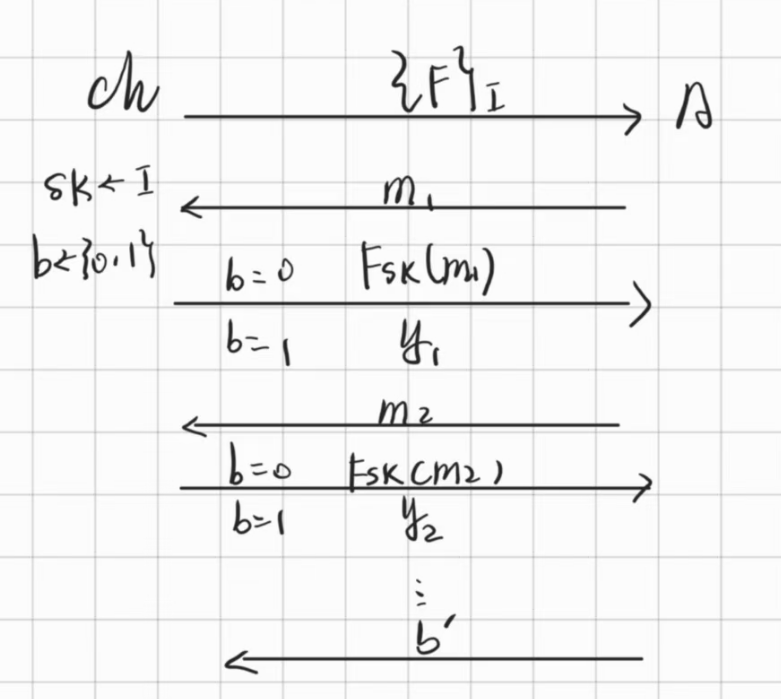
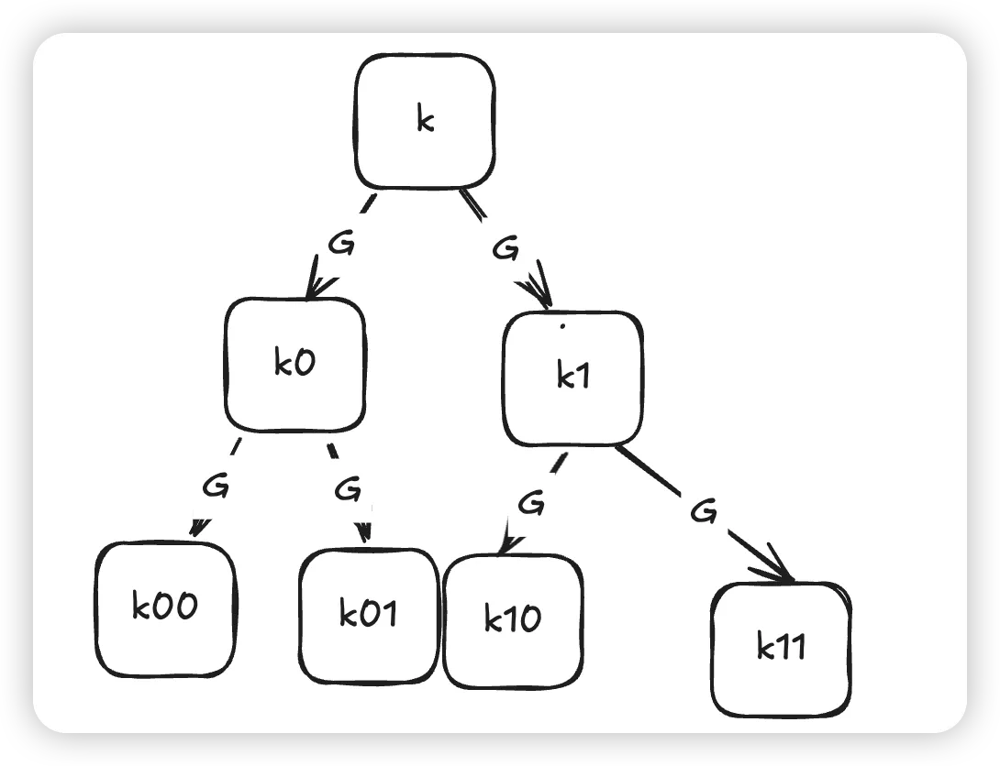
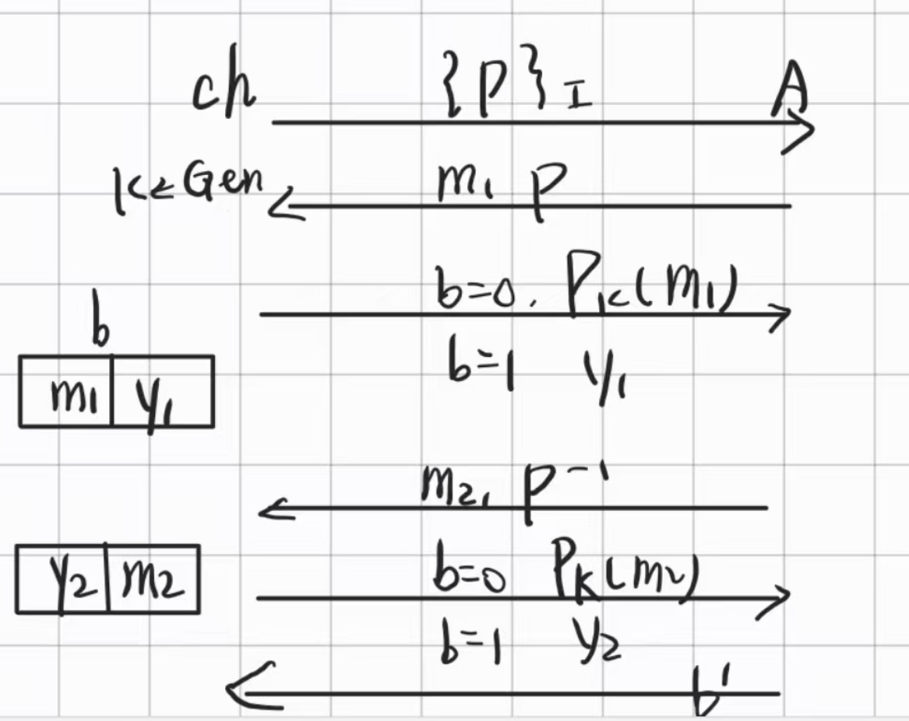
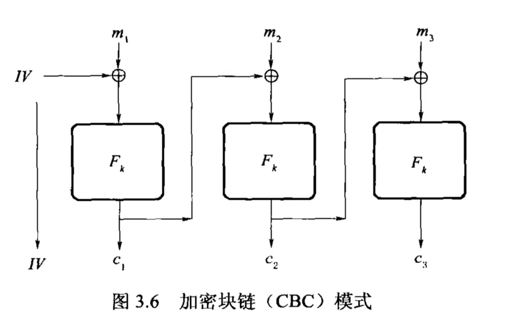

# 密码学基础 · 05：伪随机函数与伪随机置换（PRFs, PRPs & Modes of Operation）

> 来源：用户提供的课程资料（一份速查表提纲 ＋ 一份按课次记录的课程笔记 Lec1–Lec13；详见 [`00_索引.md`](00_索引.md) §1）
> 整理日期：2026-09-21
> 说明：本文由 AI 依据上述资料整理；资料的四个子小节标题是“$\Rightarrow$ 方向”的简写（`A 2 B` 读作 “A ⇒ B”），本笔记按方向重排为小节标题。
> 教材对照：Katz & Lindell（Revised 3rd ed.）**§3.5** Constructing a CPA-Secure Encryption Scheme（§3.5.1 Pseudorandom Functions and Permutations / §3.5.2 CPA-Security from a Pseudorandom Function）、**§3.6** Modes of Operation and Encryption in Practice（§3.6.1–§3.6.3）、**§8.5** Constructing Pseudorandom Functions、**§8.6** Constructing (Strong) Pseudorandom Permutations。

## 0. 本节速览

| 小节 | 主题 | 一句话摘要 |
|---|---|---|
| §1 | 为什么要 PRF | 真随机函数太多（$\lvert\mathcal{F}\rvert=(2^n)^{2^n}$），随机取样代价太大 ⇒ 用**密钥索引**的函数族冒充。 |
| §2 | PRFs 的定义 | 游戏：$\mathcal{A}$ 反复询问，$ch$ 或答 $F_{sk}(m_i)$、或答随机 $y_i$；$\mathbb{P}[b=b']=\frac12+\mathrm{negl}(n)$。 |
| §3 | IND-CPA ⇒ PRFs | 由 PRF 直接给出加密方案 $\mathrm{Enc}(sk,m,r)=(r,F_{sk}(r)\oplus m)$，即 CPA 安全。 |
| §4 | PRFs ⇒ IND-CPA | 归约流程：把 $ch$ 给的真/伪函数族当作黑盒，用 $\mathcal{A}$ 的一次 challenge 去区分它。 |
| §5 | PRG ⇒ PRFs | GGM 树 + hybrid argument；资料指出“跨 $2^{n-1}$ 那一层”不能用 hybrid，只需处理 $\mathcal{A}$ 实际问的 $O(q)$ 个点。 |
| §6 | PRFs ⇒ PRG | “显然的，一位一位即可”。 |
| §7 | PRPs 的定义 | 置换族（可逆）；游戏里 $\mathcal{A}$ 既可问 $P$ 也可问 $P^{-1}$，正反两个方向都要不可区分。 |
| §8 | 模式（modes） | 由 $(r,F_{sk}(r)\oplus m)$ 链式化得到 CBC 式构造；一般化需要 PRP：$\mathrm{CBC}/\mathrm{OFB}/\mathrm{CTR}$。 |

---

## 1. 为什么要 PRF：真随机函数太贵

- 记 $\mathcal{F}=F\bigl(\{0,1\}^{n},\{0,1\}^{n}\bigr)$（把 $n$ 位映到 $n$ 位的**所有**函数），则

$$|\mathcal{F}|=(2^{n})^{2^{n}}$$

- 资料的动机说明：**我们希望能随便选取一个 $F_I$**（从所有函数里均匀挑一个），**但显然这个随机生成的代价太大**（要描述一个真随机函数需要指数级的“表”），于是引入 **PRFs**：用**短密钥 $sk$ 索引一个函数 $F_{sk}$**，让它在 PPT 眼里“像”随机函数。

## 2. PRFs 的定义

> $\mathcal{F}_{I}$ 为一个被 $I$ 索引的映射集合（资料称为“题库”），它是伪随机的，当且仅当下面的游戏成立：

- $ch$ 首先把整个函数族 $\mathcal{F}_{I}$ 给 $\mathcal{A}$；
- 然后 $ch$ 自己在 $I$ 里选一个 $sk$，并把 $b$ 随便定下来（$b$ 决定“给真函数还是给随机函数”）；
- 然后 $\mathcal{A}$ 反复问 $m_i$，$ch$ 根据 $b$ 反复回答 $\boxed{F_{sk}(m_i)}$ 或 $\boxed{y_i}$（$y_i$ 为随机值）；
- 最后 $\mathcal{A}$ 输出 $b'$，要求

$$\mathbb{P}[b=b']=\frac12+\mathtt{negl}(n)$$

**更形式化地写**：

$$\Bigl|\ \mathbb{P}\,[\,\mathcal{D}(F_{sk}(1^{n})=1)\,]-\mathbb{P}\,[\,\mathcal{D}(f(1^{n})=1)\,]\ \Bigr|\ \le\ \mathtt{negl}(n)$$

其中 $f$ 表示真随机函数。

> 待确认：资料把区分者写成 $\mathcal{D}$（函数族游戏的对手），而在 [03 篇](03_单向函数与伪随机生成器.md#62-标准定义) 的 PRG 定义里用的是 $\mathcal{A}$，资料自己也提过“懒得区分 $\mathcal{D}$ 和 $\mathcal{A}$”。此处照录。
> 待确认：资料说“$ch$ 在 $I$ 里选一个 $sk$”，而游戏里 $ch$ 应当是在“$F_{sk}$ 与真随机函数 $f$”之间二选一（$b$ 指出是哪一种）；另外 $\mathcal{A}$ 能否在询问间重复提问、$y_i$ 是否要求与同一 $m$ 保持一致（一致性）等细节资料都未写，需按教材 §3.5.1 的定义补。

### 2.1 为什么不能“随机抽一个函数”：函数族有多大

- 定义函数族 $\mathrm{Func}_n=\{\,F_1(),F_2(),\dots,F_t()\,\}$，每个 $F_i()$ 是 $\{0,1\}^n\to\{0,1\}^n$ 的映射。
- 最“朴素”的加密想法：加密时**从函数族里均匀随机抽一个函数**。但把函数**想成一张表**：定义域大小 $2^n$ ⇒ 表有 $2^n$ 行、每行 $n$ 位 ⇒ 一个函数就是一个 $n\cdot 2^n$ 位的串。于是

$$\mathrm{size}\bigl(\mathrm{Func}_n(\cdot)\bigr)=t=2^{\,n\cdot 2^{n}},\qquad \mathrm{size}(sk)=\log t=n\cdot 2^{n}$$

- 这个 size 是**指数级**的，**不“有效”**，所以随机均匀选取不现实 ⇒ 必须用**伪随机**重新定义 PRF。
- 课程笔记对 PRF 目标的表述：**没有多项式时间的敌手能够区分 $F_{sk}()$ 与 $f$**——其中前者的 $sk$ 从 $\{0,1\}^n$ 中随机均匀选取，后者的 $f$ 从函数族中随机均匀选取。

> 这与 [§1 资料的口径](#1-为什么要-prf真随机函数太贵)（资料写 $|\mathcal{F}|=(2^n)^{2^n}$）**是同一个量的两种写法**：$2^{n\cdot2^n}=(2^n)^{2^n}$，两者等价。
> 待确认：课程笔记这段游戏描述里“$b=0$ 从 $\{F_1,\dots,F_I\}$ 中选（$size=I$）；$b=1$ 从函数族 $G_{sk}(\cdot)$ 中选（$size=n\cdot2^n$）”的**编号与 $b$ 的方向和资料相反**（资料：$b$ 决定给“真函数”还是“伪随机函数”），此处按课程笔记原文照录，方向以教材 §3.5.1 为准。

### 2.2 PRF 与 PRG 的对照

| | PRF | PRG |
|---|---|---|
| 密钥 | **有**密钥 $sk$ | **没有**密钥 $sk$ |
| 需要保密的东西 | 密钥 $sk$ | 种子 seed |
| 长度关系 | **等长**（输入输出同长） | **必须有扩张**（输出比输入长） |
| 敌手拿到的能力 | **只能拿到预言机的访问权** | **可以拿到 function code** |

## 3. IND-CPA ⇒ PRFs：用伪随机函数构造 CPA 安全方案

资料（小标题 “IND-CPA 2 PRFs”）给出构造：

$$\mathrm{Gen}(1^{n})\to sk,\ \{\mathcal{F}\}_{I};\qquad
\mathrm{Enc}(sk,m,r)=\bigl(r,\ F_{sk}(r)\oplus m\bigr);\qquad
\mathrm{Dec}(sk,c_1,c_2)=c_{2}\oplus F_{sk}(r)$$

读法：**用随机数 $r$ 当“随机化的一次性密钥索引”**——每次加密换一个 $r$，于是 $F_{sk}(r)$ 每次都是“新的一次性密钥”，这就把 [04 篇](04_多消息安全与IND-CPA.md#2-一种多消息安全的方案) 里“泄露 $r$、换取一消息一密钥”的方案落到了 PRF 上。

> 待确认：解密式资料写作 $c_2\oplus F_{sk}(r)$，但解密方并不知道 $r$（$r$ 在密文里是 $c_1$），按构造应是 $c_2\oplus F_{sk}(c_1)$，资料此处疑为笔误。

## 4. PRFs ⇒ IND-CPA：归约怎么搭

资料（小标题 “PRFs 2 IND-CPA”）把归约的**交互流程**写下来了：

1. $ch$ 给归约 $R$ 一个函数族 $\mathcal{F}_{I}$，$R$ 自己生成 $sk$；
2. $R$ 按 §3 的定义生成 $(\mathrm{Gen},\mathrm{Enc},\mathrm{Dec})$ 交给 $\mathcal{A}$；
3. $\mathcal{A}$ 丢回来 $m_1$，$R$ 顺带挑一个 $r_1$ 去问 $ch$，$ch$ 回答 $str_1$；
4. $R$ 把 $(r_1,\ str_1\oplus m_1)$ 交给 $\mathcal{A}$；
5. ……（对 Phase 1 / Phase 2 的每一次询问都照此转发）
6. 直到 $\mathcal{A}$ 发出**一次** challenge：给 $m_0^{*},m_1^{*}$，那么 $R$ 就返回一个 $\mathrm{Enc}(m_d^{*})$；
7. $\mathcal{A}$ 的猜测正确与否，对应 $b'=0/1$，$R$ 再把它回给 $ch$ 的 $b$ 作对照。

要点：**$R$ 的任务不是攻破加密方案，而是把 $\mathcal{A}$ 变成 PRF 的区分器**——$ch$ 回答的是“真随机函数值 / $F_{sk}$ 的函数值”，$R$ 把这份差异原封不动地包装成密文交给 $\mathcal{A}$，$\mathcal{A}$ 若能区分明文，$R$ 就能区分函数。

## 5. PRG ⇒ PRFs：GGM 树与 hybrid argument

资料（小标题 “PRG 2 PRFs”）：“**还是 hybrid argument**”，并给出两张说明：

- “相当于你需要从 $[0,2^{n})$ 全 0 → $[0,2^{n})$ 全 1”；
- 游戏序列：$\mathrm{Game}_0$ 用 $G$；$\mathrm{Game}_1$ “层 1 反”；$\mathrm{Game}_1$ “层 1,2 反”；……

资料自己指出的一处**技术问题**：

> “这里一个问题是 $\mathrm{Game}_{n-1}$ 这个间隔有 $2^{n-1}$（个点/条路径），**是不能用 hybrid argument**；显然我们是求解具体一个 $O(q)$ 的发问，因此**完善这部分即可**。”

也就是说：完整版（真正的随机函数）与“逐层替换 GGM 树”的中间游戏之间，在**整个树**上差了指数多的不一致点；但因为 $\mathcal{A}$ 只会问 $O(q)$ 个点（$q=\mathrm{poly}$），只需**针对被问到的那 $O(q)$ 条路径**做混合论证，就能把差距压回多项式级别。

> 待确认：资料的 “层 1 反 / 层 1,2 反” 与 “[0,2^n) 全 0 → 全 1” 两种说法都是**示意性**的（前者指 GGM 树的层、后者指函数取值表），未给出严格的 hybrid 序列。教材 §8.5（Constructing Pseudorandom Functions）是这部分的正规出处。

## 6. PRFs ⇒ PRG：显然的那一步

资料（小标题 “PRFs 2 PRG”）一句话：「**这个是显然的，一位一位即可**」。

- 资料只给了这一句结论，没有展开“取哪一位、输入怎么定”。
- 整理者按语（仅为理解方向，非资料结论）：既然 $F_{sk}$ 的输出在 PPT 眼里像“随机函数”，那么**从中取出一部分比特**就可以当作 PRG 来用——具体取法与输入约定（固定输入？逐位取？）请以教材 §8.5 的构造为准。

## 7. PRPs：伪随机置换（Pseudorandom Permutation）

> $\mathcal{P}_{I}$ 为一个被 $I$ 索引的映射集合（资料同样称为“题库”），它是伪随机的，当且仅当下面的游戏成立：

- $ch$ 首先把整个置换族 $\mathcal{P}_{I}$ 给 $\mathcal{A}$；
- 然后 $ch$ 自己在 $I$ 里选一个 $sk$，并把 $b$ 随便定下来；
- 然后 $\mathcal{A}$ 反复问 $(\text{正向},\ \mathcal{P})$ 或 $(\text{反向},\ \mathcal{P}^{-1})$（资料写作 $(m_0,\mathcal{P})$ 或 $(m_1,\mathcal{P}^{-1})$）；
- 最后 $\mathbb{P}[b=b']=\frac12+\mathtt{negl}(n)$。

**形式化定义**（资料，注意**正反两个方向分别都要**不可区分）：

$$\Bigl|\ \mathbb{P}\,[\,\mathcal{D}(P_{sk}(1^{n})=1)\,]-\mathbb{P}\,[\,\mathcal{D}(\pi(1^{n})=1)\,]\ \Bigr|\le\mathtt{negl}(n)$$
$$\Bigl|\ \mathbb{P}\,[\,\mathcal{D}(P^{-1}_{sk}(1^{n})=1)\,]-\mathbb{P}\,[\,\mathcal{D}(\pi^{-1}(1^{n})=1)\,]\ \Bigr|\le\mathtt{negl}(n)$$

其中 $\pi$ 表示真随机置换。

- 与 PRF 的区别：**PRP 一定是可逆的**（置换），因此对手可以利用**逆函数** $P_{sk}^{-1}$ 来询问——安全性定义必须把这条通道堵上。
- 分块密码（block cipher）就是 PRP 的标准实例（教材 §7.2、§8.6）。

> 待确认：资料写“然后 $\mathcal{A}$ 反复问 $(m_0,\mathcal{P})$ 或者 $(m_1,\mathcal{P}^{-1})$，然后**A 这边**根据问题回答”——按上下文回答者应为 $ch$，疑为笔误。

### 7.1 PRP 的计数与形式化游戏

**（1）为什么要 PRP**：要加密**任意长度**的消息，可以用 CPA 安全方案**逐比特**加密：

$$m=m_1\Vert m_2\Vert\cdots\Vert m_l,\qquad c=\mathrm{Enc}(m_1)\Vert\mathrm{Enc}(m_2)\Vert\cdots\Vert\mathrm{Enc}(m_l)$$

这**符合 IND-CPA**，但**非常低效**（密文被撑得极长、冗余信息过多）。理想情况是**密文长度 = 明文长度**；课程笔记说这个理想条件苛刻，于是**放松为“密文比明文多一个常数”**——这正是 PRP 能做到的事。

**（2）PRP 是什么**：对 $\{0,1\}^n$ 而言，一个**置换**是从该空间到自身的**一一对应**映射（每个输入唯一对应一个输出、每个输出有唯一输入 ⇒ **存在逆函数**）。记作 $\mathrm{Perm}_n$：它是 $\mathrm{Func}_n$ 的**子集**，且

$$\mathrm{size}(\mathrm{Perm}_n(\cdot))=(2^n)!$$

> 课程笔记的补充：$n!\approx\dfrac{n^{n}}{e^{n}}$ 是 **super-exp 级别**，远大于 $2^n$；为什么是阶乘？因为空间 $\{0,1\}^n$ 有 $2^n$ 个元素，一个置换就是对它们的重新排列。

**（3）形式化游戏**（课程笔记的四步）：

1. **初始化**：$\mathcal{P}_I$ 是被索引集合 $I$ 参数化的置换族；挑战者选 $sk\leftarrow I$ 与 $b\leftarrow\{0,1\}$，$b$ 决定 oracle 是 $(\mathcal{P}_{sk},\mathcal{P}_{sk}^{-1})$ 还是随机置换 $(\pi,\pi^{-1})$。
2. **查询阶段**：$\mathcal{A}$ 可**自适应**地多次查询——**前向查询（加密）** 提交 $m$ 要 $\mathcal{P}(m)$；**后向查询（解密）** 提交 $c$ 要 $\mathcal{P}^{-1}(c)$。
3. **猜测阶段**：$\mathcal{A}$ 输出 $b'$（认为用的是伪随机置换还是随机置换）。
4. **胜利条件**：

$$\Bigl|\Pr[b'=b]-\frac12\Bigr|\le\mathrm{negl}(n)$$

## 8. 从 $(r,F_{sk}(r)\oplus m)$ 到链式模式（Cipher-Block-Chaining 等）

资料先回顾 §3 的单块构造：

$$\mathrm{Enc}(m,sk,r)=(r,\ F_{sk}\oplus m)$$

- 动机：**我们希望节省 $sk$（以及每个随机量）生成的开销**，于是有了“**循环利用**”的想法：

$$\mathrm{Enc}(sk,\,m_1\Vert m_2\Vert\cdots\Vert m_t,\,r)=\bigl(r,\ F_{sk}(r)\oplus m_1,\ F_{sk}(c_1)\oplus m_2,\ \ldots,\ F_{sk}(c_{t-1})\oplus m_t\bigr)$$

- 资料随即指出问题：这里的 $F$ **用到了异或可逆的性质**，因此**更一般的做法需要 PRPs**，实现

$$(r,\ P_{k}(m,r))\ \leftrightarrow\ m$$

- 资料列出的模式名称：**CBC、OFB、CTR**（资料只列名字，未展开各自定义）。

> 待确认：资料在本小节里的 $F_{sk}(r)\oplus m_1$、$F_{sk}(c_1)\oplus m_2$ 是 **CBC 的示意写法**（用前一块密文当下一块的“索引”），但严格说 CBC 是 $c_i=F_{sk}(c_{i-1}\oplus m_i)$ 这类分组密码模式（教材 §3.6.3）；而 $F_{sk}(\cdot)\oplus m$ 这种“密钥流”写法更接近流密码模式（教材 §3.6.2）。资料把两者混在一处，**具体定义请以教材 §3.6.2/§3.6.3 为准**。

### 8.1 CBC 模式的公式

课程笔记在这里给出了资料只列名字的 **CBC** 的具体定义：

| 项 | 公式课程笔记 |
|---|---|
| 加密 | $C_i=E_k(P_i\oplus C_{i-1})$，其中 $C_0=IV$ |
| 解密 | $P_i=D_k(C_i)\oplus C_{i-1}$ |
| 安全性 | 在**选择明文攻击（IND-CPA）下安全，但需要随机 IV** |

> 这与资料的说法是一致的（资料说“**更一般的做法需要 PRPs**”，也就是这里的分组密码 $E_k$）：
> $\mathrm{Enc}(sk,m,r)=(r,F_{sk}(r)\oplus m)$ 那种“**密钥流**”写法属于流密码模式（教材 §3.6.2），
> 而 $C_i=E_k(P_i\oplus C_{i-1})$ 这种“**分组链接**”写法是分组密码模式（教材 §3.6.3）——[§8](#8-从-rf_skroplus-m-到链式模式cipher-block-chaining-等) 已标注过资料把两者混在一处。
> 课程笔记只给了 CBC；**OFB / CTR 仍未展开**（资料也只列了名字）→ 待补。

### 8.2 分组密码与加密操作模式

- **Block Cipher（分组密码）**是 **PRP 的别称**；课程笔记补一句：**Block Cipher 也可以用来构造 Stream Cipher**。
- **加密操作模式**：用**分组密码（PRP）加密任意长度消息**的基本方法，常见四种——**ECB（电子密码本）、CBC（密码分组链接）、OFB（输出反馈）、CTR（计数器）**；课程笔记本节只展开 **CBC**。
- 为什么需要模式：上讲的

$$\mathrm{Enc}(m,sk;r):=r,\ F_{sk}(r)\oplus m$$

（注意：每加密一次都要**重新生成纯随机数 $r$**）会把密文长度扩大到**两倍**（$L\to 2L$）；CBC 的目标是**减少 $r$ 的数量**，让“密文/明文长度比”在摊还意义下**只差一个常数**。

- CBC 的做法（课程笔记原文）：“**把上一组的密文和这一组的明文异或后整体作为输入，输入到伪随机置换中**”，即

$$C_i=E_k\bigl(P_i\oplus C_{i-1}\bigr),\qquad C_0=IV$$

课程笔记给出的性质与缺点：

- **性质**：可以证明，如果 $F$（分组密码）是**伪随机置换**，则 CBC 加密模式是 **CPA 安全**的；
- **缺点**：它是**线性（链式）**的——“要加密明文分组 $m_i$ 依赖于密文分组 $c_{i-1}$，所以**每组的加密必须从头来过**”（不能并行）。

> 待确认：课程笔记在此处把两个式子混写了——$C_i=E_k(P_i\oplus C_{i-1})$（CBC 模式）与 $\mathrm{Enc}(m,sk;r)=r,P_k(m\oplus r)$（随机化的 PRF/PRP 加密）**并不是同一个东西**；[§8.1](#81-cbc-模式的公式) 已按期末考要点的公式整理了 CBC，这里保留课程笔记原文供对照。

## 9. 关键公式与记号汇总

| 名称 | 式 | 出处 |
|---|---|---|
| 真随机函数总数 | $\lvert\mathcal{F}\rvert=(2^{n})^{2^{n}}$ | [§1](#1-为什么要-prf真随机函数太贵) |
| PRF 游戏 | $\mathbb{P}[b=b']=\frac12+\mathtt{negl}(n)$；$\bigl|\mathbb{P}[\mathcal{D}(F_{sk}(1^n)=1)]-\mathbb{P}[\mathcal{D}(f(1^n)=1)]\bigr|\le\mathtt{negl}(n)$ | [§2](#2-prfs-的定义) |
| 由 PRF 加密 | $\mathrm{Enc}(sk,m,r)=(r,F_{sk}(r)\oplus m)$ | [§3](#3-ind-cpa--prfs用伪随机函数构造-cpa-安全方案) |
| PRP 定义 | 正向、逆向两条不等式同时成立 | [§7](#7-prps伪随机置换pseudorandom-permutation) |
| 链式加密 | $(r,F_{sk}(r)\oplus m_1,F_{sk}(c_1)\oplus m_2,\ldots)$ | [§8](#8-从-rf_skroplus-m-到链式模式cipher-block-chaining-等) |

## 10. 听课重点与易混点

1. **PRG / PRF / PRP 是三种“伪随机物”**：PRG 把短种子拉长、PRF 是“像随机函数”、PRP 是“像随机置换（可逆）”。本节把三者的推导方向（谁能构造谁）串成一张网。
2. **“一次一个随机 $r$”是本节的核心技巧**：$r$ 保证同一明文两次加密不同，$F_{sk}(r)$ 提供“一次性密钥”。
3. **PRP 的定义必须包含逆方向**——只挡住正向询问是不够的（对手可以直接问 $P^{-1}$）。
4. **归约的“角色分工”**要记牢：$ch$ 提供“难题的实例”（真/伪函数族），$R$ 把它包装成方案给 $\mathcal{A}$；$\mathcal{A}$ 的输出反过来解难题。
5. **GGM 树那一处的技术细节**（资料点出的 $2^{n-1}$ 间隔问题）是本节课里最容易被忽略的“证明不完整”之处：hybrid 只需覆盖 $\mathcal{A}$ 实际询问的 $O(q)$ 个点。
6. **模式（CBC/OFB/CTR）资料只列名**，考试若考定义，须自备（教材 §3.6）。

## 11. 复习清单

- [ ] 为什么不能直接随机取一个函数当密钥？$\lvert\mathcal{F}\rvert$ 是多少？（[§1](#1-为什么要-prf真随机函数太贵)）
- [ ] 默写 PRF 游戏与形式化定义，并解释 $b$ 控制什么。（[§2](#2-prfs-的定义)）
- [ ] 写出由 PRF 构造的加密方案，并说明 $r$ 的作用。（[§3](#3-ind-cpa--prfs用伪随机函数构造-cpa-安全方案)）
- [ ] 按“$ch$ → $R$ → $\mathcal{A}$”的顺序复述 PRF ⇒ IND-CPA 的归约。（[§4](#4-prfs--ind-cpa归约怎么搭)）
- [ ] GGM 树是怎么用 PRG 造出 PRF 的？为什么说“$2^{n-1}$ 那一步不能用 hybrid”？（[§5](#5-prg--prfsggm-树与-hybrid-argument)）
- [ ] PRP 与 PRF 的定义差在哪里？为什么 PRP 要管逆方向？（[§7](#7-prps伪随机置换pseudorandom-permutation)）
- [ ] 说明“循环利用”想法怎么把单块方案变成链式方案，并指出为什么更一般的构造需要 PRP。（[§8](#8-从-rf_skroplus-m-到链式模式cipher-block-chaining-等)）

- [ ] 默写 CBC 的加密/解密公式与 IV 的位置，并说明为什么“需要随机 IV”才能达到 IND-CPA 安全。（[§8.1](#81-cbc-模式的公式)）

## 12. 关联知识点

- 随机化加密的动机与 IND-CPA 游戏——见 [`04_多消息安全与IND-CPA.md`](04_多消息安全与IND-CPA.md#3-ind-cpa选择明文攻击下的不可区分性)。
- PRG、hybrid argument 与归约图——见 [`03_单向函数与伪随机生成器.md`](03_单向函数与伪随机生成器.md#64-prg-链与-hybrid-argument)。
- 由 MAC 提供完整性、避免“可延展性”——见 [`06_消息认证码MAC.md`](06_消息认证码MAC.md)。
- CCA 安全与认证加密（资料只留标题的“第二次作业：CCA-PRP”）——教材 §5.1–§5.3。
- 教材：§3.5（PRF/PRP 与 CPA 安全）、§3.6（工作模式）、§8.5–§8.6（由 OWF/PRG 构造 PRF/PRP）。

## 13. 来源与延伸阅读

- 来源：用户提供的课程资料（速查表提纲 ＋ 课程笔记 Lec1–Lec13）；清单见 `密码学基础/readme.md`。原始资料（`数据安全与密码学基础.zip` 及其中的附件）均为**只读引用**，未改动。
- 参考书：Katz & Lindell, *Introduction to Modern Cryptography*（Revised 3rd ed.）**§3.5**、**§3.6**、**§8.5**、**§8.6**。
- 图片：`assets/fig_ggm_tree.png`（原页上的手绘示意图）。
- 仍待补：**OFB / CTR** 在资料里只有名字与要点，没有展开（本笔记不补写）。
