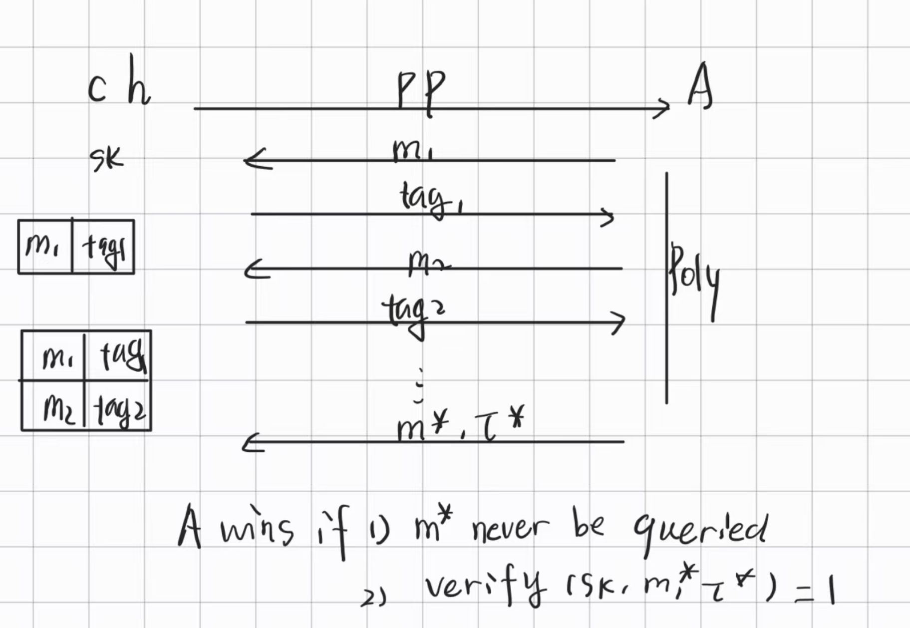
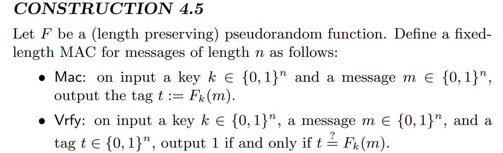
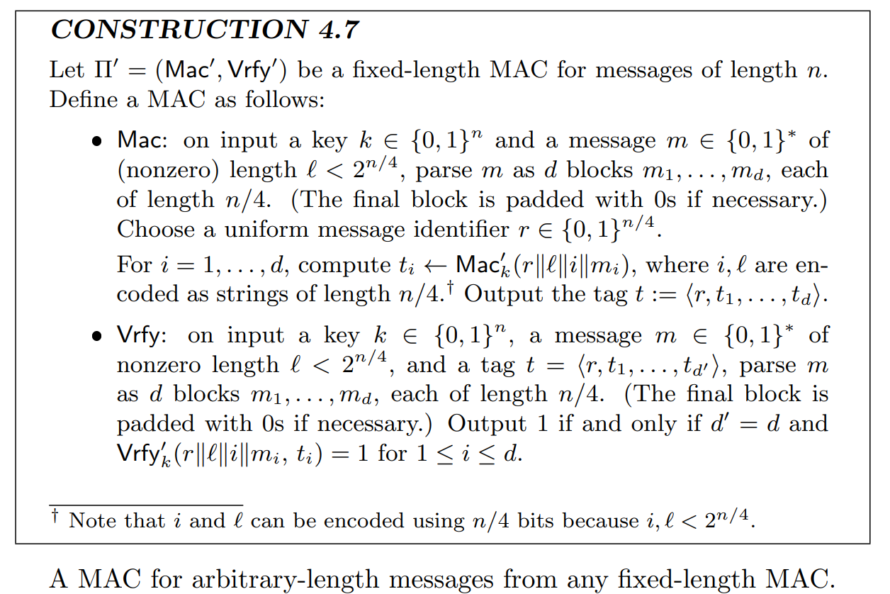
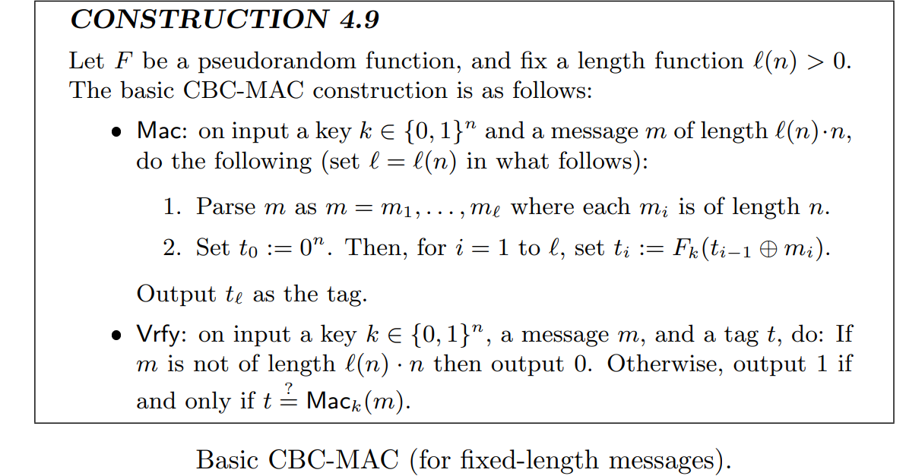
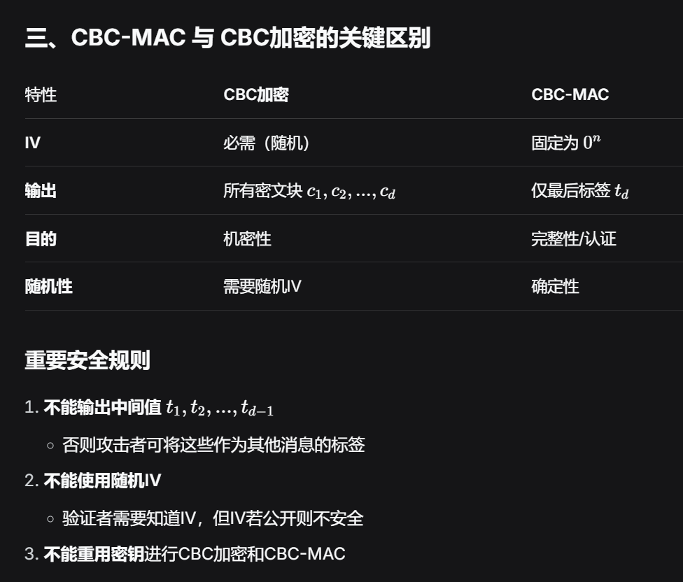
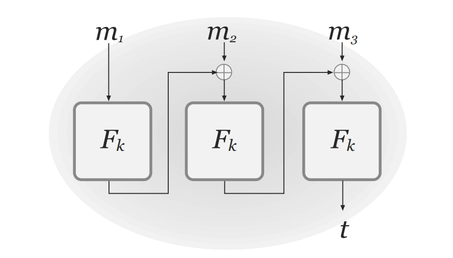
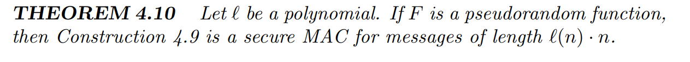
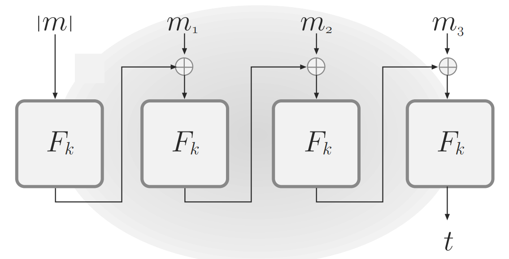
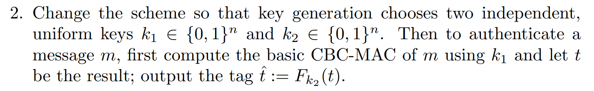

# 密码学基础 · 06：消息认证码与不可伪造性（MAC & Unforgeability）

> 来源：用户提供的课程资料（一份速查表提纲 ＋ 一份按课次记录的课程笔记 Lec1–Lec13；详见 [`00_索引.md`](00_索引.md) §1）
> 整理日期：2026-09-21
> 说明：本文由 AI 依据上述资料整理；资料这一节较短（只给定义骨架 + 游戏骨架），**凡资料未展开的内容本笔记不补**，只标注对应教材章节。
> 教材对照：Katz & Lindell（Revised 3rd ed.）**§4.1** Message Integrity（§4.1.1 Secure vs. Integrity / §4.1.2 Encryption vs. Message Authentication）、**§4.2** Message Authentication Codes (MACs) – Definitions、**§4.3** Constructing Secure MACs（§4.3.1 A Fixed-Length MAC / §4.3.2 Domain Extension for MACs）、**§4.4** CBC-MAC、**§4.5** GMAC and Poly1305、**§4.6** \*Information-Theoretic MACs。

## 0. 本节速览

| 小节 | 主题 | 一句话摘要 |
|---|---|---|
| §1 | 关注点转向 | 不动机密性，转而关注**可信性/完整性**：消息有没有被改。 |
| §2 | MAC 的基本形状 | $\mathrm{MAC}(sk,m)\to\tau$，发送 $(m,\tau)$；攻击者必须**伪造** $(m',\tau')$。 |
| §3 | 与数字签名的差别 | 资料一句提醒：“**真实的数字签名没有 $sk$**”（对称 vs 非对称）。 |
| §4 | 攻击模型 | UCMA（选择消息攻击下的不可伪造），与 EUF-CMA 的关系。 |
| §5 | 方案骨架与游戏 | $\{\mathrm{Gen},\mathrm{MAC},\mathrm{Verify}\}$ 三个算法；对手反复询问后提交 $(m^{*},\tau^{*})$，$\mathbb{P}[\mathcal{A}\ \text{wins}]=\mathbb{P}[\mathrm{Verify}(m^{*},\tau^{*})=1]=\mathtt{negl}(n)$。 |

---

## 1. 关注点的转移

> 资料原文：“这部分我们暂时不看机密性，我们开始关注**可信性**。”

- 前几节（[02](02_完美保密与一次性密码本.md)–[05](05_伪随机函数与伪随机置换.md)）都在追求**机密性（confidentiality）**：让对手看不懂内容。
- 本节换成**消息完整性/可信性（integrity）**：让对手**改不动**内容——即使他完全看得懂密文也不怕。

## 2. MAC 的基本形状

$$\mathrm{MAC}(sk,m)\ \to\ \tau,\qquad \text{发送 }(m,\tau)$$

- 收方用同一个 $sk$ 验证 $\tau$ 与 $m$ 是否匹配。
- 攻击者的目标是**仿造（forge）**一对 $(m',\tau')$——注意资料的措辞：“攻击者必须仿造 $(m',\tau')$”。

## 3. 与数字签名的差别

> 资料原句：“**真实的数字签名没有 $sk$**”。

- 也就是：MAC 是对称的（验证也需要密钥），因此**任何能验证的人都能伪造**；数字签名是非对称的，用**公钥**验证、私钥签名，所以“验证方”不会顺带获得伪造能力。
- 本节只讲对称情形（教材 §4；数字签名在课程后半段/公钥部分）。

## 4. 攻击模型：UCMA / EUF-CMA

- 资料把这一节标作 **unforgeability chosen message attack（UCMA）**——**选择消息攻击下的不可伪造性**。
- 资料给出的关系说明（原文照录）：

> UCMA 模型的安全性通常与数字签名的**存在性不可伪造性（Existential Unforgeability）**相关联。如果一个数字签名方案在 UCMA 模型下是安全的，那么可以认为该方案具有 **EUF-CMA（Existential Unforgeability under Chosen Message Attacks）**的安全性。

> 待确认：资料把 UCMA 与 EUF-CMA 当作“可以认为等价”的关系来说，但没有给出定义级的对照（例如是否允许“新消息”还是要求“新标签”、是否允许对已验证过的 $m$ 再问等）。**考试作答时建议直接使用 EUF-CMA 的标准定义**（教材 §4.2 Definition 4.2 及 §4.3），资料这段只作为记忆线索。

## 5. 方案骨架与安全游戏

### 5.1 三个算法

$$\begin{cases}
\mathrm{Gen}(1^{n})\to sk\\
\mathrm{MAC}(sk,m)\to\tau\\
\mathrm{Verify}(sk,\tau,m)\in\{0,1\}
\end{cases}$$

### 5.2 游戏

$$\mathrm{ch}\xrightarrow{\mathrm{Gen},\mathrm{MAC},\mathrm{Verify}}\mathcal{A};
\qquad
\mathrm{ch}\underset{\mathrm{MAC}_{sk}(m_1)/\mathrm{Verify}_{sk}(m_1)}{\overset{m_1/(m_1,\tau_1)}{\leftrightharpoons}}\mathcal{A};
\ \cdots\ ;
\qquad
\mathrm{ch}\underset{\mathrm{MAC}_{sk}(m_t)}{\overset{m_t}{\leftrightharpoons}}\mathcal{A};
\qquad
\mathrm{ch}\underset{\tau^{*}}{\overset{m^{*}}{\leftarrow}}\mathcal{A}$$

- 即：$\mathcal{A}$ 可以**反复**向 $ch$ 要标签（也可以问验证），最后提交一对 $(m^{*},\tau^{*})$ 作为伪造尝试。
- 安全性：

$$\mathbb{P}[\mathcal{A}\ \text{wins}]=\mathbb{P}[\,\mathrm{Verify}(m^{*},\tau^{*})=1\,]=\mathtt{negl}(n)$$

- 资料特别提醒（很重要的一句）：

> “注意 **$\mathcal{A}$ 这次开挂了**，相当于**本地可以一直跑，跑好了才找人**。”

 也就是说：对手可以在线下的本地计算里**任意尝试**（不需要限次询问），把 $\mathcal{A}$ 的能力全部用上；安全性依然要求伪造概率可忽略。

### 5.3 MAC-Secure 实验的三步与 UF-CMA

课程笔记把 [§5.2](#52-游戏) 的游戏写成了**标准的三步实验**（名字叫 **$\mathrm{Mac\text{-}forge}_{\mathcal{A},\Pi}(n)$**，安全性目标写作“**在自适应选择消息攻击下的存在性不可伪造**”）：

| 步骤 | 内容 |
|---|---|
| 1. **密钥生成** | 挑战者运行 $\mathrm{Gen}(1^n)$ 得到密钥 $k$。 |
| 2. **敌手攻击** | 敌手 $\mathcal{A}$ 得到 $1^n$，可**自适应地**访问消息认证预言机 $\mathrm{Mac}_k(\cdot)$（任选 $m$ 得 $t=\mathrm{Mac}_k(m)$），最后输出伪造的 $(m,t)$。记 $Q$ 为敌手查询过的**所有消息集合**。 |
| 3. **成功判定** | $\mathcal{A}$ 成功 **当且仅当** ① $\mathrm{Vrfy}_k(m,t)=1$（标签有效）**且** ② $m\notin Q$（该消息**从未查询过**）。成功则实验输出 1。 |

- 敌手是 PPT 的，并且：可以**根据已获得的标签动态选择**下一个查询消息；**不知道 $k$**，但可以访问合法的标签生成预言机。
- 课程笔记对“攻破”的定义：**在未查询过某个消息的情况下，为该消息生成一个有效的认证标签**，即成功制造了一个**存在性伪造（existential forgery）**。
- 安全定义：

$$\Pr\bigl[\mathrm{Mac\text{-}forge}_{\mathcal{A},\Pi}(n)=1\bigr]\le\mathrm{negl}(n)$$

- 课程笔记注明：这也被称为 **UF-CMA**（选择消息攻击下的不可伪造性）——正好补齐了 [§4](#4-攻击模型ucma--euf-cma) 里资料只说“UCMA ≈ EUF-CMA”的那一处缺口（**这里的“$m\notin Q$”就是“存在性”**）。

## 6. 具体的 MAC 构造

资料只给了 MAC 的定义与游戏；课程笔记在“期末考要点”里补了**三种构造**，正好对上教材第 4 章的三条主线：

### 6.1 由 PRF 构造**定长** MAC（及归约证明）

课程笔记给的第一块内容是：**用 PRF 构造能认证定长消息的 MAC**（构造细节见图），并给出了**归约证明**：

要证的式子是

$$\Pr\bigl[\mathrm{Mac\text{-}forge}_{\mathcal{A},\Pi}(n)=1\bigr]\le 2^{-n}+\mathrm{negl}(n)$$

其中 $2^{-n}$ 是**纯随机函数**情况下敌手猜对标签的概率，$\mathrm{negl}(n)$ 来自 **PRF 与随机函数的不可区分性**。

证明思路（两个游戏 + 一个区分器）：

1. 设游戏 0 用**真随机函数**、游戏 1 用 **PRF**；
2. 若敌手能区分这两个游戏，就能构造**区分器 $D$** 来区分 PRF 与真随机函数：
   - $D$ 运行 $\mathcal{A}$；当 $\mathcal{A}$ 查询 $m_i$ 时，用预言机 $O(m_i)$ 作为标签返回；
   - 当 $\mathcal{A}$ 输出伪造 $(m^*,t^*)$ 时，$D$ 检查 $t^*=O(m^*)$ 是否成立；成立则输出 1（猜是 PRF），否则输出 0（猜是随机函数）；
3. 若 $O=F_k$（PRF），$D$ 输出 1 的概率 $=\varepsilon_0$（敌手在真实 MAC 中获胜概率）；若 $O=R$（随机函数），则 $=2^{-n}$；
4. 由 PRF 定义 $\bigl|\Pr[D^{F_k}(1^n)=1]-\Pr[D^{R}(1^n)=1]\bigr|\le\mathrm{negl}(n)$，代入得

$$|\varepsilon_0-2^{-n}|\le\mathrm{negl}(n)\ \Longrightarrow\ \varepsilon_0\le2^{-n}+\mathrm{negl}(n)$$

### 6.2 变长 MAC 的四次尝试（都在被攻击后被推翻）

| 尝试 | 构造 | 被什么攻击打破 |
|---|---|---|
| **Attempt 1** | 分块后**逐块独立**：$\mathrm{Mac}(sk,m)=F_{sk}(m_1)\Vert\cdots\Vert F_{sk}(m_s)$ | **块重排（block re-ordering）**：把 $m_1\Vert m_2$ 换成 $m_2\Vert m_1$，标签同步换序 $t_2\Vert t_1$ 即合法 |
| **Attempt 2** | 引入**序号**：$\mathrm{Mac}=F_{sk}(1\Vert m_1)\Vert\cdots\Vert F_{sk}(s\Vert m_s)$ | **截断（truncation）**：取原消息的**前缀** $m''=m_1\Vert\cdots\Vert m_{s'}$，对应截取前 $s'$ 个标签块即合法 |
| **Attempt 3** | 序号 + **总块数**：$\mathrm{Mac}=F_{sk}(s\Vert1\Vert m_1)\Vert\cdots\Vert F_{sk}(s\Vert s\Vert m_s)$ | **混合匹配（mix-and-match）**：两条**等长**消息的相同位置块**互相嫁接**（如 $m_1\Vert m_2^*$），标签块照样拼得起来 |
| **Attempt 4** | 再引入一个**纯随机数** $r$（防止嫁接） | 本身可用，但**效率极差**：只处理长度 $<2^{n/4}$ 的消息；长度为 $dn$ 的消息需**分组密码运算 $4d$ 次**，标签长于 $4dn$ 位 |

> 课程笔记的落脚点：**任意长的安全 MAC 是可以由 block cipher 构造出来的**，但上面这种构造**极其低效** ⇒ 需要更高效的构造，于是有了 CBC-MAC。

### 6.3 CBC-MAC（定长 MAC）

对消息 $m=m_1\Vert m_2\Vert\cdots\Vert m_l$：

- 计算：$t_0=0^n$，$t_i=E_k(m_i\oplus t_{i-1})$；
- 输出 $t_l$ 作为 MAC 标签；
- **仅对定长消息安全**（课程笔记原句）。

> 教材对照：§4.4 CBC-MAC（§4.4.1 The Basic Construction / §4.4.2 \*Proof of Security）。

### 6.4 CBC-MAC 的两个细节与“变长 CBC-MAC”

**（a）Basic CBC-MAC 长什么样**（教材 CONSTRUCTION 4.9）：对长度恰为 $\ell(n)\cdot n$ 的定长消息

$$t_0:=0^n,\qquad t_i:=F_k(t_{i-1}\oplus m_i)\ (i=1,\dots,\ell),\qquad \text{输出 } t_\ell$$

**（b）既然只对定长安全，为什么还要用它？**

- 同样长度的密钥下，**能加密的消息更长**（不再受 Attempt 4 的 $2^{n/4}$ 限制）；
- **更高效**：长度 $dn$ 的消息分成 $d$ 个 block，只需 $d$ 次运算，且**最终输出只有 $n$ 位的 tag**。

**（c）CBC-MAC 与 CBC 加密模式的两点主要区别**：

1. **CBC-MAC 不引入随机性**（没有外部输入 $r$；课程笔记说“更好的视角是把 $r$ 看成 $0^n$”）；并且**如果引入随机数，可以证明 CBC-MAC 将变得不再安全**；
2. **CBC-MAC 只输出一个 tag**：CBC 加密对每个 $m_i$ 都要输出 $c_i$，而 CBC-MAC **只输出最后的 $t_s$**；**若输出中间的 tag，CBC-MAC 不安全**。

**（d）变长 CBC-MAC（课程笔记的 Way 1 / Way 2）**：

- **Way 1**：**预处理消息**，在**前面引入消息长度**；
- **Way 2**：生成**两个密钥**——先用 $sk_1$ 跑一次 CBC-MAC，再用 $sk_2$ **加密一次 tag**（即 [§6.5 的 ECBC-MAC](#65-从定长-mac-到变长-mac-的两种方法)）；
  - 好处：**不需要提前知道消息长度**；坏处：**多生成一个 $sk$ 的代价往往很高**，对很长的消息可能难以接受。

### 6.5 从定长 MAC 到变长 MAC 的两种方法

**方法 1：加密的 CBC-MAC（ECBC-MAC）**

- 使用**两个独立密钥** $k_1,k_2$；
- 先算定长 CBC-MAC：$t=\mathrm{CBC\text{-}MAC}_{k_1}(m)$；
- 再加密：$\mathrm{tag}=E_{k_2}(t)$。

**方法 2：MAC 与 Hash 组合**

- 设 $\mathrm{MAC}_k$ 是**定长 MAC**，$H$ 是**抗碰撞 Hash 函数**；
- 构造变长 MAC：$\mathrm{MAC}'_k(m)=\mathrm{MAC}_k(H(m))$；
- 课程笔记给的口诀：**MAC(F) + Hash(A) = MAC(A)**。

**安全性证明要点**（课程笔记原文）：

1. 如果攻击者能伪造 $\mathrm{MAC}'$，则要么：
   - 找到 $H(m)=H(m')$（**碰撞**），攻破 $H$；
   - 要么伪造 $\mathrm{MAC}_k$ 对新消息 $H(m)$ 的标签；
2. 因此，**如果 $\mathrm{MAC}$ 安全且 $H$ 抗碰撞，则 $\mathrm{MAC}'$ 安全**。

> 教材对照：§4.3.2 Domain Extension for MACs（“固定长度 MAC + 抗碰撞 Hash ⇒ 变长 MAC”正是教材的路线）。
> 相关：Merkle–Damgård 结构与 Hash 见 [`07_哈希函数与Merkle-Damgård结构.md`](07_哈希函数与Merkle-Damgård结构.md)。

### 6.6 Padding Oracle Attack：为什么必须“机密性 + 完整性”一起要

- 课程笔记以 **Padding Oracle Attack（填充提示攻击）** 作为例子，说明**为什么需要把保密性与完整性结合起来**（原文给了一篇简书详解作为延伸阅读：<https://www.jianshu.com/p/833582b2f560>）。
- 课程笔记在结尾写下：**“下一讲中，将会由此引入 CCA”**——也就是说这个攻击是 [08 篇 CCA 安全](08_CCA安全与认证加密.md) 的动机来源。

> 本笔记没有展开该攻击的具体步骤（课程笔记只给了外部链接，未写细节）⇒ 需要的话看链接或讲义；不臆造。

## 7. 关键公式与记号汇总

| 名称 | 式/记号 | 出处 |
|---|---|---|
| 标签生成 | $\mathrm{MAC}(sk,m)\to\tau$ | [§2](#2-mac-的基本形状) |
| 验证 | $\mathrm{Verify}(sk,\tau,m)\in\{0,1\}$ | [§5.1](#51-三个算法) |
| 伪造成功概率 | $\mathbb{P}[\mathrm{Verify}(m^{*},\tau^{*})=1]=\mathtt{negl}(n)$ | [§5.2](#52-游戏) |
| 攻击模型 | UCMA / EUF-CMA | [§4](#4-攻击模型ucma--euf-cma) |

## 8. 听课重点与易混点

1. **机密性 ≠ 完整性**：加密方案（哪怕 CPA 安全）**不保证**密文没被改过；反之 MAC 也不保密（它不隐藏 $m$）。
2. **“存在性不可伪造”要看清允许伪造的范围**：对手只需要对**任意一条没问过标签的消息**伪造成功，就算赢——这比“伪造指定消息”弱，但仍要求 $\mathtt{negl}(n)$。
3. **MAC 是对称的**：能验证 = 能伪造，这是 MAC 与数字签名的根本差别。
4. **离线计算不受限**（资料“开挂”那句）：安全性完全靠密钥的保密性与方案本身的不可伪造性撑着。

## 9. 复习清单

- [ ] MAC 与加密方案各自保证什么？为什么加密不保证完整性？（[§1](#1-关注点的转移)）
- [ ] 写出 MAC 的三个算法与验证的条件。（[§5.1](#51-三个算法)）
- [ ] 复述 MAC 的安全游戏，并说明 $\mathcal{A}$ 什么时候算赢。（[§5.2](#52-游戏)）
- [ ] UCMA 与 EUF-CMA 分别是什么？二者是什么关系？（[§4](#4-攻击模型ucma--euf-cma)）
- [ ] 为什么数字签名不需要 $sk$，而 MAC 需要？（[§3](#3-与数字签名的差别)）

- [ ] 默写 CBC-MAC 的迭代式，并说明“仅对定长消息安全”意味着什么攻击面。（[§6.1](#63-cbc-mac定长-mac)）
- [ ] ECBC-MAC 的两个密钥各起什么作用？“MAC + 抗碰撞 Hash”这条路的证明要点是什么？（[§6.2](#65-从定长-mac-到变长-mac-的两种方法)）

## 10. 关联知识点

- PRF/PRP 是构造 MAC 的常用零件（如固定长度 MAC、CBC-MAC）——见 [`05_伪随机函数与伪随机置换.md`](05_伪随机函数与伪随机置换.md#2-prfs-的定义)；教材 §4.3–§4.4。
- 认证加密（同时要机密性与完整性）与 CCA 安全——资料「第二次作业：CCA-PRP」只留标题（见 [`00_索引.md`](00_索引.md)）；教材 §5.1–§5.3。
- 归约式证明的通用套路（把“伪造能力”变成“区分能力”）——见 [`03_单向函数与伪随机生成器.md`](03_单向函数与伪随机生成器.md#63-由-prg-得到-eav-安全的加密方案归约的思路)。
- 教材：§4.1（完整性 vs 机密性）、§4.2（MAC 定义与 EUF-CMA）、§4.3（构造）、§4.4（CBC-MAC）、§4.6（信息论 MAC）。

## 11. 来源与延伸阅读

- 来源：用户提供的课程资料（速查表提纲 ＋ 课程笔记 Lec1–Lec13）；清单见 `密码学基础/readme.md`。原始资料（`数据安全与密码学基础.zip` 及其中的附件）均为**只读引用**，未改动。
- 参考书：Katz & Lindell, *Introduction to Modern Cryptography*（Revised 3rd ed.）**§4.1–§4.6**。
- 仍待补：**Padding Oracle 攻击**资料只给了结论与一句「下一讲将由它引入 CCA」（本笔记不补攻击脚本细节）。
