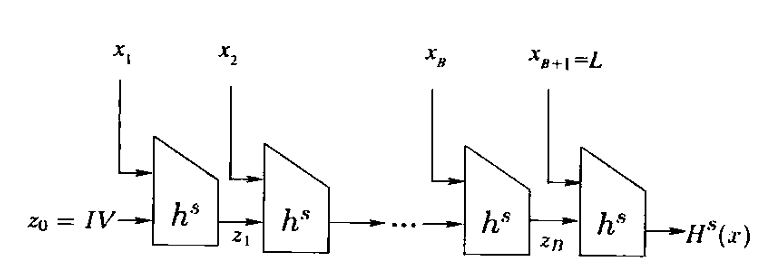
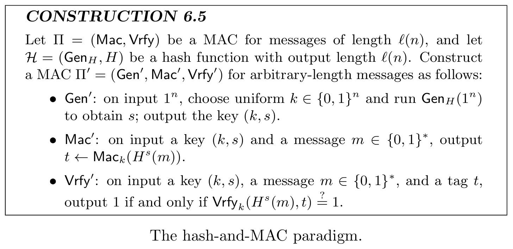

# 密码学基础 · 07：哈希函数与 Merkle–Damgård 结构（Hash & MD Transform）

> 来源：用户提供的课程资料（一份速查表提纲 ＋ 一份按课次记录的课程笔记 Lec1–Lec13；详见 [`00_索引.md`](00_索引.md) §1）
> 整理日期：2026-09-21（按完整资料扩写）
> 说明：本文由 AI 依据上述资料整理（**不是**讲义原文照抄）；课程笔记自己标注 **Lec8 之后带 \* 号的小节是“来不及整理所以用 ai 总结的笔记”**（Lec10 即带 \* 号），引用时请留意这一点。
> 教材对照：Katz & Lindell（Revised 3rd ed.）**§6.1** Definitions（§6.1.1 Collision Resistance / §6.1.2 Weaker Notions of Security）、**§6.2** Domain Extension: The Merkle–Damgård Transform、**§6.3** Message Authentication Using Hash Functions（§6.3.1 Hash-and-MAC / §6.3.2 HMAC）。

## 0. 本节速览

| 小节 | 主题 | 一句话摘要 |
|---|---|---|
| §1 | 为什么要 MD 结构 | 压缩函数只能吃**定长**输入，而要 Hash 的是**变长**消息。 |
| §2 | Merkle–Damgård 变换 | 把 $f:\{0,1\}^{n}\times\{0,1\}^{l}\to\{0,1\}^{n}$ 扩展为能处理变长消息的 Hash 函数（填充 → 加长度块 → 迭代 → 输出状态）。 |
| §3 | 安全性 | **压缩函数抗碰撞 ⇒ 整个 Hash 函数抗碰撞**。 |
| §4 | 与 MAC 的关系 | 定长 MAC + 抗碰撞 Hash ⇒ 变长 MAC（见 [`06`](06_消息认证码MAC.md#65-从定长-mac-到变长-mac-的两种方法)）。 |

---

## 1. 问题：压缩函数 vs 哈希函数

- **压缩函数（compression function）** $f:\{0,1\}^{n}\times\{0,1\}^{l}\to\{0,1\}^{n}$：把「$n$ 位的状态 + $l$ 位的数据块」压成「$n$ 位的新状态」——**输入长度固定**。
- **哈希函数（hash function）**要处理的是**任意长度**的消息，所以需要一个办法把定长的压缩函数“串”起来。

### 1.1 哈希函数的基本概念与形式化

- **定义**：哈希函数把**任意长度**（或固定长度）的输入**压缩**为**固定长度**的输出。
- **与 PRG 的区别**（课程笔记专门点出）：**PRG 是扩展字符串长度，哈希函数是压缩字符串长度。**
- **形式化**：哈希函数族由两个算法组成：
  - `Gen(1^n)`：生成密钥 `s`；
  - `H^s(x)`：**确定性**算法，输出固定长度的哈希值。

### 1.2 三个安全性要求

| 要求 | 定义（课程笔记原文大意） |
|---|---|
| **抗碰撞性（collision resistance）** | 难以找到两个**不同**输入 $x\ne x'$ 使 $H^s(x)=H^s(x')$；形式化：对所有 PPT 敌手，找到碰撞的概率**可忽略**。 |
| **抗第二原像性（second-preimage resistance）** | 给定 $s$ 和 $x$，难以找到 $x'\ne x$ 使 $H^s(x')=H^s(x)$。 |
| **抗原像性 / 单向性（preimage resistance / one-wayness）** | 给定 $s$ 和 $y=H^s(x)$，难以找到**任意** $x'$ 使 $H^s(x')=y$。 |

### 1.3 密钥化 vs 无密钥哈希函数

- **密钥化哈希函数**：使用**公开的**密钥 $s$，用来解决“**硬编码碰撞**”这一理论问题。
- **无密钥哈希函数**：现实中常用（如 **SHA-256**）；虽然**理论上存在碰撞**，但**实际中找到碰撞是困难的**。

## 2. Merkle–Damgård 变换（MD 结构）

课程笔记原文：**将压缩函数 $f:\{0,1\}^{n}\times\{0,1\}^{l}\to\{0,1\}^{n}$ 扩展为 Hash 函数**。处理变长消息的步骤是：

1. **填充消息到分组长度的倍数**；
2. **添加长度块**；
3. **迭代应用压缩函数**；
4. **输出最后的状态值**。

课程笔记另外给了“把压缩函数当只能处理一页纸的工具”的比喻与三步说法（含义与上面四步一致）：

> 1. 将书**分页**（分块）；2. 从第一页开始，**结合一个初始向量**算出第一个中间状态；3. 把该状态与下一页结合算出下一个中间状态；4. 如此重复到最后一页，**最终状态就是整本书的哈希值**。
> “中间状态”的传递就是“**链接**”的核心，它确保了最终输出的哈希值**依赖于之前所有输入块的完整序列**。



用式子写出“迭代”这一步（整理者按上面的文字补的记号，便于对照教材）：

$$h_0=IV,\qquad h_i=f\bigl(h_{i-1},\,m_i\bigr)\ (i=1,\dots,t),\qquad H(m)=h_t$$

> 待确认：**初始向量 $IV$ 与“长度块”的确切处理方式**课程笔记没有给出（例如长度块是并入最后一个分组还是单独一块、填充规则是什么）。这些细节属于讲义/教材内容，等讲义正文补上后再写。
> 教材对照：§6.2 Domain Extension: The Merkle–Damgård Transform。

## 3. 安全性：为什么“压缩函数抗碰撞”就够了

课程笔记原文：**如果压缩函数抗碰撞，则整个 Hash 函数抗碰撞。**

- 直觉（整理者按语，仅为理解方向）：MD 结构的输出是**最后一次压缩的结果**，所以要给整个 $H$ 找到碰撞，就必须在**某一步压缩**上制造出碰撞（或利用“长度块”产生的域分离）；把这件事严格化就是教材里“**归约到压缩函数的碰撞**”式的证明。
- 因此 HMAC/MD5/SHA 系列这类“**MD 结构 + 压缩函数**”的设计，其密码学假设就落在**压缩函数的抗碰撞性**上。

## 4. 与 MAC 的接口

MD 结构在课程里最直接的用途是**构造变长 MAC**（详见 [`06_消息认证码MAC.md`](06_消息认证码MAC.md#65-从定长-mac-到变长-mac-的两种方法)）：

- 设 $\mathrm{MAC}_k$ 是**定长 MAC**、$H$ 是**抗碰撞 Hash**，则 $\mathrm{MAC}'_k(m)=\mathrm{MAC}_k(H(m))$ 是**变长 MAC**；
- 安全性证明要点：能伪造 $\mathrm{MAC}'$ ⇒ 要么找到 $H$ 的碰撞，要么伪造定长 $\mathrm{MAC}_k$ 的标签。

> 教材对照：§6.3.1 Hash-and-MAC（教材给的正是“**抗碰撞 Hash + 定长 MAC**”这条路线）。

### 4.1 Hash-and-MAC 的三个算法与安全性证明

课程笔记把 [§4](#4-与-mac-的接口) 的路线（教材叫 **Hash-and-MAC**）写成了完整方案（密钥化哈希 + 定长 MAC）：

```text
Gen'(1^n)：1. 均匀随机选 k ← {0,1}^n        # MAC 密钥
          2. 运行 Gen_H(1^n) 得到 s        # 哈希密钥
          3. 输出密钥对 (k, s)

Mac'((k,s), m)：1. h = H^s(m)              # 压缩消息
               2. t = Mac_k(h)             # 对哈希值生成 MAC
               3. 输出标签 t

Vrfy'((k,s), m, t)：1. h = H^s(m)
                   2. 返回 Vrfy_k(h, t)
```

**安全性证明**（课程笔记原文，分两种情况）：

1. **存在碰撞**：直接违反哈希函数的**抗碰撞性**；
2. **无碰撞**：违反底层 **MAC** 的安全性。

即通过**规约**，把对 Hash-and-MAC 的攻击转化为**对哈希函数或 MAC 的攻击**。



### 4.2 攻击方法：暴力攻击与生日攻击

- **暴力攻击**：计算所有输入的哈希值再比较；时间复杂度高，不实用。
- **生日攻击（birthday attack）**：基于**生日悖论**，只需约 $\sqrt{2^{n}}=2^{n/2}$ 次查询就能以高概率找到碰撞；时间复杂度 $O(2^{n/2})$，空间复杂度可优化至 $O(1)$。

> 后果：$n$ 位输出的哈希函数，其**碰撞**安全强度只有 $n/2$ 位（不是 $n$ 位）——设计哈希时必须把输出长度取得足够大。

## 5. 关键公式与流程汇总

| 名称 | 内容 | 出处 |
|---|---|---|
| 压缩函数 | $f:\{0,1\}^{n}\times\{0,1\}^{l}\to\{0,1\}^{n}$ | [§1](#1-问题压缩函数-vs-哈希函数) |
| MD 四步 | 填充 → 加长度块 → 迭代压缩 → 输出最后状态 | [§2](#2-merkledamgård-变换md-结构) |
| 迭代式 | $h_i=f(h_{i-1},m_i)$ | [§2](#2-merkledamgård-变换md-结构) |
| 安全性 | 压缩函数抗碰撞 ⇒ Hash 抗碰撞 | [§3](#3-安全性为什么压缩函数抗碰撞就够了) |
| 变长 MAC | $\mathrm{MAC}'_k(m)=\mathrm{MAC}_k(H(m))$ | [§4](#4-与-mac-的接口) |
| 三类安全目标 | 抗碰撞 / 抗第二原像 / 抗原像 | [§1.2](#12-三个安全性要求) |
| 生日攻击 | 找碰撞约 $2^{n/2}$ 次查询，$O(2^{n/2})$ | [§4.2](#42-攻击方法暴力攻击与生日攻击) |

## 6. 听课重点与易混点

1. **别把“压缩函数”和“Hash 函数”混为一谈**：前者定长输入定长输出，后者处理任意长度消息——MD 结构就是两者之间的桥。
2. **“抗碰撞”是 Hash 的核心安全目标**（不是“抗第一/第二原像”那么弱的要求）；MD 结构的安全性直接继承自压缩函数。
3. **哈希的输出长度要按“生日攻击”算**：$n$ 位输出只给 $n/2$ 位的碰撞强度（[§4.2](#42-攻击方法暴力攻击与生日攻击)）。
4. **MD 结构另有一个已知弱点**（长度扩展攻击 length-extension）课程笔记没有提，讲义/教材里若有请以讲义为准；本笔记**不臆测**。
5. **三个安全目标不是同一条线**：抗碰撞是这里最强的要求，而“抗原像（单向）”与抗碰撞属于**不同维度**的要求——术语别混。

## 7. 复习清单

- [ ] 压缩函数与 Hash 函数在输入长度上有什么区别？（[§1](#1-问题压缩函数-vs-哈希函数)）
- [ ] MD 结构的四个步骤是什么？为什么必须“添加长度块”？（[§2](#2-merkledamgård-变换md-结构)）
- [ ] 为什么“压缩函数抗碰撞”就能推出“整个 Hash 抗碰撞”？（[§3](#3-安全性为什么压缩函数抗碰撞就够了)）
- [ ] 怎么用“抗碰撞 Hash + 定长 MAC”得到变长 MAC？证明要点是哪两条分支？（[§4](#4-与-mac-的接口)）

- [ ] 哈希函数与 PRG 在“长度”上的区别是什么？（[§1.1](#11-哈希函数的基本概念与形式化)）
- [ ] 三个安全目标（抗碰撞 / 抗第二原像 / 抗原像）各自的“给定条件”与“要找的东西”是什么？（[§1.2](#12-三个安全性要求)）
- [ ] 为什么生日攻击只要 $2^{n/2}$ 次查询？（[§4.2](#42-攻击方法暴力攻击与生日攻击)）
- [ ] 写出 Hash-and-MAC 的 $\mathrm{Gen}'/\mathrm{Mac}'/\mathrm{Vrfy}'$ 与证明的两种情况。（[§4.1](#41-hash-and-mac-的三个算法与安全性证明)）

## 8. 关联知识点

- 定长 MAC → 变长 MAC 的两种方法（ECBC-MAC 与 Hash 组合）——见 [`06_消息认证码MAC.md`](06_消息认证码MAC.md#6-具体的-mac-构造)。
- 分组密码与工作模式（CBC 等）——见 [`05_伪随机函数与伪随机置换.md`](05_伪随机函数与伪随机置换.md#81-cbc-模式的公式)。
- 考试范围里与 Hash 相关的条目——见 [`13_考试范围与复习要点.md`](13_考试范围与复习要点.md)。
- 教材：§6.1（定义：抗碰撞与更弱的安全目标）、§6.2（MD 结构）、§6.3（Hash-and-MAC / HMAC）。

## 9. 来源与延伸阅读

- 来源：用户提供的课程资料（速查表提纲 ＋ 课程笔记 Lec1–Lec13）；清单见 `密码学基础/readme.md`。原始资料（`数据安全与密码学基础.zip` 及其中的附件）均为**只读引用**，未改动。
- 参考书：Katz & Lindell, *Introduction to Modern Cryptography*（Revised 3rd ed.）**§6.1–§6.3**（§6.1.1 抗碰撞 / §6.1.2 更弱的目标 / §6.2 Merkle–Damgård / §6.3 Hash-and-MAC、HMAC）。
