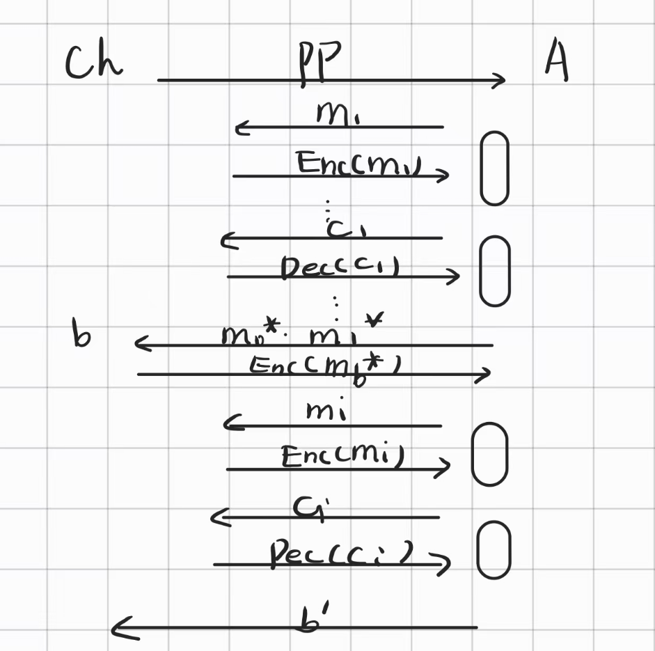

# 密码学基础 · 08：CCA 安全与认证加密（CCA-Security & Authenticated Encryption）

> 来源：用户提供的课程资料（一份速查表提纲 ＋ 一份按课次记录的课程笔记 Lec1–Lec13；详见 [`00_索引.md`](00_索引.md) §1）
> 整理日期：2026-09-21
> 说明：本文由 AI 依据上述资料整理；课程笔记在“安全性证明”一节自己写了「看不懂，略」，本笔记**同样不补**证明。
> 教材对照：Katz & Lindell（Revised 3rd ed.）**§5.1** Chosen-Ciphertext Attacks and CCA-Security（§5.1.1 Padding-Oracle Attacks / §5.1.2 Defining CCA-Security）、**§5.2** Authenticated Encryption（§5.2.1 Defining Authenticated Encryption / §5.2.2 CCA Security vs. Authenticated Encryption）、**§5.3** Authenticated Encryption Schemes（§5.3.1 Generic Constructions / §5.3.2 Standardized Schemes）、**§5.4** Secure Communication Sessions。

## 0. 本节速览

| 小节 | 主题 | 一句话摘要 |
|---|---|---|
| §1 | 从被动到主动 | CPA 敌手只能“看密文”；**CCA 敌手还能改密文并看解密结果**。 |
| §2 | CCA 安全定义 | 敌手可访问**加密预言机 + 解密预言机**，但**挑战密文不能拿去解密**；目标仍是不可区分。 |
| §3 | 不可延展性 | CCA 安全要求**密文被改动后，解密结果与原明文无关**。 |
| §4 | AE 的定义 | 同时要**保密性（CCA 安全）**与**完整性（不可伪造）**；含“理想预言机”等价定义。 |
| §5 | 三种构造尝试 | encrypt-and-authenticate ❌ / authenticate-then-encrypt ❌ / **encrypt-then-authenticate ✅**。 |
| §6 | 密钥独立性 | 加密密钥与认证密钥**必须独立**。 |

---

## 1. 从被动敌手到主动敌手

- 之前的 **CPA（选择明文攻击）**模型里，敌手**只能被动观察密文**；
- **CCA 模型**里，敌手可以**主动修改密文并观察解密结果**——课程笔记一句话概括：**“可以加密也可以解密了”**。

## 2. CCA 安全（chosen-ciphertext attack security）

- 敌手**可访问加密预言机和解密预言机**；
- **挑战阶段之后，敌手不能把挑战密文提交给解密预言机**（否则游戏被平凡攻破）；
- 安全性定义为：**敌手无法区分两个等长明文的加密结果**。



> 课程笔记的定位：CCA 是**一种很强的安全定义**，能抵御现实中的主动攻击（**如 Padding Oracle Attack**，见 [`06` §6.6](06_消息认证码MAC.md#66-padding-oracle-attack为什么必须机密性--完整性一起要)）。
> 教材对照：§5.1.2 Defining CCA-Security。

## 3. CCA 安全 ↔ 不可延展性（non-malleability）

- CCA 安全**要求**：**密文被修改后，解密结果与原明文无关**。
- 课程笔记给的例子：攻击者拿到 $m$ 的密文 `c`，改成 `c' = c ⊕ 1`；当接收方解密 `c'` 时，得到的明文 `m'` 必须与 $m$ **在语义上毫无关联**。
- 也就是说：攻击者**无法通过“加工”一个已知密文，来生成与其对应的、解密后具有特定关系的新明文**——**无法控制修改密文所产生的结果**。

> 换句话说：**不可延展性 = “改密文没用”**。这与 [§2](#2-cca-安全chosen-ciphertext-attack-security) 的“不能拿挑战密文去解密”配合起来，正是 CCA 游戏想表达的直觉。

## 4. 认证加密（authenticated encryption, AE）

### 4.1 定义

AE 方案要**同时满足**：

1. **保密性**：**CCA 安全**；
2. **完整性**：敌手**无法伪造一个有效的密文**（除非它来自加密预言机）。

课程笔记给出的关系：

> **AE 安全 ⇒ CCA 安全，但反之不一定成立。**

> 教材对照：§5.2.2 CCA Security vs. Authenticated Encryption（教材同样把二者区分开）。

### 4.2 等价定义：理想预言机模型（真实世界 vs 理想世界）

| | 真实世界（$b=0$） | 理想世界（$b=1$） |
|---|---|---|
| 加密预言机 | $\mathrm{Enc}_k(m)$ → **真实加密** | $\mathrm{Enc}^0_k(m)$ → **总是加密等长的零串** |
| 解密预言机 | $\mathrm{Dec}_k(c)$ → **真实解密** | $\mathrm{Dec}_\perp(c)$ → **总是返回错误 $\perp$** |

若敌手**无法区分这两个世界**，则方案是 AE 安全的。课程笔记对这种定义“强大之处”的两点解释：

- 若**加密输出无法与零串的加密区分** ⇒ **完美保密性**；
- 若**解密对新密文总是返回错误** ⇒ **完美完整性**。

## 5. 构造 AE 的三种尝试

| 构造 | 写法 | 课程笔记的判定与理由 |
|---|---|---|
| **1. Encrypt-and-authenticate** | 密文 $=(\mathrm{Enc}(k_E,m),\ \mathrm{Mac}(k_M,m))$ | ❌ **不安全**：MAC 不保证保密性，**可能泄露明文信息**；即使使用不同密钥，加密与 MAC 之间也**没有依赖关系**；敌手可能从标签中获得明文信息。 |
| **2. Authenticate-then-encrypt** | ① $\tau=\mathrm{Mac}(k_M,m)$；② 密文 $=\mathrm{Enc}(k_E,\ m\Vert\tau)$ | ❌ **易受攻击**：解密时**可能泄露不同的错误类型**（“填充错误” vs “认证失败”），这些错误信息可被用于**填充预言攻击**。 |
| **3. Encrypt-then-authenticate** | ① $c=\mathrm{Enc}(k_E,m)$；② $t=\mathrm{Mac}(k_M,c)$；③ 输出 $(c,t)$ | ✅ **推荐**（公认的安全构造）：先加密，**再对密文做 MAC**；解密时先验证 $\mathrm{Vrfy}(k_M,c,t)$，**不通过就返回 $\perp$**，通过才输出 $\mathrm{Dec}(k_E,c)$。 |

**解密流程（构造 3）**：

```text
1. 如果 Vrfy(k_M, c, t) = 0，返回 ⊥
2. 否则，输出 Dec(k_E, c)
```

### 5.1 安全性证明与两条附加要求

- 课程笔记把安全性证明的要点写为：**证明 encrypt-then-authenticate 构造满足 AE 安全**；**关键在于敌手无法伪造有效的 MAC**，因此**无法构造有效的篡改密文**。
- 证明细节课程笔记原文注明「**看不懂，略**」⇒ **本笔记不补**（需要时看教材 §5.3.1）。
- **密钥独立性**：**加密密钥和认证密钥必须独立**，否则**可能破坏安全性**。

## 6. 关键公式与记号汇总

| 名称 | 内容 | 出处 |
|---|---|---|
| CCA 游戏 | 加密预言机 + 解密预言机，**挑战密文不得提交解密** | [§2](#2-cca-安全chosen-ciphertext-attack-security) |
| CCA ⇒ 不可延展 | 改密文后，明文与原明文语义无关 | [§3](#3-cca-安全--不可延展性non-malleability) |
| AE = 保密 + 完整 | CCA 安全 + 不可伪造；AE ⇒ CCA | [§4.1](#41-定义) |
| 理想世界 | $\mathrm{Enc}^0_k(m)$ 加密零串；$\mathrm{Dec}_\perp(c)$ 恒返回 $\perp$ | [§4.2](#42-等价定义理想预言机模型真实世界-vs-理想世界) |
| 推荐构造 | encrypt-then-authenticate：$(c,t)=(\\mathrm{Enc}(k_E,m),\ \mathrm{Mac}(k_M,c))$ | [§5](#5-构造-ae-的三种尝试) |

## 7. 听课重点与易混点

1. **三种组合方式的“顺序”是本节考点**：MAC 加在**明文**上（E&A）会漏信息；MAC 加在**明文内侧的密文**里（A&E）会漏错误类型；只有 **MAC 加在密文外侧**（E&A 的第三种）两者都占。
2. **AE ≠ 简单的“加密 + MAC”**：还必须**密钥独立**、**验证失败就返回 $\perp$（不泄露原因）**。
3. **CCA 与不可延展性是同一件事的两种说法**：一个是游戏式的、一个是性质式的。
4. **AE ⇒ CCA，但 CCA ⇏ AE**：CCA 只管保密性，不管“能不能伪造密文”。
5. 填充预言攻击（[`06` §6.6](06_消息认证码MAC.md#66-padding-oracle-attack为什么必须机密性--完整性一起要)）是“为什么需要 CCA/AE”的现实动机。

## 8. 复习清单

- [ ] CCA 敌手比 CPA 敌手多拿到的能力是什么？游戏里有什么限制？（[§1](#1-从被动敌手到主动敌手)、[§2](#2-cca-安全chosen-ciphertext-attack-security)）
- [ ] 什么是不可延展性？用 $c'=c\oplus1$ 的例子解释。（[§3](#3-cca-安全--不可延展性non-malleability)）
- [ ] 写出 AE 的两条要求，并说明 AE 与 CCA 的包含关系。（[§4.1](#41-定义)）
- [ ] 复述理想预言机模型的真实世界 / 理想世界各是什么。（[§4.2](#42-等价定义理想预言机模型真实世界-vs-理想世界)）
- [ ] 三种构造各自的问题/优点是什么？为什么 encrypt-then-authenticate 被推荐？（[§5](#5-构造-ae-的三种尝试)）
- [ ] 为什么加密密钥与认证密钥必须独立？（[§5.1](#51-安全性证明与两条附加要求)）

## 9. 关联知识点

- 填充预言攻击与“为什么要机密性 + 完整性”——见 [`06_消息认证码MAC.md`](06_消息认证码MAC.md#66-padding-oracle-attack为什么必须机密性--完整性一起要)。
- 更强安全性的阶梯（EAV → CPA → CCA）与考试大纲第 3 条——见 [`13_考试范围与复习要点.md`](13_考试范围与复习要点.md)。
- 公钥加密里的 IND-CPA 与“EAV 与 IND-CPA 等价”——见 [`11_公钥加密与ElGamal.md`](11_公钥加密与ElGamal.md)。
- 教材：§5.1（CCA 与填充预言攻击）、§5.2（AE 的定义与 CCA 的关系）、§5.3（通用构造与标准化方案）。

## 10. 来源与延伸阅读

- 来源：用户提供的课程资料（速查表提纲 ＋ 课程笔记 Lec1–Lec13）；清单见 `密码学基础/readme.md`。原始资料（`数据安全与密码学基础.zip` 及其中的附件）均为**只读引用**，未改动。
- 参考书：Katz & Lindell, *Introduction to Modern Cryptography*（Revised 3rd ed.）**§5.1–§5.3**（CCA 的定义与 Padding Oracle、认证加密、构造与标准方案）。
