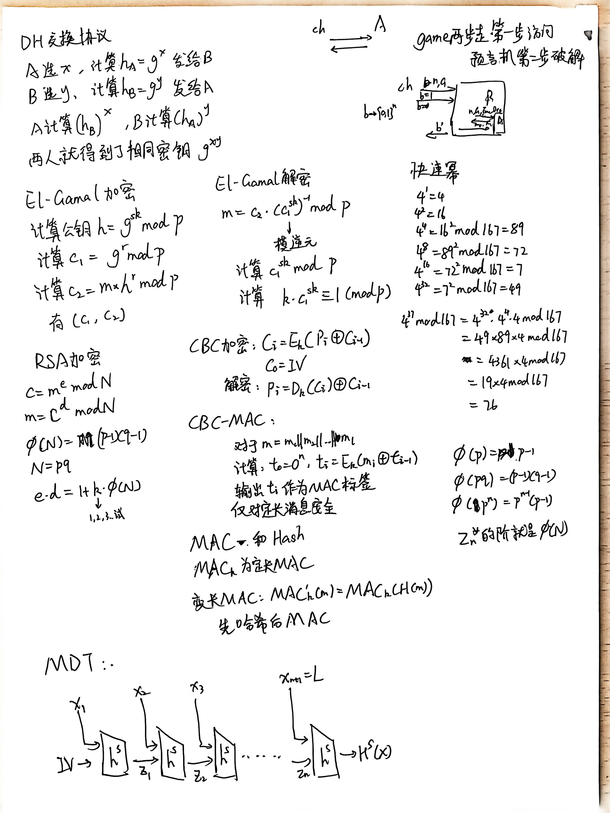
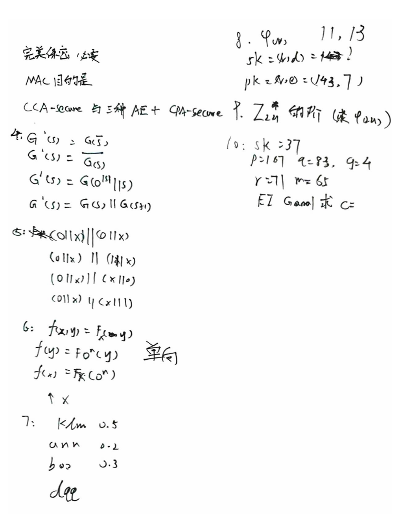
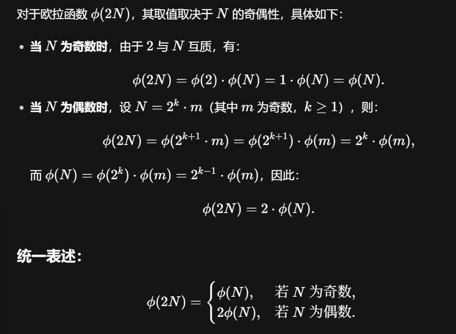

# 密码学基础 · 13：考试范围与复习要点

> 来源：用户提供的课程资料（一份速查表提纲 ＋ 一份按课次记录的课程笔记 Lec1–Lec13；详见 [`00_索引.md`](00_索引.md) §1）
> 整理日期：2026-09-21
> 说明：本文**只做搬运与结构化**，内容全部来自该课程笔记；它**不是官方考纲**，请以老师当堂说明、讲义与「学在浙大」通知为准。笔记原文自己注明：「**笔记内容是根据参考资料整理的（叠甲），带 \* 号的是来不及整理所以用 ai 总结的笔记**」。
> 用途：给本目录其他各篇做**优先级定位**——哪些主题值得优先背定义、哪些要能自己写归约。

## 0. 本节速览

| 小节 | 内容 | 一句话摘要 |
|---|---|---|
| §1 | 期中考 | 只有一个嵌入视图与附件《25秋冬期中.pdf》；该**试卷已转录整理**到 [`14_期中试卷_25秋冬.md`](14_期中试卷_25秋冬.md)。 |
| §2 | 25秋冬期末考要点 | 题型（选择＋填空＋主观题）、范围（偏定义/归约），以及老师给出的 6 个方向 + 具体题目示例；附 1 张手写复习稿。 |
| §3 | 24秋冬期末考要点 | 一份 10 条的《密码学考试复习大纲》（含 RSA / ElGamal 的计算步骤），附件 `复习大纲.docx` 与原文一致；附 1 张「三种安全定义关系」对比表插图。 |
| §4 | 课程笔记的注 | 25 秋冬**没讲数字签名、期末只考到 PKE**；老师板书 + 不对话筒，建议上课录音。 |
| §5 | 回忆卷 | 两个 CC98 帖子链接（历年卷回忆）＋两张手写稿（24 秋冬的题目速记、以及 $\phi(2N)$ 的推导）。 |
| §6 | 这份笔记怎么用 | 按「定义 / 归约 / 构造 / 计算」四类，定位该复看本目录哪几篇。 |

---

## 1. 期中考

- 课程笔记的「期中考」小节下只有一个**嵌入视图（view 块）**与一个附件「**25秋冬期中.pdf**」；正文**没有转写**试卷内容、也没有答案。
- **本次已把该附件转录成文字**：试卷是**扫描/拍照版 PDF**（6 页、无文字层），内容见 [`14_期中试卷_25秋冬.md`](14_期中试卷_25秋冬.md)。要点：

| 大题 | 题型与分值 | 内容 |
|---|---|---|
| 一 | 选择题（各 5 分，共 20 分） | Kerckhoffs 原则；香农安全 vs 完美安全；可忽略函数；OTP 的四种修改（**多选**，少选/多选均不得分） |
| 二 | 填空题（各 5 分，共 20 分） | 凯撒密码；$\mathrm{Func}_n$ 的表示位数；移位密码的 $\Pr[C=b]$；完美安全的 $\lvert\mathcal{K}\rvert\ge\lvert\mathcal{M}\rvert$ |
| 三 | 计算题（15 分） | 口令生成策略的**信息熵**是否达到 16 bit |
| 四 | 主观题（30 分） | EAV Security 的形式化定义（10 分）；用归纳法证明 **PRG ⇒ EAV**（20 分） |
| 五 | 主观题（15 分） | PRF 的三种修改（$F(k,x)\Vert0$、$F(k,x)\Vert x$、$F(k,x)\oplus x$）是否仍安全 |

> 试卷信息（原卷卷头）：浙江大学 2025-2026 学年秋冬学期；授课教师：张聪 / 张秉晟；闭卷；2025 年 11 月 6 日；90 分钟。

---

## 2. 25秋冬期末考要点

课程笔记原文（引用）：

> **即使不会，多写点。——zc**

- **题型**：与期中考差不多——**选择＋填空＋主观题**。
- **考试内容**：**偏定义 / 归约**。
- 老师给出的方向（原文列表）：

1. **公钥部分**：算法构造（课程笔记注明：**本次考试不会考公钥的归约**）。
   - **协议构造**：Diffie–Hellman（Alice–Bob）→ [`10` §2](10_密钥交换与Diffie-Hellman.md#2-diffiehellman-密钥交换协议)；
   - **RSA 算法**：$\mathrm{Gen}()\Rightarrow N=p\cdot q$，$\phi(N)=(p-1)(q-1)$ → [`11` §2](11_公钥加密与ElGamal.md#2-rsa按期末考要点整理)。
2. **定义部分（pseudo-random）**：
   - **PRG**：
     - “Let $G$ is PRG, $G^{*}(x)=G(x)\Vert G(2x)$ work for all?”（即：这样拼起来的 $G^{*}$ 还对任意输入成立吗？）
     - “Assume $G$ is perfect PRG（$G(x)\to y\to$ uniformly），构造 $G\to G'$”；
     - 笔记给的例子：$G'(x)=G(2x)$（$x$ 为奇数时）；$G'(x)=G(x)$（$x$ 为偶数时）；
     - 笔记的结论：“**这样 $x$ 为 odd 时候就攻破了 $G^{*}(x)$**”。
   - **PRF**：
     - “其 pseudo-random 属性**基于 $k$ 的不定性**。$F_k(*)$ random **不代表** $F_{1^n}(*)$ random”；
     - 构造：$F'(*)=1111\ldots$，$k=1^{n}$；$F'(*)=F_k(*)$，$k\ne 1^{n}$。
3. **Enc【CBC】、MAC【CBC-MAC】、Hash【MDT】**：
   - **如何从定长 MAC 到变长 MAC**；
   - 口诀：**MAC(F) + Hash(A) = MAC(A)**。

> 待确认：上面 2、3 两条是按**考试题目草稿**记的（句子不完整、$G'$ 与 $G^{*}$ 的关系也有歧义），本笔记**照录不解读**。相关整理见：
> PRG 的定义与 hybrid argument → [`03_单向函数与伪随机生成器.md`](03_单向函数与伪随机生成器.md)；
> PRF 的定义 → [`05_伪随机函数与伪随机置换.md`](05_伪随机函数与伪随机置换.md)；
> CBC → [`05` §8.1](05_伪随机函数与伪随机置换.md#81-cbc-模式的公式)；
> CBC-MAC / 变长 MAC → [`06` §6](06_消息认证码MAC.md#6-具体的-mac-构造)；
> MD 结构 → [`07_哈希函数与Merkle-Damgård结构.md`](07_哈希函数与Merkle-Damgård结构.md)。
> 另外：课程笔记在这里还**内嵌了一段 AI 生成的公式小结**（CBC 加密/解密、CBC-MAC 定长、ECBC-MAC、MAC+Hash、Merkle–Damgård 四步），本目录已把这几条并入 [`05` §8.1](05_伪随机函数与伪随机置换.md#81-cbc-模式的公式)、[`06` §6](06_消息认证码MAC.md#6-具体的-mac-构造)、[`07`](07_哈希函数与Merkle-Damgård结构.md)。
>
> 课程笔记在这一节末尾还附了一张**手写复习稿**（见下图），内容是之后公钥与 CBC 的要点：DH 交换协议、ElGamal 加解密、RSA 加解密、CBC 加解密、CBC-MAC、MAC+Hash 变长、MDT 结构、$\phi(N)$ 的三种情形、$\mathbb{Z}_N^{*}$ 的阶 = $\phi(N)$，以及一组「快速幂」演算（$4^{x}\bmod167$：$4^{37}\equiv76$）。

---

## 3. 24秋冬期末考要点（复习大纲）

课程笔记附了一份《密码学考试复习大纲》（原文条目照录）。**整理者核对**：附件 `复习大纲.docx` 的正文与该列表**逐条一致**（10 条，无遗漏）。

1. **消息认证码的安全定义及其作用** → [`06`](06_消息认证码MAC.md)；
2. **完美安全的定义及其性能局限性** → [`02`](02_完美保密与一次性密码本.md)；
3. **IND-EAV、IND-CPA、IND-CCA 的定义**，以及**在公钥密码中三种安全定义的关系**（课程笔记在此处附了一张插图，见下）→ [`04`](04_多消息安全与IND-CPA.md)、[`08`](08_CCA安全与认证加密.md)、[`11` §3](11_公钥加密与ElGamal.md#3-公钥加密里的安全性定义eav--ind-cpa)；
4. **伪随机生成器（PRG）的定义** → [`03`](03_单向函数与伪随机生成器.md)；
5. **伪随机函数簇（PRF）的定义** → [`05`](05_伪随机函数与伪随机置换.md)；
6. **大数分解问题中**，关于整数 $N=pq$ 的**欧拉函数**定义，包括给定 $N$ 的分解如何计算欧拉函数（笔记给出三种情形）→ [`09` §2](09_数论基础与密码学硬假设.md#2-欧拉定理与费马小定理)：

$$N=p\ (\text{素数}):\quad \phi(N)=p-1$$
$$N=pq\ (\text{素数乘积}):\quad \phi(N)=(p-1)(q-1)$$
$$N=p^{n}\ (p\ \text{为素数}):\quad \phi(N)=p^{n-1}(p-1)$$

7. **掌握 RSA 加密的计算过程**，包括给定 $N$ 的分解，根据公钥计算私钥（笔记给的 6 步）→ [`11` §2](11_公钥加密与ElGamal.md#2-rsa按期末考要点整理)：

   1. 计算模数 $N=pq$；
   2. 计算欧拉函数 $\phi(N)=(p-1)(q-1)$；
   3. 选择公钥指数 $e$；
   4. 计算私钥指数 $e\cdot d\equiv 1 \pmod{\phi(N)}$，也就是 $e\cdot d=1+k\cdot\phi(N)$；
   5. 加密：$c=m^{e}\bmod N$；
   6. 解密：$m=c^{d}\bmod N$。

8. **掌握 ElGamal 加密系统的加解密计算**，包括用**快速幂**计算指数（笔记原文）→ [`11` §4](11_公钥加密与ElGamal.md#4-elgamal-加密方案)：

   - 加密（课程笔记原文标注“【快速幂】”）：
     1. 计算公钥 $h=g^{sk}\bmod p$；
     2. 计算 $c_1=g^{r}\bmod p$；
     3. 计算 $c_2=m\cdot h^{r}\bmod p$。
   - 解密：
     1. $m=c_2\cdot (c_1^{sk})^{-1}\bmod p$；
     2. 求 $s=c_1^{sk}\bmod p$；
     3. 求 $s^{-1}\bmod p$，即求 $t$ 使 $t\cdot s\equiv 1\pmod p$（也就是“多少乘 $s$ 会与 $p$ 模 1”）；
     4. 相乘回代。

9. **认证加密的定义** → [`08` §4](08_CCA安全与认证加密.md#4-认证加密authenticated-encryption-ae)；
10. **公钥加密与私钥加密的对比** → [`11` §1.1](11_公钥加密与ElGamal.md#11-与私钥加密的对比24-秋冬大纲第-10-条)。

> 待确认：这是 **24 秋冬**那一届的复习大纲，与当前学期是否完全一致**未知**；第 3 条提到的“公钥密码中三种安全定义的关系”只有这张插图，课程笔记正文**没有写文字结论**（本目录在 [`11` §3](11_公钥加密与ElGamal.md#3-公钥加密里的安全性定义eav--ind-cpa) 里整理了「公钥里 EAV ⇔ IND-CPA」这一条）。

---

## 4. 课程与考试相关的提醒

课程笔记在整份笔记的最后一段「注」里写了三条**上课与考试相关**的提醒（原文整理）：

1. **25 秋冬的课程里老师来不及讲数字签名**，所以**就没讲**；
2. **期末考也只考到 PKE（公钥加密）**——所以复习时**要注意实际讲课的内容**（不要按教材章节一路往后看）；
3. **老师全程板书 + 不对话筒讲话，智云效果很差**，推荐上课时**把关键部分录音**。

> 对本目录的影响：
> - **不整理数字签名**（它与 MAC 的对照只在 [`06` §3](06_消息认证码MAC.md) 与 [`10` §4](10_密钥交换与Diffie-Hellman.md#4-公钥革命私钥--公钥的对应) 里作为**对照**出现）；
> - 公钥部分到 **PKE（[`11`](11_公钥加密与ElGamal.md)）** 为止，后面的教材章节（如 §12.3–§12.6 的细节）只作**导航**、不作考点。

---

## 5. 回忆卷（历年卷回忆）

两届历年卷的 CC98 帖子（课程笔记原文提示：复制本链接到浏览器或打开 CC98 微信小程序查看）：

- 【学习天地】数据安全与密码学基础 2024-2025 期末历年卷（信安/密码学/历年题）：<https://www.cc98.org/topic/6400637>
- 【学习天地】数据安全与密码学基础 期末卷回忆（2025-2026 秋冬）：<https://www.cc98.org/topic/6401264>

课程笔记在这两处各附了插图。**24 秋冬**那一处附的是一张**手写速记稿**（下图 1），照录其**可辨认**的条目如下（**照录，不解读**；带「?」处原文即模糊）：

| 位置 | 原文（照录） |
|---|---|
| 顶部三行 | 「完美保密 定义」「MAC 目的是」「CCA-secure 与三种 AE + CPA-secure」 |
| 第 4 题 | $G'(s)=G(\bar{s})$；$G'(s)=\overline{G(s)}$；$G'(s)=G(0^{\lvert s\rvert+1}\Vert s)$；$G'(s)=G(s)\Vert G(s+1)$ |
| 第 5 题 | （右上角被划掉的一行）$(0\vert1\vert x)\Vert(0\vert1\vert x)$；$(0\vert1\vert x)\Vert(1\vert1\vert x)$；$(0\vert1\vert x)\Vert(x\vert1\vert0)$；$(0\vert1\vert x)\Vert(x\vert1\vert1)$ |
| 第 6 题 | $f(x,y)=F_k(\ldots y)$；$f(y)=F_{0^{n}}(y)$；$f(x)=F_k(0^{n})$（旁边写着「单向」），并画了个箭头指向 $x$ |
| 第 7 题 | 「$k/m$　0.5」「ann　0.2」「baa　0.3」「dgg」 |
| 第 8 题 | $N=11,13$；$sk=(N,d)=?$；$pk=(N,e)=(143,7)$ |
| 第 9 题 | $\mathbb{Z}_{2N}^{*}$ 的阶（求 $\phi(2N)$） |
| 第 10 题 | $sk=37$，$p=167$，$q=83$，$g=4$，$r=71$，$m=65$，**ElGamal 求 $c$** |

同一处还附了一张**$\phi(2N)$ 的推导稿**（下图 2）：$N$ 为奇数时 $\phi(2N)=\phi(2)\phi(N)=\phi(N)$；$N=2^{k}m$（$m$ 为奇数）时 $\phi(2N)=\phi(2^{k+1})\phi(m)$、$\phi(N)=\phi(2^{k})\phi(m)$，故 $\phi(2N)=2\phi(N)$；统一写成 $\phi(2N)=\phi(N)$（$N$ 奇）／$2\phi(N)$（$N$ 偶）。

> 待确认与说明：
> - 上表是**手写速记**的转录，第 4–7 题的句子**语义不完整**（例如 $G(\bar{s})$ 里的 $\bar{s}$、第 7 题三个缩写的含义都无法确定）⇒ **照录、不解读**，也不要当成原题；
> - 第 8、10 两题的数字与算式比较清楚，本目录已把它们做成**算例**：[`11` §2](11_公钥加密与ElGamal.md#2-rsa按期末考要点整理)（$pk=(143,7)$ 求 $d$）、[`11` §4.4](11_公钥加密与ElGamal.md#44-回忆卷里的-elgamal-算例整理者核对)（$p=167,g=4,\mathrm{sk}=37,r=71,m=65$ 的完整演算）；
> - 第 9 题的 $\phi(2N)$ 与 [`09` §2](09_数论基础与密码学硬假设.md#2-欧拉定理与费马小定理) 的欧拉函数三情形相关（注意 $\mathbb{Z}_{n}^{*}$ 的阶就是 $\phi(n)$——这条也写在 25 秋冬的手写复习稿上，见 [§2](#2-25秋冬期末考要点)）；
> - **25 秋冬**那一处（第二个链接）课程笔记没有插图。

---

## 6. 这份笔记怎么用

- 把它当作**复习优先级表**：课程笔记反复出现的四个关键词是 **定义**、**归约**、**构造**、**计算**——
  - 「定义」类 ⇒ 优先背 [`02`](02_完美保密与一次性密码本.md)（完美安全）、[`03`](03_单向函数与伪随机生成器.md)（PRG/OWF）、[`04`](04_多消息安全与IND-CPA.md)（IND-CPA）、[`05`](05_伪随机函数与伪随机置换.md)（PRF/PRP）、[`06`](06_消息认证码MAC.md)（MAC/EUF-CMA）、[`08`](08_CCA安全与认证加密.md)（CCA/AE）、[`11` §3](11_公钥加密与ElGamal.md#3-公钥加密里的安全性定义eav--ind-cpa)（公钥里 EAV ⇔ CPA）；
  - 「归约」类 ⇒ 练 [`03` §6.3](03_单向函数与伪随机生成器.md#63-由-prg-得到-eav-安全的加密方案归约的思路)、[`05` §4](05_伪随机函数与伪随机置换.md#4-prfs--ind-cpa归约怎么搭)、[`12`](12_习题一_OTP缺陷与OWF-PRG关系.md) 的三道题（尤其 [`14` §5](14_期中试卷_25秋冬.md#5-四主观题30-分) 的「归纳法证 PRG ⇒ EAV」）；
  - 「构造」类 ⇒ CBC / CBC-MAC / MD 见 [`05` §8.1](05_伪随机函数与伪随机置换.md#81-cbc-模式的公式)、[`06` §6](06_消息认证码MAC.md#6-具体的-mac-构造)、[`07`](07_哈希函数与Merkle-Damgård结构.md)；「改一改还安全吗」型的构造题见 [`14` §6](14_期中试卷_25秋冬.md#6-五主观题15-分)；
  - 「计算」类 ⇒ RSA / ElGamal 见 [`11`](11_公钥加密与ElGamal.md)、DH 见 [`10` §2](10_密钥交换与Diffie-Hellman.md#2-diffiehellman-密钥交换协议)、欧拉函数见 [`09` §2](09_数论基础与密码学硬假设.md#2-欧拉定理与费马小定理)、信息熵见 [`14` §4](14_期中试卷_25秋冬.md#4-三计算题15-分)。
- 注意：这些范围信息来自**2024/2025 两届**的复习材料与**2025 秋冬的期中卷**，**不等于本学期的考纲**。

---

## 7. 来源与延伸阅读

- 来源：用户提供的课程资料（速查表提纲 ＋ 课程笔记 Lec1–Lec13）；清单见 `密码学基础/readme.md`。原始资料（`数据安全与密码学基础.zip` 及其中的附件）均为**只读引用**，未改动。
- 配套：期中试卷的转录与考点对照见 [`14_期中试卷_25秋冬.md`](14_期中试卷_25秋冬.md)。
- 参考书（章节导航）：Katz & Lindell, *Introduction to Modern Cryptography*（Revised 3rd ed.）——公钥部分见第 11、12 章。
